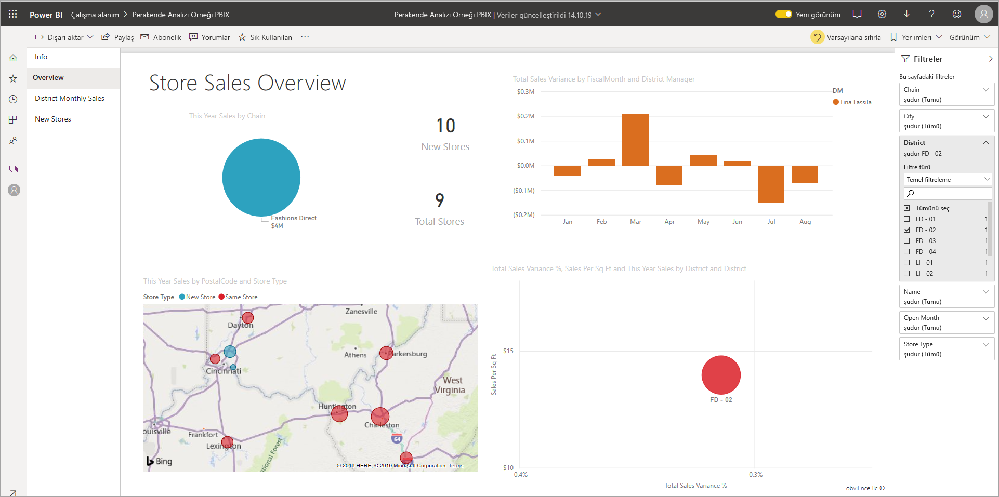
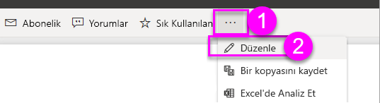
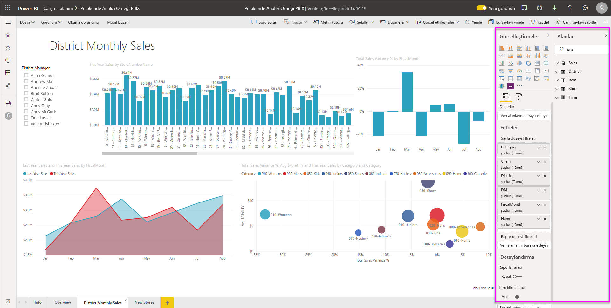
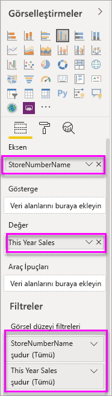
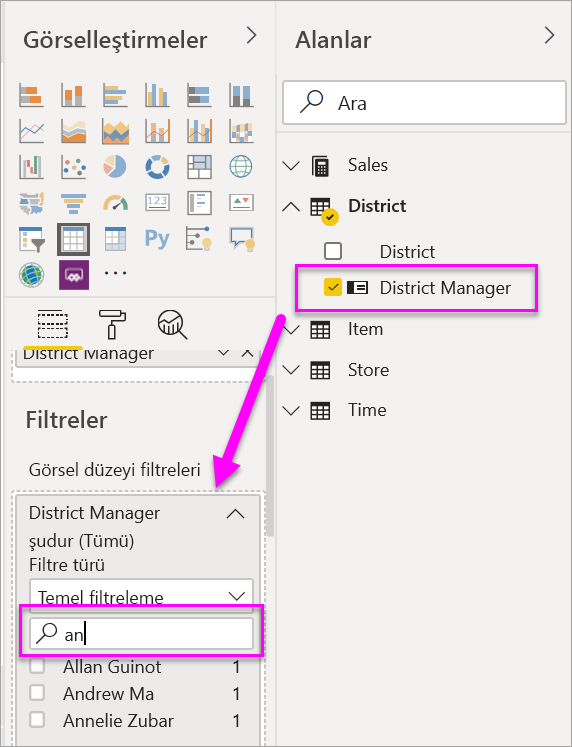
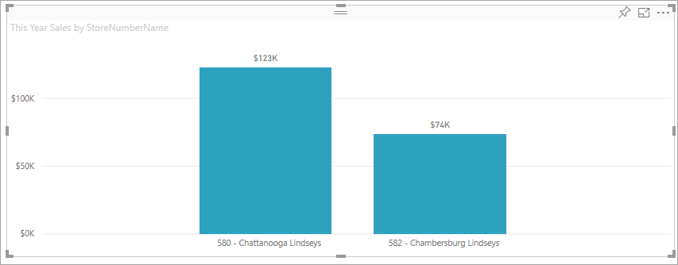

# Power BI'daki raporlara filtre ekleme

Bu makalede, Power BI bir rapora görselleştirme filtresi, sayfa filtresi veya rapor filtresi ekleme açıklanır. Filtre eklemek için bir raporu düzenleyebilmeniz gerekir. Bu makaledeki örneklerde Power BI hizmeti ve adımlar Power BI Desktop neredeyse aynıdır. Genel Bakış mı arıyorsunuz? Önce [Power BI raporlarında filtreleri ve vurgulamayı](power-bi-reports-filters-and-highlighting.md) inceleyin.

Power BI, el ile ve otomatik filtreden detaylandırma ve geçişe kadar farklı türlerde çok çeşitli filtreler sunar. [Farklı türlerde filtreler](power-bi-report-filter-types.md) hakkında bilgi edinin.

Filtreleri ekledikten sonra, istediğiniz şekilde bakmak ve işlem yapmak için [Power BI raporlardaki filtreleri biçimlendirebilirsiniz](power-bi-report-filter.md) .

## Düzenleme görünümündeki ve Okuma görünümündeki filtrelerin karşılaştırması
Raporlarla iki farklı görünümde etkileşim kurabilirsiniz: okuma görünümü ve düzenlenme görünümü. Bu makalede rapor **Düzenleme görünümünde** nasıl filtre oluşturabileceğiniz açıklanmaktadır.  Okuma görünümündeki filtreler hakkında daha fazla bilgi için [rapor Okuma görünümünde filtrelerle etkileşim kurma](../consumer/end-user-report-filter.md) başlıklı makaleye bakın.

Filtreler *kalıcı* olduğu için, rapordan çıktığınızda Power BI yaptığınız filtre, dilimleyici ve diğer veri görünümü değişikliklerini tutar. Bu nedenle, rapora geri döndüğünüzde kaldığınız yerden devam edebilirsiniz. Filtre değişikliklerinizin devam etmek istemiyorsanız, üstteki menü çubuğundan **Varsayılana sıfırla** ' yı seçin.

:::image type="content" source="../consumer/media/end-user-report-filter/power-bi-reset-icon.png" alt-text="Varsayılan simgeye sıfırlayın.":::

Rapor Oluşturucu olarak, raporla birlikte kaydedeceğiniz her türlü filtre, tüm rapor okuyucularınız için *varsayılan filtre durumuna* dönüşecek şekilde aklınızda bulundurun. **Varsayılan olarak Sıfırla**' yı seçtiğinizde, bu, geri dönirler.

## Filtreler bölmesinde filtre düzeyleri
Power BI Desktop veya Power BI hizmeti kullanıp kullansanız da, filtreler bölmesi rapor tuvalinin sağ tarafında görüntülenir. Filtreler bölmesini görmüyorsanız bölmeyi genişletmek için sağ üst köşedeki ">" simgesini seçin.

Rapor için üç farklı düzeyde filtre ayarlayabilirsiniz: görsel düzeyi, sayfa düzeyi ve rapor düzeyi. Bu makalede, farklı düzeylerin nasıl ayarlanacağı açıklanır.

## Görsele filtre ekleme
Görsellerde iki farklı tür filtre vardır.
Görsel için iki farklı şekilde görsel düzeyinde bir filtre ekleyebilirsiniz. 

* Görselde bulunan alanlar, bu görselin otomatik olarak filtreleridir. 
* Rapor Tasarımcısı olarak, zaten görsel olmayan bir alanı tanımlayabilir ve bu alanı doğrudan **görsel düzeyi filtreleri** demetine ekleyebilirsiniz.
 
Bu makalede, yüklemek ve daha sonra izlemek istiyorsanız perakende analizi örneği kullanılmaktadır. [Perakende analizi örnek](sample-retail-analysis.md#get-the-content-pack-for-this-sample) içerik paketini yükler.

### Görselde bulunmayan bir alanla filtreleme

1. Power BI hizmeti, **diğer seçenekler (...)**  >  seçeneğini belirleyin. Raporunuzu düzenleme görünümü 'nde açmak için **düzenleyin** .
   
   

2. Zaten açık değilse görselleştirmeler, filtreler ve alanlar bölmelerini açın.
   
   

3. Bir görseli seçerek etkin hale getirin. Bu durumda, Genel Bakış sayfasındaki dağılım grafiğidir. Görseldeki tüm alanlar **görsel öğeler** bölmesinde bulunur. Bunlar ayrıca, **Bu görsel başlıktaki filtreler** altında **Filtreler** bölmesinde listelenir.
   
   
  
1. Alanlar bölmesinden yeni görsel düzeyi filtresi olarak eklemek istediğiniz alanı seçip **Görsel düzeyi filtreleri alanına** sürükleyin.  Bu örnekte, **Bu görseldeki filtreler** altına **buraya veri alanları eklemek** için **Kategori** sürükliyoruz.
     
    

    Bildirim **kategorisi** görselleştirmenin *kendine eklenmez.*
     
1. **Çocukları** seçin. Dağılım grafiği filtrelenmiştir, ancak diğer görseller aynı kalır.
     
    

    Raporunuzu bu filtreyle kaydederseniz, rapor okuyucuları okuma görünümü, değerleri seçme veya temizleme bölümünde **Kategori** filtresiyle etkileşime girebilirler.
    
    Görsel düzeyde bir filtre oluşturmak için filtre bölmesine bir *sayısal sütunu* sürüklerseniz, filtre *temel alınan veri sütunlarına* uygulanır. Örneğin, **UnitCost** alanına bir filtre ekleme ve bunu **UnitCost** değerinin 20’den büyük olduğu bir yere ayarlama, görselde gösterilen veri noktalarının toplam Birim Maliyeti ne olursa olsun yalnızca Birim Maliyetinin 20’den büyük olduğu satırlardaki verileri gösterir.

## Sayfanın tamamına filtre ekleme

Sayfanın tamamını filtrelemek için sayfa düzeyi bir filtre de ekleyebilirsiniz.

1. Power BI hizmetinde, Perakende Analizi raporunu açın ve **Bölge Aylık Satışı** sayfasına gidin. 

2. **...**  > **Raporu düzenle**’yi seçerek raporunuzu Düzenleme görünümünde açın.
   
   

2. Zaten açık değilse görselleştirmeler, filtreler ve alanlar bölmelerini açın.

3. Alanlar bölmesinden yeni sayfa düzeyi filtresi olarak eklemek istediğiniz alanı seçip **Sayfa düzeyi filtreleri** alanına sürükleyin.  
4. Filtrelemek istediğiniz değerleri seçip **Temel** veya **Gelişmiş** filtreleme denetimlerini belirleyin.
   
   Sayfadaki tüm görselleştirmeler, yapılan değişikliği yansıtacak şekilde yeniden çizilir.
   
    Raporunuzu filtreli olarak kaydederseniz raporu okuyan kişiler, değerleri seçerek veya temizleyerek Okuma görünümünde filtre ile etkileşim kurabilir.

## Raporun tamamını filtrelemek için rapor düzeyi bir filtre ekleme

1. **Raporu düzenle**'yi seçerek raporu Düzenleme görünümünde açın.
   
   

2. Henüz açık değillerse Görselleştirmeler ve Filtreler bölmesini ve Alanlar bölmesini açın.
3. Alanlar bölmesinden yeni rapor düzeyi filtresi olarak eklemek istediğiniz alanı seçip **Rapor düzeyi filtreleri** alanına sürükleyin.  
4. Filtre uygulamak istediğiniz değerleri seçin.

    Etkin sayfadaki ve raporda bulunan tüm sayfalardaki görseller, yeni filtreyi yansıtacak şekilde değişir. Raporunuzu filtreli olarak kaydederseniz raporu okuyan kişiler, değerleri seçerek veya temizleyerek Okuma görünümünde filtre ile etkileşim kurabilir.

1. Önceki rapor sayfasına geri dönmek için geri okunu seçin.

## Önemli noktalar ve sorun giderme

- Alanlar bölmesini görmüyorsanız, rapor [düzenlemesi görünümünde](service-interact-with-a-report-in-editing-view.md)olduğunuzdan emin olun.
- Filtrelerdeki çok sayıda değişiklik yaptıysanız ve varsayılan ayarlara dönmek istiyorsanız, üstteki menü çubuğundan varsayılana **Sıfırla** ' yı seçin. Unutmayın: rapor yazarı olarak, raporu kaydettiğinizde hangi filtrelerin gerçekleştiği, varsayılan filtre ayarları *haline gelir* .

## Sonraki adımlar

[Power BI raporlarınızda filtreleri biçimlendirme](power-bi-report-filter.md)

[Power BI Filtreler bölmesine ilişkin tura katılın](../consumer/end-user-report-filter.md)

[Raporlarda filtreleme ve vurgulama](power-bi-reports-filters-and-highlighting.md)

[Power BI’daki farklı filtre türleri](power-bi-report-filter-types.md)

Başka bir sorunuz mu var? [Power BI Topluluğu'na başvurun](https://community.powerbi.com/)
