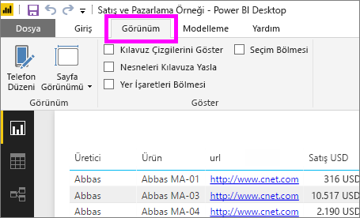
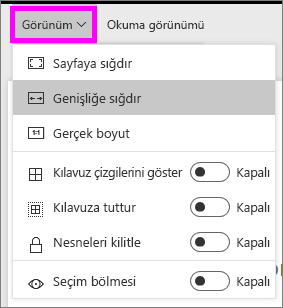
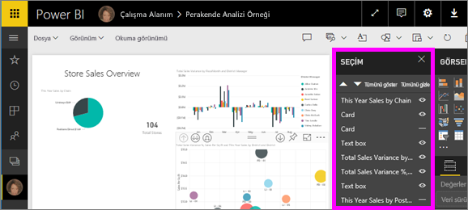
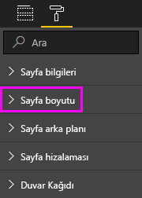

# Power BI raporuna sayfa görüntüleme ayarlarını uygulama
Rapor düzeninizin kusursuz görünmesinin sizin için çok önemli olduğunu anlıyoruz. Siz ve iş arkadaşlarınız bu raporları farklı en boy oranlarına ve boyutlara sahip ekranlarda görüntülediğiniz için, bu bazen güç olabilir. 

Varsayılan ekran görünümü **Sayfaya sığdır**, varsayılan görüntüleme boyutu ise **16:9** şeklindedir. Farklı bir en boy oranı kullanmak veya raporunuzu farklı şekilde sığdırmak istiyorsanız şu iki araçtan faydalanabilirsiniz: **_Sayfa görünümü_* _ ayarları ve _*_Sayfa boyutu_*_ ayarları.

<iframe width="560" height="315" src="https://www.youtube.com/embed/5tg-OXzxe2g" frameborder="0" allowfullscreen></iframe>

## Power BI hizmetinde ve Power BI Desktop'ta Sayfa görünümü ayarlarının yeri
Sayfa görünümü ayarları hem Power BI hizmetinde hem de Power BI Desktop'ta bulunmaktadır ancak arabirimi biraz farklıdır. Aşağıdaki bölümde, her Power BI aracında Görünüm ayarlarını nerede bulabileceğiniz açıklanmaktadır.

### Power BI Desktop'ta
Rapor görünümü'nde Sayfa görünümü ayarlarını ve telefon düzeni ayarlarını açmak için _ *Görünüm** sekmesini seçin.

  

### Power BI hizmetinde (app.powerbi.com)
Power BI hizmetinde, bir rapor açın ve sol üst menü çubuğundan **Görünüm**'ü seçin.

Sayfa görünümü ayarları, [Okuma görünümü ve Düzenleme görünümü](../consumer/end-user-reading-view.md)'nde bulunmaktadır. Düzenleme görünümünde, rapor sahibi bireysel rapor sayfalarına sayfa görünümü ayarları atayabilir ve bu ayarlar raporla birlikte kaydedilir. İş arkadaşlarınızdan biri söz konusu raporu Okuma görünümü'nde açtığında, rapor sayfalarını rapor sahibinin ayarlarını kullanarak görüntüler. İş arkadaşlarınız Okuma görünümünde *bazı* **Sayfa görünümü** ayarlarını değiştirebilir ancak bu değişiklikler rapordan çıktıklarında kaydedilmez.

## Sayfa görünümü ayarları
Birinci Sayfa görünümü ayarları kümesi, rapor sayfanızın tarayıcı penceresiyle ilgili görüntülenmesini denetler. Şunlardan birini seçin:

* **Sayfaya sığdır** (varsayılan): İçerikler sayfaya en iyi sığacak şekilde ölçeklendirilir
* **Genişliğe uydur**: İçerikler sayfanın genişliğine sığacak şekilde ölçeklendirilir
* **Gerçek boyut**: İçerikler tam boyutta görüntülenir

İkinci Sayfa görünümü ayarları kümesi, rapor tuvalindeki nesnelerin konumlandırılmasını denetler. Şunlardan birini seçin:

* **Kılavuz çizgilerini göster**: Rapor tuvali üzerindeki nesneleri konumlandırmanıza yardımcı olması için kılavuz çizgilerini açın.
* **Kılavuza yasla**: Rapor tuvalindeki nesneleri tam olarak konumlandırmak ve hizalamak için **Kılavuz çizgilerini göster** seçeneğiyle birlikte kullanın. 
* **Nesneleri kilitle**: Taşınamamaları veya yeniden boyutlandırılmamaları için tuvaldeki tüm nesneleri kilitleyin.
* **Seçim bölmesi**: **Seçim** bölmesi, tuvaldeki tüm nesneleri listeler. Hangisinin gösterileceğine, hangisinin gizleneceğine karar verebilirsiniz.

    

## Sayfa boyutu ayarları

**Sayfa boyutu** ayarları yalnızca rapor sahipleri tarafından kullanılabilir. Bu, Power BI hizmetinde (app.powerbi.com) raporun [Düzenleme görünümü](../consumer/end-user-reading-view.md)'nde açabileceği anlamına gelmektedir. **Sayfa boyutu** ayarları **Görsel öğeler** bölmesindedir ve rapor tuvalinin görüntü birimi oranı ile gerçek boyutunu (piksel olarak) denetler:   

* 4:3 oranı
* 16:9 oranı (varsayılan)
* Letter
* Özel (piksel cinsinden yükseklik ve genişlik)

## Sonraki adımlar
[Power BI Desktop'ta rapor görünümü](desktop-report-view.md)

[Sahip olduğunuz Power BI raporlarında Sayfa görünümü ve Sayfa boyutu ayarlarını değiştirme](../consumer/end-user-report-view.md)

[Power BI'daki raporlar](../consumer/end-user-reports.md) hakkında daha fazla bilgi edinin

[Power BI hizmetinde tasarımcılara yönelik temel kavramlar](../fundamentals/service-basic-concepts.md)

Başka bir sorunuz mu var? [Power BI Topluluğu'na başvurun](https://community.powerbi.com/)
