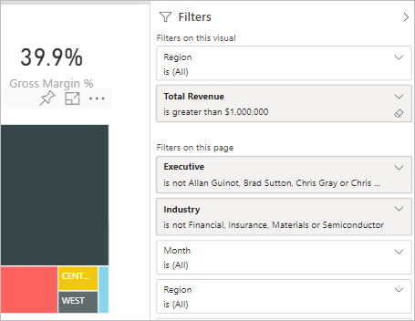
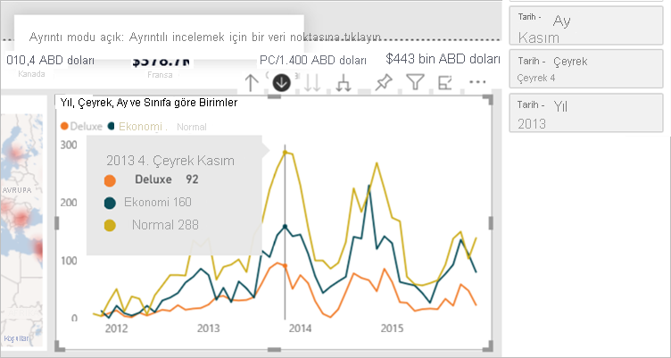
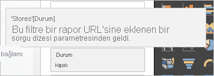
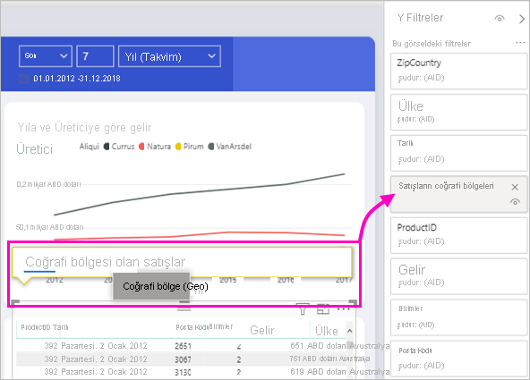

# Power BI raporlarındaki filtre türleri

Filtreler birbiriyle aynı davranışları göstermez çünkü aynı şekilde oluşturulmamışlardır. Bunları nasıl oluşturduğunuz, yeni filtre bölmesinde düzenleme modundaki davranışlarını etkiler. Bu makalede farklı filtre türlerini açıklayacağız: bunları farklı oluşturma yollarınız ve bunların yararlı olduğu farklı kullanımlar. [Raporlara filtre ekleme](power-bi-report-add-filter.md) konusunda bilgi edinin. 

En yaygın iki filtre türüyle başlayalım: el ile ve otomatik.

## El ile çalıştırılan filtreler 

El ile çalıştırılan filtreler, rapor oluşturucularının yeni filtre bölmesinde herhangi bir konuma sürükleyip bıraktığı filtrelerdir. Raporu düzenleme izni olan kullanıcılar yeni bölmede bu filtreyi düzenleyebilir, silebilir, temizleyebilir, gizleyebilir, kilitleyebilir, yeniden adlandırabilir veya sıralayabilir.

## Otomatik filtreler 

Otomatik filtreler, siz görsel oluştururken filtre bölmesinin görsel düzeyine otomatik olarak eklenen filtrelerdir. Bu filtreler görselinizi oluşturan alanları temel alır. Raporu düzenleme izni olan kullanıcılar yeni bölmede bu filtreyi düzenleyebilir, temizleyebilir, gizleyebilir, kilitleyebilir, yeniden adlandırabilir veya sıralayabilir. Otomatik filtreleri silemezler çünkü görselde bu alanlara başvurulur.

## Daha gelişmiş filtreler

Bundan sonra açıklanan filtre türleri o kadar yaygın değildir ama bunlar raporunuzda görüntüleniyorsa bunları anlamanız yine de önemlidir. Ayrıca raporunuz için en doğru filtreyi oluşturmanıza yardımcı olabilirler.

## Dahil etme ve hariç tutma filtreleri

Görselde dahil etme veya hariç tutma işlevselliğini kullandığınızda filtre bölmesine dahil etme ve hariç tutma filtreleri otomatik olarak eklenir. Raporu düzenleme izni olan kullanıcılar yeni bölmede bu filtreyi silebilir, kilitleyebilir, gizleyebilir veya sıralayabilir. Dahil etme veya hariç tutma filtresini düzenleyemez, temizleyemez veya yeniden adlandıramazlar çünkü bu filtre görsellerin dahil etme ve hariç tutma işlevselliğiyle ilişkilidir.

## Detaya gitme filtreleri

Raporunuzda görsel için detaya gitme işlevselliğini kullandığınızda filtre bölmesine detaya gitme filtreleri otomatik olarak eklenir. Raporu düzenleme izni olan kullanıcılar yeni bölmede filtreyi düzenleyebilir veya temizleyebilir. Bu filtreyi silemez, gizleyemez, kilitleyemez, yeniden adlandıramaz veya sıralayamazlar çünkü bu filtre görsellerin detaya gitme işlevselliğiyle ilişkilidir. Detaya gitme filtresini kaldırmak için görselin detaydan çıkma düğmesine tıklarsınız.

## Çapraz detaylandırma filtreleri

Çapraz filtreleme veya çapraz vurgulama özelliği üzerinden bir detaya gitme filtresi rapor sayfasındaki başka bir görsele geçirildiğinde, yeni bölmeye çapraz detaylandırma filtreleri otomatik olarak eklenir. Rapor üzerinde düzenleme izni olan kullanıcılar bu filtreyi silemez, temizleyemez, gizleyemez, kilitleyemez, yeniden adlandıramaz veya sıralayamazlar çünkü bu filtre görsellerin detaya gitme işlevselliğiyle ilişkilidir. Ayrıca başka bir görseldeki detaya gitme işleminden geldiği için bu filtreyi düzenleyemezler. Detaya gitme filtresini kaldırmak için filtreyi geçiren görselin detaydan çıkma düğmesine tıklarsınız.

## Detaylandırma filtreleri

Detaylandırma filtreleri detaylandırma özelliği yoluyla bir sayfadan diğerine geçirilir. Bunlar detaylandırma bölmesinde gösterilir. İki tür detaylandırma filtresi vardır. İlk tür, detaylandırma işlemini çağıran filtredir. Rapor düzenleyicileri bu tür bir filtreyi düzenleyebilir, silebilir, temizleyebilir, gizleyebilir veya kilitleyebilir. İkinci tür filtre kaynak sayfanın sayfa düzeyi filtreleri temel alınarak hedefe geçirilen detaylandırma filtresidir. Rapor düzenleyicileri bu geçici detaylandırma filtresi türünü düzenleyebilir, silebilir veya temizleyebilir. Bu filtreyi son kullanıcılar için kilitleyemez veya gizleyemezler.

## URL filtreleri

URL filtreleri, bir URL sorgu parametresinin eklenmesiyle yeni bölmeye eklenir. Raporu düzenleme izni olan kullanıcılar yeni bölmede filtreyi düzenleyebilir, silebilir veya temizleyebilir. Bu filtreyi gizleyemez, kilitleyemez, yeniden adlandıramaz veya sıralayamazlar çünkü bu filtre URL parametresiyle ilişkilidir. Filtreyi kaldırmak için URL'den URL parametresini kaldırırsınız. Parametre içeren bir URL örneği:

app.powerbi.com/groups/me/apps/*app-id*/reports/*report-id*/ReportSection?filter=Stores~2FStatus%20eq%20'Off'

[URL filtreleri](../collaborate-share/service-url-filters.md) hakkında daha fazla bilgi edinin.

## Geçiş filtreleri

Geçiş filtreleri Soru-Cevap aracılığıyla oluşturulan görsel düzeyi filtrelerdir. Yazarlar bu filtreleri yeni bölmede silebilir, gizleyebilir veya sıralayabilir. Öte yandan bu filtreleri yeniden adlandıramaz, düzenleyemez, temizleyemez veya kilitleyemezler.

## Filtre türlerini karşılaştırma

Bu tabloda yazarların farklı filtre türleriyle neler yapabilecekleri karşılaştırılır.

| Filtre türü | Düzenle | Temizle | Sil | Gizle | Kilitle | Sırala | Yeniden adlandır |
|----|----|----|----|----|----|----|----|
| El ile çalıştırılan filtreler | E | E | E | E | E | E | E |
| Otomatik filtreler | E | E | N | E | E | E | E |
| Ekleme/Dışlama filtreleri | N | N | E | E | E | E | N |
| Detaya gitme filtreleri | E | E | N | N | N | N | N |
| Çapraz Detaylandırma filtreleri | N | N | N | N | N | N | N |
| Detaylandırma filtreleri (detaylandırma işlemini çağırır) | E | E | E | E | E | N | N |
| Detaylandırma filtreleri (Geçici) | E | E | E | N | N | N | N |
| URL filtreleri - geçici | E | E | E | N | N | N | N |
| Geçiş filtreleri | N | N | E | E | N | E | N |

## Sonraki adımlar

[Raporlara filtre ekleme](power-bi-report-add-filter.md)

[Power BI Filtreler bölmesine ilişkin tura katılın](../consumer/end-user-report-filter.md)

[Raporlarda filtreleme ve vurgulama](power-bi-reports-filters-and-highlighting.md)

Başka bir sorunuz mu var? [Power BI Topluluğu'na başvurun](https://community.powerbi.com/)
