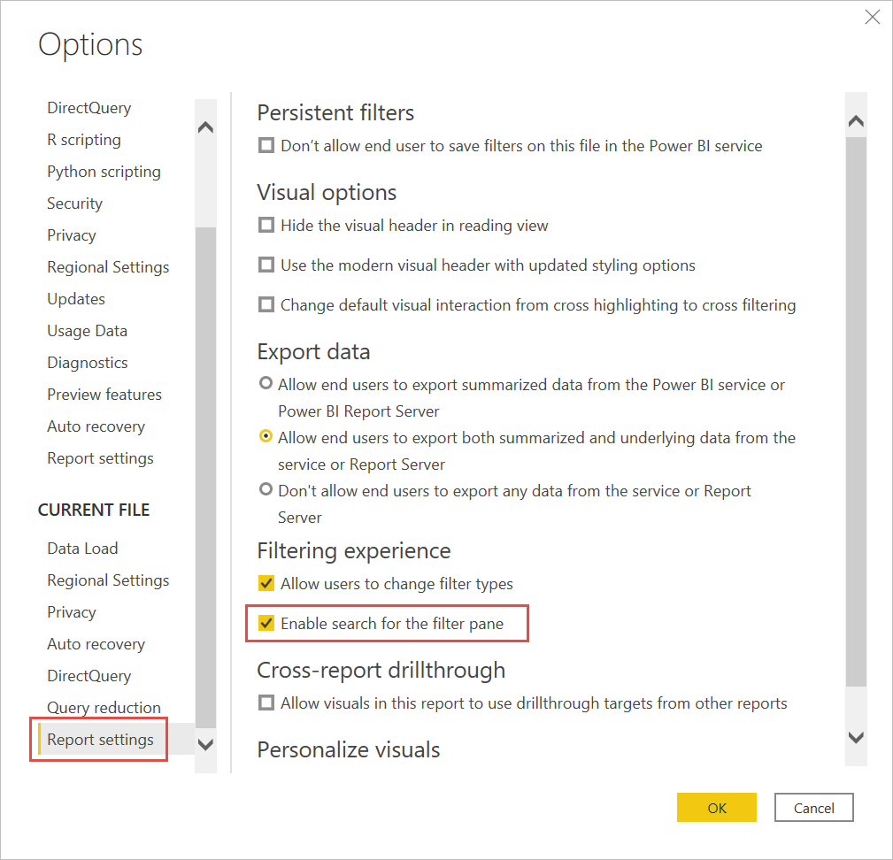

# <a name="format-filters-in-power-bi-reports"></a>Power BI raporlarında biçim filtreleri

[!INCLUDE [applies-to](../includes/applies-to.md)] [!INCLUDE [yes-desktop](../includes/yes-desktop.md)] [!INCLUDE [yes-service](../includes/yes-service.md)]

Rapor filtresi tasarımı ve işlevleri üzerinde çok fazla denetiminiz vardır. Bu makalede, raporun geri kalanı gibi görünmesi için filtreler bölmesini nasıl biçimlendirebileceğiniz açıklanır. Filtreleri kilitleyebilir, hatta gizleyebilirsiniz.


İlk adım, [raporunuza filtre eklemektir](power-bi-report-add-filter.md). Daha sonra, bir rapor Tasarımcısı olarak filtreler bölmesini biçimlendirmek için birçok yol vardır:

- Filtrenin uygulandığı alanları ekleyebilir veya kaldırabilirsiniz. 
- Filtre durumunu değiştirebilirsiniz.
- Filtreler bölmesini raporunuzu bir parçası gibi görünecek şekilde biçimlendirebilir ve özelleştirebilirsiniz.
- Kullanıcı raporu açtığında Filtreler bölmesinin varsayılan olarak açık mı yoksa daraltılmış mı olacağını tanımlayabilirsiniz.
- Filtreler bölmesinin tamamını veya rapor kullanıcılarının görmesini istemediğiniz belirli filtreleri gizleyebilirsiniz.
- Filtreler bölmesinin görünürlüğünü, açık ve daraltılmış durumunu denetleyebilir, hatta buna yer işareti ekleyebilirsiniz.
- Kullanıcıların düzenlemesini istemediğiniz filtreleri kilitleyebilirsiniz.

Kullanıcılar raporu okurken herhangi bir görselin üzerine gelerek o görseli etkileyen tüm filtrelerin ve dilimleyicilerin salt okunur bir listesini görüntüleyebilir.


Rapor okuyucularının rapor okuma modunda [filtreleri nasıl kullandığını](../consumer/end-user-report-filter.md) okuyun.

## <a name="build-the-filters-pane"></a>Filtreler bölmesini oluşturma

Varsayılan olarak, filtreler bölmesi geçerli rapor ayarlarınıza göre biçimlendirilir. Filtreler bölmesinde hangi filtrelerin ekleneceğini yapılandırır ve mevcut filtreleri güncelleştirirsiniz. Raporunuzu yayımladığınızda filtreler bölmesi rapor Tüketicileriniz için de aynı şekilde görünür. 

1. Rapor tuvaline görsel eklediğinizde, Power BI görseldeki her alan için Filtreler bölmesine otomatik olarak bir filtre ekler.

2. Filtreler bölmesini oluşturmak için, ilgilendiğiniz diğer alanları görsel, sayfa veya rapor düzeyi filtreleri olarak filtreler bölmesine sürükleyin.

## <a name="show-or-hide-the-filters-pane"></a>Filtreler bölmesini göster veya gizle

### <a name="hide-the-filters-pane-in-reading-mode"></a>Okuma modunda filtreler bölmesini gizle

Rapor okuyucularınızın filtreler bölmesini hiç görmesini istemiyorsanız, **Filtreler**' in yanındaki **göz** simgesini seçin.

 

### <a name="hide-the-filters-pane-while-editing"></a>Düzenlerken Filtreler bölmesini gizleme

Raporunuzu düzenlediğinizde filtreler bölmesini gizleyebilirsiniz, filtreler bölmesini kullanmıyorsanız ve ekranda ek alana ihtiyacınız vardır. 

- **Görünüm** sekmesinde **Filtreler** düğmesi filtreler bölmesini gösterebilir veya gizlemenize izin verir.


Bu ayar yalnızca Power BI Desktop’ta Filtreler bölmesini gizler. Power BI hizmeti için Düzenle modunda eşdeğer değildir.

## <a name="lock-or-hide-filters"></a>Filtreleri kilitleme veya gizleme

Tek tek filtre kartlarını kilitleyebilir veya gizleyebilirsiniz. Filtreyi kilitlerseniz, rapor kullanıcılarınız filtreyi görebilir ama değiştiremez. Gizlerseniz, kullanıcılar filtreyi hiç göremez. Normalde null değerlerle beklenmeyen değerleri dışlayan veri temizleme filtrelerini gizlemeniz gerektiğinde, filtre kartlarını gizleme özelliği yararlı olur. 

- Filtreler bölmesinde, filtre kartındaki **Filtreyi kilitle** veya **Filtreyi gizle** simgesini seçin veya temizleyin.

   

Filtreler bölmesinde bu ayarları açtığınız ve kapattığınızda, değişikliklerin rapora yansıtıldığını görürsünüz. Gizli filtreler, görselin filtre açılan listesinde gösterilmez.

Ayrıca Filtreler bölmesinin durumunu, raporunuzun yer işaretleriyle akışa katılacak şekilde yapılandırabilirsiniz. Bölmenin açık, kapalı ve görünürlük durumlarının tümüne yer işaretleri eklenebilir.
 
## <a name="format-the-filters-pane"></a>Filtreler bölmesini biçimlendirme

Filtre deneyiminin önemli bir parçası, Filtreler bölmesini raporunuzun genel görünümüne uyacak şekilde biçimlendirebilmenizdir. Ayrıca Filtreler bölmesini raporun her sayfası için farklı biçimlendirebilirsiniz. Biçimlendirebileceğiniz öğeler şunlardır: 

- Arka plan rengi
- Arka plan saydamlığı
- Kenarlık açık veya kapalı
- Kenarlık rengi
- Başlık ve üst bilgi yazı tipi, rengi ve metin boyutu

Bu öğeleri, uygulanmış (bir değere ayarlanmış) veya kullanılabilir (temizlenmiş) olup olmadıklarına bağlı olarak filtre kartları için de biçimlendirebilirsiniz: 

- Arka plan rengi
- Arka plan saydamlığı
- Kenarlık: açık veya kapalı
- Kenarlık rengi
- Yazı tipi, renk ve metin boyutu
- Giriş kutusu rengi

### <a name="format-the-filters-pane-and-cards"></a>Filtreler bölmesini ve kartlarını biçimlendirme

1. Raporda, raporun kendisine veya arka plana (*duvar kağıdı*) tıklayın ve **Görselleştirmeler** bölmesinde **Biçimlendir**'i seçin. 
    Rapor sayfasını, duvar kağıdını ve ayrıca Filtreler bölmesiyle Filtre kartlarını biçimlendirme seçeneklerini görürsünüz.

1. Arka plan, simge ve sol kenarlık rengini rapor sayfasını tamamlayacak şekilde ayarlamak için **Filtreler bölmesini** genişletin.

    

1. **Kullanılabilir** ve **Uygulanmış** kart rengini ve kenarlığını ayarlamak için **Filtre kartlarını** genişletin. Kullanılabilir ve uygulanmış kartları farklı renklerde ayarlarsanız, hangi filtrelerin uygulandığı rahatça görülür. 
  
    

## <a name="theming-for-filters-pane"></a>Filtreler bölmesi için tema oluşturma
Artık tema dosyasıyla Filtreler bölmesinin varsayılan ayarlarını değiştirebilirsiniz. Aşağıda başlangıç yapmanıza yardımcı olacak bir örnek tema kod parçacığı verilmiştir:

 
```
"outspacePane": [{ 

"backgroundColor": {"solid": {"color": "#0000ff"}}, 

"foregroundColor": {"solid": {"color": "#00ff00"}}, 

"transparency": 50, 

"titleSize": 35, 

"headerSize": 8, 

"fontFamily": "Georgia", 

"border": true, 

"borderColor": {"solid": {"color": "#ff0000"}} 

}], 

"filterCard": [ 

{ 

"$id": "Applied", 

"transparency": 0, 

"backgroundColor": {"solid": {"color": "#ff0000"}}, 

"foregroundColor": {"solid": {"color": "#45f442"}}, 

"textSize": 30, 

"fontFamily": "Arial", 

"border": true, 

"borderColor": {"solid": {"color": "#ffffff"}}, 

"inputBoxColor": {"solid": {"color": "#C8C8C8"}} 

}, 

{ 

"$id": "Available", 

"transparency": 40, 

"backgroundColor": {"solid": {"color": "#00ff00"}}, 

"foregroundColor": {"solid": {"color": "#ffffff"}}, 

"textSize": 10, 

"fontFamily": "Times New Roman", 

"border": true, 

"borderColor": {"solid": {"color": "#123456"}}, 

"inputBoxColor": {"solid": {"color": "#777777"}} 

}] 
```

## <a name="sort-the-filters-pane"></a>Filtreler bölmesini sıralama

Filtreler bölmesinde özel sıralama işlevi kullanılabilir. Raporunuzu oluştururken filtreleri sürükleyip bırakarak herhangi bir sırada yeniden düzenleyebilirsiniz.


Filtrelerin varsayılan sıralama düzeni alfabetiktir. Özel sıralama modunu başlatmak için herhangi bir filtreyi yeni bir konuma sürüklemeniz yeterlidir. Filtreleri yalnızca uygulandıkları düzeyin içinde yeniden düzenleyebilirsiniz. Örneğin, filtreler bölmesinin görsel düzeyi bölümündeki görsel düzeyi filtrelerin sırasını değiştirebilirsiniz.

## <a name="improved-filters-pane-accessibility"></a>Geliştirilmiş Filtreler bölmesi erişilebilirliği

Filtreler bölmesinin klavye gezintisini geliştirdik. Filtreler bölmesinin her parçasına Sekme tuşuyla gidebilir ve klavyenizdeki içerik tuşunu kullanarak ya da Shift+F10 tuşlarına basarak içerik menüsünü açabilirsiniz.


## <a name="rename-filters"></a>Filtreleri yeniden adlandırma
Filtreler bölmesini düzenlerken, başlığa çift tıklayarak başlığı düzenleyebilirsiniz. Son kullanıcılarınızın daha iyi anlayabilmesi için filtre kartını güncelleştirmek istiyorsanız yeniden adlandırma kullanışlıdır. Unutmayın; filtre kartını yeniden adlandırmak alanlar listesindeki alanın görünen adını *değiştirmez*. Yalnızca filtre kartında kullanılan görünen adını değiştirir.


## <a name="filters-pane-search"></a>Filtreler bölmesi araması

Filtreler bölmesi araması özelliği, filtre kartlarınızda başlığa göre arama yapmanıza olanak sağlar. Bu özellik, Filtreler bölmenizde birkaç farklı filtre kartınız varsa ve ilginizi çekenleri bulma konusunda yardıma ihtiyacınız varsa kullanışlıdır.


Ayrıca, Filtreler bölmesinin diğer öğelerini biçimlendiriyormuş gibi arama kutusunu da biçimlendirebilirsiniz.


Filtreler bölmesi araması özelliği varsayılan olarak açık olsa da, **Seçenekler** iletişim kutusunun **Rapor** ayarları bölümünde **Filtreler bölmesi için aramayı etkinleştir** seçeneğini belirleyerek bu özelliği açabilir veya kapatabilirsiniz.



## <a name="restrict-changes-to-filter-type"></a>Filtre türündeki değişiklikleri kısıtlama

**Rapor** ayarlarının **Filtreleme deneyimi** bölümünde, kullanıcıların filtre türünü değiştirip değiştiremeyeceğini belirleme seçeneğiniz vardır.


## <a name="allow-saving-filters"></a>Filtrelerin kaydedilmesine olanak tanıma

Rapor okuyucuları varsayılan olarak raporunuzdaki filtreleri kaydedebilir. Okuyucuların filtreleri kaydetme iznini kaldırabilirsiniz.

- Ayrıca **Seçenekler** iletişim kutusundaki **Rapor** ayarlarının **Kalıcı filtreler** bölümünde **Son kullanıcıların bu raporda filtre kaydetmesine izin verme**'yi seçin.

    :::image type="content" source="media/power-bi-report-filter/power-bi-persistent-filters.png" alt-text="Son kullanıcıların bu raporda filtre kaydetmesine izin verme seçeneğinin ekran görüntüsü.":::

## <a name="apply-filters-button"></a>Filtre uygula düğmesi

Filtre bölmesine tek bir **Uygula** düğmesi ekleyebilirsiniz. Bu düğme sizin ve son kullanıcılarınızın tüm filtre değişikliklerini tek seferde eklemenize olanak tanır. Filtre değişikliklerinin uygulanmasını geciktirmek istiyorsanız bu düğmenin bulunması yararlı olabilir. Rapora veya görsellere tüm filtre değişikliklerini uygulaya hazır olduktan sonra, yalnızca bir kez beklemeniz yeterli olur.

:::image type="content" source="media/power-bi-report-filter/apply-filter-button.png" alt-text="Filtre uygula düğmesi":::

### <a name="turn-on-the-apply-button"></a>Uygula düğmesini açma

Bu özelliği rapor düzeyinde ayarlayabilirsiniz. Bununla birlikte bu özellik varsayılan olarak kapalıdır.

1. **Dosya** > **Seçenekler ve ayarlar** > **Seçenekler** > **Sorgu azaltma** öğesine gidin.

1. **Değişiklikleri aynı anda uygulamak için filtre bölmesine tek bir Uygula düğmesi ekleyin** öğesini seçin.

    :::image type="content" source="media/power-bi-report-filter/apply-all-filters.png" alt-text="Filtre uygula düğmesini açma":::

### <a name="format-the-apply-button"></a>Uygula düğmesini yapılandırma

Şu anda düğmenin **Uygula** metninin biçimlendirmesini bazı yönlerden denetleyebilirsiniz. **Biçim** bölmesinin **Filtre bölmesi** bölümünde şu seçenekleri ayarlayın:

- **Onay kutusu ve Uygula rengi** dolgu rengini denetler. 
- **Yazı tipi ve simge rengi** metnin rengini denetler.
- **Üst bilgi metin boyutu** metnin boyutunu denetler.
- **Yazı tipi ailesi** yazı tipini denetler.

    :::image type="content" source="media/power-bi-report-filter/format-apply-filter.gif" alt-text="Filtre uygula düğmesinin metnini biçimlendirme":::

## <a name="considerations-and-limitations"></a>Önemli noktalar ve sınırlamalar

Web’de yayımla, Filtreler bölmesini göstermiyor. Web 'de bir rapor yayımlamayı planlıyorsanız bunun yerine, filtreleme için dilimleyici eklemeyi göz önünde bulundurun.

## <a name="next-steps"></a>Sonraki adımlar

- [Rapor filtrelerini kullanma](../consumer/end-user-report-filter.md)
- [Raporlarda filtreleme ve vurgulama](power-bi-reports-filters-and-highlighting.md)
- [Power BI’daki farklı filtre türleri](power-bi-report-filter-types.md)

Başka bir sorunuz mu var? [Power BI Topluluğu'na başvurun](https://community.powerbi.com/)
