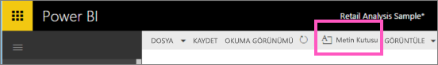
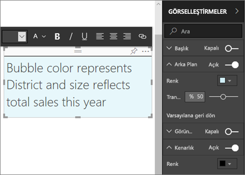
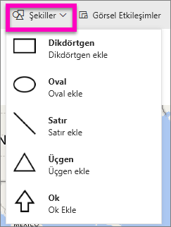
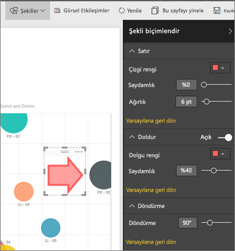

# Power BI raporlarına metin kutuları ve şekiller ekleme
Power BI hizmeti ve Power BI Desktop kullanılarak, raporlara metin kutuları ve şekiller ekleyebilirsiniz. Her iki durumda da, rapor için düzenleme izinlerine sahip olmanız gerekir. Power BI hizmetinde sizinle bir rapor paylaşıldıysa, düzenleme izinlerine sahip olmazsınız. 

Will'i [rapora statik görüntüler eklemek](/learn/modules/visuals-in-power-bi/12-formatting) için Power BI Desktop kullanırken izleyin ve ardından, bunun yerine Power BI hizmetini kullanarak kendiniz denemek için aşağıdaki adımları izleyin.
> 
> <iframe width="560" height="315" src="https://www.youtube.com/embed/_3q6VEBhGew" frameborder="0" allowfullscreen></iframe>
> 

## Rapora metin kutusu ekleme
1. Bir raporu Düzenleme görünümünde açın.

2. İmlecinizi rapor tuvalinin boş bir alanına yerleştirip, üstteki menüden **Metin kutusu** seçeneğini belirleyin.
   
   
3. Metin kutusuna metninizi yazın ve isteğe bağlı olarak biçim yazı tipini, rengini ve metin hizalamasını biçimlendirin. 
   
   
4. Metin kutusunu yerleştirmek için üst kısımdaki gri alanı seçip sürükleyin. Metin kutusunu yeniden boyutlandırmak için ana hat tutamaçlarından herhangi birini seçip sürükleyin. 
   
   

5. Metin kutusu hala seçiliyken, **Görsel öğeler** bölmesine ek biçimlendirmeler ekleyin. Bu örnekte, arka planı ve kenarlığı biçimlendirdik. Ayrıca, bir metin kutusu için tam bir boyut ve konum oluşturabilirsiniz.  

   

6. Metin kutusunu kapatmak için rapor tuvalindeki herhangi bir boş alanı seçin. 

7. Bu görselleştirmenin panonuzda da gösterilmesi için raptiye simgesini   metin kutusunu bir panoya sabitlemek için. 

## Rapora şekil ekleme
1. İmlecinizi rapor tuvalinin herhangi bir yerine yerleştirip **Şekiller** seçeneğini belirleyin.
   
   
2. Açılan listeden, rapor tuvalinize eklemek üzere bir şekil seçin. Bu örnek için toplam satış varyansının en yüksek olduğu balona dikkat çekmek için bir ok ekleyelim. 
   
   **Şekli biçimlendir** bölmesinde, eklediğiniz şekli özelleştirin. Biz bu örnekte koyu kırmızı kenarlıklı, 90 derece döndürülmüş kırmızı bir ok oluşturduk.
   
   
3. Şekli yerleştirmek için üst kısımdaki gri alanı seçip sürükleyin. Şekli yeniden boyutlandırmak için ana hat tutamaçlarından herhangi birini seçip sürükleyin. Metin kutusu için yaptığınız gibi, bir şekil için de tam bir boyut ve konum oluşturabilirsiniz.

   > [!NOTE]
   > [Canlı bir sayfayı sabitlediğinizde](service-dashboard-pin-live-tile-from-report.md) görsel öğelerden biri olması dışında, şekiller bir panoya sabitlenemez. 
   > 
   > 

## Sonraki adımlar

Aşağıdaki makaleler de ilginizi çekebilir:

* [Metin kutularına köprü ekleme](service-add-hyperlink-to-text-box.md)
* [Power BI hizmetinde tasarımcılar için temel kavramlar](../fundamentals/service-basic-concepts.md)
* [Power BI raporlarında analizleri şekil, görüntü ve simgelerle geliştirmeye yönelik ipuçları](../guidance/report-tips-shapes-images-icons.md)
* Başka bir sorunuz mu var? [Power BI Topluluğu'na başvurun](https://community.powerbi.com/)
