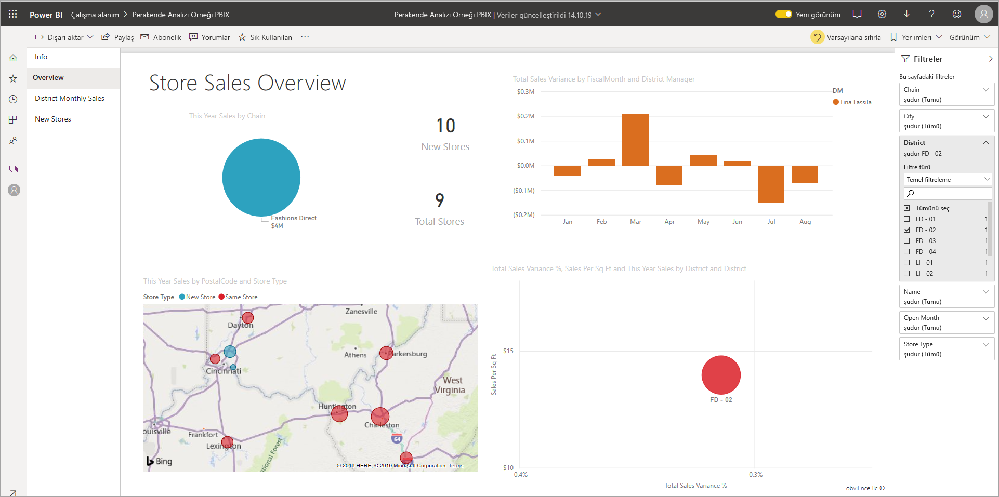
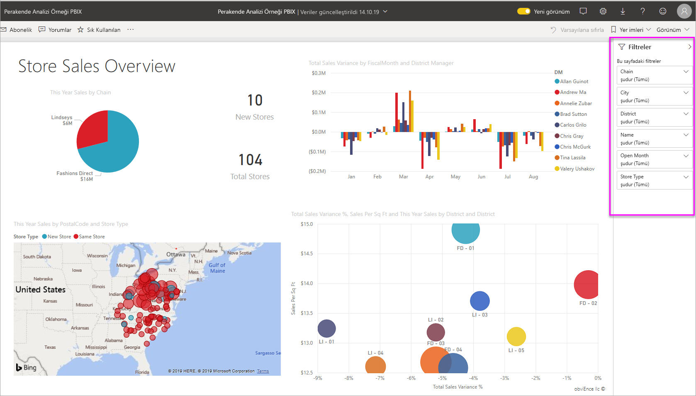
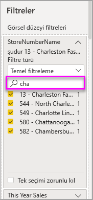
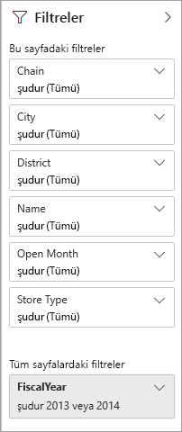
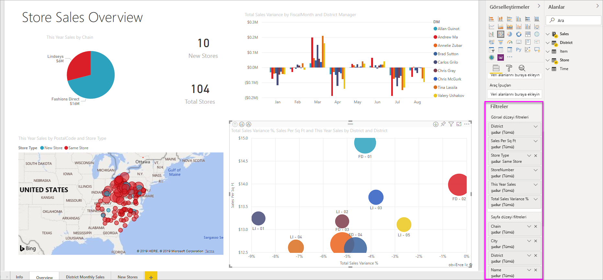

# Power BI raporlarındaki filtreler ve vurgulama

 Bu makalede, Power BI hizmetindeki filtreleme ve vurgulama özellikleri tanıtılmaktadır. Power BI Desktop ile sunulan deneyim de neredeyse aynıdır. *Filtreler*, odaklanmak istedikleriniz dışındaki tüm verileri kaldırır. Genel olarak, *vurgulama* filtrelememez. Çoğu görselde, vurgulama ilgisiz verileri kaldırmaz. Bunun yerine ilgili verileri vurgular. Verilerin geri kalanı görünür kalır ancak soluk kalır. Ayrıntılar için bu makalenin ilerleyen kısımlarında [çapraz filtreleme ve çapraz vurgulama](#cross-filter-and-cross-highlight-visuals) bölümüne bakın.

Power BI raporların filtreleneceği ve vurgulamanın birçok farklı yolu vardır. Tüm bu bilgilerin tek bir makaleye yerleştirilmesi çok büyük olabilir, bu nedenle bu bölümlere ayrılır:

* Filtrelere ve vurgulamaya giriş (şu anda okuduğunuz makale).
* [Filtreler ve vurgulama Power BI hizmeti okuma görünümü 'nde nasıl çalışır](../consumer/end-user-interactions.md) . Yapabileceğiniz özellikler, Düzen görünümü ' ne göre daha sınırlıdır, ancak hala çok çeşitli filtreleme ve vurgulama seçeneklerine sahipsiniz.  
* Power BI Desktop ve Power BI hizmeti [Filtreler bölmesinde Filtreler oluşturma](power-bi-report-add-filter.md) . Düzenleme izinlerine sahip olmanız halinde raporlarda filtre oluşturabilir, bunları değiştirebilir ve silebilirsiniz.
* Filtreleri ekledikten sonra, istediğiniz şekilde hareket etmek için [filtreleri biçimlendirebilir](power-bi-report-filter.md) ve raporun geri kalanına benzer şekilde bakabilirsiniz.
* Filtrelerin ve vurgulamanın varsayılan olarak nasıl çalıştığını öğrendiniz. Artık [bir sayfa filtresindeki görselleştirmelerin nasıl değiştirileceğini ve birbirini vurgulayacağınızı](service-reports-visual-interactions.md)öğrenin.
* [Power BI raporlarında diğer filtre türleri](power-bi-report-filter-types.md)hakkında bilgi edinin.

## Filtreler bölmesine giriş

**Filtreler bölmesinde filtreler** uygulayabilir veya doğrudan rapor sayfasında Dilimleyiciler üzerinde [seçimler yapabilirsiniz](../visuals/power-bi-visualization-slicers.md) . Filtreler bölmesi ayrı görsellerdeki alanları ve rapor tasarımcısının eklediği diğer filtreleri gösterir. 

Filtreler bölmesinde oluşturduğunuz dört standart filtre türü vardır.

- **Görsel filtresi** , bir rapor sayfasındaki tek bir görsel için geçerlidir. Rapor tuvalinde bir görsel seçtiğinizde görsel düzeyi filtreleri görürsünüz. Bir raporu düzenleyemeseniz bile, bir görseli seçip filtreleyelim.
- **Sayfa filtresi** , rapor sayfasındaki tüm görsellere uygulanır.
- **Rapor filtresi** , rapordaki tüm sayfalara uygulanır.
- **Detaya gitme filtresi** Power BI hizmeti ve Power BI Desktop detaya gitme özelliğiyle, belirli bir varlığa odaklanan bir tedarikçi gibi bir *hedef* rapor sayfası oluşturursunuz. Diğer rapor sayfalarından, kullanıcılar söz konusu varlık için bir veri noktasına sağ tıklayıp odaklanmış sayfada gezininebilir.

İlk üç, görsel, sayfa ve rapor filtrelerini oluşturmak için, bkz. [Power BI bir rapora filtre ekleme](power-bi-report-add-filter.md). 

Detaylandırma filtreleri oluşturmak için bkz. [Power BI raporlarında detaya gitmeyi ayarlama](desktop-drillthrough.md).

### Temel ve Gelişmiş filtreleme

Rapor okuyucuları, varsayılan olarak **temel** sürümünden **Gelişmiş** filtrelemeye geçebilir. 

**Temel filtreler** alandaki tüm değerlerin bir listesini gösterir. Okuma veya Düzenleme görünümünde sayfa, görsel ve rapor filtrelerinde arama yaparak istediğiniz değeri bulabilir ve seçebilirsiniz. 

**Tüm** bir sözcüğe sahip bir filtre filtrelenmemiş ve bu, alandaki tüm değerler gösteriliyor.  Örneğin, **zincir (tümü)** rapor sayfasının tüm mağaza zincirleriyle ilgili verileri içerdiği anlamına gelir. Buna karşılık, rapor düzeyi filtresi **Fcalyear 2013 veya 2014 ise** rapor yalnızca 2013 ve 2014 mali yıllarına ait verileri gösterir.

**Gelişmiş filtreler** daha karmaşık filtreler kullanmanıza olanak sağlar. Örneğin, belirli bir değeri içeren veya içermeyen, kullanmaya başlama veya bunlarla başlamadan değer araması yapabilirsiniz. 

:::image type="content" source="media/power-bi-reports-filters-and-highlighting/power-bi-advanced-filter.png" alt-text="Gelişmiş Filtreler daha fazla nmiş filtreleme seçeneği sunar.":::

Bir rapor oluşturduğunuzda, değiştirmeyi kapatabilir ve [rapor okuyucularının filtre türlerini değiştirmesine izin vermez](power-bi-report-filter.md#restrict-changes-to-filter-type). Ayrıca filtre bölmesinde aramayı kapatabilirsiniz.

## Okuma veya Düzenleme görünümündeki filtreler

Power BI hizmeti raporlarla etkileşim kurmaya yönelik iki mod vardır: okuma görünümü ve düzenlenme görünümü. Kullanabileceğiniz filtreleme özellikleri hangi modda olduğunuza bağlıdır.

* [Okuma görünümü](#filters-in-reading-view)'nde, raporda zaten bulunan filtrelerle etkileşime geçebilir ve yaptığınız seçimleri kaydedebilirsiniz. Yeni filtre ekleyemezsiniz.
* [Düzen görünümü](#filters-in-editing-view)' nde, her tür filtre ekleyebilirsiniz. Raporu kaydettiğinizde, rapor okuyucuları onu bir mobil uygulamada açsa bile filtreler raporla birlikte kaydedilir. Okuma görünümü 'nde rapora göz atan kişiler eklediğiniz filtrelerle etkileşime geçebilir, ancak yeni filtreler ekleyemez.

### Okuma görünümündeki filtreler

Power BI hizmeti, okuma görünümü ' nde bir görseli seçerseniz, filtreler bölmesi şuna benzer:

Her görselde görseldeki tüm alanlar için filtreler bulunur. Bir rapor oluşturduğunuzda daha fazla bilgi ekleyebilirsiniz. Bu filtreler bölmesinde, görselde üç filtre vardır.

Okuma görünümü 'nde, varolan filtreleri değiştirerek verileri keşfedebilirsiniz. Yalnızca raporun görünümünü filtreliyoruz. Rapordan çıktığınızda, raporu bir mobil uygulamada açmış olsanız bile, yaptığınız değişiklikler rapor görünümle birlikte kaydedilir. Filtrelemesini geri almak ve rapor yazarı tarafından ayarlanan varsayılanlara dönmek için, üstteki menü çubuğundan **Varsayılana sıfırla** ' yı seçin.

:::image type="content" source="../consumer/media/end-user-report-filter/power-bi-reset-icon.png" alt-text="Varsayılan simgeye sıfırlayın.":::

Okuma görünümü hakkında daha fazla bilgi edinin: [rapor filtreleri bölmesini gezin](../consumer/end-user-report-filter.md).

### Düzenleme görünümündeki filtreler
Power BI Desktop bir raporu açtığınızda, **filtrelerin** yalnızca birkaç Düzenle bölmesinin kullanılabilir olduğunu görürsünüz. Power BI hizmeti bir raporu bir rapor açtığınızda, bu bölmeleri görürsünüz.

Raporun bu sayfasında, üç sayfa düzeyinde filtre ve bir rapor düzeyi filtresi olduğunu görüyoruz. Sütun grafiğini seçerek Ayrıca üç görsel düzeyi filtrenin de olduğunu görüyoruz.

#### Düzenle görünümü 'nde filtrelerle çalışma

- Power BI Desktop [bir rapora nasıl filtre ekleneceğini](power-bi-report-add-filter.md) ve Power BI hizmeti Düzen görünümünü öğrenin.

- Filtre ekledikten sonra bunlar için çok sayıda biçimlendirme seçeneğiniz vardır. Örneğin, filtreleri gizleyebilir, kilitleyebilir veya yeniden sıralayabilir veya raporun geri kalanıyla eşleşecek şekilde biçimlendirebilirsiniz. [Rapordaki filtreleri biçimlendirmeyi](power-bi-report-filter.md)öğrenin. 

- Görsellerin etkileşim kurma şeklini de değiştirebilirsiniz. Çapraz vurgulamaya ve çapraz filtrelemeye ince ayar yapmak için bkz. [görsellerin raporlarda nasıl etkileşime gireceğini değiştirme](service-reports-visual-interactions.md).

## Çapraz filtreleme ve çapraz vurgulama görselleri

Filtre veya dilimleyici kullanmadan raporunuzdaki görseller arasındaki ilişkileri inceleyebilirsiniz. *Çapraz filtrelemek* için bir görselde bir değer veya eksen etiketi seçin veya sayfadaki diğer görsellerdeki ilgili değerleri *çapraz olarak vurgulayın* . Hepsi aynı şekilde davranır. 

- **Çapraz vurgulama** Bir görselde bir değer seçmek, sütun ve çubuk grafikler gibi görsellerdeki ilgili verileri vurgular. Çapraz vurgulama, ilgisiz verileri bu görsellerden kaldırmaz. İlişkisiz veriler hala görünür ancak soluk olur. 
- **Çapraz filtreleme** Bir görselde bir değer seçilmesi, çizgi grafikler ve dağılım grafikleri gibi diğer görsellerde bir filtre gibi davranır. Bu görsellerde yalnızca ilgili veriler görünür kalır. İlişkisiz veriler, tıpkı bir filtreyle gördüğünüz gibi görünmez. 

Vurgulamayı kaldırmak için değeri yeniden seçin veya aynı görselde herhangi bir boş alanı seçin. Daha fazla örnek için, "bir Power BI raporundaki görsellerin çapraz filtrelenmesi [ve çapraz vurgulama](../consumer/end-user-interactions.md#cross-filtering-and-cross-highlighting) " bölümüne bakın.

## Sonraki adımlar

- [Düzenleme görünümünde bir rapora filtre ekleme](power-bi-report-add-filter.md)
- [Power BI raporlarında biçim filtreleri](power-bi-report-filter.md)
- [Rapor filtrelerine ilişkin bir tura katılın](../consumer/end-user-report-filter.md)
- [Raporda bir raporda çapraz filtreleme ve çapraz vurgulama gibi rapor görselleri](../consumer/end-user-interactions.md)

Başka bir sorunuz mu var? [Power BI Topluluğu'na başvurun](https://community.powerbi.com/)
