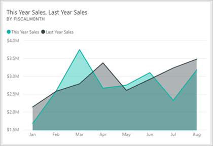
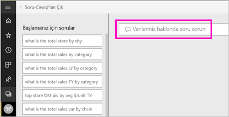
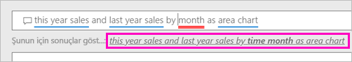
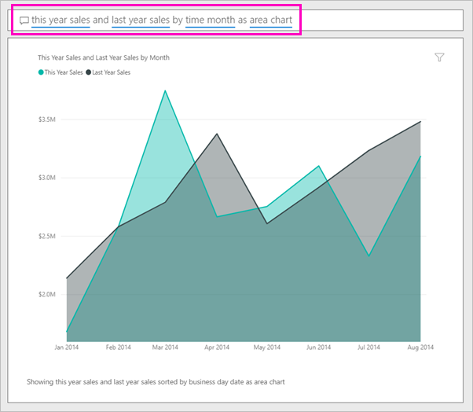
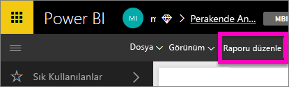

# Power BI Soru-Cevap özelliğiyle görsel oluşturma

Bazen verilerinize ilişkin cevaplar edinmenin en hızlı yolu doğal dil kullanarak bir soru sormaktır.  Bu makalede aynı görselleştirmeyi oluşturmak için kullanabileceğiniz iki yöntemi inceleyeceğiz: Soru-Cevap ile soru sorma ve görseli bir raporda oluşturma. Rapordaki görseli oluşturmak için Power BI hizmetini kullanacağız ancak Power BI Desktop kullanıldığında da neredeyse aynı işlem gerçekleştirilir.

Birlikte ilerleyebilmeniz için, düzenleyebileceğiniz bir raporu kullanmanız gerekir. Bu nedenle, Power BI'da bulunan örneklerden birini kullanacağız.

## Soru-Cevap özelliğiyle görsel oluşturma

Soru-Cevap özelliğini kullanarak bu çizgi grafiği nasıl oluşturabiliriz?

1. Power BI çalışma alanınızda **Veri Al** \> **Örnekler** \> **Perakende Analizi Örneği** > **Bağlan**'ı seçin.

1. Perakende Analizi Örneği panosunu açın ve imlecinizi **Verilerinizle ilgili bir soru sorun** ifadesinin yer aldığı Soru-Cevap kutusuna getirin.

    

2. Soru-Cevap kutusuna şu soruya benzer bir soru yazın:
   
    **bu yıla ait satış verileri ile önceki yıla ait satış verilerini alan grafiğinde aylara göre görüntüle**
   
    Siz sorunuzu yazarken Soru-Cevap özelliği, yanıtınızı görüntülemek üzere en iyi görselleştirmeyi seçer. Siz soruyu değiştirdikçe görselleştirmeler de dinamik olarak değiştirilir. Soru-Cevap özelliği öneriler, otomatik tamamlama ve yazım düzeltmeleri ile sorunuzu biçimlendirmenize de yardımcı olur. Soru-Cevap, ifadede ufak bir değişiklik yapılmasını önerir: "bu yıla ait satış verileri ile önceki yıla ait satış verilerini alan grafiğinde *aylara göre zamanlayarak* görüntüle".  

    

4. Öneriyi kabul etmek için tümceyi seçin. 
   
   Soruyu yazmayı tamamladığınızda göreceğiniz sonuç, panodakiyle aynı grafik olacaktır.
   
   

4. Grafiği panonuza sabitlemek için raptiye simgesini seçin  dokunun.

## Rapor düzenleyicisinde görsel oluşturma

1. Perakende Analizi Örneği panosuna geri dönün.
   
2. Panoda "Geçen Yılın Satışları ve Bu Yılın Satışları" adlı, hem geçen yıla ait hem de bu yıla ait satış verilerinin yer aldığı aynı alan grafiği kutucuğu bulunur.  Bu kutucuğu seçin. Soru-Cevap ile oluşturduğunuz kutucuğu seçmeyin. Bunu seçerseniz Soru-Cevap açılır. Özgün alan grafiği kutucuğu raporda oluşturulduğundan raporda, bu görselleştirmeyi içeren sayfa açılır.

    

1. **Raporu düzenle**'yi seçerek raporu Düzenleme Görünümü'nde açın.  Raporun sahibi siz değilseniz Düzenleme görünümünde açma seçeneği sağlanmaz.
   
    
4. Alan grafiğini seçin ve **Alanlar** bölmesinde ayarları gözden geçirin.  Raporu oluşturan kişi bu grafiği, ilgili üç değeri seçip (**Satış** tablosundan **Önceki Yılın Satışları** ve **Bu Yılın Satışları > Değer** ile **Zaman** tablosundan **MaliAy**) bunları **Eksen** ve **Değerler** kutularında düzenleyerek oluşturmuştur.
   
    

    Gördüğünüz gibi iki işlem de aynı görseli oluşturmaktadır. Bu şekilde oluşturmak da çok zor değildir. Ancak Soru-Cevap ile oluşturmak çok daha kolaydır!

## Sonraki adımlar

- [Panolarda ve raporlarda Soru-Cevap kullanma](power-bi-tutorial-q-and-a.md)  
- [Tüketiciler için Soru-Cevap](../consumer/end-user-q-and-a.md)
- [Power BI'daki Soru-Cevap özelliğiyle verilerinizin düzgün çalışmasını sağlama](service-prepare-data-for-q-and-a.md)

Başka bir sorunuz mu var? [Power BI Topluluğu'na başvurun](https://community.powerbi.com/)
