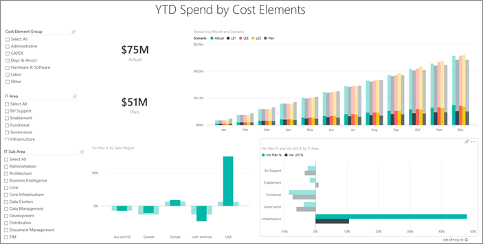

# Power BI için IT Spend Analysis örneği: Tura katılın

BT Harcama Analizi örneği içerik paketinde pano, rapor ve veri kümesi bulunur; bir BT departmanının planlanan maliyetleriyle gerçek maliyetleri karşılaştırmalı olarak çözümlenir. Bu karşılaştırma şirketin yıl için ne kadar iyi planlama yaptığını anlamamıza yardımcı olur ve plana göre büyük sapmalar görülen alanları araştırmamıza olanak tanır. Bu örnekteki şirket yıllık bir planlama döngüsünden geçer ve ardından finansal yılda BT'ye yapılan harcamalardaki değişiklikleri çözümlemelerine yardımcı olması için üç ayda bir yeni en yeni tahmin (LE) oluşturur.

Bu örnek, Power BI'ı işle ilgili veriler, raporlar ve panolarla birlikte nasıl kullanabileceğinizi gösteren serinin bir parçasıdır. Örnek, [obviEnce](http://www.obvience.com/) öğesinden alınan, anonimleştirilmiş gerçek verilerle oluşturulmuştur. Veriler çeşitli biçimlerde sunulur: içerik paketi, .pbix Power BI Desktop dosyası veya Excel çalışma kitabı. Bkz. [Power BI Örnekleri](sample-datasets.md). 

Bu öğreticide, Power BI hizmetinde BT Harcama Analizi örneği içerik paketi incelenir. Power BI Desktop ile hizmette rapor deneyimleri benzer olduğundan, Power BI Desktop'ta örnek .pbix dosyasını kullanarak da örneği takip edebilirsiniz. 

Power BI Desktop'ta örnekleri incelemek için Power BI lisansına ihtiyacınız yoktur. Power BI Pro lisansınız yoksa örneği Power BI hizmetinde Çalışma Alanım alanınıza kaydedebilirsiniz. 

## Örneği alma

 Örneği kullanabilmeniz için bir [içerik paketi](#get-the-content-pack-for-this-sample), [.pbix dosyası](#get-the-pbix-file-for-this-sample) veya [Excel çalışma kitabı](#get-the-excel-workbook-for-this-sample) olarak indirmeniz gerekir.

### Bu örneğe ilişkin içerik paketini edinme

1. Power BI hizmetini açın (app.powerbi.com), oturum açın ve örneği kaydetmek istediğiniz çalışma alanını açın.

   Power BI Pro lisansınız yoksa örneği Çalışma Alanım alanınıza kaydedebilirsiniz.

2. Sol alt köşedeki **Veri Al**'ı seçin.
   
   
3. Görüntülenen **Veri Al** sayfasında **Örnekler**'i seçin.
   
4. **BT Harcama Analizi Örneği**'ni ve ardından **Bağlan**'ı seçin.  
  
   
   
5. Power BI, içerik paketini içeri aktarır ve ardından geçerli çalışma alanınıza yeni bir pano, rapor ve veri kümesi ekler.
   
   
  
### Bu örneğe ilişkin .pbix dosyasını edinme

Alternatif olarak, BT Harcama Analizi örneğini bir [.pbix dosyası](https://download.microsoft.com/download/E/9/8/E98CEB6D-CEBB-41CF-BA2B-1A1D61B27D87/IT%20Spend%20Analysis%20Sample%20PBIX.pbix) olarak indirebilirsiniz. Bu dosya biçimi, Power BI Desktop ile kullanım için tasarlanmıştır.

### Bu örneğe ilişkin Excel çalışma kitabını edinme

Bu örnekte kullanılan veri kaynağını görüntülemek isterseniz, [Excel çalışma kitabı](https://go.microsoft.com/fwlink/?LinkId=529783) olarak da bulabilirsiniz. Çalışma kitabı, görüntüleyebileceğiniz ve değiştirebileceğiniz Power View sayfaları içerir. Ham verileri görmek için Veri Çözümlemesi eklentilerini etkinleştirip **Power Pivot > Yönet**'i seçin. Power View ve Power Pivot eklentilerini etkinleştirmek için bkz. [Excel’de Excel örneklerini bulma](sample-datasets.md#explore-excel-samples-inside-excel).

## BT Harcama Analizi Örneği panosu
Panonun solunda yer alan, **Var Plan %** ve **Variance Latest Estimate % Quarter 3** adlı iki sayı kutucuğu, plana göre ve en yeni üç aylık dönem tahminine (LE3 = latest estimate quarter 3) göre nasıl bir ilerleme kaydettiğimize ilişkin bir genel bakış sunar. Genel olarak bakıldığında, planın yaklaşık %6 oranında gerisindeyiz. Şimdi bu farkın nedenini araştıralım: ne zaman, nerede ve hangi kategori.

## YTD IT Spend Trend Analysis sayfası
**Var Plan % by Sales Region** pano kutucuğunu seçtiğinizde BT Harcama Analizi Örneği raporunun **YTD IT Spend Trend Analysis** sayfası görüntülenir. Sayfaya göz attığımızda, ABD'de ve Avrupa'da pozitif bir varyansa; Kanada, Latin Amerika ve Avustralya'da negatif bir varyansa sahip olduğumuzu görüyoruz. ABD yaklaşık olarak %6 +LE varyansa, Avustralya ise yaklaşık olarak %7-LE varyansa sahip.

Öte yandan yalnızca bu grafiğe bakıp çıkarım yapmak yanıltıcı olabilir. Kapsamlı bir değerlendirme yapmak için dolar cinsinden gerçek tutarlara bakmamız gerekir.

1. **Var Plan % by Sales Region** grafiğinde **Aus and NZ** seçeneğini belirleyip **Var Plan by IT Area** grafiğini gözlemleyin.

   
2. Şimdi **USA** seçeneğini belirleyin. Avustralya ve Yeni Zelanda’nın, Amerika’ya oranla genel harcamanın çok küçük bir bölümünü oluşturduğuna dikkat edin.

    Sonra da ABD’de varyansa neden olan kategorinin hangisi olduğunu araştıralım.

## Veriler hakkında soru sorma
1. Örnek panoya geri dönmek için üst gezinti bölmesinde **BT Harcama Analizi Örneği**'ni seçin.
2. **Verilerinizle ilgili bir soru sorun**’u seçin.
3. Sol taraftaki **Başlamanıza yardımcı olacak sorular** listesinden **BT alanına göre plan nedir**’i seçin.

   

4. Soru-Cevap kutusunda, önceki girişi silin ve *show IT areas, var plan % and var le3 % bar chart* girin.

   

   **Infrastructure** adlı ilk BT alanında, ilk varyans planı ile varyans planı en yeni tahmini yüzde değerlerinin önemli ölçüde değişiklik gösterdiğini unutmayın.

## YTD Spend by Cost Elements sayfası

1. Panoya dönün ve **Variance Plan %, Variance Latest Estimate % - Quarter 3** pano kutucuğuna bakın.

   

   Infrastructure alanının plandaki yüksek pozitif varyans ile göze çarptığına dikkat edin.

1. Raporu açmak için kutucuğu seçin ve **YTD Spend by Cost Elements** sayfasını görüntüleyin.
2. Sağ alt taraftaki **Var Plan % and Var LE3 % by IT Area** grafiğinde bulunan **Infrastructure** çubuğunu seçin ve sol alt taraftaki**Var Plan % by Sales Region** grafiğinde plana ilişkin varyansı gözlemleyin.

    
3. **Cost Element Group** dilimleyicisinde her adı sırayla seçerek en büyük varyansa sahip maliyet öğesini bulun.
4. **Other** seçiliyken **IT Area** dilimleyicisinde **Infrastructure** seçeneğini belirleyin ve en büyük varyansa sahip alt alanı bulmak için **IT Sub Area** dilimleyicisindeki alt alanları seçin.  

   **Networking** için büyük bir varyans olduğunu gözlemleyin. Şirketin, çalışanlarına kazanç olarak telefon hizmetleri sunmaya karar verdiği ancak bunun plan dahilinde olmadığı anlaşılıyor.

## Plan Variance Analysis sayfası

1. Sayfanın altındaki **Plan Variance Analysis** sekmesini seçin.

2. Sol taraftaki **Var Plan and Var Plan % by Business Area** grafiğinde, sayfanın geri kalanındaki altyapı iş alanı değerlerini vurgulamak için **Infrastructure** sütununu seçin.

    

   Altyapı iş alanının **Var plan % by Month and Business Area** grafiği için Şubat’ta pozitif bir varyans başlattığına dikkat edin. Ayrıca, diğer iş alanlarından farklı olarak o iş alanı için plana yönelik varyans değerinin ülkeye göre değiştiğine de dikkat edin. 

3. Sayfanın geri kalan kısmındaki değerleri filtrelemek ve verileri keşfetmek için sağ taraftaki **IT Area** ve **IT Sub Areas** dilimleyicilerini kullanın. 

## Raporu düzenleme
Düzenleme görünümünde keşif yapmak için sol üst köşedeki **Raporu Düzenle**’yi seçin:

* Sayfaların nasıl oluşturulduğuna, her grafikteki alanlara ve sayfalardaki filtrelere bakın.
* Aynı verileri temel alan sayfalar ve grafikler ekleyin.
* Her grafik için görselleştirme türünü değiştirin.
* İlgilendiğiniz grafikleri panonuza sabitleyin.

## Sonraki adımlar: Verilerinize bağlanma
Değişikliklerinizi kaydetmek zorunda olmadığınızdan, bu ortamda güvenle farklı şeyler deneyebilirsiniz. Değişikliklerinizi kaydetseniz bile, dilediğiniz zaman **Veri Al**'ı seçip bu örneğin yeni bir kopyasını oluşturabilirsiniz.

Power BI panolarının, Soru-Cevap özelliğinin ve raporların örnek veriler için nasıl içgörüler sağlayacağını gösterme konusunda etkili bir tur deneyimi yaşadığınızı umuyoruz. Artık siz de kendi verilerinize bağlanarak çalışmaya başlayabilirsiniz. Power BI ile çok çeşitli veri kaynaklarına bağlanabilirsiniz. Daha fazla bilgi edinmek için bkz. [Power BI hizmeti ile çalışmaya başlama](../fundamentals/service-get-started.md).
