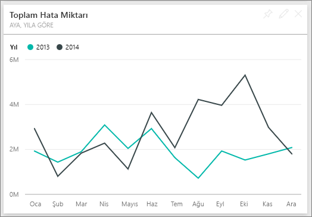

# Power BI için Tedarikçi Kalite Analizi Örneği: Tura katılın

Bu sektör örneği panosu ve bağlantılı rapor, tipik tedarik zincirinde yaygın olarak karşılaşılan zorluklardan birine odaklanır: tedarikçi kalite analizi. Bu analizde iki ölçüm ön plandadır: toplam hata sayısı ve bu hataların neden olduğu toplam çalışmama süresi. 

Bu örnek iki ana hedefe sahiptir:

* Kalite açısından hangi tedarikçilerin en iyi ve en kötü olduğunu anlayın.
* Çalışmama süresini en aza indirmek için, hangi tesislerin hataları bulma ve reddetme konusunda daha iyi iş çıkardığını belirleyin.

Bu örnek, Power BI'ı işle ilgili veriler, raporlar ve panolarla birlikte nasıl kullanabileceğinizi gösteren serinin bir parçasıdır. Örnek, [obviEnce](http://www.obvience.com/) öğesinden alınan, anonimleştirilmiş gerçek verilerle oluşturulmuştur. Veriler çeşitli biçimlerde sunulur: içerik paketi, .pbix Power BI Desktop dosyası veya Excel çalışma kitabı. Bkz. [Power BI Örnekleri](sample-datasets.md). 

Bu öğreticide, Power BI hizmetinde Tedarikçi Kalite Analizi örneği içerik paketi incelenir. Power BI Desktop ile hizmette rapor deneyimleri benzer olduğundan, Power BI Desktop'ta örnek .pbix dosyasını kullanarak da örneği takip edebilirsiniz. 

Power BI Desktop'ta örnekleri incelemek için Power BI lisansına ihtiyacınız yoktur. Power BI Pro lisansınız yoksa örneği Power BI hizmetinde Çalışma Alanım alanınıza kaydedebilirsiniz. 

## Örneği alma

Örneği kullanabilmeniz için bir [içerik paketi](#get-the-content-pack-for-this-sample), [.pbix dosyası](#get-the-pbix-file-for-this-sample) veya [Excel çalışma kitabı](#get-the-excel-workbook-for-this-sample) olarak indirmeniz gerekir.

### Bu örneğe ilişkin içerik paketini edinme

1. Power BI hizmetini açın (app.powerbi.com), oturum açın ve örneği kaydetmek istediğiniz çalışma alanını açın.

   Power BI Pro lisansınız yoksa örneği Çalışma Alanım alanınıza kaydedebilirsiniz.

2. Sol alt köşedeki **Veri Al**'ı seçin.
   
   
3. Görüntülenen **Veri Al** sayfasında **Örnekler**'i seçin.
   
4. **Tedarikçi Kalite Analizi Örneği**'ni ve ardından **Bağlan**'ı seçin.  
   
   

5. Power BI, içerik paketini içeri aktarır ve ardından geçerli çalışma alanınıza yeni bir pano, rapor ve veri kümesi ekler.
   
   
  
### Bu örneğe ilişkin .pbix dosyasını edinme

Alternatif olarak, Tedarikçi Kalite Analizi örneğini bir [.pbix dosyası](https://download.microsoft.com/download/8/C/6/8C661638-C102-4C04-992E-9EA56A5D319B/Supplier-Quality-Analysis-Sample-PBIX.pbix) olarak indirebilirsiniz. Bu dosya biçimi, Power BI Desktop ile kullanım için tasarlanmıştır.

### Bu örneğe ilişkin Excel çalışma kitabını edinme

Bu örnekte kullanılan veri kaynağını görüntülemek isterseniz, [Excel çalışma kitabı](https://go.microsoft.com/fwlink/?LinkId=529779) olarak da bulabilirsiniz. Çalışma kitabı, görüntüleyebileceğiniz ve değiştirebileceğiniz Power View sayfaları içerir. Ham verileri görmek için Veri Çözümlemesi eklentilerini etkinleştirip **Power Pivot > Yönet**'i seçin. Power View ve Power Pivot eklentilerini etkinleştirmek için bkz. [Excel’de Excel örneklerini bulma](sample-datasets.md#explore-excel-samples-inside-excel).

## Hatalı malzemelerin neden olduğu çalışmama süresi
Hatalı malzemelerin neden olduğu çalışmama süresini çözümleyip hangi satıcıların sorumlu olduğunu bulalım.  

1. Panoda **Total Defect Quantity** (Toplam Hata Miktarı) veya **Total Downtime Minutes** (Dakika Cinsinden Toplam Çalışmama Süresi) kutucuğunu seçin.

     

   Tedarikçi Kalite Analizi Örneği raporu açılarak **Downtime Analysis** (Çalışmama Süresi Analizi) sayfası görüntülenir.

   33 milyon hatalı parçamız olduğuna bunların ve toplam 77.000 dakikalık bir çalışmama süresi yaşanmasına neden olduğuna dikkat edin. Bazı malzemelerde daha az sayıda hatalı parça olsa da, bunlar gecikmelere neden olabilir ve çalışmama süresi daha fazla olur. Rapor sayfasında bu konular üzerinde araştırma yapalım.  
2. **Defects and Downtime (min) by Material Type** (Malzeme Türüne göre Hatalar ve Dakika Cinsinden Çalışmama Süresi) birleşik haritasında **Total Downtime Minutes** (Dakika Cinsinden Toplam Çalışmama Süresi) satırına baktığımızda oluklu malzemelerin en fazla çalışmama süresine neden olduğunu görürüz.  
3. Hangi tesislerin bu hatadan en çok etkilendiğini ve hangi satıcının sorumlu olduğunu görmek için **Corrugate** (Oluklu) sütununu seçin.  

     
4. **Downtime (min) by Plant** (Tesise göre Dakika Cinsinden Çalışmama Süresi) haritasında, söz konusu tesiste çalışmama süresinden sorumlu satıcıyı veya malzemeyi görmek için haritada tesisleri ayrı ayrı seçin.

### En kötü tedarikçiler hangileri?
 En kötü sekiz tedarikçiyi bulmak ve çalışmama süresinin yüzde kaçını oluşturduklarını belirlemek istiyoruz. Bunu, **Downtime (min) by Vendor** (Satıcıya göre Dakika Cinsinden Çalışmama Süresi) alan grafiğini ağaç haritası şeklinde değiştirerek yapabiliriz.  

1. Raporun **Downtime Analysis** (Çalışmama Süresi Analizi) sayfasında, sol üst köşedeki **Raporu düzenle** seçeneğini belirleyin.  
2. **Downtime (min) by Vendor** alan grafiğini seçin ve **Görsel Öğeler** bölmesinde **Ağaç Haritası** simgesini seçin.  

     

    Ağaç Haritası, **Grup** için **Satıcı** alanını otomatik olarak ayarlar.  

      

   Bu ağaç haritasından, en kötü sekiz satıcının ağaç haritasının solundaki sekiz blok olduğunu görürüz. Ayrıca bu satıcıların, dakika cinsinden toplam çalışmama süresinin yaklaşık %50'sini oluşturduğunu da görebiliriz.  
3. Panoya geri dönmek için üst gezinti bölmesinde **Supplier Quality Analysis Sample**'ı (Tedarikçi Kalite Analizi Örneği) seçin.

### Tesisleri karşılaştırma
Şimdi hangi tesisin daha iyi bir iş çıkardığını ve hatalı malzemeyi yöneterek daha az çalışmama süresi sağladığını keşfedelim.  

1. Panoda, **Total Defect Reports by Plant, Defect Type** (Tesis ve Hata Türüne göre Toplam Hata Raporları) harita parçasını seçin.      

     

   Rapor açılarak **Supplier Quality Analysis** (Tedarikçi Kalite Analizi) sayfası görüntülenir.  

2. **Total Defect Reports by Plant and Defect Type** (Tesis ve Hata Türüne göre Toplam Hata Raporları) göstergesinde, **Impact** (Etki) dairesini seçin.  

      

    Kabarcık grafiğinde **Lojistik**’in en sorunlu kategori olduğuna dikkat edin. Bu, toplam hata miktarı, hata raporu ve çalışmama süresi bakımından en büyük miktardır. Bu kategoriyi biraz daha araştıralım.  
3. Kabarcık grafiğinde **Lojistik** kabarcığını seçin ve Springfield ve Naperville, IL seçeneklerini belirleyin. Naperville, Springfield’in çok sayıdaki etkisiyle karşılaştırıldığında, yüksek reddetme sayısına ve birkaç etkiye sahip olduğundan hatalı tedarikleri yönetme konusunda çok daha iyi bir iş çıkarıyor.  

     
4. Panoya geri dönmek için üst gezinti bölmesinde **Supplier Quality Analysis Sample**'ı (Tedarikçi Kalite Analizi Örneği) seçin.

## Hangi malzeme türü en iyi şekilde yönetilmektedir?
En iyi yönetilen malzeme türü, hata miktarına bakılmaksızın en düşük çalışmama süresine sahip olan veya hiçbir etki görmeyendir.

1. Panoda, **Total Defect Quantity by Material Type, Defect Type** kutucuğuna bakın.

   

   **Raw Materials** (Ham Maddeler) malzeme türünün toplam hata sayısının fazla olduğuna ancak hataların çoğunun reddedildiğine veya hiçbir etkiye sahip olmadığına dikkat edin.

   Bu malzeme türünün yüksek miktarda hataya rağmen çok fazla çalışmama süresine neden olmadığını doğrulayalım.

2. Panoda, **Total Defect Qty, Total Downtime Minutes by Material Type** kutucuğuna bakın.

   

   Ham maddeler iyi yönetiliyor gibi görünüyor: Daha fazla hata içeriyorlar ancak dakika cinsinden toplam çalışmama süresi daha düşük.

### Yıla göre hataları ve çalışmama süresini karşılaştırma
1. Raporu **Supplier Quality Analysis** (Tedarikçi Kalite Analizi) sayfası görüntülenecek şekilde açmak için **Total Defect Reports by Plant, Defect Type** (Tesise ve Hata Türüne göre Toplam Hata Raporu) harita parçasını seçin.
2. **Total Defect Qty by Month and Year** (Ay ve Yıla göre Toplam Hata Miktarı) grafiğinde, hata miktarının 2014’te 2013’ten daha yüksek olduğunu fark edeceksiniz.  

      
3. Daha fazla hata daha fazla çalışmama süresi anlamına mı gelir? Bunu öğrenmek için Soru-Cevap kutusunda soru sorabilirsiniz.  
4. Panoya geri dönmek için üst gezinti bölmesinde **Supplier Quality Analysis Sample**'ı (Tedarikçi Kalite Analizi Örneği) seçin.  
5. Raw Materials'ın (Ham Maddeler) en yüksek sayıda hataya sahip olduğunu bildiğimizden soru kutusuna *show material types, year and total defect qty* (malzeme türlerini, yılı ve toplam hata miktarını göster) yazın.  

    2014'te 2013'e göre çok daha fazla ham madde hatası vardı.  

      
6. Daha sonra, soruyu _show material types, year, and total **downtime minutes**_ (malzeme türlerini, yılı ve dakika cinsinden toplam çalışmama süresini göster) olarak değiştirin.  

   

   2014'te çok daha fazla ham madde hatası olsa da ham madde çalışmama süresinin 2013'te ve 2014'te yaklaşık olarak aynı olduğuna dikkat edin. 2014’teki ham malzemeler için daha fazla hata, 2014’te ham malzemeler için daha fazla kapalı kalma süresine yol açmamış gibi görünüyor.

### Aya göre hataları ve çalışmama süresini karşılaştırma
Toplam hata miktarıyla ilgili başka bir pano kutucuğuna bakalım.  

1. Panoya geri dönmek için sol üst köşedeki **Soru-Cevap’tan Çık** seçeneğini belirleyin.  

    **Total Defect Quantity by Month, Year** (Aya ve Yıla göre Toplam Hata Miktarı) kutucuğu bölümüne daha yakından bakın. 2014'ün ilk yarısında 2013'tekine benzer sayıda hata olduğu ancak 2014'ün ikinci yarısında hata sayısının kayda değer oranda arttığı görülür.  

      

    Hata miktarındaki bu artışın dakika cinsinden çalışmama süresinde de eşit bir artışa neden olup olmadığına bakalım.  
2. Soru kutusuna *total downtime minutes by month and year as a line chart* (çizgi grafiği olarak ay ve yıla göre dakika cinsinden toplam çalışmama süresi) yazın.  

   

   Haziran ve Ekim’de meydana gelen dakika cinsinden çalışmama süresi dışında, hata sayısındaki dik yükseliş, çalışmama süresinin önemli ölçüde artmasına neden olmadı. Bu sonuç, hataların iyi yönetildiğini gösterir.  
3. Bu grafiği panonuza sabitlemek için yukarıdaki soru kutusunda raptiye simgesini  seçin.  
4. Aykırı ayları keşfetmek için *total downtime minutes in October by plant* (tesise göre Ekim'deki dakika cinsinden toplam çalışmama süresi) gibi sorular sorarak Ekim ayındaki malzeme türü, tesis konumu, kategori vb. temelinde çalışmama süresi dakika sayısını kontrol edin. 
5. Panoya geri dönmek için sol üst köşedeki **Soru-Cevap’tan Çık** seçeneğini belirleyin.

## Sonraki adımlar: Verilerinize bağlanma
Değişikliklerinizi kaydetmek zorunda olmadığınızdan, bu ortamda güvenle farklı şeyler deneyebilirsiniz. Değişikliklerinizi kaydetseniz bile, dilediğiniz zaman **Veri Al**'ı seçip bu örneğin yeni bir kopyasını oluşturabilirsiniz.

Power BI panolarının, Soru-Cevap özelliğinin ve raporların örnek veriler için nasıl içgörüler sağlayacağını gösterme konusunda etkili bir tur deneyimi yaşadığınızı umuyoruz. Artık siz de kendi verilerinize bağlanarak çalışmaya başlayabilirsiniz. Power BI ile çok çeşitli veri kaynaklarına bağlanabilirsiniz. Daha fazla bilgi edinmek için bkz. [Power BI hizmeti ile çalışmaya başlama](../fundamentals/service-get-started.md).
