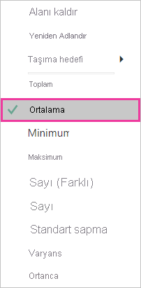
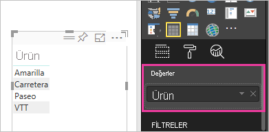
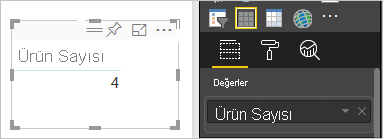
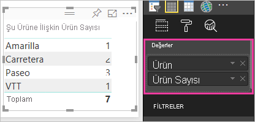

# Power BI hizmetinde toplamlarla (toplam, ortalama vb.) çalışma

## Toplam neye denir?

Bazı durumlarda verilerinizdeki değerleri matematiksel olarak birleştirmek istersiniz. Bu matematiksel işlem toplam, ortalama, maksimum, sayım vb. olabilir. Verilerinizdeki değerleri birleştirmek için gerçekleştirdiğiniz işleme *toplama* adı verilir. Bu matematik işleminin sonucu *toplam* olarak adlandırılır.

Power BI hizmetinde ve Power BI Desktop'ta görselleştirmeler oluşturulurken verileriniz toplanabilir. Genellikle tüm ihtiyacınız olan toplama ulaşmaktır ancak belirli durumlarda değerleri farklı bir şekilde toplamanız gerekebilir.  Örneğin, toplam yerine ortalama. Bir görselleştirmede Power BI’ın kullandığı toplama işlemini yönetmek ve değiştirmek için izlenebilecek birkaç farklı yol bulunur.

Power BI’ın verileri toplayıp toplayamayacağını ve nasıl toplayabileceği veri türüne göre belirlendiğinden, ilk olarak veri *türlerini* inceleyelim.

## Veri türleri

Çoğu veri kümesinde birden fazla türde veri bulunur. En temel düzeyde veriler, sayısal veriler ve sayısal olmayan veriler olarak ayrılır. Power BI sayısal verileri toplam, ortalama, sayım, minimum, varyans veya daha pek çok toplama işlemi kullanarak toplayabilir. Hizmet metinsel verileri (sıklıkla *kategorik* veriler olarak adlandırılır) bile toplayabilir. Kategorik bir alanı **Değerler** veya **Araç ipuçları** gibi yalnızca sayısal bir demete yerleştirerek toplamayı denerseniz, Power BI her kategoriye ilişkin oluşumları ya da her kategoriye ilişkin benzersiz oluşumları sayabilir. Tarihler gibi özel veri türlerine özgü birkaç toplama seçeneği bulunur: En erken, en geç, ilk ve son.

Aşağıdaki örnekte:

- **Units Sold** ve **Manufacturing Price** sayısal veriler içeren sütunlardır

- **Segment**, **Country**, **Product**, **Month** ve **Month Name** sütunları ise kategorik veriler içerir

   

Power BI’da görselleştirme oluştururken hizmet sayısal alanları bazı kategorik alanlarla ilişkili olarak toplanır. (Varsayılan olarak *toplam* kullanılır.)  Örneğin, "Units Sold ***by Product** _”, "Units Sold by _*_Month_*_" ve "Manufacturing Price _*_by Segment_*_”. Power BI’da bazı sayısal alanlar _*ölçü** olarak adlandırılır. Power BI rapor düzenleyicisinde ölçüleri kolayca tanıyabilirsiniz: **Alanlar** listesinde ölçüler yanlarında ∑ sembolü ile gösterilir. Daha fazla bilgi için bkz. [Rapor düzenleyicisi... tura katılın](service-the-report-editor-take-a-tour.md).

## Toplama işlemleri neden istediğim şekilde gerçekleştirilmiyor?

Power BI hizmetinde toplama işlemleriyle çalışmak kafa karıştırıcı olabilir. Sayısal bir alanınız olabilir ve Power BI toplamayı değiştirmenize izin vermeyebilir. Yıl gibi bir alanı ele alırken bu alanı toplamak değil, yalnızca oluşumları saymak istiyor da olabilirsiniz.

Normalde temel sorun veri kümesindeki alan tanımıdır. Veri kümesi sahibi alanı metin olarak tanımlamış olabilir ve işte bu nedenle Power BI alanda toplam veya ortalama hesaplaması yapamayabilir. Ne yazık ki, [bir alanın kategorisi yalnızca veri kümesi sahibi tarafından değiştirilebilir](../transform-model/desktop-measures.md). Bu, veri kümesine yönelik sahip izinlerinizin bulunması halinde, Desktop'ta veya veri kümesinin oluşturulması için kullanılan programda (örneğin, Excel) bu sorunu çözebileceğiniz anlamına gelir. Aksi halde, yardım almak için veri kümesinin sahibine ulaşmanız gerekir.  

Bu makalenin sonunda [**Önemli noktalar ve sorun giderme**](#considerations-and-troubleshooting) adlı özel bir bölüm vardır. Bu bölümde ipuçları ve rehberlik sağlanır. Yanıtı bu bölümde bulamamanız halinde, sorunuzu [Power BI Topluluğu forumuna](https://community.powerbi.com) gönderin. Doğrudan Power BI takımından hemen yanıt alırsınız.

## Bir sayısal alana yönelik toplama işlemini değiştirme

Farklı ürünler için satılan birim sayısının toplandığı bir grafiğe sahip olduğunuzu ancak bunun yerine ortalamaya ihtiyaç duyduğunuzu varsayalım.

1. Ölçü ve kategori kullanan bir **Kümelenmiş sütun grafik** oluşturun. Bu örnekte, Units Sold by Product grafiğini kullanmayı tercih ettik.  Varsayılan olarak Power BI, her ürün (kategoriyi **Eksen** kutusuna sürükleyin) için satılan birim sayısının (ölçüyü **Değer** kutusuna sürükleyin) toplamını veren bir grafik oluşturur.

   

1. **Görsel Öğeler** bölmesinde ölçüye sağ tıklayın ve ihtiyaç duyduğunuz toplama türünü seçin. Bu örnekte, **Ortalama**’yı seçiyoruz. Size gereken toplama seçeneğini görmüyorsanız [**Önemli noktalar ve sorun giderme**](#considerations-and-troubleshooting) bölümüne bakın.

   

   > [!NOTE]
   > Açılan listede yer alan seçenekler şu iki unsura göre değişiklik gösterir: 1) seçilen alan ve 2) veri kümesi sahibinin bu alanı kategorilere ayrılma şekli.

1. Görselleştirmeniz artık ortalama işlemiyle toplanmaktadır.

   

## Verilerinizi toplamak için izleyebileceğiniz yollar

Bir alanı toplamak için kullanılabilen seçeneklerden bazıları şunlardır:

- **Özetleme**. Bu seçenek belirtildiğinde Power BI bu alandaki her değeri ayrı ele alır ve bu değerleri özetlemez. Hizmetin toplamaması gereken bir sayısal kimlik sütununuz olduğunda bu seçeneği kullanın.

- **Toplam**. Bu alandaki tüm değerleri toplar.

- **Ortalama**. Değerlerin aritmetik ortalamasını alır.

- **Minimum**. En küçük değeri gösterir.

- **Maksimum**. En büyük değeri gösterir.

- **Sayı (Boş Olanları Değil).** Bu alandaki boş olmayan değerleri sayar.

- **Sayı (Benzersiz).** Bu alandaki farklı değerleri sayar.

- **Standart sapma.**

- **Varyans**.

- **Ortanca**.  Ortanca (ortadaki) değeri gösterir. Bu değerin üstünde ve altında aynı sayıda öğe vardır.  İki ortancanın bulunması halinde Power BI, bu değerlerin ortalamasını alır.

Örneğin, aşağıdaki veriler kullanıldığında,

| Ülke | Tutar |
|:--- |:--- |
| Amerika Birleşik Devletleri |100 |
| Birleşik Krallık |150 |
| Kanada |100 |
| Almanya |125 |
| Fransa | |
| Japonya |125 |
| Avustralya |150 |

Şu sonuçları elde edersiniz:

- **Özetleme**: Her değer ayrı bir şekilde gösterilir

- **Toplam**: 750

- **Ortalama**: 125

- **Maksimum**:  150

- **Minimum**: 100

- **Sayı (Boş Olanları Değil):** 6

- **Sayı (Benzersiz):** 4

- **Standart sapma:** 20,4124145...

- **Varyans:** 416,666...

- **Ortanca Değer:** 125

## Bir kategori (metin) alanı kullanarak toplam oluşturma

Sayısal olmayan bir alanı da toplayabilirsiniz. Örneğin, bir ürün adı alanına sahipseniz bu alanı bir değer olarak ekleyebilir ve **Sayı**, **Ayrı sayım**, **İlk** veya **Son** olarak ayarlayabilirsiniz.

1. **Product** alanını **Değerler** kutusuna sürükleyin. **Değerler** kutusu genellikle sayısal alanlar için kullanılır. Power BI bu alanın bir metin alanı olduğunu anlar ve toplama işlemini **Özetleme** olarak ayarlayıp size tek sütunlu bir tablo sunar.

   

1. **Özetleme** olan varsayılan toplama işlemini **Sayı (Benzersiz)** olarak değiştirirseniz, Power BI farklı ürünleri sayar. Bu örnekte dört farklı ürün bulunur.
  
   

1. Toplama işlemini **Sayı** olarak değiştirmeniz durumunda ise Power BI, toplam sayıyı verir. Bu örnekte, **Product** için yedi girdi vardır.

   

1. Aynı alanı (bu örnekte **Product**) **Değerler** kutusuna sürükleyip varsayılan toplamayı **Özetleme** olarak bıraktığımızda Power BI, sayımın ürünlere göre dağılımını verir.

   

## Önemli Noktalar ve Sorun Giderme

S:  **Özetleme** seçeneğini neden görmüyorum?

Y:  Seçtiğiniz alan büyük olasılıkla, Excel veya [Power BI Desktop](../transform-model/desktop-measures.md)’ta oluşturulan bir hesaplanmış ölçü ya da çok boyutlu modeldir. Her ölçünün kendi sabit kodlanmış formülü vardır. Power BI’ın kullandığı toplama işlemini değiştiremezsiniz. Örneğin, toplama işlemi toplam ise yalnızca toplam olarak kalabilir. **Alanlar** listesinde hesap makinesi sembolüyle *ölçüler* gösterilir.

S:  Alanım **sayısal** olmasına rağmen neden yalnızca **Sayı** ve **Ayrı sayım** seçeneklerini görüyorum?

C1:  Bu, büyük olasılıkla veri sahibinin alanı bir sayı olarak *sınıflandırmamasından* kaynaklanır. Örneğin veri kümesinde **yıl** alanı varsa, veri kümesi sahibi değeri metin kategorisine ayırmış olabilir. Daha büyük olasılıkla Power BI **yıl** alanını sayacaktır (örneğin 1974’te doğan kişilerin sayısı). Power BI’ın bunun toplamını veya ortalamasını alması daha düşük bir olasılıktır. Veri kümesinin sahibi sizseniz veri kümesini Power BI Desktop'ta açabilir ve **Modelleme** sekmesini kullanarak veri türünü değiştirebilirsiniz.

C2: Alanda hesap makinesi simgesinin olması bunun *ölçü* olduğu anlamına gelir. Her ölçünün yalnızca veri kümesi sahibi tarafından değiştirilebilen kendi formülü vardır. Power BI’ın kullandığı hesaplama, ortalama veya toplam gibi basit bir toplama olabilir. Öte yandan "üst kategoriye katkıda bulunma yüzdesi" ya da "yılın başlangıcından itibaren değişen toplam" gibi daha karmaşık bir işlem de olabilir. Power BI sonuçları toplamayacak veya ortalamalarını almayacaktır. Bunun yerine her veri noktası için yeniden hesaplama yapacaktır (sabit kodlanmış formülü kullanarak).

C3:  Alanı yalnızca kategorik değerlere izin veren bir *demete* de yerleştirmiş olabilirsiniz.  Bu durumda, yalnızca sayı ve ayrı sayım seçeneklerine sahip olursunuz.

C4:  Bir eksen alanı kullanıyor olmanız da dördüncü olasılıktır. Örneğin; Power BI, bir çubuk grafik ekseninde her benzersiz değer için tek bir çubuk gösterir; alan değerlerine yönelik olarak toplama gerçekleştirmez.

>[!NOTE]
>X ve Y eksenleri için değerlerin toplanmasını *gerektiren* dağılım grafikleri bu konuda bir istisna oluşturur.

S:  SQL Server Analysis Services (SSAS) veri kaynaklarının metin alanlarını neden toplayamıyorum?

Y:  SSAS çok boyutlu modelleriyle kurulan canlı bağlantılar ilk, son, maksimum, minimum ve toplam gibi istemci tarafı toplama işlemlerine izin vermez.

S:  Bir dağılım grafiğine sahibim ve alanımın *toplanmamasını* sağlamak istiyorum.  Nasıl yapabilirim?

Y:  Alanı, X veya Y ekseni demetlerine değil, **Ayrıntılar** demetine ekleyin.

S:  Bir görselleştirmeye sayısal alan eklediğimde, alanların çoğu için varsayılan işlem toplam işlemi olarak ayarlanırken bazıları için de sayı veya başka bir toplama işlemi olarak belirleniyor.  Varsayılan toplama işlemi neden aynı kalmıyor?

Y:  Veri kümesi sahipleri her alan için varsayılan özetlemeyi ayarlayabilir. Bir veri kümesi sahibiyseniz Power BI Desktop'ın **Modelleme** sekmesindeki varsayılan özetlemeyi değiştirin.

S:  Ben bir veri kümesi sahibiyim ve bir alanın hiçbir zaman toplanmamasını sağlamak istiyorum.

Y:  Power BI Desktop'taki **Modelleme** sekmesinde, **Veri türü**'nü **Metin** olarak ayarlayın.

S:  Açılan listede **Özetleme** seçeneğini görmüyorum.

Y:  Alanı kaldırıp tekrar eklemeyi deneyin.

Başka bir sorunuz mu var? [Power BI Topluluğu'na başvurun](https://community.powerbi.com/)
