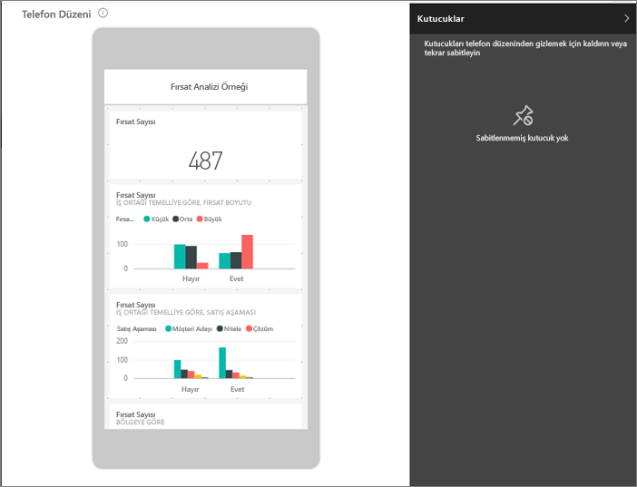
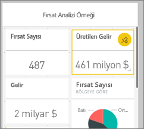
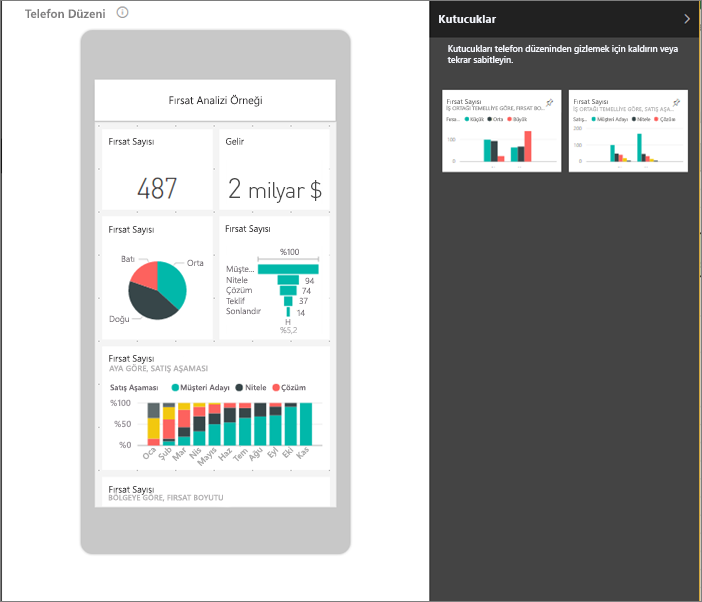
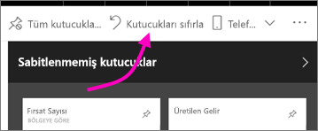

# Panoyu cep telefonları için en uygun duruma getirme - Power BI 
Telefon kullanırken dikey modda panoları görüntülediğinizde, pano kutucuklarının tümü aynı boyutlarda olacak şekilde birbirleri ardına sıralandığını fark edersiniz. Power BI hizmetinde, telefonlardaki dikey moda özel olarak, panonun özelleştirilmiş bir görünümünü oluşturabilirsiniz. Bir telefon görünümü oluştursanız bile, telefonu yan çevirdiğinizde panoyu hizmette görüntülendiği şekilde görürsünüz.

Panoları bir mobil cihazda görüntüleme hakkında bilgi mi arıyorsunuz? Bunun yerine şu hızlı başlangıcı deneyin: [Power BI mobil uygulamalarında pano ve raporları keşfetme](../consumer/mobile/mobile-apps-quickstart-view-dashboard-report.md).

> [!NOTE]
> Siz telefon görünümünü düzenlerken, panoyu telefonda görüntüleyen kişiler yaptığınız değişiklikleri gerçek zamanlı olarak görebilir. Örneğin, panoya yönelik telefon görünümünde tüm kutucukları kaldırırsanız telefondaki panoda bulunan kutucuklar da hemen kaybolur. 
> 
> 

## Bir panonun telefon görünümünü oluşturma
1. Power BI hizmetinde bir panoyu açın.
2. Sağ üst köşedeki **Web görünümü**'nün yanında bulunan oku ve ardından **Telefon görünümü**'nü seçin.

    

    Pano sahibi değilseniz bu seçeneği görmezsiniz.

    

    Telefona yönelik pano düzenleme görünümü açılır. Burada, kutucukları telefon görünümüne uyacak şekilde, yeniden boyutlandırabilir, yeniden düzenleyebilir ve kaldırabilirsiniz. Panonun web sürümü değişmez.

1. Bir kutucuğu sürüklemek, yeniden boyutlandırmak veya kaldırmak için bu kutucuğu seçin. Siz bir kutucuğu sürüklerken diğer kutucukların ortada olmadığını fark edeceksiniz.
   
    
   
    Kaldırılan kutucuklar Sabitlenmemiş kutucuklar bölmesine gider ve siz onları tekrar eklemediğiniz sürece burada kalır.
   
    
2. Fikrinizi değiştirirseniz, kutucukları eski boyutlarına ve sıralarına geri almak için **Kutucukları sıfırla** seçeneğini belirleyin.
   
    
   
    Power BI hizmetinde Telefon görünümünü düzenle ekranının açılması bile telefondaki kutucukların boyutlarının ve şekillerinin az oranda değişmesi için yeterlidir. Bu nedenle panoyu tam olarak, Telefon görünümünü düzenle ekranında açılmadan önceki durumuna getirmek için **Kutucukları sıfırla** seçeneğini belirleyin.
3. Telefona yönelik pano düzeninden memnunsanız sağ üst köşedeki **Telefon görünümü**'nün yanındaki oku seçin ve ardından **Web görünümü** seçeneğini belirleyin.
   
    Power BI, telefon düzenini otomatik olarak kaydeder.

## Sonraki adımlar
* [Power BI telefon uygulamaları için en iyi duruma getirilmiş raporlar oluşturma](desktop-create-phone-report.md)
* [Tüm boyutlar için en iyi duruma getirilmiş esnek görseller oluşturma](../visuals/power-bi-report-visualizations.md)
* Başka bir sorunuz mu var? [Power BI Topluluğu'na sorun](https://community.powerbi.com/)
