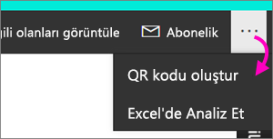
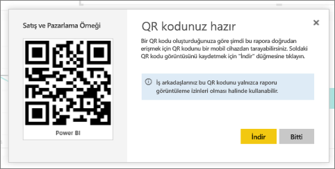

# Mobil uygulamalarda kullanmak üzere Power BI'daki bir rapor için QR kodu oluşturma
Power BI'daki QR kodları ile gerçek dünyadaki her şey, ilgili BI bilgilerine, gezinti ve arama gerekmeden doğrudan bağlanabilir.

Herhangi bir rapor (düzenleyemediğiniz raporlar da dahil) için Power BI hizmetinde QR kodu oluşturabilirsiniz. Ardından QR kodunu önemli bir konuma yerleştirebilirsiniz. Örneğin, kodu bir e-postaya yapıştırabilir veya yazdırıp belirli bir konuma yerleştirebilirsiniz. 

Raporu paylaştığınız iş arkadaşlarınız [QR kodunu tarayarak doğrudan mobil cihazlarından rapora erişebilir](../consumer/mobile/mobile-apps-qr-code.md). Power BI uygulamasında yer alan QR kodu tarayıcısını veya cihazlarında yüklü olan diğer herhangi bir QR tarayıcısını kullanabilirler. Ayrıca [Karma Gerçeklik için Power BI uygulamasıyla raporun QR kodunu da tarayabilirler](../consumer/mobile/mobile-hololens2-app.md#open-reports-with-qr-codes).

## Rapor için QR kodu oluşturma
1. Power BI hizmetinde bir raporu açın.
2. Sağ üst köşedeki **Diğer seçenekler** (...) düğmesini ve **QR kodu oluştur**’u seçin. 
   
    
3. QR kodunu içeren bir iletişim kutusu görünür. 
   
    
4. Burada QR kodunu tarayabilir veya aşağıdaki işlemleri gerçekleştirmek için indirip kaydedebilirsiniz: 
   
   * Bir e-postaya veya başka bir belgeye ekleme ya da 
   * yazdırıp belirli bir konuma yerleştirme. 

## QR kodunu yazdırma
Power BI, QR kodunu, JPG dosyası olarak yazdırılmaya hazır bir şekilde oluşturur. 

1. **İndir**'i seçin ve ardından yazıcıya bağlı bir bilgisayarda JPG dosyasını açın.  
   
   JPG dosyası kutucukla aynı ada sahiptir. Örneğin, "Sales and Marketing Sample.jpg".
   
1. Dosyayı %100 oranında veya "gerçek boyutu" ile yazdırın.  
2. QR kodunu kesin ve raporla ilgili bir konuma yapıştırın. 

## Sonraki adımlar
* Mobil uygulamalarla [gerçek dünyadan Power BI verilerine bağlanma](../consumer/mobile/mobile-apps-data-in-real-world-context.md)
* [Mobil cihazınızdan Power BI QR kodu tarama](../consumer/mobile/mobile-apps-qr-code.md)
* [Bir kutucuk için QR kodu oluşturma](service-create-qr-code-for-tile.md)
* Sorularınız mı var? [Power BI Topluluğu'na sorun](https://community.powerbi.com/)
