# Rapordan Power BI panosu oluşturma
[Power BI'da panolara giriş](service-dashboards.md) makalesini okuduğunuza göre artık kendi panolarınızı oluşturabilirsiniz. Pano oluşturmanın birçok farklı yolu vardır. Örneğin bir rapordan, sıfırdan, bir veri kümesinden veya mevcut panoyu yinelenerek oluşturulabilirler.  

Daha önce oluşturulmuş bir raporun görselleştirmelerini sabitleyen bir panoyu hızla ve kolayca oluşturarak başlayacağız. 

Bu makaleyi tamamladıktan sonra şu konular hakkında fikir sahibi olacaksınız:
- Panolarla raporlar arasındaki ilişki
- Rapor düzenleyicisinde Düzenleme görünümünü açma
- Kutucukları sabitleme 
- Panoyla rapor arasında gezinme 
 
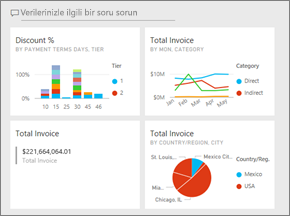

> [!NOTE] 
> Panolar Power BI Desktop'ın değil Power BI hizmetinin sunduğu bir özelliktir. Power BI mobil uygulamalarında pano oluştaramasanız da bu cihazlarda onları [görüntüleyebilir ve paylaşabilirsiniz](../consumer/mobile/mobile-apps-view-dashboard.md).
>
> 

## Video: Rapordaki görselleri ve resimleri sabitleyerek pano oluşturma
Amanda'nın bir rapordaki görselleştirmeleri sabitleyerek yeni bir pano oluşturmasını izleyin. Ardından, Tedarik Analizi örneğini kullanarak bunu denemek için bir sonraki bölüm olan [Rapor içeren bir veri kümesini içeri aktarma](#import-a-dataset-with-a-report) başlığı altında verilen adımları izleyin.
    

<iframe width="560" height="315" src="https://www.youtube.com/embed/lJKgWnvl6bQ" frameborder="0" allowfullscreen></iframe>

## Rapor içeren bir veri kümesini içeri aktarma
Adım adım ilerleyen bu kılavuzda, Power BI örnek veri kümelerinden birini içeri aktarıp yeni panomuzu oluşturmak için kullanacağız. Kullandığımız örnek iki PowerView sayfası bulunan bir Excel çalışma kitabıdır. Çalışma kitabı Power BI tarafından içeri aktarıldığında, çalışma alanınıza bir veri kümesi ve bir rapor eklenir. Rapor otomatik olarak PowerView sayfalarından oluşturulur.

1. [Tedarik Analizi örneğinin](https://go.microsoft.com/fwlink/?LinkId=529784) Excel dosyasını indirin. Dosyayı OneDrive İş hesabınıza kaydetmenizi öneririz.
2. Tarayıcınızda Power BI hizmetine (app.powerbi.com) gidin ve oturum açın.
3. Gezinti bölmesinde **Çalışma Alanım**'ı ve ardından **Veri Al**'ı seçin.

    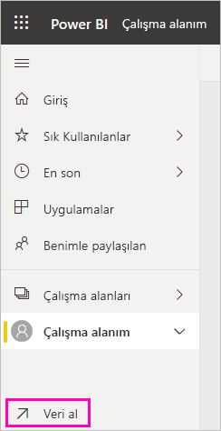
5. **Dosyalar**’ı seçip **Al** seçeneğini belirleyin.

   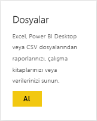
6. Tedarik Analizi örnek Excel dosyasını kaydettiğiniz konuma gidin. Dosyayı seçin ve **Bağlan** seçeneğini belirleyin.

   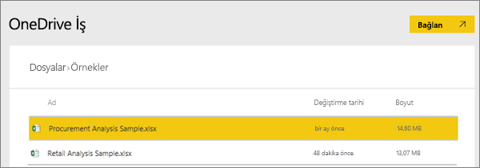
7. Bu alıştırma için **İçeri aktar** seçeneğini belirleyin.

    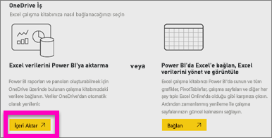
8. Başarılı iletisi gösterildiğinde kapatmak için **x** işaretini seçin.

   

> [!TIP]
> Biliyor muydunuz? Yukarıda yer alan üç çizgili simgeyi () seçerek gezinti bölmesini daraltabilirsiniz. Böylelikle rapor için daha fazla alan elde edersiniz.

### Raporu açma ve panonuza kutucukları sabitleme
1. Aynı çalışma alanında **Raporlar** sekmesini seçin ve ardından **Tedarik Analizi Örneği**'ni seçerek raporu açın.

     Rapor Okuma görünümünde açılır. Solda iki sekmesi olduğuna dikkat edin: **Discount Analysis** ve **Spend Overview**. Her sekme raporun bir sayfasını temsil eder.

2. **Diğer seçenekler (...)**  > **Raporu düzenle**’yi seçerek raporu Düzenleme görünümünde açın.

    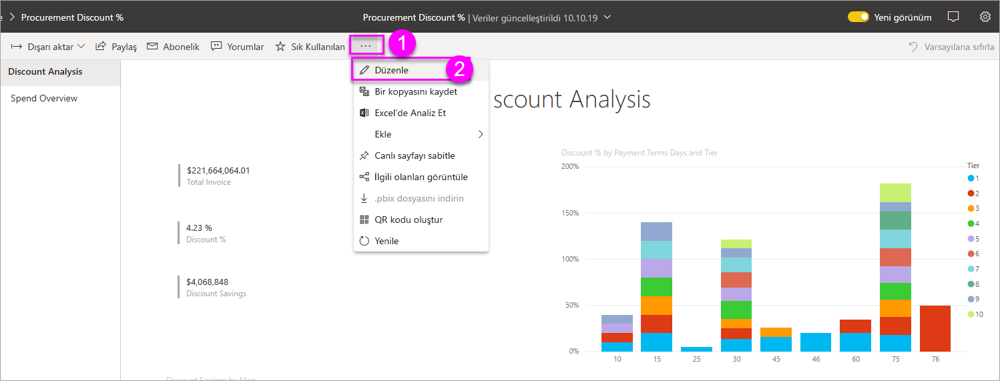
3. Kullanılabilir seçenekleri görüntülemek için bir görselleştirmenin üzerine gelin. Panoya görselleştirme eklemek için raptiye simgesini seçin .

    
4. Yeni bir pano oluşturduğumuz için **Yeni pano** seçeneğini belirtin ve buna bir ad verin.

    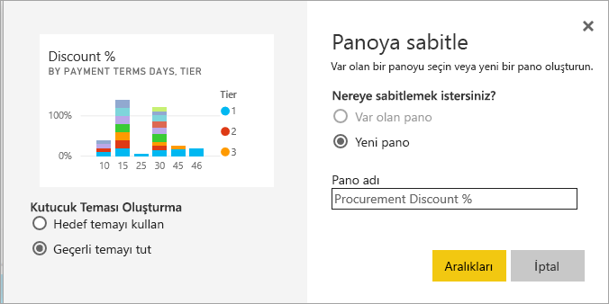
5. **Sabitle**'yi seçtiğinizde, Power BI geçerli çalışma alanında yeni bir pano oluşturur. **Panoya sabitlendi** iletisi görüntülendiğinde **Panoya git**'i seçin. Raporu kaydetmeniz istenirse **Kaydet**'i seçin.

    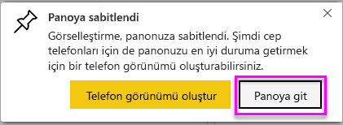

    Power BI yeni panoyu açar. Tek kutucuğu vardır: yeni sabitlediğiniz görselleştirme.

   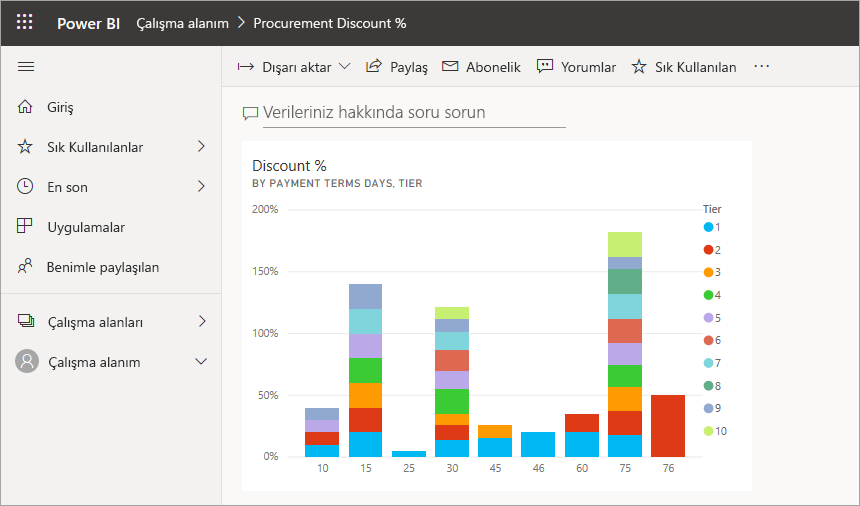
7. Rapora dönmek için kutucuğu seçin. Yeni panoya birkaç kutucuk daha sabitleyin. **Panoya sabitle** penceresi görüntülendiğinde, **Var olan pano**'yu seçin.  

   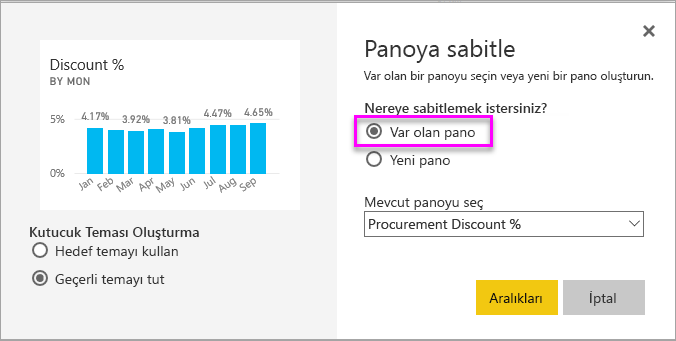

## Rapor sayfasının tamamını panoya sabitleme
Görselleri tek tek sabitlemek yerine, [bir rapor sayfasının tamamını *canlı kutucuk* olarak sabitleyebilirsiniz](service-dashboard-pin-live-tile-from-report.md). Şimdi bu işlemi yapalım.

1. Rapor düzenleyicisinde **Spend Overview** sekmesini seçerek raporun ikinci sayfasını açın.

   

2. Rapordaki tüm görsellerin panonuzda olmasını istiyoruz. Menü çubuğunun sağ üst köşesindeki **Canlı sabitleme sayfası**’nı seçin. Sayfa her yenilendiğinde bir panodaki canlı sayfa kutucukları güncelleştirilir.

   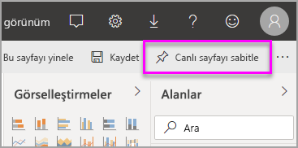

3. **Panoya sabitle** penceresi görüntülendiğinde **Var olan pano**'yu seçin.

   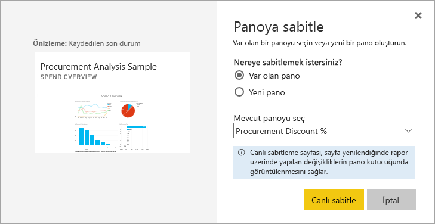

4. Başarılı iletisi görüntülendikten sonra **Panoya git**'i seçin. Burada, rapordan sabitlediğiniz kutucukları görürsünüz. Aşağıdaki örnekte biri raporun ilk sayfasından ve diğeri de canlı kutucuk olan (raporun ikinci sayfası) iki kutucuk sabitledik.

   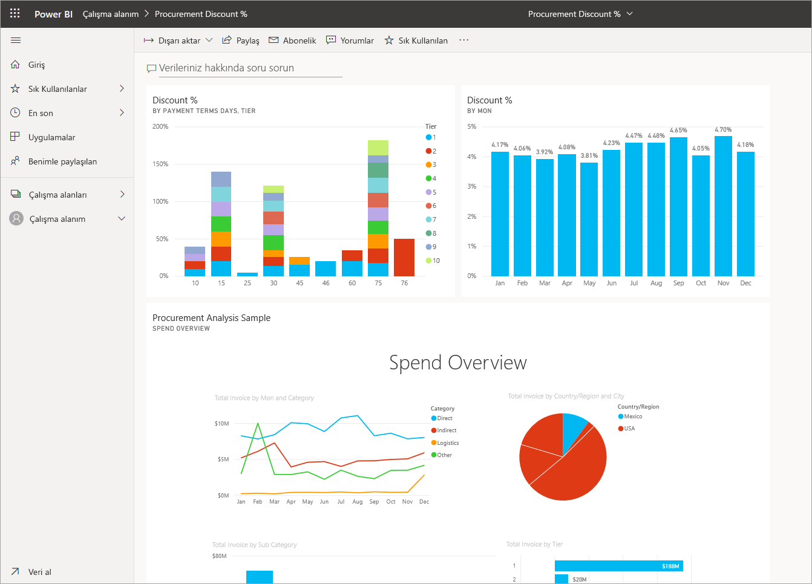

## Sonraki adımlar
Tebrikler, ilk panonuzu oluşturdunuz! Artık panonuz olduğuna göre bununla birçok şey yapabilirsiniz. Aşağıdaki önerilen makalelerden birini izleyin veya kendi başınıza keşfetmeye başlayın: 

* [Kutucukları yeniden boyutlandırma ve taşıma](service-dashboard-edit-tile.md)
* [Pano kutucukları hakkında tüm bilmeniz gerekenler](service-dashboard-tiles.md)
* [Uygulama oluşturarak panonuzu paylaşma](../collaborate-share/service-create-workspaces.md)
* [Power BI - Temel Kavramlar](../fundamentals/service-basic-concepts.md)
* [Harika bir pano oluşturmaya yönelik ipuçları](service-dashboards-design-tips.md)

Başka bir sorunuz mu var? [Power BI Topluluğu'na başvurun](https://community.powerbi.com/).
