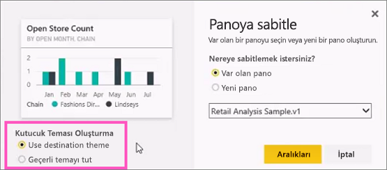

# Raporlardan Power BI panolarına kutucuk sabitleme

[Pano kutucuğu](../consumer/end-user-tiles.md) eklemenin yollarından biri, bu işlemi bir [Power BI raporundan](../consumer/end-user-reports.md) gerçekleştirmektir. Bu kutucuklardan birini seçtiğinizde kutucuk raporda açılır.

Rapor sayfasının tamamı panoya sabitlenebilir ve bu işlem *canlı* kutucuk sabitleme olarak adlandırılır. Canlı kutucuk olarak adlandırılır çünkü panodaki kutucukla etkileşim kurabilirsiniz. Tek tek görselleştirme kutucuklarından farklı olarak, raporda yapılan değişiklikler otomatik olarak panoyla eşitlenir. Daha fazla bilgi için bkz. [Rapor sayfasının tamamını sabitleme](#pin-an-entire-report-page).

Sizinle veya Power BI Desktop'tan paylaşılmış olan raporlardan kutucuk sabitleyemezsiniz. 

> [!TIP]
> Bazı görselleştirmeler arka plan resimleri kullandığından, arka plan resmi fazla büyük olduğunda sabitleme çalışmayabilir. Resmin boyutunu azaltın veya resmi sıkıştırın.  
> 
> 

## Bir rapordan kutucuk sabitleme
Aşağıdaki videoda Amanda, bir Power BI raporundan görseller ve resimler sabitleyerek bir pano oluşturmaktadır.
    

<iframe width="560" height="315" src="https://www.youtube.com/embed/lJKgWnvl6bQ" frameborder="0" allowfullscreen></iframe>

Şimdi Power BI örnek raporlarından birini kullanarak kendi panonuzu oluşturun.

1. Raporda, sabitlemek istediğiniz görselleştirmenin üzerine gelin ve raptiye simgesini seçin. . Bu işlemin ardından Power BI, **Panoya sabitle** ekranını açar.
   
     
2. Var olan bir panoya mı yoksa yeni bir panoya mı sabitlemek istediğinizi seçin.
   
   * **Var olan pano**: Açılan listeden panonun adını seçin. Sizinle paylaşılan panolar açılan listede görünmez.
   * **Yeni pano**: Yeni panonun adını girin.
3. Bazı durumlarda, sabitlediğiniz öğeye önceden bir *tema* uygulanmış olabilir. Örneğin, bir Excel çalışma kitabından sabitlenen görseller. Bu durumda, kutucuğa uygulanacak temayı seçin.
4. **Sabitle**'yi seçin.
   
   Sağ üst köşeye yakın bir noktada çıkan başarılı iletisi, görselleştirmenin bir kutucuk olarak panonuza eklendiğini bildirir.
   
   
5. Gezinti bölmesinden yeni kutucuk içeren panoyu seçin. [Kutucuğun görüntüsünü ve davranışını düzenleyin](service-dashboard-edit-tile.md) veya kutucuğu seçerek rapora dönün.

## Bir rapor sayfasının tamamını sabitleme
Diğer bir seçenek de bir rapor sayfasının tamamını panoya sabitlemektir ve bu bir kerede birden çok görselleştirmeyi sabitlemenin kolay bir yoludur. Sayfanın tamamını sabitlediğinizde kutucuklar *canlı* olur. Başka bir deyişle kutucuklarla panoda etkileşim kurabilirsiniz. Rapor düzenleyicisinde herhangi bir görselleştirme üzerinde yaptığınız değişiklikler (filtre ekleme veya grafikte kullanılan alanları değiştirme gibi) pano kutucuğu için de geçerli olur.  

Daha fazla bilgi için bkz. [Rapor sayfasının tamamını sabitleme](service-dashboard-pin-live-tile-from-report.md).

## Sonraki adımlar
- [Panoların Power BI hizmeti tüketicileri için anlamı](../consumer/end-user-dashboards.md)
- [Power BI'daki pano kutucukları](../consumer/end-user-tiles.md)
- [Power BI'daki raporlar](../consumer/end-user-reports.md)
- [Power BI'da veri yenileme](../connect-data/refresh-data.md)
- [Power BI hizmetinde tasarımcılara yönelik temel kavramlar](../fundamentals/service-basic-concepts.md)

Başka bir sorunuz mu var? [Power BI Topluluğu'na başvurun](https://community.powerbi.com/)
