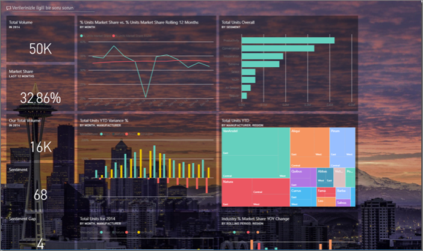
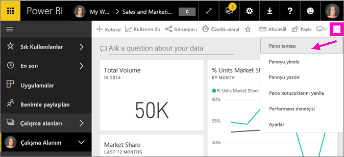
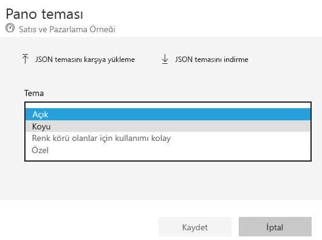
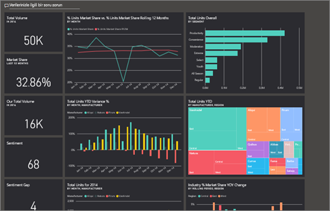
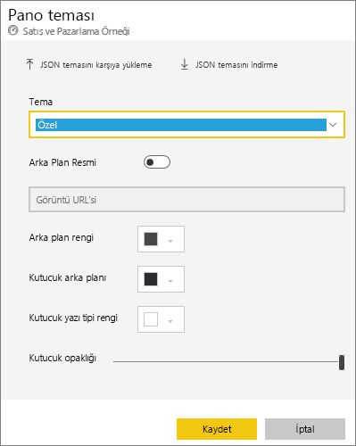
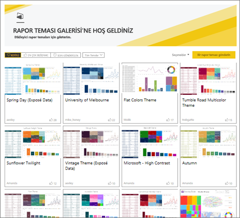
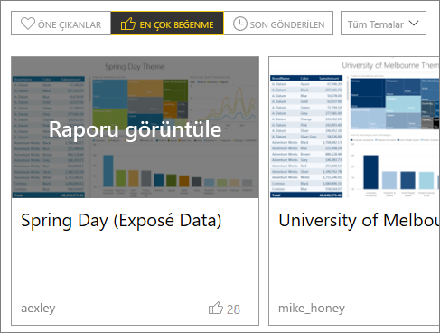
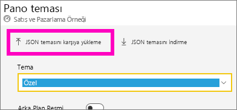
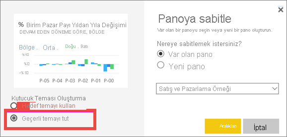
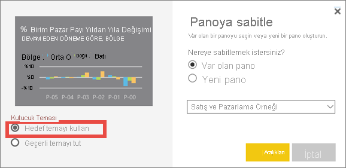

# <a name="use-dashboard-themes-in-the-power-bi-service"></a>Power BI hizmetinde pano temaları kullanma
**Pano temaları** ile, bir renk temasını (kurumsal renkler, mevsim renkleri ve uygulamak isteyebileceğiniz diğer renk temaları) panonuzun tamamına uygulayabilirsiniz. Bir pano teması uyguladığınızda panonuzdaki tüm görsellerde, seçtiğiniz temanın renkleri kullanılır. Bu makalenin [Önemli noktalar ve sınırlamalar](#considerations-and-limitations) bölümünde de açıklandığı üzere bazı özel durumlar söz konusudur.



Bir panodaki rapor görsellerinin renklerini değiştirmek ilgili rapordaki görselleri etkilemez. Ayrıca, bir raporun [rapor teması uygulanmış](desktop-report-themes.md) kutucuklarını sabitlediğinizde geçerli temayı tutabilir veya pano temasını kullanabilirsiniz.


## <a name="prerequisites"></a>Önkoşullar
* Birlikte ilerleyebilmek için, [Satış ve Pazarlama örneği panosunu](sample-datasets.md) açın.


## <a name="how-dashboard-themes-work"></a>Pano temalarının işleyişi
Başlamak için kendi oluşturduğunuz veya düzenleme izinlerine sahip olduğunuz bir panoyu açın. **Düzenle** > **Pano teması**'nı seçin. 



Görüntülenen pano bölmesinde önceden oluşturulmuş temalardan birini seçin.  Aşağıdaki örnekte, **Koyu** seçeneğini kullandık.





## <a name="create-a-custom-theme"></a>Özel tema oluşturma

Power BI panoları için varsayılan tema **Açık**’tır. Renkleri özelleştirmek veya kendi temanızı oluşturmak isterseniz, açılır listeden **Özel**’i seçin. 



Kendi pano temanızı oluşturmak için özel seçenekleri kullanın. Arka plan görüntüsü ekleyecekseniz görüntünüzün en az 1920x1080 çözünürlüğe sahip olması önerilir. Bir görüntüyü arka plan olarak kullanmak için herkese açık bir web sitesine yükleyin, URL'yi kopyalayın ve **Görüntü URL'si** alanına yapıştırın. 

## <a name="use-a-json-theme"></a>JSON teması kullanma
Özel tema oluşturmanın başka bir yolu ise panonuz için kullanmak istediğiniz tüm renklere ilişkin ayarları olan bir JSON dosyasını karşıya yüklemektir. Power BI Desktop'ta rapor oluşturucular, [raporlar için tema oluşturmak](desktop-report-themes.md) üzere JSON dosyalarını kullanır. Panolar için aynı JSON dosyalarını karşıya yükleyebilir veya Power BI Topluluğu’ndaki [Tema galeri sayfasından](https://community.powerbi.com/t5/Themes-Gallery/bd-p/ThemesGallery) farklı JSON dosyaları bulup bunları karşıya yükleyebilirsiniz. 



Ayrıca, özel temanızı bir JSON dosyası olarak kaydedebilir ve sonra diğer pano oluşturucuları ile paylaşabilirsiniz. 

### <a name="use-a-theme-from-the-theme-gallery"></a>Tema Galerisinden tema kullanma

Yerleşik ve özel seçeneklerde olduğu gibi karşıya bir tema yüklediğinizde renkler panodaki tüm kutucuklara otomatik olarak uygulanır. 

1. Bir temanın üzerine gelin ve **Raporu görüntüle**’yi seçin.

    

2. Sayfayı aşağı kaydırın ve JSON dosyasının bağlantısını bulun.  İndirme simgesini seçin ve dosyayı kaydedin.

    

3. Power BI hizmetine geri dönerek Özel Pano tema penceresinden **JSON temasını karşıya yükle**’yi seçin.

    

4. Kayıtlı JSON tema dosyasını kaydettiğiniz konuma gidip **Aç**’ı seçin.

5. Pano teması sayfasında **Kaydet**’i seçin. Yeni tema panonuza uygulanır.

    

## <a name="reports-and-dashboards-with-different-themes"></a>Farklı temalara sahip raporlar ve panolar

Raporunuzda panodan farklı bir tema kullanılıyorsa çoğu durumda görselin geçerli temayı mı yoksa pano temasını mı kullanacağını belirleyebilirsiniz. Ancak panolardaki kart görselleri için "DIN" yazı tipi ailesi ve siyah metinler kullanılır. Özel bir pano teması oluşturarak kartlar dahil olmak üzere bir panodaki tüm kutucukların metin rengini değiştirebilirsiniz.

- Panoya bir kutucuk sabitlerken rapor temasını tutmak için **Geçerli temayı tut**’u seçin. Panodaki görsel, şeffaflık ayarları ile birlikte rapor temasını tutar.

    **Kutucuk Teması Oluşturma** seçeneklerini yalnızca raporu Power BI Desktop’ta oluşturduysanız, [bir rapor teması eklediyseniz](desktop-report-themes.md) ve sonra raporu Power BI hizmetinde yayımladıysanız görürsünüz.

    

- Kutucuğu yeniden sabitlemeyi ve **Pano teması kullan**’ı seçmeyi deneyin.

    

## <a name="dashboard-theme-json-file-format"></a>Pano teması JSON dosya biçimi

En temel düzeyinde, tema JSON dosyasında yalnızca bir gerekli satır vardır: **name**.

```json
{
    "name": "Custom Theme"
}
```

**name** dışındaki her şey isteğe bağlıdır. Tema dosyasına yalnızca özellikle istediğiniz özellikleri eklemekte ve geri kalanı için Power BI’ın varsayılan özelliklerini kullanmakta serbestsiniz.

Pano teması oluşturmak için kullanılan JSON dosyasında şunlar bulunur:

- name: Temanın adı (gerekli olan tek alandır).
- foreground ve background: Panoda kullanılacak renkler.
- dataColors: Grafiklerdeki veriler için kullanılacak onaltılık renk kodlarının listesi. İstediğiniz kadar renk ekleyebilirsiniz.
- tiles: Panolar için arka plan ve renk yapılandırmaları.
- visualStyles: Görseller için ayrıntılı biçimlendirme.

Aşağıda varsayılan Açık temaya ait örnek tema JSON dosyası verilmiştir:

```json
{

"name":"Light",

"foreground":"#000000",

"background":"#EAEAEA",

"dataColors":["#01B8AA","#374649","#FD625E","#F2C80F","#5F6B6D","#8AD4EB","#FE9666","#A66999"],

"tiles":{"background":"#FFFFFF","color":"#000000"},

"visualStyles":{"*":{"*":{"*":[{"color":{"solid":{"color":"#000000"}}}]}}}

}
```

## <a name="considerations-and-limitations"></a>Önemli noktalar ve sınırlamalar

* Pano temalarını sabitlenmiş canlı rapor sayfalarına, iframe kutucuklarına, SSRS kutucuklarına, çalışma kitabı kutucuklarına ya da görüntülere uygulayamazsınız.
* Pano temalarını mobil cihazlarda görürsünüz ancak pano temalarını yalnızca Power BI hizmetinde oluşturabilirsiniz.
* Pano özel temaları yalnızca raporlardan sabitlenmiş kutucuklarla çalışır.

## <a name="next-steps"></a>Sonraki adımlar

- [Raporlara tema uygulama](desktop-report-themes.md)
