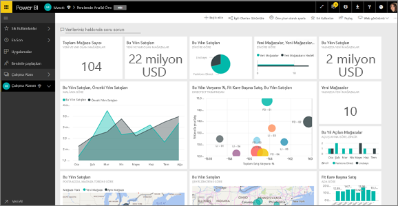
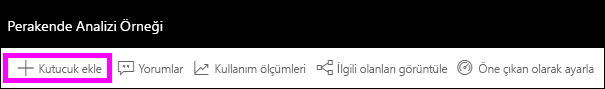
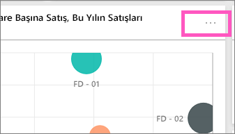
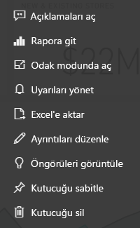

# Power BI tasarımcıları için pano kutucuklarına giriş

Kutucuklar, verilerinizin panoya sabitlenmiş anlık görüntüleridir. Bir rapor, veri kümesi ve panonun yanı sıra Soru-Cevap kutusu, Excel, SQL Server Reporting Services (SSRS) raporları ve diğer hizmetlerden kutucuk oluşturabilirsiniz.  Bu ekran görüntüsünde, bir panoya sabitlenmiş birçok farklı kutucuk gösterilmektedir.

Panolar ve pano kutucukları Power BI Desktop'ın değil, Power BI hizmetinin sunduğu özelliklerdir. Mobil cihazlarda pano oluşturamazsınız ama bu cihazlarda onları [görüntüleyebilir ve paylaşabilirsiniz](../consumer/mobile/mobile-apps-view-dashboard.md).

Kutucukları sabitlemenin yanı sıra, [Kutucuk ekle](service-dashboard-add-widget.md) denetimini kullanarak doğrudan pano üzerinde tek başına kutucuklar oluşturabilirsiniz. Ayrı kutucuklar arasında metin kutuları, resimler, videolar, akış verileri ve web içeriği bulunur.

Power BI'ın yapı taşlarını anlamak için yardıma mı ihtiyacınız var? Bkz. [Power BI hizmetinde tasarımcılar için temel kavramlar](../fundamentals/service-basic-concepts.md).

> [!NOTE]
> Kutucuğu oluşturmak için kullanılan özgün görselleştirmenin değişmesi halinde kutucuk değişmez.  Örneğin, bir rapordan çizgi grafik sabitler ve ardından çizgi grafiği çubuk grafik olarak değiştirirseniz pano kutucuğunda bir çizgi grafik gösterilmeye devam eder. Veriler yenilenir ancak görselleştirme türü yenilenmez.
> 
> 

## Kutucuk sabitleme
Bir panoya kutucuk eklemenin (sabitlemenin) birçok farklı yolu vardır. Kutucukları şuralardan sabitleyebilirsiniz:

* [Power BI Soru-Cevap](service-dashboard-pin-tile-from-q-and-a.md)
* [Bir rapordan](service-dashboard-pin-tile-from-report.md)
* [Başka bir panodan](service-pin-tile-to-another-dashboard.md)
* [OneDrive İş'teki Excel çalışma kitabı](service-dashboard-pin-tile-from-excel.md)
* [Quick Insights (Hızlı Öngörüler)](service-insights.md)
* [Power BI Rapor Sunucusu veya SQL Server Reporting Services içindeki bir şirket içi sayfalandırılmış rapordan](/sql/reporting-services/pin-reporting-services-items-to-power-bi-dashboards)

[Kutucuk ekle](service-dashboard-add-widget.md) denetimini kullanarak doğrudan pano üzerinde resimler, metin kutuları, videolar, akış verileri ve web içeriği için tek başına kutucuklar oluşturabilirsiniz.

  

## Bir panodaki kutucuklarla etkileşim kurma
Bir kutucuğu panoya ekledikten sonra taşıyabilir ve yeniden boyutlandırabilir veya görünümünü ve davranışını değiştirebilirsiniz.

### Bir kutucuğu taşıma ve yeniden boyutlandırma
Bir kutucuğu alın ve [panonun farklı yerlerinde taşıyın](service-dashboard-edit-tile.md). Kutucuğu yeniden boyutlandırmak için ’nın üzerine gelip tutamacı seçin.

### Görünümünü ve davranışını değiştirmek için bir kutucuğun üzerine gelme
1. Üç noktanın görüntülenmesi için kutucuğun üzerine gelin.
   
    
2. Kutucuğun eylem menüsünü açmak için üç noktayı seçin.
   
    
   
    Burada yapabilecekleriniz:
   
     * [Panoya açıklama ekleyin](../consumer/end-user-comment.md).
     * [Bu kutucuğu oluşturmak için kullanılan raporu açın](../consumer/end-user-reports.md).  
     * [Odak modunda görüntüleyin](../consumer/end-user-focus.md).   
     * [Kutucukta kullanılan verileri dışarı aktarın](../visuals/power-bi-visualization-export-data.md).
     * [Başlığı ve alt başlığı düzenleyip köprü ekleyin.](service-dashboard-edit-tile.md) 
     * [İçgörüleri çalıştırın](service-insights.md). 
     * [Kutucuğu başka bir panoya sabitleyin](service-pin-tile-to-another-dashboard.md).
     * [Kutucuğu silin](service-dashboard-edit-tile.md).

3. Eylem menüsü kapatmak için panoda boş bir alan seçin.

### Kutucuk seçme
Bir kutucuğu seçtiğinizde sonraki adım, kutucuğu nasıl oluşturduğunuza bağlıdır. Aksi takdirde kutucuğu seçtiğinizde, kutucuğu oluşturmak için kullanılan rapora, Excel Online çalışma kitabına, şirket içi Reporting Services raporuna veya Soru-Cevap sorusuna yönlendirilirsiniz. Kutucuk [özel bağlantı](service-dashboard-edit-tile.md) içeriyorsa kutucuğu seçtiğinizde söz konusu bağlantıya yönlendirilirsiniz.

> [!NOTE]
> **Kutucuk ekle** seçeneği kullanılarak doğrudan pano üzerinde oluşturulan video kutucukları için bu durum geçerli değildir. Bu şekilde oluşturulmuş bir video kutucuğunun seçilmesi, videonun doğrudan panoda oynatılmasına neden olur.   
> 
> 

## Önemli noktalar ve sorun giderme

* Görselleştirmeyi oluşturmak için kullanılan rapor kaydedilmemişse kutucuk seçildiğinde herhangi bir işlem gerçekleşmez.
* Kutucuk Excel Online'da bir çalışma kitabından oluşturulduysa, söz konusu çalışma kitabı üzerinde en azından Okuma izinleriniz olmalıdır. Aksi takdirde, kutucuk seçildiğinde Excel Online'da çalışma kitabı açılmaz.
* Doğrudan panoda **Kutucuk ekle**'yi kullanarak bir kutucuk oluşturduğunuzu ve bunun için bir özel köprü ayarladığınızı varsayalım. Bu durumda başlığı, alt başlığı veya kutucuğu seçtiğinizde söz konusu URL açılır. Aksi takdirde bir resim, web kodu veya metin kutusu için doğrudan panoda oluşturulan kutucukları seçtiğinizde varsayılan olarak hiçbir işlem geçekleşmez.
* Kutucuklar, Power BI Rapor Sunucusu veya SQL Server Reporting Services içindeki bir şirket içi sayfalandırılmış rapordan oluşturulabilir. Şirket içi rapora erişim izniniz yoksa, kutucuğun seçilmesi sizi erişiminizin olmadığını belirten bir sayfaya götürür (rsAccessDenied).
* Power BI Rapor Sunucusu veya SQL Server Reporting Services içindeki şirket içi sayfalandırılmış rapordan oluşturulmuş bir kutucuk seçtiğinizi varsayalım. Sunucunun bulunduğu ağa erişiminiz yoksa, söz konusu sayfalandırılmış rapordan oluşturulmuş bir kutucuğu seçtiğinizde sunucunun bulunamadığını belirten bir sayfaya (HTTP 404) yönlendirilirsiniz. Raporu görüntülemek için cihazınızın, rapor sunucusuna ağ erişimi olmalıdır.
* Kutucuğu oluşturmak için kullanılan özgün görselleştirmenin değişmesi halinde kutucuk değişmez. Örneğin, bir rapordan çizgi grafik sabitler ve ardından çizgi grafiği çubuk grafik olarak değiştirirseniz pano kutucuğunda bir çizgi grafik gösterilmeye devam eder. Veriler yenilenir ancak görselleştirme türü yenilenmez.

## Sonraki adımlar
- [Panonuz için kart (büyük sayı kutucuğu) oluşturma](../visuals/power-bi-visualization-card.md)
- [Power BI tasarımcıları için panolara giriş](service-dashboards.md)  
- [Power BI'da veri yenileme](../connect-data/refresh-data.md)
- [Power BI hizmetinde tasarımcılara yönelik temel kavramlar](../fundamentals/service-basic-concepts.md)
- [Power BI kutucuklarını Office belgeleriyle tümleştirme](https://powerbi.microsoft.com/blog/integrating-power-bi-tiles-into-office-documents/)
- [Reporting Services öğelerini Power BI panolarına sabitleme](/sql/reporting-services/pin-reporting-services-items-to-power-bi-dashboards)

Başka bir sorunuz mu var? [Power BI Topluluğu'na başvurun](https://community.powerbi.com/).