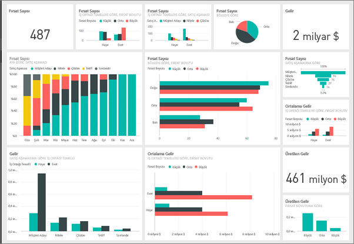
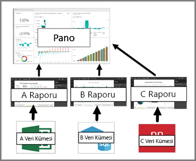

# Power BI tasarımcıları için panolara giriş

Power BI *panosu*, görselleştirmeler kullanarak bir hikaye anlatan ve genellikle tuval olarak adlandırılan tek bir sayfadır. Tek sayfayla sınırlı olduğundan, iyi tasarlanmış bir panoda yalnızca hikayenin önemli parçaları yer alır. Okuyucular ayrıntılar için ilgili raporları görüntüleyebilir.

Panolar yalnızca Power BI hizmetinin bir özelliğidir. Power BI Desktop'ta kullanılamazlar. Mobil cihazlarda pano oluşturamasanız da bu cihazlarda onları [görüntüleyebilir ve paylaşabilirsiniz](../consumer/mobile/mobile-apps-view-dashboard.md).

## Pano temel bilgileri 

Panoda gördüğünüz görselleştirmelere *kutucuklar* denir. Kutucukları raporlardan panoya *sabitlersiniz*. Power BI'ı kullanmaya yeni başladıysanız [Power BI hizmetinde tasarımcılar için temel kavramlar](../fundamentals/service-basic-concepts.md) makalesini okuyarak iyi bir temel oluşturabilirsiniz.

Panodaki görselleştirmeler raporlardan kaynaklanır ve her rapor bir veri kümesini temel alır. Panoları, bağlantılı raporlara ve temel alınan veri kümelerine giriş noktası olarak düşünebilirsiniz. Görselleştirmelerden birini seçtiğinizde temel aldığı rapor (ve veri kümesi) açılır.

## Panoların avantajları
Panolar işlerinizi izlemek ve en önemli ölçümlerinizi bir bakışta görmek için harika bir yoldur. Panolardaki görselleştirmeler, bir veya daha fazla temel alınan veri kümesinden ve bağlantılı rapordan oluşabilir. Bir panoda şirket içi ve bulut verileri bir arada kullanılabilir ve verilerin konumundan bağımsız olarak tümleşik bir görünüm oluşturulabilir.

Panolar yalnızca güzel görünen resimlerden ibaret değildir. Bunlar son derece etkileşimli çalışır ve temel alınan veriler değiştikçe kutucuklar da güncelleştirilir.

## Kimler pano oluşturabilir?
Pano oluşturabilme becerisi bir *oluşturucu* özelliği olarak kabul edilir ve raporda düzenleme izinleri gerektirir. Düzenleme izinleri, rapor oluşturanlar ve oluşturanın erişim verdiği iş arkadaşları tarafından kullanılabilir. Örneğin, David ABC çalışma alanında bir rapor oluşturur ve sonra sizi o çalışma alanının bir üyesi olarak eklerse, hem siz hem de David düzenleme izinlerine sahip olursunuz. Diğer yandan, bir rapor sizinle doğrudan veya bir [Power BI uygulamasının](../collaborate-share/service-create-distribute-apps.md) parçası olarak paylaşılırsa, raporu *kullanıyor* olursunuz. Kutucukları bir panoya sabitleyemeyebilirsiniz. 

> [!IMPORTANT]
> Çalışma alanlarında pano oluşturmak için [Power BI Pro](../fundamentals/service-features-license-type.md) lisansı gerekir. Çalışma Alanım’da, Power BI Pro lisansı olmadan pano oluşturabilirsiniz.

## Panolarla raporları karşılaştırma
[Raporlar](../consumer/end-user-reports.md) ve panoların ikisi de görselleştirmelerle dolu tuvaller olduğu için benzer görünebilir. Ama aşağıdaki tabloda görebileceğiniz gibi önemli farklılıklar vardır.

| **Özellik** | **Panolar** | **Raporlar** |
| --- | --- | --- |
| Sayfalar |Bir sayfa |Bir veya daha fazla sayfa |
| Veri kaynakları |Pano başına bir veya daha fazla rapor ve bir veya daha fazla veri kümesi |Rapor başına tek bir veri kümesi |
| Power BI Desktop'ta kullanılabilirlik |Hayır | Evet. Power BI Desktop'ta rapor oluşturabilir ve görüntüleyebilirsiniz |
| Abonelik |Evet. Bir panoya abone olabilirsiniz |Evet. Bir rapor sayfasına abone olabilirsiniz |
| Filtreleme |Hayır. Filtreleme veya dilimleme yapamazsınız |Evet. Filtreleme, vurgulama ve dilimleme için birçok farklı yol vardır |
| Öne çıkanlar |Evet. Bir panoyu *öne çıkan* panonuz olarak ayarlayabilirsiniz |Hayır |
| Sık kullanılanlara ekle | Evet. Birden çok panoyu *sık kullanılanlara* ekleyebilirsiniz | Evet. Birden çok raporu *sık kullanılanlara* ekleyebilirsiniz
| Uyarı ayarlama |Evet. Bazı durumlarda pano kutucukları için kullanılabilir |Hayır |
| Doğal dil sorguları (Soru-Cevap) |Evet | Evet, rapor ve bağlantılı veri kümesi üzerinde düzenleme izinlerinizin olması koşuluyla |
| Temel alınan veri kümesi tablolarını ve alanlarını görme |Hayır. Verileri dışarı aktarabilir ancak panonun üzerinde tabloları ve alanları göremezsiniz |Evet |

## Sonraki adımlar
* Panoları daha rahat kullanmak için [örnek panolarımızdan](sample-tutorial-connect-to-the-samples.md) birine ilişkin tura katılın.
* [Pano kutucukları](service-dashboard-tiles.md) hakkında bilgi edinin.
* Tek bir pano kutucuğunu izlemek ve belirli bir eşiğe ulaştığında e-posta almak mı istiyorsunuz? [Kutucukta uyarı oluşturma](service-set-data-alerts.md).
* Verileriniz hakkında soru sormak ve görselleştirme şeklinde yanıt almak için [Power BI Soru-Cevap](power-bi-tutorial-q-and-a.md) özelliğini kullanmayı öğrenin.
