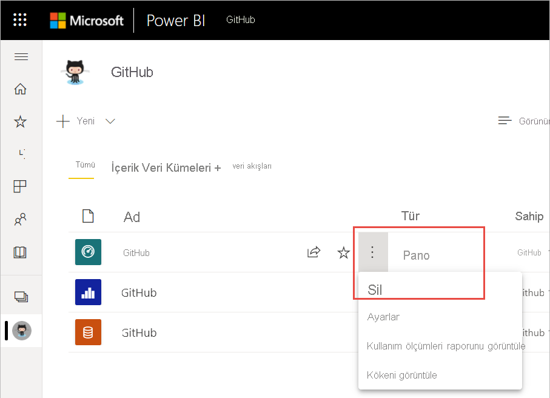
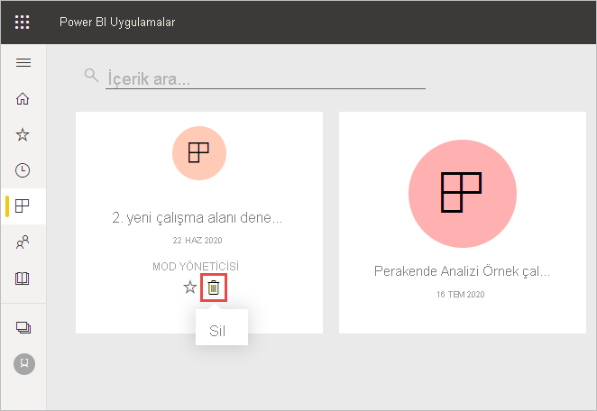
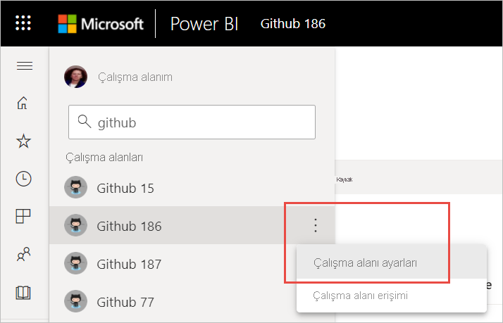

# Power BI hizmetindeki hemen her şeyi silme
Bu makalede, Power BI hizmetindeki bir panoyu, raporu, çalışma kitabını, veri kümesini, uygulamayı, görselleştirmeyi veya çalışma alanını silmeyle ilgili bilgiler sunulmaktadır. Bazı özel durumlar haricinde Power BI hizmetindeki hemen her şeyi silebilirsiniz. 

## Panoyu, raporu, veri kümesini veya çalışma kitabını silme

1. Çalışma alanınızda **Tümü** sekmesini seçin.
1. Silmek istediğiniz varlığın yanındaki **Diğer seçenekler (...)** öğesini seçip **Sil** seçeneğini belirleyin.

    

1. Silme işlemini onaylamak için **Sil**’e tıklayın.

## Bir uygulamayı uygulama listesi sayfanızdan kaldırma

Uygulamalar listesi sayfanızdan uygulamaları kolayca kaldırabilirsiniz. Kaldırılan uygulama diğer üyelerden silinmez. Uygulamayı çalışma alanından yalnızca çalışma alanı yöneticisi silebilir.

1. Gezinti bölmesinde **Uygulamalar**'ı seçerek uygulama listesi sayfasını açın.
2. Silmek istediğiniz uygulamanın üzerine gelip Sil simgesini :::image type="icon" source="media/service-delete/power-bi-delete-report2.png" border="false"::: seçin.

   

   Yanlışlıkla kaldırdığınız uygulamaları geri almak için kullanabileceğiniz birçok seçenek vardır.  Uygulama oluşturucusunun uygulamayı yeniden göndermesini isteyebilir, uygulama bağlantısını içeren özgün e-postayı bulabilir, [Bildirim merkezinizde](../consumer/end-user-notification-center.md) uygulamayla ilgili bildirimin mevcut olup olmadığına bakabilir veya kuruluşunuzun [AppSource](../consumer/end-user-apps.md) sayfasını kontrol edebilirsiniz.

## Çalışma alanını kaldırma veya silme

Power BI’da iki farklı türde çalışma alanı bulunur: özgün veya *klasik* çalışma alanları ve yeni çalışma alanları. Bu çalışma alanlarını kaldırma ve silme işlemleri farklıdır. [Yeni ve klasik çalışma alanları](../collaborate-share/service-new-workspaces.md) hakkında daha fazla bilgi edinin.

### Üyeleri yeni çalışma alanından kaldırma

Yalnızca çalışma alanı yöneticileri yeni çalışma alanından kişileri kaldırabilir. Yöneticiyseniz kendinizi veya başkasını kaldırabilirsiniz. Ancak çalışma alanının tek yöneticisiyseniz Power BI kendinizi kaldırmanıza izin vermez.

1. Çalışma alanı liste görünümünde sağ üstteki **Erişim**’i seçin.

    :::image type="content" source="media/service-delete/power-bi-select-access.png" alt-text="Erişimi Seçme işleminin ekran görüntüsü.":::

1. **Erişim** bölmesinde, kaldırmak istediğiniz kişinin adının yanındaki **Diğer seçenekler (...)** öğesini seçip **Kaldır** seçeneğini belirleyin.

    :::image type="content" source="media/service-delete/power-bi-access-remove.png" alt-text="Erişim bölmesinde Kaldır seçeneğini belirleme işleminin ekran görüntüsü.":::

### Yeni çalışma alanını silme

*Yeni çalışma alanlarından* birini oluşturduğunuzda, ilişkili bir Microsoft 365 grubu oluşturmuş olmazsınız. Çalışma alanı yöneticisiyseniz Microsoft 365 gruplarını etkilemeden yeni çalışma alanını silebilirsiniz. [Yeni ve klasik çalışma alanları](../collaborate-share/service-new-workspaces.md) hakkında daha fazla bilgi edinin.

Yöneticisi olduğunuz çalışma alanını silebilir veya kişileri buradan kaldırabilirsiniz. Ayrıca silme işleminin ardından ilişkili uygulama, tüm grup üyeleri için silinir ve AppSource’unuzdan kaldırılır. 

1. Gezinti bölmesinden **Çalışma alanları**’nı seçin

2. Silmek istediğiniz çalışma alanının sağ tarafındaki **Diğer seçenekler**’i (...) ve **Çalışma alanı ayarları**’nı seçin.

    

3. **Çalışma alanı ayarları** bölmesinde, **Çalışma alanını sil** > **Sil**’i seçin.

### Klasik çalışma alanını listenizden kaldırma

Klasik çalışma alanının üyesi olmak istemiyorsanız **_ayrılabilir_* _ve ilgili girişin listenizden kaldırılmasını sağlayabilirsiniz. Siz bir çalışma alanından ayrıldığınızda diğer çalışma alanı üyeleri için herhangi bir değişiklik olmaz.  

> [!NOTE]
> Çalışma alanındaki tek yönetici sizseniz Power BI ayrılmanıza izin vermez.
>

1. Kaldırmak istediğiniz çalışma alanında işleme başlayın.

2. Sağ üst köşede _ *Diğer seçenekler** (...) seçeneğini ve **Çalışma alanından ayrıl** > **Ayrıl**’ı seçin.

      :::image type="content" source="media/service-delete/power-bi-leave-workspace.png" alt-text="Diğer seçenekler, Çalışma alanından ayrıl işleminin ekran görüntüsü.":::

   > [!NOTE]
   > Açılan listede göreceğiniz seçenekler, çalışma alanında Yönetici veya Üye olma durumunuza göre değişir.
   >

### Klasik çalışma alanını silme

> [!WARNING]
> *Klasik* çalışma alanı oluşturduğunuzda bir Microsoft 365 grubu oluşturmuş olursunuz. Klasik çalışma alanını sildiğinizde bu Microsoft 365 grubunu da silmiş olursunuz. Söz konusu grup SharePoint ve Microsoft Teams gibi diğer Microsoft 365 ürünlerinden de silinir.
> 

Bir çalışma alanını silmek, çalışma alanından ayrılmaktan farklıdır. Çalışma alanını silmek için çalışma alanı yöneticisi olmanız gerekir. Ayrıca silme işleminin ardından ilişkili uygulama, tüm grup üyeleri için silinir ve AppSource’unuzdan kaldırılır. Ancak çalışma alanının tek yöneticisiyseniz Power BI ayrılmanıza izin vermez.

1. Gezinti bölmesinden **Çalışma alanları**’nı seçin.

2. Silinecek çalışma alanının yanında **Diğer seçenekler (...)**  > **Çalışma alanı ayarları**’nı seçin.

    

3. **Ayarlar** bölmesinde, **Çalışma alanını sil**’i seçip **Silme** işlemini onaylayın.

    

## Önemli noktalar ve sınırlamalar

- Bir *panoyu* kaldırdığınızda bağlı olduğu veri kümesi veya o panoyla ilişkilendirilmiş raporlar silinmez.
- *Panonun veya raporun sahibiyseniz* bunları kaldırabilirsiniz. Panoyu veya raporu iş arkadaşlarınızla paylaştıysanız bunları Power BI çalışma alanınızdan kaldırdığınızda bu kişilerin Power BI çalışma alanlarından da kaldırmış olursunuz.
- *Pano veya rapor sizinle paylaşıldıysa* bunları kaldıramazsınız.
- Raporu sildiğinizde raporun temel aldığı veri kümesi silinmez.  Panoya sabitlediğiniz, rapordaki tüm görselleştirmeler de korunur. Bunlar tek tek silinene kadar panoda kalmaya devam eder.
- *Veri kümesini* silebilirsiniz. Ancak bir veri kümesini sildiğinizde ilgili veri kümesindeki verilerin kullanıldığı tüm raporlar ve pano kutucukları da silinir.
- *Çalışma kitaplarını* kaldırabilirsiniz. Ancak bir çalışma kitabını kaldırdığınızda bu çalışma kitabındaki verilerin kullanıldığı tüm raporlar ve pano kutucukları da kaldırılır. OneDrive İş hesabında kayıtlı çalışma kitaplarının Power BI’dan silinmesi, OneDrive’dan kaldırılmasını sağlamaz.
- *Pano veya rapor* bir [kurumsal içerik paketinin](../collaborate-share/service-organizational-content-pack-disconnect.md) parçasıysa bu yöntemi kullanarak silinemez.  Bkz. [Kurumsal içerik paketi bağlantılarını kaldırma](../collaborate-share/service-organizational-content-pack-disconnect.md).
- Veri kümesi bir veya daha fazla *kurumsal içerik paketinin* parçasıysa söz konusu veri kümesini silmek için, kullanıldığı içerik paketlerinden kaldırmanız, işlemin tamamlanmasını beklemeniz ve silmeyi tekrar denemeniz gerekir.

## Sonraki adımlar

Bu makalede Power BI hizmetinin başlıca yapı taşlarını silme yöntemleri ele alınmıştır. Silebileceğiniz diğer birkaç öğe aşağıda verilmiştir.  

- [Öne Çıkan panonuzu kaldırma](../consumer/end-user-featured.md)
- [Bir panoyu kaldırma (sık kullanılanlardan çıkarma)](../consumer/end-user-favorite.md)
- [Bir pano kutucuğunu silme](service-dashboard-edit-tile.md)

Başka bir sorunuz mu var? [Power BI Topluluğu'na başvurun](https://community.powerbi.com/)