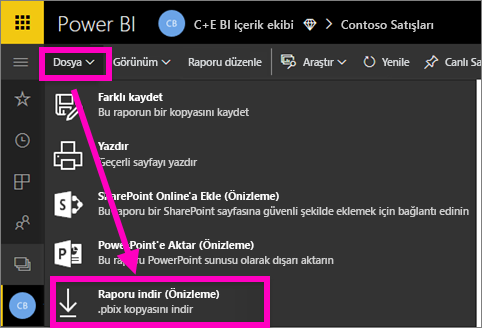
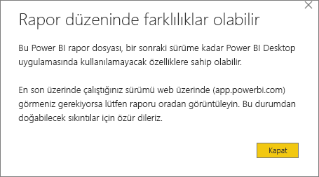
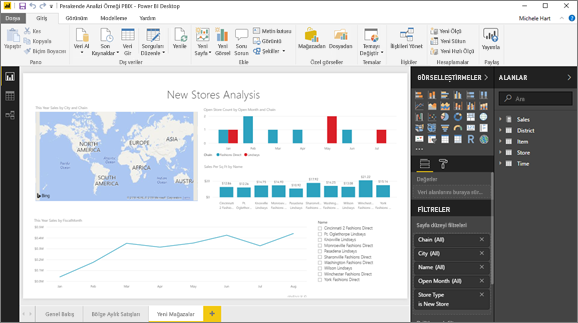

# Power BI hizmetindeki raporları Power BI Desktop’a indirme (önizleme)
      
Power BI Desktop’ta bir raporu ( *.pbix* dosyası) yerel bilgisayarınızdan Power BI hizmetine yayımlayabilirsiniz. Power BI raporları diğer yöne de gidebilir: Power BI hizmetindeki bir raporu Power BI Desktop’a indirebilirsiniz. Power BI raporunun uzantısı, her iki durumda da .pbix olur.

Dikkat etmeniz gereken bazı sınırlamalar, bu makalenin [Önemli noktalar ve sorun giderme](#considerations-and-troubleshooting) bölümünde ele alınmıştır.

## Raporu .pbix dosyası olarak indirme

Yalnızca 23 Kasım 2016'dan sonra [Power BI Desktop ile oluşturulmuş](/learn/modules/publish-share-power-bi/2-publish-reports) ve sonrasında güncelleştirilmiş raporları indirebilirsiniz. Bu tarihten önce oluşturulmadıysa, Power BI hizmetindeki **Raporu indir** seçeneği gri renkte görünür.

.pbix dosyasını indirmek için şu adımları uygulayın:

1. Power BI hizmetinde, indirmek istediğiniz raporu [Düzenleme görünümü](./service-interact-with-a-report-in-editing-view.md)'nde açın.

2. Üst gezinti bölmesinden **Dosya > Raporu indir**'i seçin.
   
3. Rapor indirilirken, ilerleme durumu bir durum başlığında gösterilir. Dosya hazır olduğunda .pbix dosyasını nereye kaydedeceğiniz sorulur. Dosyanın varsayılan adı, raporun başlığıyla aynıdır.
   
4. Henüz yapmadıysanız, [Power BI Desktop’ı yükleyin](../fundamentals/desktop-get-the-desktop.md), ardından .pbix dosyasını Power BI Desktop’ta açın.
   
    Raporu Power BI Desktop uygulamasında açtığınızda Power BI hizmeti raporunda bulunan bazı özelliklerin Power BI Desktop uygulamasında kullanılamadığını belirten bir uyarı iletisiyle karşılaşabilirsiniz.
   
    

5. Power BI Desktop’taki rapor düzenleyicisi, Power BI hizmetindeki rapor düzenleyicisi ile benzerdir.  
   
    

## Önemli noktalar ve sorun giderme

Power BI hizmetinden .pbix dosyası indirirken dikkat etmeniz gereken bazı önemli noktalar ve sınırlamalar vardır.

* Dosyayı indirebilmek için raporu düzenleme iznine sahip olmanız gerekir.
* Raporun Power BI Desktop kullanılarak oluşturulmuş ve Power BI hizmetinde *yayımlanmış* olması ya da .pbix dosyasının Power BI hizmetine *yüklenmiş* olması gerekir.
* Raporların 23 Kasım 2016'dan sonra yayımlanmış veya güncelleştirilmiş olması gerekir. Daha önce yayımlanan raporlar indirilemez.
* Bu özelik, ilk olarak Power BI hizmetinde oluşturulmuş olan raporlar ve içerik paketleriyle birlikte kullanılamaz.
* İndirilen dosyaları açarken mutlaka Power BI Desktop uygulamasının son sürümünü kullanın. İndirilen .pbix dosyaları Power BI Desktop’ın eski sürümlerinde açılmayabilir. Örneğin bilgi korumasını desteklemeyen bir Desktop sürümü kullanarak indirilen .pbix dosyalarını açamazsınız.
* Yöneticiniz verileri indirme özelliğini devre dışı bıraktıysa bu özellik Power BI hizmetinde görüntülenmez.
* Artımlı yenileme özelliği olan veri kümeleri .pbix dosyasına indirilemez.
* [Büyük modeller](../admin/service-premium-large-models.md) için etkinleştirilmiş veri kümeleri .pbix dosyasına indirilemez.
* [XMLA uç noktasını](../admin/service-premium-connect-tools.md) kullanarak değiştirilen veri kümeleri .pbix dosyasına indirilemez.
* Bir çalışma alanındaki veri kümesini temel alarak bir Power BI raporu oluşturup bu raporu farklı bir çalışma alanında yayımlarsanız siz ve kullanıcılarınız bu raporu indiremezsiniz. İndirme özelliği şu anda bu senaryoda desteklenmiyor.

## Sonraki adımlar

Bu özellik hakkındaki bir dakikalık **Guy in a Cube** videosunu izleyin:

<iframe width="560" height="315" src="https://www.youtube.com/embed/ymWqU5jiUl0" frameborder="0" allowfullscreen></iframe>

Power BI hizmetini kullanmayı öğrenmenize yardımcı olabilecek birkaç ek makale aşağıda verilmiştir:

* [Power BI'daki raporlar](../consumer/end-user-reports.md)
* [Power BI hizmetinde tasarımcılara yönelik temel kavramlar](../fundamentals/service-basic-concepts.md)

Power BI Desktop uygulamasını yükledikten sonra aşağıdaki makale hızlı bir şekilde çalışmaya başlamanıza yardımcı olabilir:

* [Power BI Desktop ile çalışmaya başlama](../fundamentals/desktop-getting-started.md)

Başka bir sorunuz mu var? [Power BI Topluluğu'na başvurun](https://community.powerbi.com/).