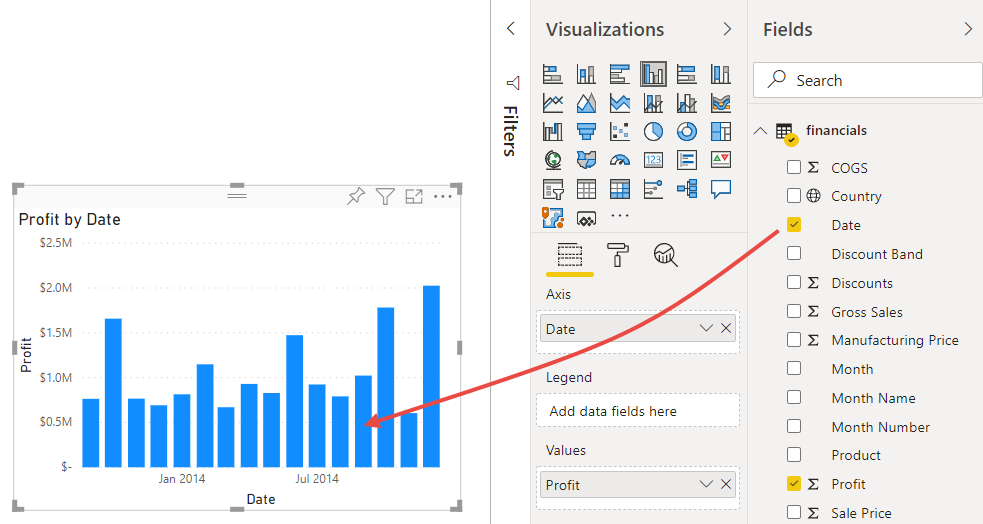
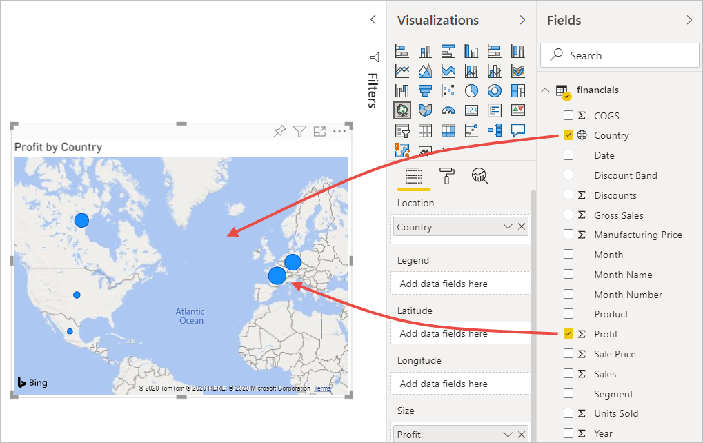
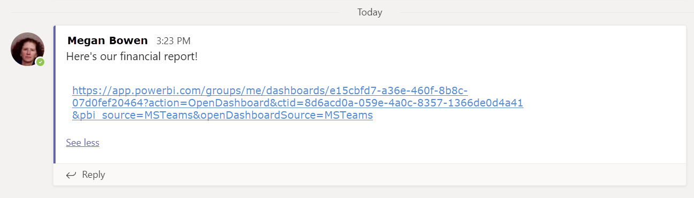

# Öğretici: Excel çalışma kitabından Power BI hizmetindeki bir rapora ve Microsoft Teams'e
Yöneticiniz gün sonuna kadar en son satış ve kâr rakamlarınızı içeren bir rapor görmek istiyor. Ama en yeni verileriniz çeşitli üçüncü taraf sistemlerinde ve dizüstü bilgisayarınızdaki dosyalarda bulunur. Daha önce, görseller oluşturmak ve bir raporu biçimlendirmek saatler sürüyor ve sonunda endişelenmeye başlıyordunuz.

Endişelenmeyin. Power BI ile büyüleyici bir rapor oluşturabilir ve bunu hiç zaman harcamadan Microsoft Teams'de paylaşabilirsiniz!

:::image type="content" source="media/service-from-excel-to-stunning-report/power-bi-financial-report-service.png" alt-text="Bitmiş Finansal Örnek raporunun ekran görüntüsü":::

Bu öğreticide, bir Excel dosyasını karşıya yükleyecek, yeni bir rapor oluşturacak ve bu raporu Microsoft Teams'de iş arkadaşlarımızla paylaşacağız. Üstelik bu işlemlerin tümünü Power BI'da gerçekleştireceğiz. Şunları öğrenirsiniz:

> [!div class="checklist"]
> * Excel'de verilerinizi hazırlama.
> * Örnek verileri indirme.
> * Power BI hizmetinde raporu oluşturma.
> * Rapor görsellerini panoya sabitleme.
> * Panoya bir bağlantı paylaşma.
> * Panoyu Microsoft Teams'de paylaşma

## Excel’de verileri hazırlama
Örnek olarak basit bir Excel dosyasını ele alalım. 

1. Excel dosyanızı Power BI'a yükleyebilmeniz için verilerinizi düz bir tabloda düzenlemeniz gerekir. Düz bir tabloda, her sütun aynı veri türünü (örn. metin, tarih, sayı veya para birimi) içerir. Tablonuzun bir başlık satırı olması gerekir, ancak toplamları görüntüleyen herhangi bir sütun veya satır olmamalıdır.

   

2. Şimdi, verilerinizi bir tablo olarak biçimlendirin. Excel'in **Giriş** sekmesindeki **Stiller** grubunda **Tablo Olarak Biçimlendir** seçeneğini belirleyin. 

3. Çalışma sayfanızda uygulanacak bir tablo stili seçin. 

   Excel çalışma sayfanız artık Power BI'a yüklenmek için hazır.

   

## Excel dosyanızı Power BI hizmetine yükleme
Power BI hizmeti, bilgisayarınızda bulunan Excel dosyaları da dahil olmak üzere birçok veri kaynağına bağlanır. 

 > [!NOTE] 
 > Bu öğreticinin kalan kısmında birlikte ilerleyebilmemiz için [Financial Sample çalışma kitabını](https://go.microsoft.com/fwlink/?LinkID=521962) indirin.

1. Çalışmaya başlamak için Power BI hizmetinde oturum açın. Henüz kaydınız yoksa [ücretsiz kaydolabilirsiniz](https://powerbi.com).
1. **Çalışma alanım**'da **Yeni** > **Karşıya dosya yükle**'yi seçin.

    :::image type="content" source="media/service-from-excel-to-stunning-report/power-bi-new-upload.png" alt-text="Dosyayı karşıya yükleme seçeneğinin ekran görüntüsü.":::

1. **Yerel Dosya**'yı seçin, Financial Sample Excel dosyasını kaydettiğiniz konuma gidin ve **Aç**'ı seçin.
7. **Yerel Dosya** sayfasında **İçeri Aktar**'ı seçin.

    Artık bir Finansal Örnek veri kümeniz vardır. Power BI ayrıca otomatik olarak boş bir pano oluşturur. Panoyu görmüyorsanız tarayıcınızı yenileyin.

    :::image type="content" source="media/service-from-excel-to-stunning-report/power-bi-financial-dataset.png" alt-text="Finansal Örnek veri kümesi ile Çalışma Alanımın ekran görüntüsü.":::

2. Rapor oluşturmak istiyorsunuz. Yine **Çalışma alanım**'da **Yeni** > **Rapor**'u seçin.

   

3. **Rapor oluşturmak için bir veri kümesi seçin** iletişim kutusunda **Financial Sample** veri kümesi > **Oluştur**'u seçin.

   

## Raporunuzu oluşturma
 
Rapor Düzenleme görünümünde açılır ve boş bir rapor tuvali görüntülenir. Sağ tarafta **Görsel Öğeler**, **Filtreler** ve **Alanlar** bölmeleri bulunur. Excel çalışma kitabınızdaki tablo verileri **Alanlar** bölmesinde görüntülenir. Üst kısımda tablo adı (**financials**) yer alır. Bunun altında Power BI sütun başlıklarını ayrı alanlar olarak listeler.

Alanlar listesinde Sigma simgelerini görüyor musunuz? Power BI bu alanların sayısal olduğunu algıladı. Ayrıca Power BI coğrafi alanı dünya simgesiyle gösterir.

1. Rapor tuvalinde daha fazla yer açmak için **Gezinti bölmesini gizle**'yi seçin ve **Filtreler** bölmesini simge durumuna küçültün.

    :::image type="content" source="media/service-from-excel-to-stunning-report/power-bi-hide-nav-pane.png" alt-text="Gezinti bölmesini simge durumuna küçültme işleminin ekran görüntüsü."::: 

1. Artık görselleştirme oluşturmaya başlayabilirsiniz. Yöneticinizin zaman içinde elde edilen kârı görmek istediğini varsayalım. **Alanlar** bölmesinde **Kar**’ı rapor tuvaline sürükleyin. 

   Varsayılan olarak Power BI tek sütunu olan bir sütun grafiği görüntüler. 

    :::image type="content" source="media/service-from-excel-to-stunning-report/power-bi-profit-column.png" alt-text="Tek sütunu olan bir sütun grafiğinin ekran görüntüsü.":::

3. **Tarih** alanını da rapor tuvaline sürükleyin. 

   Power BI, sütun grafiğini tarihe göre kârı görüntülenecek şekilde güncelleştirir.

   

    En kârlı ay Aralık 2014'tü.
   
    > [!TIP]
    > Grafik değerleriniz beklediğiniz gibi görünmüyorsa toplama işlemlerinizi kontrol edin. Örneğin, **Değerler** kutusunda yeni eklediğiniz **Profit** alanını seçin ve verilerin istediğiniz şekilde toplandığından emin olun. Biz bu örnekte **Toplam** seçeneğini kullanıyoruz.
    > 

### Harita oluşturma

Yöneticiniz, en fazla kâr sağlayan ülkeleri görmek istiyor. Bir harita görselleştirmesi hazırlayarak yöneticinizi etkileyin. 

1. Rapor tuvalinizde boş bir alan seçin. 

2. **Alanlar** bölmesinde **Country** (Ülke) alanını rapor tuvalinize sürükleyin, sonra da **Profit** (Kâr) alanını haritaya sürükleyin.

   Power BI her bir konumun göreceli kârını temsil eden balonlar içeren bir harita görseli oluşturur.

   

    Avrupa ülkeleri Kuzey Amerika ülkelerinden daha iyi performans gösteriyor gibi görünüyor.

### Satışları gösteren bir görsel oluşturma

Ürüne ve pazar segmentine göre satışları görüntüleyen bir görsel oluşturmaya ne dersiniz? Çok basit. 

1. Boş tuvali seçin.

1. **Alanlar** bölmesinde **Satışlar**, **Ürün** ve **Segment** alanlarını seçin. 
   
   Power BI, kümelenmiş sütun grafiği oluşturur. 

2. **Görsel Öğeler** menüsündeki simgelerden birini seçerek grafiğin türünü değiştirin. Örneğin, görseli bir **Yığılmış sütun grafik** olarak değiştirin. 

   

3. Grafiği sıralamak için **Diğer seçenekler** (...) > **Sıralama ölçütü**’nü seçin.

### Görselleri süsleme

Görselleştirmeler bölmesinin **Biçim** sekmesinde aşağıdaki değişiklikleri yapın.

:::image type="content" source="media/desktop-excel-stunning-report/power-bi-format-tab-visualizations.png" alt-text="Görselleştirmeler bölmesindeki Biçim sekmesinin ekran görüntüsü.":::

1. **Profit by Date** (Tarihe Göre Kâr) sütun grafiğini seçin. **Başlık** bölümünde **Metin boyutu** ayarını **16 nokta** olarak değiştirin. **Gölge** ayarını **Açık** olarak değiştirin. 

1. **Sales by Product and Segment** (Ürün ve Segmente Göre Satışlar) yığılmış sütun grafiğini seçin. **Başlık** bölümünde, başlığın **Metin boyutu**'nu **16 nokta** olarak değiştirin. **Gölge** ayarını **Açık** olarak değiştirin.

1. **Profit by Country** (Ülkeye Göre Kâr) haritasını seçin. **Harita stilleri** bölümünde **Tema** ayarını **Gri tonlama** olarak değiştirin. **Başlık** bölümünde, başlığın **Metin boyutu**'nu **16 nokta** olarak değiştirin. **Gölge** ayarını **Açık** olarak değiştirin.

## Panoya sabitleme

Artık görsellerinizin hepsini Power BI'ın varsayılan olarak oluşturduğu boş panoya sabitleyebilirsiniz. 

1. Görselin üzerine gelin ve **Görseli sabitle**'yi seçin.

   

1. Bir görseli panoya sabitleyebilmeniz için öncelikle raporunuzu kaydetmeniz gerekir. Raporunuza bir ad verin ve **Kaydet**'i seçin.
1. Tüm görselleri Power BI'ın oluşturduğu **Financial Sample.xlsx** panosuna sabitleyin.
1. Son görseli de sabitlediğinizde **Panoya git**'i seçin.
1. Power BI panoya otomatik olarak yer tutucu bir Financial Sample.xlsx kutucuğu eklemiştir. **Diğer seçenekler (...)**  > **Kutucuğu sil**'i seçin.

    :::image type="content" source="media/service-from-excel-to-stunning-report/power-bi-tile-more-options.png" alt-text="Kutucuğa ait Diğer seçeneklerin ekran görüntüsü.":::

1. Kutucukları istediğiniz şekilde yeniden yerleştirin ve yeniden boyutlandırın.

Pano ve rapor hazırdır.

## Panonuzun bağlantısını paylaşma

Artık panonuzu yöneticinizle paylaşmanın zamanı geldi. Panonuzu ve bağlantılı raporu, Power BI hesabı olan tüm iş arkadaşlarınızla paylaşabilirsiniz. Bu kişi raporunuzla etkileşim kurabilir ancak değişiklikleri kaydedemez. İzin verirseniz diğer kişilerle yeniden paylaşabilir veya temel veri kümesine dayanan yeni bir rapor oluşturabilirsiniz.

1. Raporunuzu paylaşmak için panonun üst kısmında bulunan **Paylaş** seçeneğini belirleyin.

   

2. **Panoyu paylaş** sayfasındaki **E-posta adreslerini girin** kutusuna alıcıların e-posta adreslerini girin ve altındaki kutuya bir ileti ekleyin. 

3. Varsa, bu seçeneklerden hangisi istediğinize karar verin:

    - **Alıcıların panonuzu paylaşmasına izin verin**. 
    - **Alıcıların temel alınan veri kümelerini kullanarak yeni içerik oluşturmasına izin verin**.
    - **Alıcılara e-posta bildirimi gönder.**

   

1. **Paylaş**'ı seçin.

## Microsoft Teams'de paylaşma

Ayrıca Microsoft Teams'de raporları ve panoları doğrudan iş arkadaşlarınızla paylaşabilirsiniz.

1. Teams'de paylaşmak için panonun üst kısmında bulunan **Teams'de Paylaş**'ı seçin.

   

2. Power BI **Teams'de paylaş** iletişim kutusunu görüntüler. Bir kişinin, grubun veya kanalın adını girin ve **Paylaş**'ı seçin. 
   
    :::image type="content" source="media/service-from-excel-to-stunning-report/power-bi-share-teams-dialog.png" alt-text="Teams'de Paylaş iletişim kutusunun ekran görüntüsü":::

3. Bağlantı söz konusu kişi, grup veya kanal için **Gönderiler**'de gösterilir.

   

## Sonraki adımlar

* Power BI hizmetinde temel bir rapor oluşturduğunuza göre şimdi de Power BI Desktop’ta bir rapor oluşturmaya ne dersiniz? [Power BI Desktop’ta Excel çalışma kitabından muhteşem raporlar elde etme](desktop-excel-stunning-report.md) başlıklı öğreticiyi deneyin.

Başka bir sorunuz mu var? [Power BI Topluluğu'na başvurun](https://community.powerbi.com/).
