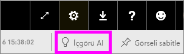

# Power BI ile veri kümenizden otomatik veri içgörüleri oluşturma
Yeni bir veri kümeniz var ve keşfetmeye nereden başlayacağınızı bilemiyor musunuz?  Hızla bir pano mu oluşturmanız gerekiyor?  Gözünüzden kaçmış olabilecek öngörülere göz atmak mı istiyorsunuz?

Verilerinizi temel alan ilgi çekici görselleştirmeler oluşturmak için hızlı içgörüler çalıştırın. Bu makalede bir veri kümesinin tamamında hızlı içgörü (hızlı içgörüler) çalıştırma adımları verilmiştir. İsterseniz [belirli bir pano kutucuğunu temel alan hızlı içgörüler ](../consumer/end-user-insights.md) (kapsamlı içgörüler) de çalıştırabilirsiniz. Bir öngörü üzerinde bile hızlı öngörüler çalıştırabilirsiniz!

> [!NOTE]
> İçgörüler DirectQuery ile birlikte çalışmaz. Yalnızca Power BI’a yüklenmiş olan verilerle birlikte çalışır.
> 

İçgörü özelliği, Microsoft Research ekibi tarafından sürekli olarak geliştirilen [gelişmiş analitik algoritmaları](../consumer/end-user-insight-types.md) temel alır. İnsanların verileriyle ilgili içgörülere yeni ve sezgisel bir şekilde ulaşmasına yardımcı olmak için bu algoritmaları kullanmaya devam ediyoruz. [Verilerinizi hızlı içgörüler için iyileştirmeyi](service-insights-optimize.md) öğrenmek de isteyebilirsiniz.

## Bir veri kümesi üzerinde hızlı öngörüler çalıştırma
Bir veri kümesi üzerinde hızlı içgörüler çalıştıran ve içgörülerden birini Odak modunda açan Amanda'yı izleyin. Amanda, içgörüyü panoya kutucuk olarak sabitleyip pano kutucuğuyla ilgili içgörüler alıyor.

<iframe width="560" height="315" src="https://www.youtube.com/embed/et_MLSL2sA8" frameborder="0" allowfullscreen></iframe>

Şimdi sıra sizde. [Tedarikçi Kalite Analizi örneğini](sample-supplier-quality.md) kullanarak içgörüleri keşfedin.

1. **Veri Kümeleri** sekmesinden **Diğer seçenekler** (...) ve sonra **Hızlı içgörüler alın**’ı seçin.
   
    
   
    
2. Power BI [çeşitli algoritmalar](../consumer/end-user-insight-types.md) kullanarak veri kümenizdeki eğilimleri arar.
   
    
3. Öngörüleriniz saniyeler içinde hazır duruma gelir.  Görselleştirmeleri görüntülemek için **Öngörüleri görüntüle**'yi seçin.
   
    
   
    > [!NOTE]
    > Bazı veri kümelerindeki veriler istatistiksel olarak önemsiz olduğundan bu veri kümelerinde içgörü oluşturulamaz.  Daha fazla bilgi için bkz. [Verilerinizi öngörüler için en iyi duruma getirme](service-insights-optimize.md).
    > 
    
4. Görselleştirmeler, en fazla 32 ayrı öngörü kartını destekleyen özel bir **Hızlı Öngörüler** tuvalinde görüntülenir. Her kartta bir grafik veya graf ile kısa bir açıklama bulunur.
   
    

## Öngörü kartlarıyla etkileşim kurma

1. Kartlardan birinin üzerine gelin ve görselleştirmeyi bir panoya eklemek için raptiye simgesini seçin.

2. Bir kartın üzerine gelin, **Diğer seçenekler** (...) ve sonra **İçgörüleri görüntüle**’yi seçin. 

    İçgörü ekranı Odak modunda açılır.
   
    
3. Odak modunda şunları yapabilirsiniz:
   
   * Görselleştirmeleri filtreleyebilirsiniz. **Filtreler** bölmesi zaten açık değilse, pencerenin sağ tarafındaki oku seçerek genişletin.

       
   * **Görseli sabitle**'yi seçerek içgörü kartını bir panoya sabitleyebilirsiniz.
   * İçgörüyü kart üzerinde çalıştırın. Bu durum genellikle *kapsama alınmış içgörüler* olarak adlandırılır. Sağ üst köşede, ampul simgesini  veya **İçgörü al**’ı seçin.
     
       
     
     Sol tarafta içgörü görüntülenir. Yalnızca bu tek içgörüdeki verileri temel alan yeni kartlar sağ tarafta görüntülenir.
     
       
4. Özgün öngörü tuvaline geri dönmek için sol üst köşedeki **Odak modundan çık**'ı seçin.

## Sonraki adımlar
- Bir veri kümesine sahipseniz [bu veri kümesini Hızlı İçgörüler için en iyi duruma getirebilirsiniz](service-insights-optimize.md).
- [Kullanılabilir Hızlı İçgörü türleri](../consumer/end-user-insight-types.md) hakkında bilgi edinin.

Başka bir sorunuz mu var? [Power BI Topluluğu'na başvurun](https://community.powerbi.com/).
