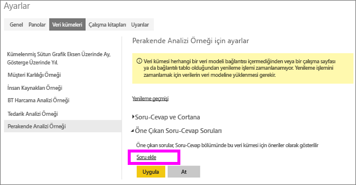
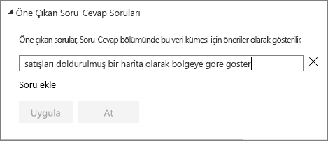
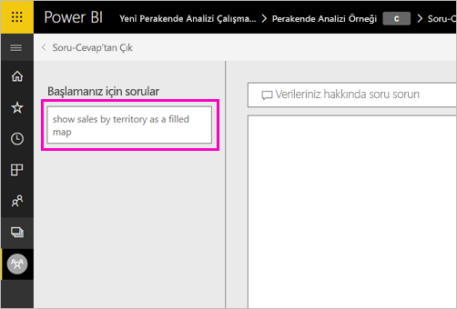
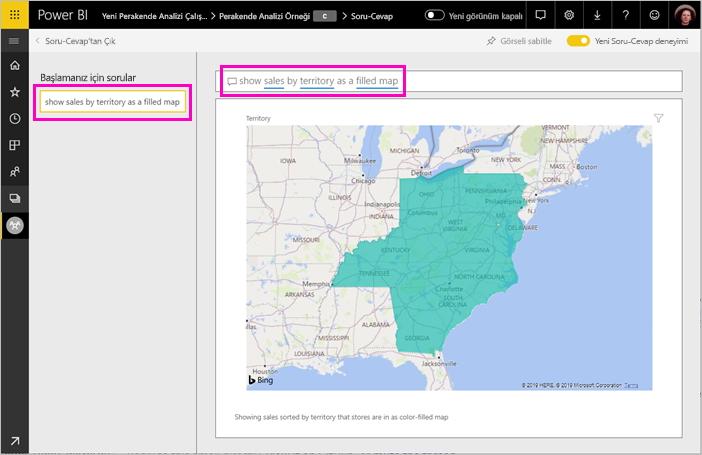

# Power BI Soru-Cevap için öne çıkan sorular oluşturma
Bir veri kümeniz varsa kendi öne çıkan sorularınızı bu veri kümesine ekleyebilirsiniz. Power BI Soru-Cevap, bu veri kümesine göre raporlar kullanan iş arkadaşlarınıza bu soruları gösterir.  Öne çıkan sorular, iş arkadaşlarınıza bir veri kümesi ile ilgili sorabilecekleri soru türleri hakkında fikirler verir. Ne tür öne çıkan sorular ekleyeceğiniz size bağlıdır; sık kullanılan sorular, ilgi çekici sonuçlar görüntüleyen sorular veya uygun şekilde ifade etmesi zor olabilecek sorular sorabilirsiniz.

> [!NOTE]
> Soru-Cevap öne çıkan soruları, [iPad, iPhone ve iPod Touch cihazlarında iOS için Microsoft Power BI uygulamasında](../consumer/mobile/mobile-apps-ios-qna.md) ve Power BI Desktop Soru-Cevap'ta kullanılabilir. Soru oluşturma seçeneği yalnızca Power BI hizmetinde (app.powerbi.com) mevcuttur.
> 

## Öne çıkan soru oluşturma

Bu makalede [Perakende Analizi örneği](sample-datasets.md) kullanılacaktır. Bir veri kümesini kendiniz keşfetmeyi denemek için bu adım adım yönergeleri izleyin.

1. Panoda Soru-Cevap soru kutusunu seçin.   Soru-Cevap bölümünde, veri kümesinde görünen terimlerin yer aldığı faydalı bir listenin görüntülendiğini fark edersiniz.
2. Bu listeye ekleme yapmak için PowerBI'ın sağ üst köşesindeki dişli simgesini seçin.  
   
3. **Ayarlar** &gt; **Veri kümeleri** &gt; **Retail Analysis Sample** &gt; **Öne Çıkan Soru-Cevap soruları** seçeneğini belirleyin.  
4. **Soru ekle**'yi seçin.
   
   
5. Sorunuzu metin kutusuna yazdıktan sonra **Uygula**'yı seçin.   İsteğe bağlı olarak **Soru ekle**'yi seçip başka bir soru daha ekleyebilirsiniz.  
   
6. Power BI Retail Analysis Sample panosuna geri gidin ve imlecinizi Soru-Cevap soru kutusuna yerleştirin.   
   
7. Yeni eklenen **Sales by territory as a map** (Harita olarak bölgeye göre satışlar) öne çıkan sorusunun ilk sırada olduğunu görürsünüz. Kalem simgesini seçin.  
8. Power BI yanıtı oluşturur ve kartogram görselleştirmesi olarak görüntüler.  
   

## Sonraki adımlar

- [Tüketiciler için Soru-Cevap](../consumer/end-user-q-and-a.md)  
- [Panolarda ve raporlarda Soru-Cevap kullanma](power-bi-tutorial-q-and-a.md)  
- [Power BI hizmetinde tasarımcılara yönelik temel kavramlar](../fundamentals/service-basic-concepts.md)  

Başka bir sorunuz mu var? [Power BI Topluluğu'na başvurun](https://community.powerbi.com/)
