# Power BI hizmetinde Excel dosyasından rapor oluşturma
[Power BI'daki raporlar](../consumer/end-user-reports.md) başlıklı makaleyi okudunuz ve artık kendi raporlarınızı oluşturmak isteyebilirsiniz. Rapor oluşturmanın farklı yolları vardır. Bu makalede, Power BI hizmetinde bir Excel dosyasından temel bir rapor oluşturarak başlayacağız. Rapor oluşturmanın temeli anladıktan sonra, raporlara yönelik daha gelişmiş konu başlıkları için [sonraki adımlara](#next-steps) göz atın.  

## Önkoşullar
- [Power BI hizmetine kaydolma](../fundamentals/service-self-service-signup-for-power-bi.md). 
- [Perakende Analizi Örneği adlı Excel dosyasını indirin](https://go.microsoft.com/fwlink/?LinkId=529778) ve bunu OneDrive İş'e veya yerel bir konuma kaydedin.

## Excel dosyasını içeri aktarma
Bu rapor oluşturma yöntemi için bir dosya ve boş bir tuval ile başlayacağız. Siz de Perakende Analizi Örneği Excel dosyasıyla takip edebilirsiniz.

1. Gezinti bölmesinde **Çalışma Alanım**’ı seçin.
   
   :::image type="content" source="media/service-report-create-new/power-bi-select-my-workspace.png" alt-text="Çalışma Alanım seçeneğini belirleme işleminin ekran görüntüsü.":::
2. Gezinti bölmesinin alt kısmından **Veri al**'ı seçin.
   
   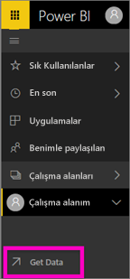
3. **Dosyalar**'ı seçin ve Retail Analysis Sample dosyasını kaydettiğiniz konuma gidin.
   
    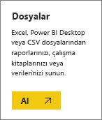
4. Bu alıştırma için **İçeri aktar** seçeneğini belirleyin.
   
   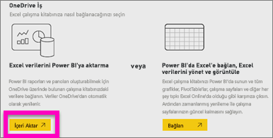
5. **Aç**’ı seçin.

   Excel dosyası içeri aktarıldıktan sonra çalışma alanı listesinde *veri kümesi* olarak listelenir.

1. Veri kümesinin yanındaki **Diğer seçenekler (...)** menüsünü ve ardından **Rapor oluştur**'u seçin.
   
   :::image type="content" source="media/service-report-create-new/power-bi-dataset-create-report.png" alt-text="Rapor oluştur seçeneğinin ekran görüntüsü.":::
6. Rapor düzenleyicisi açılır. 
   
   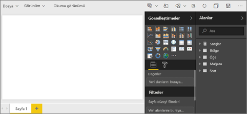

> [!TIP]
> Menü simgesini seçerek gezinti bölmesini gizleyip kendinize yer açın.
> 
> :::image type="content" source="../media/power-bi-hide-navigation-pane.png" alt-text="Menü simgesini seçerek gezinti bölmesini gizleme adımının ekran görüntüsü.":::

## Rapora Radyal Ölçer ekleme
Veri kümemiz içeri aktarıldığına göre bazı soruları yanıtlamaya başlayalım.  Pazarlama Müdürümüz (CMO) bu yılki satış hedeflerimize ne kadar yaklaştığımızı öğrenmek istiyor. Bu tür bilgilerin görüntülenmesi için Ölçer, [iyi bir görselleştirme seçimi](../visuals/power-bi-report-visualizations.md) olacaktır.

1. Alanlar bölmesinde **Sales** > **This Year Sales** > **Değer** seçeneğini belirleyin.
   
    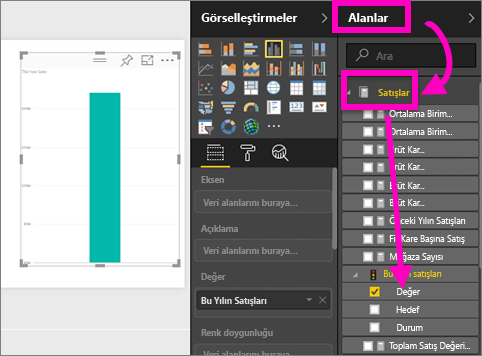
2. **Görselleştirmeler** bölmesinden Ölçer şablonunu  seçerek görseli bir Ölçere dönüştürün.
   
    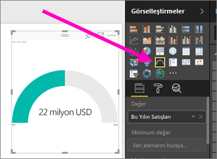
3. **Sales** > **This Year Sales** > **Hedef** alanını **Hedef değer** kutusuna sürükleyin. Hedefimize çok yakın olduğumuzu görüyoruz.
   
    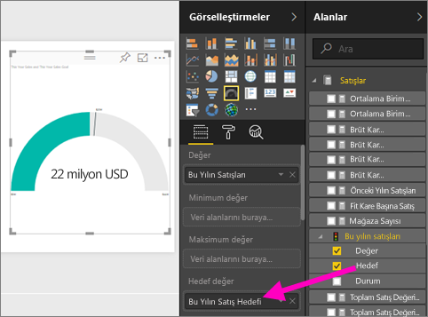
4. Şimdi raporunuzu kaydedebilirsiniz.
   
   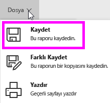

## Rapora alan grafiği ve dilimleyici ekleme
Pazarlama müdürümüzün birkaç sorusuna daha yanıt bulmamız gerekiyor. Pazarlama müdürümüz, bu yıla ait satış verileriyle bir önceki yıla ait verileri karşılaştırmamızı istiyor. Ayrıca, sonuçları bölge temelinde görmek istiyor.

1. Öncelikle tuvalde biraz yer açalım. Ölçer görselleştirmesini seçin ve sağ üst köşeye taşıyın. Ardından, köşelerden birini tutup sürükleyerek görseli küçültün.
2. Ölçerin seçimini kaldırın. Alanlar bölmesinde **Sales** > **This Year Sales** > **Değer** ve ardından **Sales** > **Last Year Sales** seçeneğini belirleyin.
   
    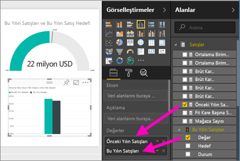
3. **Görselleştirmeler** bölmesinden Alan grafiği şablonunu  seçerek görseli bir Alan grafiğine dönüştürün.
4. **Eksen** kutusuna eklemek üzere **Time** > **Period** seçeneğini belirleyin.
   
    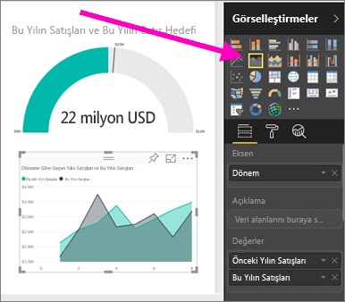
5. Görselleştirmeyi zaman aralığına göre sıralamak için üç noktayı seçin ve **Döneme Göre Sırala** seçeneğini belirleyin.
6. Şimdi de dilimleyiciyi ekleyelim. Tuvalde boş bir alanı ve sonra Dilimleyici  şablonunu seçin. Artık tuvalimizde boş bir dilimleyici var.
   
        
7. Alanlar bölmesinde **District** > **District** seçeneğini belirleyin. Dilimleyiciyi taşıyın ve yeniden boyutlandırın.
   
    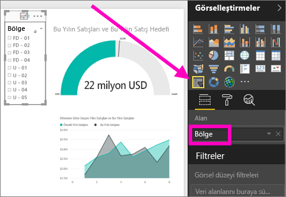  
8. Bölgeye göre belirli desenler ve öngörüler bulmak için dilimleyiciyi kullanın.
   
     

Verilerinizi keşfetmeye ve görsel öğeleri eklemeye devam edin. Özellikle ilgi çekici bilgiler bulduğunuzda [panoya sabitleyin](service-dashboard-pin-tile-from-report.md).

## Sonraki adımlar

* [Görselleştirmeleri bir panoya sabitleme](service-dashboard-pin-tile-from-report.md)
* [Power BI hizmetinde rapor ayarlarını değiştirme](power-bi-report-settings.md)
* Başka bir sorunuz mu var? [Power BI Topluluğu'na başvurun](https://community.powerbi.com/)
