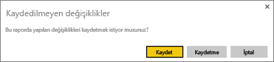
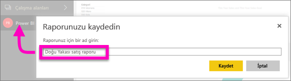

# Power BI hizmetinde ve Power BI Desktop'ta rapor kaydetme
Bir Power BI raporunda değişiklik yaptıktan sonra raporu kaydedebilir, yeni bir adla kaydedebilir veya değişikliklerinizi kaydetmeden kapatabilirsiniz. Raporu açtığınızı, bir görselleştirme oluşturduğunuzu ve panonuza sabitlediğinizi düşünelim. Değişikliklerinizi kaydetmeden kapatırsanız kutucuk panoda kalır ancak görselleştirme rapora kaydedilmez. Panodaki kutucuğa tıkladığınızda rapor açılır ancak görselleştirme raporda bulunmaz.

> [!TIP]
> Kaydedilen raporu bulabilmek için hangi çalışma alanının etkin olduğuna dikkat edin. Rapor etkin çalışma alanına kaydedilir.
> 
> 

### Bir raporu kaydetmek için:
1. Bir raporun dışındaki bir alanı seçtiğinizde raporda değişiklik yapıldıysa Power BI bir istem görüntüler.
   
   
2. Raporu kaydetmek için **DOSYA** \> **Kaydet** veya **Farklı Kaydet** yolunu da izleyebilirsiniz. [Okuma görünümü](../consumer/end-user-reading-view.md) açıksa yalnızca Farlı Kaydet seçeneği görüntülenir. 
   
   
3. Rapor yeniyse (Kaydet) veya var olan bir raporun yeni sürümüyse (Farklı kaydet) açıklayıcı bir ad verin.  **Rapor, etkin çalışma alanına kaydedilir**.
   
    

### Sonraki adımlar
[Power BI'daki raporlar](../consumer/end-user-reports.md) hakkında daha fazla bilgi edinin

[Power BI hizmetinde tasarımcılara yönelik temel kavramlar](../fundamentals/service-basic-concepts.md)

Başka bir sorunuz mu var? [Power BI Topluluğu'na başvurun](https://community.powerbi.com/)
