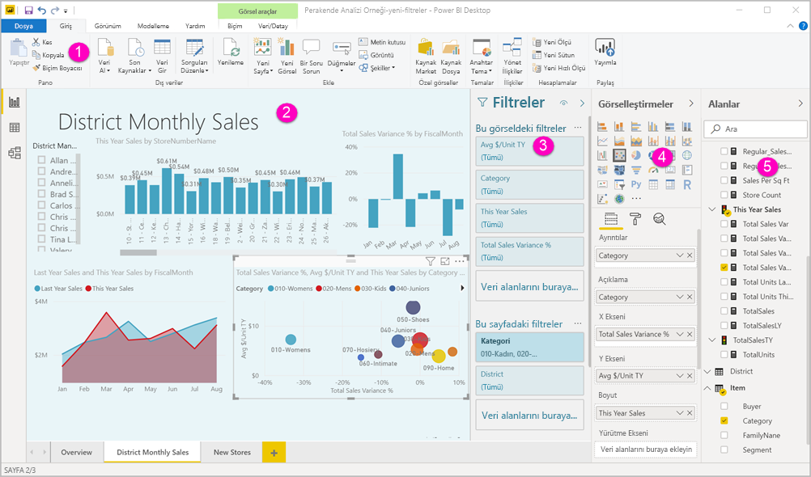
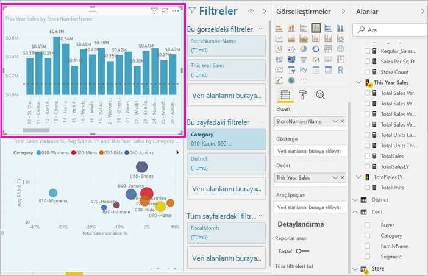
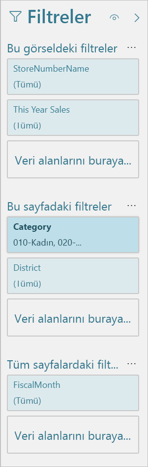
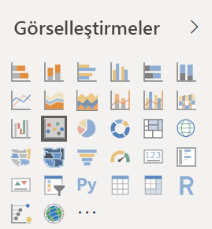
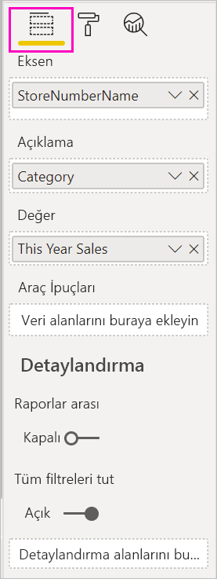
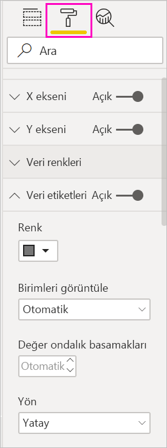
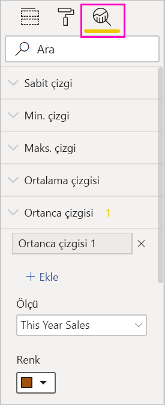
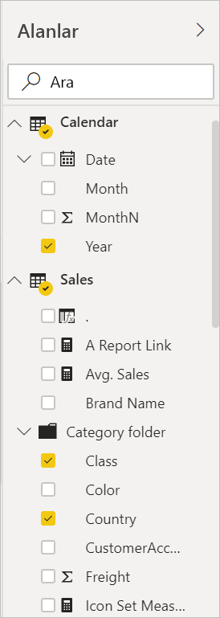

# Power BI'da rapor düzenleyicisi turu

Power BI Desktop'ta ve Power BI hizmetinde *rapor düzenleyicisi*, grafikler, tablolar, haritalar ve diğer görsellerle müşterilerinizin gördüğü raporları tasarladığınız yerdir. Bu düzenleyici iki ortamda da benzerdir. Genellikle başlangıç olarak Power BI Desktop'ta bir rapor oluşturursunuz. Ardından bunu Power BI hizmetine yayımlarsınız ve burada raporda değişiklik yapmaya devam edebilirsiniz. Raporlarınızı temel alan panoları da Power BI hizmetinde oluşturursunuz.

Panolarınızla raporlarınızı oluşturduktan sonra, bunları rapor tüketicilerinize dağıtırsınız. Nasıl paylaştığınıza bağlı olarak son kullanıcılarınız bunlarla Power BI hizmetinde Okuma görünümünde etkileşimli çalışabilir ama bunları düzenleyemez. [Power BI hizmetinde rapor kullanıcılarının yapabilecekleri](../consumer/end-user-reading-view.md) hakkında daha fazla bilgi edinin. 

Bu videoda, Power BI Desktop'taki rapor düzenleyicisi gösterilir. Bu makalede Power BI Desktop'taki rapor düzenleyicisi de gösterilir. 

<iframe width="560" height="315" src="https://www.youtube.com/embed/IkJda4O7oGs" frameborder="0" allowfullscreen></iframe>

Power BI hizmetinde rapor düzenleyicisi yalnızca Düzenleme Görünümünde kullanılabilir. Raporu Düzenleme görünümünde açmak için raporun sahibi, raporu oluşturan kişi veya raporun barındırıldığı çalışma alanına katkıda bulunan bir kullanıcı olmalısınız.

Power BI rapor düzenleyicisi birkaç ana bölüme ayrılır:  

1. Şerit
1. Rapor tuvali
1. Filtreler bölmesi
1. Görselleştirmeler bölmesi
1. Alanlar bölmesi

## 1. Şerit
Şeritten birçok farklı eylem gerçekleştirilebilir ve sürekli olarak bu eylemlere yenileri eklenmektedir. Belirli bir eylem hakkında bilgi edinmek için Power BI belgelerinin içindekiler tablosunu veya Arama kutusunu kullanın.

## 2. Rapor tuvali
Rapor tuvali, çalışmanızın görüntülendiği yerdir. Alanlar, Filtreler ve Görsel Öğeler bölmelerini kullanarak oluşturduğunuz görseller rapor tuvalinizde oluşturulur ve görüntülenir. Tuvalin en alt bölümündeki her sekme raporun bir sayfasına karşılık gelir. Açmak istediğiniz sayfaya ait sekmeyi seçebilirsiniz. 

## Rapor düzenleyicisi bölmeleri

Raporu ilk kez açtığınızda üç bölme görünür: Filtreler, Görsel Öğeler ve Alanlar. Sol taraftaki ilk iki bölme (Filtreler ve Görsel Öğeler) görselleştirmelerinizin nasıl görüneceğini, türünü, renklerini, filtrelemesini ve biçimlendirmesini denetler. Sağ taraftaki son bölme (Alanlar) ise görselleştirmelerde kullanılan temel verileri yönetir. Rapor düzenleyicisinde görüntülenen içerik, rapor tuvalinde yaptığınız seçimlere göre değişiklik gösterir. 

Örneğin, bu sütun grafiği gibi tek bir görsel seçtiğinizde:

**Filtreler bölmesinde** görseldeki, sayfadaki veya tüm sayfalardaki filtreler görüntülenir. Bu örnekte sayfa düzeyi filtreleri vardır ama görsel düzeyi filtreleri yoktur.

**Görsel Öğeler bölmesinin en üst kısmında** kullanılan görselin türü belirlenir. Bu örnekte Kümelenmiş sütun grafik kullanılmaktadır. 

**Görsel Öğeler bölmesinin en altında** üç sekme vardır:

 **Alanlar** görseldeki alanları görüntüler. Tüm ayrıntıları görmek için ekranı aşağı kaydırmanız gerekebilir. Bu grafikte StoreNumberName ve This Year Sales kullanılmaktadır.

 **Biçim** Seçilen görselleştirmeye ilişkin biçim bölmesini görüntülemek için boya rulosu simgesini seçin.

 **Analiz** Analiz bölmesini görüntülemek için büyüteç simgesini seçin.

**Alanlar bölmesi** veri modelindeki tüm kullanılabilir tabloları listeler. Bir tabloyu genişlettiğinizde o tablodaki alanları görürsünüz. Sarı onay işareti, tablodaki alanlardan en az birinin görselleştirmede yer aldığını anlamanızı sağlar.

Bölmeler hakkındaki ayrıntılar için okumaya devam edin.

## 3. Filtreler bölmesi
Raporunuzda sayfa, rapor, detaylandırma ve görsel öğe düzeyinde kalıcı filtreler görüntülemek, ayarlamak ve değiştirmek için Filtreler bölmesini kullanın. Evet, görsellerin öğelerini seçerek ya da dilimleyici gibi araçlar kullanarak rapor sayfalarında ve görsel öğelerde geçici filtreleme yapabilirsiniz. Filtreler bölmesinde filtrelemenin, filtrelerin durumunu raporla birlikte kaydetme gibi bir avantajı vardır. 

Filtreler bölmesinin bir diğer güçlü özelliği, *henüz raporunuzdaki görsellerden biri tarafından kullanılmayan* bir alan kullanarak filtreleme yapabilmenizdir. Biraz açıklayayım. Bir görselleştirme oluşturduğunuzda, Power BI görselleştirmedeki tüm alanları Filtreler bölmesinin görsel düzeyi filtreleri alanına otomatik olarak ekler. O sırada bir görselleştirmede kullanılmayan bir alanı kullanarak görsel, sayfa, detaylandırma veya rapor filtresi ayarlamak istiyorsanız, ilgili öğeyi Filtreler demetlerinden birine sürüklemeniz yeterlidir.

Yeni filtre deneyimi daha fazla esneklik getirir. Örneğin filtreleri raporun kendisine benzeyecek şekilde biçimlendirebilirsiniz. Ayrıca filtreleri kilitleyebilir veya rapor tüketicilerinden gizleyebilirsiniz. 

[Yeni filtre deneyimi](power-bi-report-filter.md) hakkında daha fazla bilgi edinin.

## 4. Görsel Öğeler bölmesi

Görsel Öğeler bölmesinin dört bölümü vardır. Biz en üstteki bölmeden başlayalım.

Burada görselleştirme türünü seçebilirsiniz. Küçük simgeler, oluşturabileceğiniz farklı görselleştirme türlerini gösterir. Yukarıdaki resimde kabarcık grafiği seçilmiştir. Önce görselleştirme türü seçmeden alanları seçerek bir görselleştirme oluşturmaya başlarsanız, Power BI görselleştirme türünü sizin yerinize seçer. Power BI tarafından yapılan seçimi tutabilir veya farklı bir simge seçerek türü değiştirebilirsiniz.

Power BI Desktop'a özel görselleştirmeler indirebilirsiniz. Bunların simgeleri de bu bölmede gösterilir. 

### Görselleştirmedeki alanları yönetme

Bu bölmedeki demetler (bazen *kutu* olarak da adlandırılır) seçtiğiniz görselleştirme türüne göre değişiklik gösterir.  Örneğin çubuk grafik seçtiyseniz Eksen, Gösterge ve Değerler'i görürsünüz. Bir alanı seçtiğinizde veya tuvale sürüklediğinizde Power BI ilgili alanı demetlerden birine ekler.  Dilerseniz Alanlar listesindeki alanları doğrudan demetlerin içine sürükleyebilirsiniz.  Bazı demetler yalnızca belirli veri türlerinde kullanılabilir.  Örneğin, **Değerler** demeti, sayısal olmayan alanlarla kullanılamaz. **Kategori** alanını **Değerler** demetine sürüklerseniz Power BI bunu **Kategori Sayısı** olarak değiştirir.

Daha fazla bilgi için bkz. [Power BI raporuna görselleştirme ekleme](../visuals/power-bi-report-add-visualizations-i.md).

Bölmenin bu kısmında [detaylandırmayı](desktop-drillthrough.md) ve filtre davranışını denetleyen seçenekler de vardır.

### Görsellerinizi biçimlendirme
Biçimlendirme bölmesini açmak için boya rulosu simgesini seçin. Kullanılabilir seçenekler, seçtiğiniz görselleştirme türüne göre değişiklik gösterir.

Çok zengin biçimlendirme seçenekleri sağlanır.  Daha fazla bilgi edinmek için kendiniz keşfedin veya şu makaleleri ziyaret edin:

* [Görselleştirme başlığını, arka planını ve göstergesini özelleştirme](../visuals/power-bi-visualization-customize-title-background-and-legend.md)
* [Renk biçimlendirme](../visuals/service-getting-started-with-color-formatting-and-axis-properties.md)
* [X ve Y ekseni özelliklerini özelleştirme](../visuals/power-bi-visualization-customize-x-axis-and-y-axis.md)

### Görselleştirmelerinize analiz ekleme
Analiz bölmesini görüntülemek için büyüteç simgesini seçin. Kullanılabilir seçenekler, seçtiğiniz görselleştirme türüne göre değişiklik gösterir.

Power BI hizmetindeki Analiz bölmesini kullanarak görselleştirmelere dinamik başvuru çizgileri ekleyebilir ve önemli eğilimlere veya içgörülere odaklanılmasını sağlayabilirsiniz. Daha fazla bilgi edinmek için bkz. [Power BI Desktop'taki Analiz bölmesi](../transform-model/desktop-analytics-pane.md).

## 5. Alanlar bölmesi
Alanlar bölmesinde, verilerinizde bulunan ve görselleştirme oluşturmak için kullanabileceğiniz tablolar, klasörler ve alanlar görüntülenir.

:::row:::
    :::column:::
        
    :::column-end:::
    :::column:::
        <ul><li>Yeni bir görselleştirme başlatmak için alanlardan birini sayfaya sürükleyin.  Dilerseniz bir alanı, var olan bir görselleştirmenin üzerine sürükleyerek görselleştirmeye ekleyebilirsiniz.  </li> <li>Bir alanın yanındaki onay kutusunu işaretlediğinizde Power BI, ilgili alanı etkin (veya yeni) görselleştirmeye ekler. Ayrıca söz konusu alanın yerleştirileceği demeti de belirler.  Örneğin, eklediğiniz alan bir açıklama, eksen veya değer olabilir. Power BI en iyi tahmini yapar ve gerekirse söz konusu alanı, belirlenen demetten bir başkasına taşıyabilirsiniz.   </li><li>Her iki durumda da seçili alanlar, rapor düzenleyicisindeki Görsel Öğeler bölmesine eklenir.</li></ul>
    :::column-end:::
:::row-end:::

Power BI Desktop'ta alanları gösterme/gizleme ve hesaplama ekleme gibi seçeneklere de sahip olursunuz.

## Alan simgeleri

Power BI rapordaki alanların türünü belirtmek için bir dizi farklı simge kullanır. Bunları tanıdığınızda farklı görsellerde nasıl davrandıklarını daha iyi anlarsınız. Tam kapsamlı liste için [Power BI Desktop’ta Alan listesini kullanma sayfasının Alan listesi simgeleri bölümüne](../transform-model/desktop-field-list.md#field-list-changes) bakın.

## Sonraki adımlar
[Rapor oluşturma](service-report-create-new.md)

[Power BI hizmeti](service-report-create-new.md), [Power BI Desktop](desktop-report-view.md) ve [Power BI mobil uygulamalarında](../consumer/mobile/mobile-apps-view-phone-report.md) raporlar hakkında daha fazla bilgi.

[Power BI tasarımcıları için temel kavramlar](../fundamentals/service-basic-concepts.md)

Başka bir sorunuz mu var? [Power BI Topluluğu'na başvurun](https://community.powerbi.com/)
