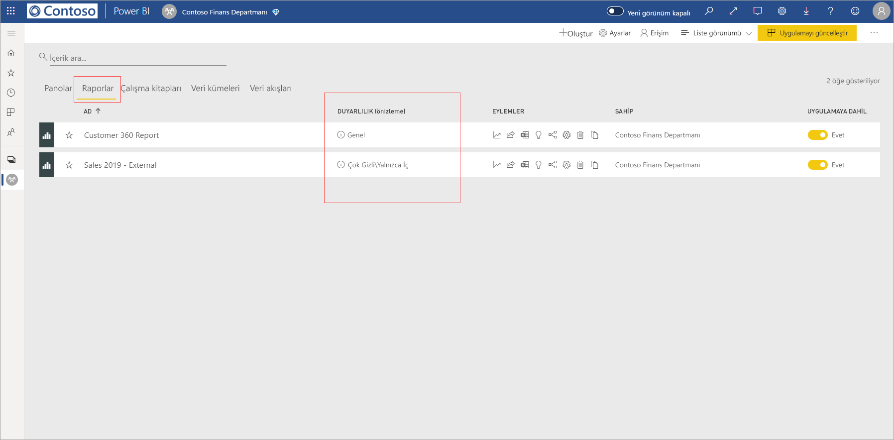
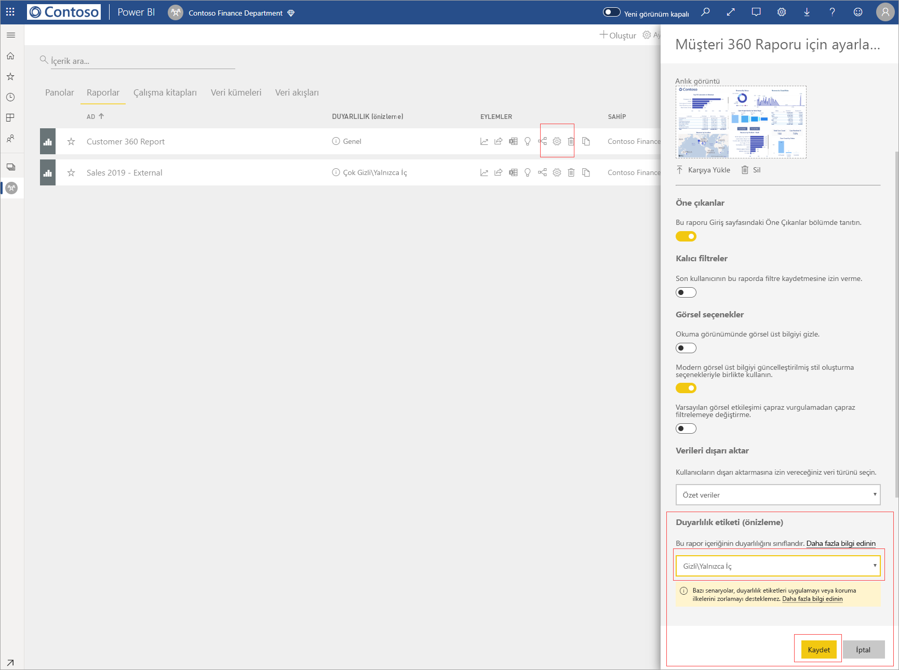
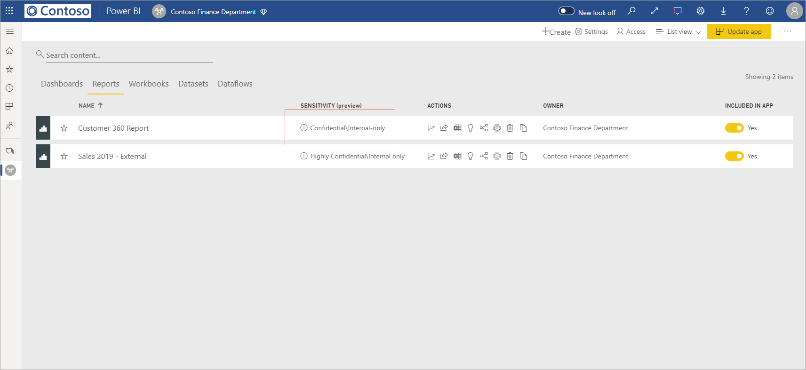
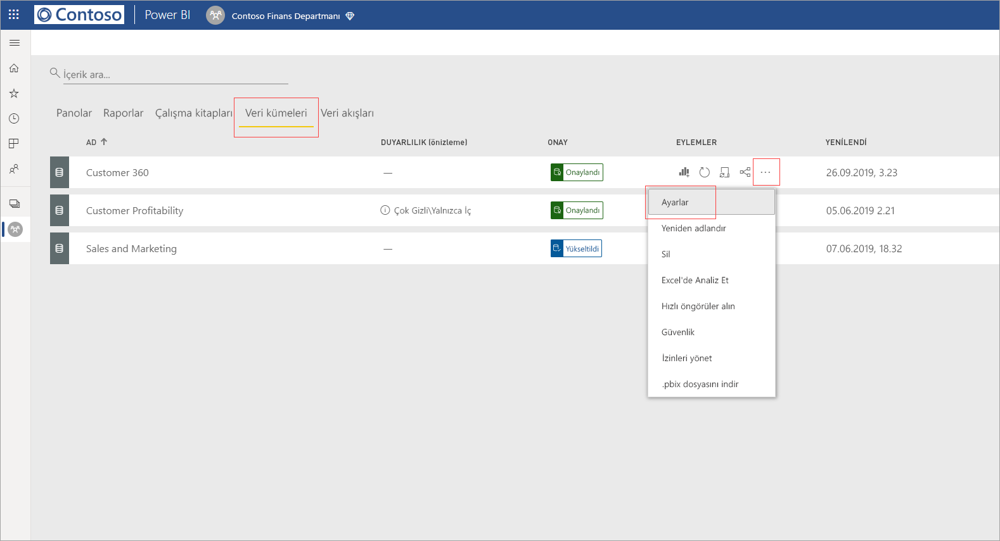
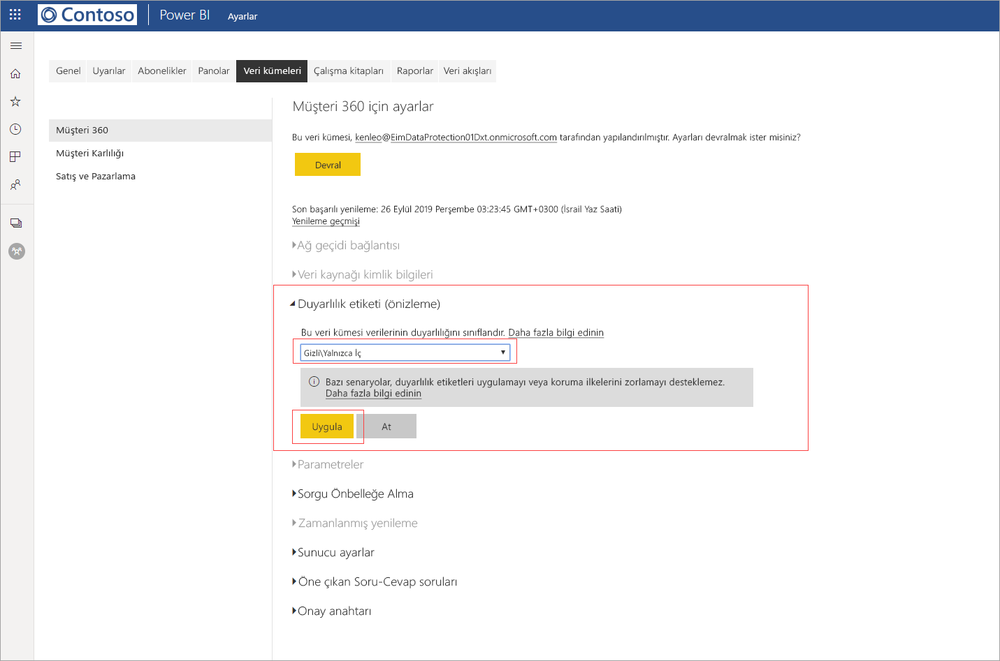
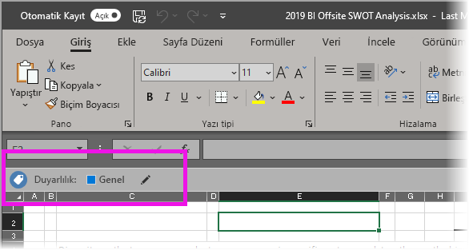

# Power BI'da veri duyarlılığı etiketlerini uygulama (önizleme)

Power BI hizmetinde duyarlılık etiketleri etkinleştirildiğinde panolarınızı, raporlarınızı, veri kümelerinizi ve veri akışlarınızı veri duyarlılık etiketleri uygulayarak yetkisiz erişime ve sızıntıya karşı koruyabilirsiniz. Verilerinize veri duyarlılık etiketlerinin doğru şekilde uygulanması, verilerinize yalnızca yetkili kişilerin erişebilmesini sağlar.

Veri koruma etkin olduğunda panolar, raporlar, veri kümeleri ve veri akışlarının liste görünümünün duyarlılık sütununda duyarlılık etiketleri görünür.

> [!NOTE]
> Power BI panolarına, raporlarına, veri kümelerine ve veri akışlarına duyarlılık etiketleri uygulamak için belirli lisanslar ve izinler gerekir. Ayrıntılar için bkz. [Duyarlılık etiketleri uygulama](#applying-sensitivity-labels).

## Duyarlılık etiketleri uygulama

Power BI’da duyarlılık etiketleri uygulamak için sizin ve kuruluşunuzun aşağıdaki gereksinimleri karşılamış olması gerekir:

* Kuruluşunuz [Microsoft 365 güvenlik merkezi](https://security.microsoft.com/) ya da [Microsoft 365 uyumluluk merkezi](https://compliance.microsoft.com/) içinde duyarlılık etiketleri tanımlamış olmalıdır.
* [Power BI’da veri duyarlılık etiketlerini etkinleştirme (Önizleme)](../admin/service-security-enable-data-sensitivity-labels.md#enable-data-sensitivity-labels) makalesinde açıklandığı gibi, veri duyarlılığı etiketlerini uygulama izinleri olan bir güvenlik grubuna dahil olmanız gerekir.
* Bir Power BI Pro lisansına ve etiketlemek istediğiniz kaynaklar üzerinde Düzenleme izinlerine sahip olmanız gerekir. 
* Bir Azure Information Protection Premium P1 veya Premium P2 lisansına sahip olmanız gerekir. Microsoft Azure Information Protection tek başına ya da Microsoft lisanslama paketlerinden biri aracılığıyla satın alınabilir. Ayrıntılı bilgi için [Azure Information Protection fiyatlandırmasına](https://azure.microsoft.com/pricing/details/information-protection/) bakın.

Bir rapora duyarlılık etiketi uygulamak veya duyarlılık etiketini değiştirmek için, çalışma alanı liste öğesinde rapor ayarları simgesine tıklayın ve ardından ayarlar yan bölmedeki veri duyarlılığı bölümüne gidin. Uygun duyarlılık etiketini seçin ve ayarları kaydedin.

Güncelleştirilmiş duyarlılık etiketi, duyarlılık sütununda görünür. 

Bir panoya duyarlılık etiketi uygulamak veya duyarlılık etiketini değiştirmek, raporlar için açıklanan işlemin aynısını izler. 

Ayrıca, veri kümelerinde ve veri akışlarında da duyarlılık etiketleri ayarlayabilirsiniz. Aşağıdaki görüntüde bir veri kümesi üzerinde duyarlılık etiketi ayarlama işlemi gösterilmektedir. Veri akışlarına yönelik adımlar da benzerdir.

Bir veri kümesinde duyarlılık etiketi ayarlamak için veri kümeleri sekmesini seçin, etiket uygulamak istediğiniz veri kümesinin üzerindeki üç noktaya tıklayın ve **Ayarları**'ı seçin.

Veri kümesinin ayarlar sayfasında duyarlılık etiketi bölümünü açın, istediğiniz duyarlılık etiketini seçin ve **Uygula**'ya tıklayın.

Bir veri akışına duyarlılık etiketi uygulamak veya duyarlılık etiketini değiştirmek, veri kümeleri için açıklanan işlemin aynısını izler.

## Dışarı aktarılmış dosyalarda veri koruması

Duyarlılık etiketi olan [bir rapordan verileri dışarı aktardığınızda](https://docs.microsoft.com/power-bi/consumer/end-user-export) duyarlılık etiketi, oluşturulan dosya (Excel, PowerPoint ve PDF. CSV desteklenmez) tarafından devralınır. Duyarlılık etiketi dosyada görünür olur ve dosyaya erişim, yeterli izinlere sahip olan kullanıcılarla sınırlandırılır.

## Önemli noktalar ve sınırlamalar

Veri duyarlılık etiketleri uygulanırken aşağıdaki noktalar göz önünde bulundurulmalıdır:

* Power BI’da Microsoft Azure Information Protection duyarlılık etiketlerini uygulamak ve görüntülemek için bir Azure Information Protection Premium P1 veya Premium P2 lisansı gerekir. Microsoft Azure Information Protection tek başına ya da Microsoft lisanslama paketlerinden biri aracılığıyla satın alınabilir. Ayrıntılı bilgi için [Azure Information Protection fiyatlandırmasına](https://azure.microsoft.com/pricing/details/information-protection/) bakın.
* Duyarlılık etiketleri yalnızca panolara, raporlara, veri kümelerine ve veri akışlarına uygulanabilir.
* Dışarı aktarılan dosyalar üzerinde etiket ve koruma denetimlerinin uygulanması yalnızca Excel, PowerPoint ve PDF dosyaları için desteklenir. Veriler .CSV dosyalarına, Abonelik e-postasına, Ekleme görsellerine ve çıktısına aktarıldığında etiket ve koruma uygulanmaz.
* Power BI’dan dosya aktaran kullanıcının, duyarlık etiketi ayarlarına uygun olarak bu dosyaya erişme ve dosyayı düzenleme izinleri vardır. Verileri dışarı aktaran kullanıcı, dosya üzerinde sahip izinleri almaz. 
* Duyarlılık etiketleri şu anda [sayfalandırılmış raporlar]( https://docs.microsoft.com/power-bi/paginated-reports-report-builder-power-bi) ve çalışma kitapları için kullanılamaz. 
* Bir etiket uygulandıktan sonra Power BI bir varlığından silemezsiniz.
* Power BI varlıkları üzerindeki duyarlılık etiketleri yalnızca çalışma alanı listesinde ve veri kökeni görünümlerinde görünür; etiketler şu anda sık kullanılanlar, benimle paylaşılan, son kullanılanlar veya uygulama görünümlerinde görünmemektedir. Ancak, görünür olmasa bile, Power BI varlığına uygulanmış bir etiketin Excel, PowerPoint ve PDF dosyalarına aktarılmış veriler üzerinde her zaman kalıcı olacağını unutmayın.
* [Microsoft 365 güvenlik merkezi](https://security.microsoft.com/) veya [Microsoft 365 uyumluluk merkezi](https://compliance.microsoft.com/) içinde yapılandırılmış *dosya Şifreleme ayarı* duyarlılık etiketi yalnızca Power BI’dan *dışarı aktarılmış* dosyalara uygulanır; Power BI *içinde* uygulanmaz.
* [HYOK koruması](https://docs.microsoft.com/azure/information-protection/configure-adrms-restrictions), Power BI’da uygulanan etiketler için desteklenmez.
* Office uygulamalarında etiketleri görüntülemek ve uygulamak için [lisanslama gereksinimleri](https://docs.microsoft.com/microsoft-365/compliance/sensitivity-labels-office-apps#subscription-and-licensing-requirements-for-sensitivity-labels) mevcuttur.
* Duyarlılık etiketleri yalnızca genel (ortak) buluttaki kiracılar için desteklenir. Duyarlılık etiketleri diğer bulutlardaki kiracılar için desteklenmez.

## Sonraki adımlar

Bu makalede, Power BI'da veri duyarlılık etiketlerini uygulama işlemi açıklanmıştır. Aşağıdaki makalelerde Power BI’da veri koruma hakkında daha fazla bilgi verilmektedir. 

* [Power BI’da veri korumasına genel bakış](../admin/service-security-data-protection-overview.md)
* [Power BI'da veri duyarlılığı etiketlerini etkinleştirme](../admin/service-security-enable-data-sensitivity-labels.md)
* [Power BI’da Microsoft Cloud App Security denetimlerini kullanma](../admin/service-security-using-microsoft-cloud-app-security-controls.md)