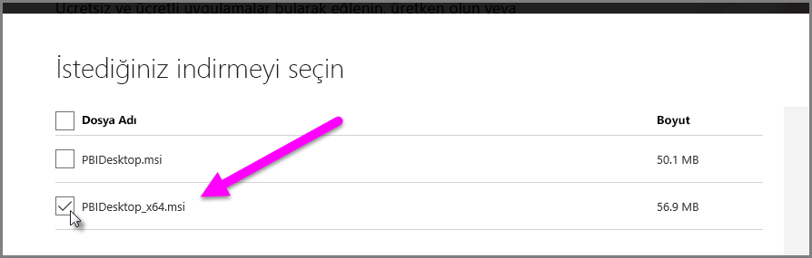

# Power BI Desktop'ta Access ve .XLS dosyalarını içeri aktarmaya ilişkin sorunlarını giderme
**Power BI Desktop**'ta hem **Access veritabanları** hem de **Excel çalışma kitaplarının** önceki sürümleri (Excel 97-2003 türünde .XLS dosyaları) *Access Veritabanı Altyapısı*'nı kullanır. Access Veritabanı Altyapısı'nın düzgün şekilde çalışmasını engelleyebilecek üç yaygın durum söz konusudur:

### 1. Durum: Access Veritabanı Altyapısı'nın yüklenmemiş olmaması
Power BI Desktop hata iletisi Access Veritabanı Altyapısı'nın yüklenmediğini belirtiyorsa Power BI Desktop sürümünüzle eşleşen (32 bit veya 64 bit) Access Veritabanı Altyapısı sürümünü yüklemeniz gerekir. Access Veritabanı Altyapısı'nı [indirmeler sayfasından](http://www.microsoft.com/en-us/download/details.aspx?id=13255) yükleyebilirsiniz.

>[!NOTE]
>Yüklenen Access Veritabanı Altyapısı bit sürümü Microsoft Office yüklemenizin bit sürümünden farklıysa Office uygulamaları, Access Veritabanı Altyapısı'nı kullanamaz.

### 2. Durum: Access Veritabanı Altyapısı bit sürümünün (32 bit veya 64 bit) Power BI Desktop bit sürümünüzden farklı olması
Bu durum genellikle Microsoft Office'in yüklenen sürümü 32 bit, yüklenen Power BI Desktop sürümü ise 64 bit olduğunda oluşur. Bunun tersi de söz konusu olabilir ve bir sürümü uyuşmazlığı her iki durumda da oluşur. (Office 365 aboneliği kullanıyorsanız farklı bir sorun ve bu sorunun çözümü için **3. Durum**'a bakın.) Aşağıdaki çözümlerden herhangi biri bit sürümü uyuşmazlığından kaynaklanan bu hatayı giderebilir:

1. Power BI Desktop'ın sürümünü Microsoft Office yüklemenizin bit sürümüyle eşleşecek şekilde değiştirin. Power BI Desktop'ın bit sürümünü değiştirmek için Power BI Desktop'ı kaldırın ve ardından Office yüklemenizle eşleşen Power BI Desktop sürümünü yükleyin. Bir Power BI Desktop sürümü seçmek için, masaüstüne yönelik indirme sayfasında **Gelişmiş yükleme seçenekleri**'ne tıklayın.
   
   
   
   Görünen indirme sayfasında dilinizi ve ardından **İndir** düğmesini seçin. Görünen ekranda 32 bit sürüm için PBIDesktop.msi onay kutusunu, 64 bit sürüm için ise PBIDesktop_x64.msi onay kutusunu işaretleyin. Aşağıdaki ekranda 64 bit sürüm seçilidir.
   
   
   
   >[!NOTE]
   >Power BI Desktop'ın 32 bit sürümü kullanılırken çok büyük veri modelleri oluşturduğunuz sırada yetersiz bellek sorunlarıyla karşılaşabilirsiniz.
2. Microsoft Office sürümünü Power BI Desktop yüklemenizin bit sürümüyle eşleşecek şekilde değiştirin. Microsoft Office'in bit sürümünü değiştirmek için Office'i kaldırın ve ardından Power BI Desktop yüklemenizle eşleşen Office sürümünü yükleyin.
3. Hata, bir .XLS dosyası (bir Excel 97-2003 çalışma kitabı) açılmaya çalışılırken oluştuysa .XLS dosyasını Excel'de açıp .XLSX dosyası olarak kaydederek Access Veritabanı Altyapısı'nı kullanmaktan kaçınabilirsiniz.
4. Önceki üç çözüm uygun değilse Access Veritabanı Altyapısı'nın iki sürümünü birden yüklemek de mümkündür ancak bu önerilen bir çözüm *değildir*. İki sürümü birden yüklemek Excel ve Power BI Desktop için bu Power Query sorununu giderse de Access Veritabanı Altyapısı'nın ilk yüklenen bit sürümünü otomatik olarak kullanan tüm uygulamalar için hatalara ve sorunlara neden olur. Access Veritabanı Altyapısı'nın her iki bit sürümünü birden yüklemek için her iki sürümü de [indirin](http://www.microsoft.com/en-us/download/details.aspx?id=13255) ve ardından */passive* anahtarını kullanarak bunları tek tek çalıştırın. Örneğin:
   
       c:\users\joe\downloads\AccessDatabaseEngine.exe /passive
   
       c:\users\joe\downloads\AccessDatabaseEngine_x64.exe /passive

### 3. Durum: Bir Office 365 aboneliğiyle Access veya .XLS dosyaları kullanılırken sorun yaşanması
Bir Office 365 aboneliği (**Office 2013** veya **Office 2016**) kullanıyorsanız Access Veritabanı Altyapısı sağlayıcısı *yalnızca* Office işlemlerinin erişebildiği sanal bir kayıt defteri konumuna kayıtlıdır. Sonuç olarak, bir Office işlemi olmayan Mashup Altyapısı (Office 365 Excel ve Power BI Desktop dışındaki çalıştırma işlemlerinden sorumludur) Access Veritabanı Altyapısı sağlayıcısını kullanamaz.

Bu durumu ortadan kaldırmak için Power BI Desktop yüklemenizin bit sürümüyle (bit sürümleri hakkında daha fazla bilgi için önceki bölümlere göz atın) eşleşen [Access Veritabanı Altyapısı yeniden dağıtılabilir paketini indirip yükleyin](http://www.microsoft.com/en-us/download/details.aspx?id=13255).

### İçeri aktarma sorunlarına neden olan diğer durumlar
Access veya .XLS dosyalarıyla ilgili mümkün olduğu kadar çok sayıda sorunu ele almak için elimizden geleni yapıyoruz. Bu makalede ele alınmayan bir sorunla karşılaşırsanız lütfen sonunla ilgili sorunuzu [Power BI Desteği](https://powerbi.microsoft.com/support/)'ne gönderin. Birçok müşteriyi etkileyebilecek sorunları düzenli olarak kontrol edip makalelerimizde bu sorunlara yer veriyoruz.

