# Power BI raporlarını erişilebilirlik için tasarlama
Etkileyici raporlar tasarlayıp oluşturabilir, aynı zamanda bu raporları erişilebilirlik için tasarlayabilirsiniz. Bir rapor oluştururken, hedef kitleniz kim olursa olsun, raporlarınızı özel bir tasarıma uyarlanmasına gerek kalmadan mümkün olduğunca kullanılabilir olacak şekilde oluşturmanız gerekir.

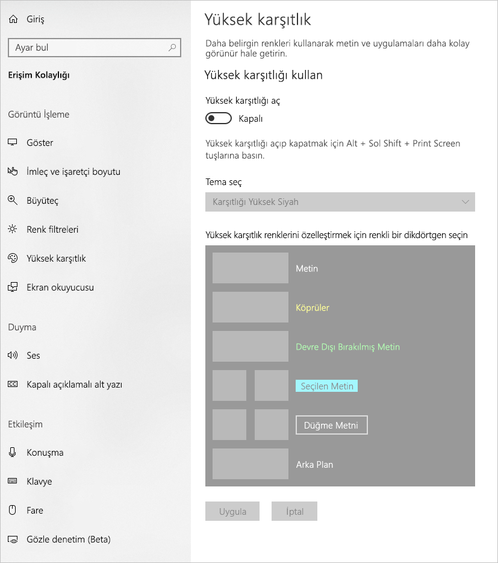

Bu makalede, Power BI’da erişilebilir raporlar oluşturmaya yönelik erişilebilirlik özellikleri ve araçları açıklanmaktadır.

Genel olarak, Power BI bir ekran okuyucuyla kullanılırken tarama modunun veya gözatma modunun kapatılmasını öneririz.

Ekran okuyucularla rapor oluşturma işlemini geliştirmek için bir bağlam menüsü sağlanmıştır. Bu menü **Alanlar** listesindeki alanları kutuda yukarı veya aşağı taşımanızı sağlar. Ayrıca menü alanı **Gösterge** veya **Değer** gibi diğer kutulara taşımaya da olanak tanır.

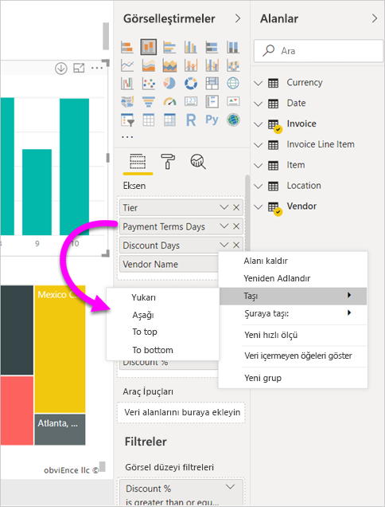

## Erişilebilirlik özelliklerinin türleri

Power BI, erişilebilir raporlar oluşturma yeteneği sağlar ancak rapor yazarı olarak bunları raporlarınıza dahil etmek size bağlıdır. Bu makalede üç erişilebilirlik özelliği açıklanmaktadır:

* Yerleşik erişilebilirlik özellikleri (yapılandırma gerekmez)
* Yerleşik erişilebilirlik özellikleri (yapılandırma gerekir)
* Diğer ipuçları ve önemli noktalar

Bu kategorilerin her birini aşağıdaki bölümlerde ele alacağız.

## Yerleşik erişilebilirlik özellikleri

Power BI, üründe yerleşik olarak bulunan erişilebilirlik özelliklerine sahiptir ve bu özellikler, rapor yazarının herhangi bir yapılandırma yapmasını gerektirmez. Bu özellikler şunlardır:

* Klavye ile gezinme
* Ekran okuyucu uyumluluğu
* Yüksek karşıtlık renkleri görünümü
* Odak modu
* Veri tablosunu göster

Ayrıca, rapor tüketim deneyimine yardımcı olan özellikler vardır. Bu özellikleri açıklayan makaleler, bu makalenin sonundaki [Sonraki adımlar](#next-steps) bölümünde bulunabilir.

Şimdi bu yerleşik erişilebilirlik özelliklerinin her birine sırayla göz atalım. 

### Klavye ile gezinme

Bir rapor yazarı olarak, tüketicilerinizin bir raporda gezinmek için klavyesini kullanıp kullanamayacağını merak etmeniz gerekmez. Power BI görsellerin hepsinde klavye ile gezinilebilir ve rapor tüketiciniz görsellerdeki veri noktaları üzerinde gezinebilir, sayfa sekmeleri arasında geçiş yapabilir ve çapraz vurgulama, filtreleme ve dilimleme gibi etkileşimli olanaklara erişim sağlayabilir.

Bir rapor tüketicisi raporda gezindiğinde, kullanıcının raporun neresinde olduğunu göstermek üzere bir odak görünür. Kullanılan tarayıcıya bağlı olarak odak modu farklı görünebilir.

En sık kullanılan klavye kısayollarına erişmek için *?* tuşuna basarak klavye kısayolu iletişim kutusunu görüntüleyebilirsiniz. Daha fazla bilgi edinmek için bu makalenin sonundaki [Sonraki adımlar](#next-steps) bölümünde yer alan erişilebilir tüketim deneyimleri ve klavye kısayolları ile ilgili makalelere bakın.

### Ekran okuyucusu uyumluluğu

Genel olarak, Power BI’da klavye ile gezinme özelliği olan her nesne ekran okuyucularla da uyumludur. Bir rapor tüketicisi görsele gittiğinde, ekran okuyucu başlık, görsel türü ve varsa alternatif metinleri okur.

### Yüksek karşıtlık rengi görünümü

Power BI raporlarında yüksek karşıtlık desteği mevcuttur. Windows’ta bir yüksek karşıtlık modu kullanıyorsanız, Power BI Desktop Windows’ta hangi yüksek karşıtlık temasının kullanıldığını otomatik olarak algılar ve bu ayarları raporlarınıza uygular. Bu yüksek karşıtlık renkleri, Power BI hizmetinde veya başka bir yerde yayımlandığında raporu izler.

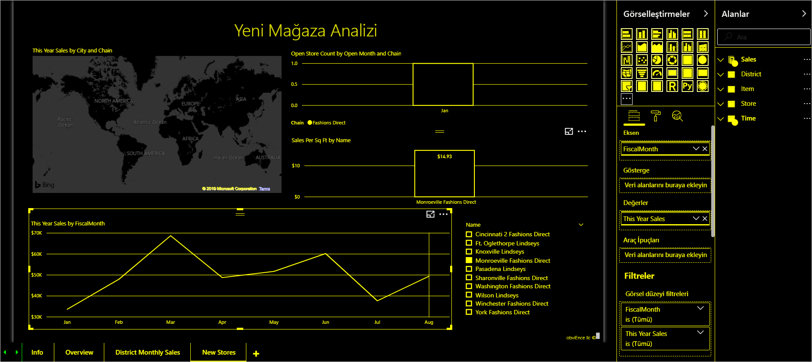

Power BI hizmeti ayrıca Windows için seçilen yüksek karşıtlık ayarlarını algılamaya çalışır, ancak bu algılamanın ne kadar etkili ve doğru olduğu Power BI hizmeti için kullanılan tarayıcıya bağlıdır. Power BI hizmetinde temayı el ile ayarlamak isterseniz, sağ üst köşeden **Görünüm > Yüksek karşıtlık renkleri**’ni ve sonra rapora uygulamak istediğiniz temayı seçebilirsiniz.

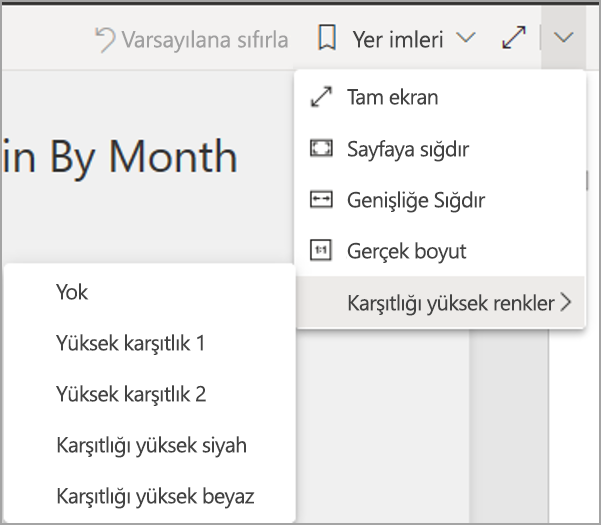

### Odak modu
Rapor tüketicisi bir panodaki görsele bakıyorsa, görselin bağlam menüsüne gidip **Odak modunda aç**'ı seçerek görseli ekranın daha büyük bir kısmını dolduracak şekilde genişletebilir.

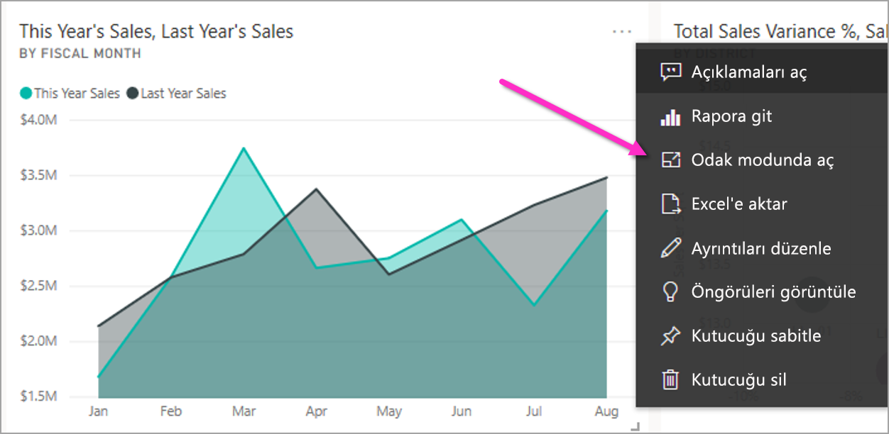

### Veri tablosunu göster
Rapor tüketicileri **Alt+Shift+F11** tuşlarına basarak bir görseldeki verileri tablo biçiminde de görüntüleyebilir. Bu tablo, görselin bağlam menüsünde **Verileri Göster**’e basılmasına benzer ancak ekran okuyucuya uygun bir tablo gösterir.

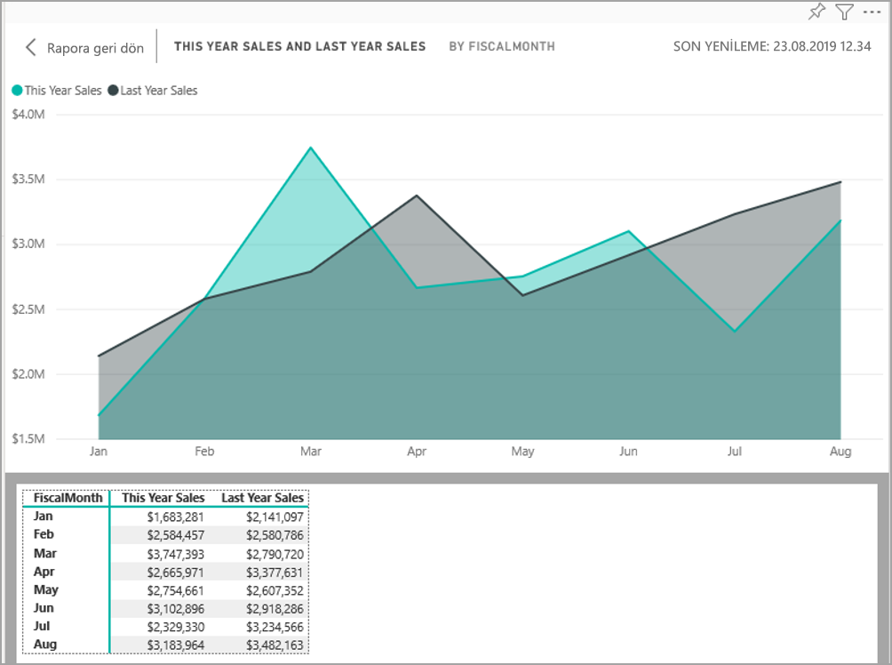

## Yapılandırma gerektiren yerleşik erişilebilirlik özellikleri

Power BI, üründe yerleşik olarak bulunan ve rapor yazarının yapılandırma yapmasını gerektiren erişilebilirlik özelliklerine sahiptir.  Bu özellikler şunlardır:

* Alternatif metin
* Sekme sırası
* Başlıklar ve etiketler
* İşaretler
* Rapor temaları

## Alternatif metin

Alternatif metin (alternatif metin açıklamaları), rapor sayfasındaki görsellerin ve görüntülerin görünüm ve işlevini, ekran okuyucu kullanıcılarına anlatmak için kullanılır. Rapor yazarları, bir rapora anlamlı bilgiler aktaran her nesneye alternatif metin eklemelidir. Alternatif metin eklediğinizde raporunuzu kullanan kişiler; ilgili görseli, resmi, şekli veya metin kutusunu görmese bile bu görselle ne amaçladığınızı anlayabilir. Nesneyi (görsel, şekil vb.) seçip **Görsel Öğeler** bölmesindeki **Biçim** bölümünde bulunan **Genel**'i genişleterek ve ardından en alt kısma gidip **Alternatif Metin** metin kutusunu doldurarak bir Power BI Desktop raporundaki herhangi bir nesne için alternatif metin sağlayabilirsiniz. **Alternatif Metin** metin kutusu 250 karakterlik bir sınıra sahiptir.

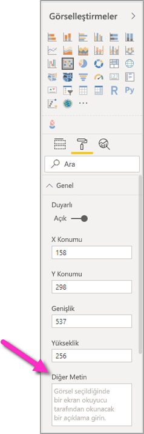

Alternatif metin, rapor tüketicisinin bir görselden almasını istediğiniz içgörü hakkındaki bilgileri içermelidir. Ekran okuyucu bir görselin başlığını ve türünü okuduğundan, yalnızca bir açıklama girmeniz gerekir. Aşağıdaki görsel için alternatif metin örneği şunlar olabilir: *Satılan ürünün rengine ve sonra ürün sınıfına göre ayrılmış net kullanıcı memnuniyeti.*

Power BI’da veriler dinamik olduğundan, bir içgörüyü veya belirli veri noktalarını çağırmak, statik alternatif metin girmek için en iyi yöntem olmayabilir. Dinamik alternatif metin kullanmak istiyorsanız, alternatif metin için koşullu biçimlendirmeyi açıklayan bir sonraki bölüme bakın.

### Alternatif metin için koşullu biçimlendirme

Power BI’ı bu kadar etkileyici hale getiren bir özellik, verilerinin dinamik olmasıdır. Dinamik alternatif metin oluşturmak için DAX ölçüleri ve koşullu biçimlendirme kullanabilirsiniz. Ekran okuyucular daha sonra bir rapor tüketicisinin görüntülediği verilere özgü değerleri çağırabilir.

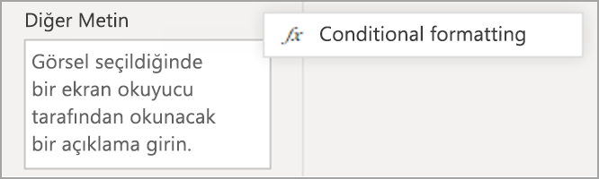

### Sekme sırası
Sekme sırasının ayarlanması, klavye kullanıcılarının raporunuzda rapor görsellerini görsel olarak işleme yöntemiyle eşleşen bir sırada gezinmesine yardımcı olur. Raporunuza dekoratif şekiller ve görüntüler ekleyecekseniz, bunları sekme sırasından kaldırmanız gerekir. 

Sekme sırasını ayarlamak için şeritteki **Görünüm** sekmesini seçin ve **Seçim Bölmesi** düğmesini seçerek Seçim bölmesini görüntüleyin.

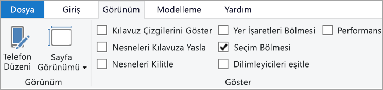

**Seçim bölmesi**’nde **Sekme sırası**’nı seçtiğinizde raporunuzun geçerli sekme sırası gösterilir. Bir nesne seçebilir, sonra yukarı ve aşağı ok düğmelerini kullanarak nesneyi hiyerarşide taşıyabilir veya farenizle bir nesne seçip listede istediğiniz konuma sürükleyebilirsiniz. Bir nesnenin yanındaki sayıya tıkladığınızda nesne sekme sırasından gizlenir.

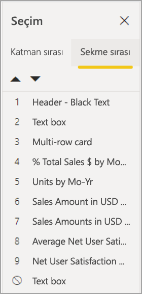

### Başlıklar ve etiketler
Görsel ve rapor sayfası başlıkları, rapor tüketicisini yönlendiren önemli erişilebilirlik özellikleridir. Rapor başlıklarında kısaltmalar veya jargon kullanmaktan kaçının; raporu yeni bir kullanıcıyla veya kuruluşunuzun dışında bir kişiyle paylaşırsanız, terimlerinizin veya kısaltmalarınızın ne anlama geldiğini bilmiyor olabilir. Aşağıdaki görüntüde, başlığında kısaltma olan bir görsel (solda) ve sağ tarafta görsele ilişkin daha net bir başlık gösterilmektedir.

Bir görseldeki tüm başlıkların, eksen etiketlerinin, gösterge değerlerinin ve veri etiketlerinin kolayca okunup anlaşılabildiğinden emin olun. Aşağıda, verilerin birkaç sayı veya açıklamasını içeren birinci görüntü ile birçok sayı veya açıklama içeren ikinci görüntüyü karşılaştırın.

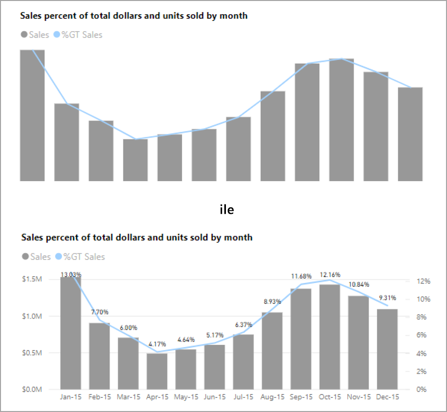

Veri etiketlerini kullanarak, görselinizdeki her bir seri için etiketleri açıp kapatmayı veya bir serinin üstüne ya da altına konumlandırmayı seçebilirsiniz. Power BI veri etiketlerini bir satırın üstüne veya altına en iyi şekilde yerleştirmeye çalışsa da bazen çok açık olmaz. Aşağıdaki görselde veri etiketleri birbirine karışmıştır ve okunması kolay değildir.

Veri etiketlerinizi serinizin üstüne veya altına konumlandırmak, özellikle birden çok satır içeren bir çizgi grafik kullanıyorsanız yararlı olabilir. Birkaç ayarlama sayesinde, veri etiketleri artık çok daha iyi bir şekilde görünür.

### İşaretler

Bilgi iletmenin tek yolu olarak renk (koşullu biçimlendirme özellikleri dahil) kullanmaktan kaçınmak en iyi uygulamadır. Bunun yerine, farklı serileri iletmek için işaretleri kullanabilirsiniz.

Çizgi, Alan ve Birleşik görsellerin yanı sıra Dağılım ve Kabarcık görselleri için işaretçileri açabilir ve her bir çizgi için farklı İşaretçi şekilleri kullanabilirsiniz.

İşaretleri etkinleştirmek için Görselleştirmeler bölmesindeki Biçim bölümünü seçin, **Şekiller** bölümünü genişletin, ardından sayfayı aşağıya kaydırarak **İşaretleri Göster** düğmesini bulun ve aşağıdaki görüntüde gösterildiği gibi **Açık** konumuna getirin. 

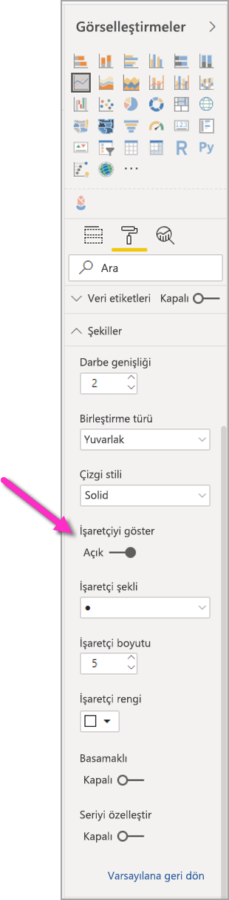

Şekiller bölümünde açılır kutudan her bir çizginin (veya Alan grafiği kullanılıyorsa alanın) adını seçmek için **Serileri Özelleştir**’i de kullanabilirsiniz. Açılan kutunun altında, seçili çizgi için kullanılan işaretçinin birçok özelliğini (şekli, rengi ve boyutu dahil) ayarlayabilirsiniz.

Rapor yazarlarının veri etiketlerini ve işaretlerini etkinleştirmesini önersek de, her görsel için bunların etkinleştirilmesi dikkat dağıtıcı olabilir ve raporunuzu daha az erişilebilir hale getirebilir. Aşağıdaki görüntüde, hem veri etiketleri hem de işaretleri etkin olan bir görseli, veri etiketleri kapalı olan daha anlaşılır bir sürüm ile karşılaştırabilirsiniz.

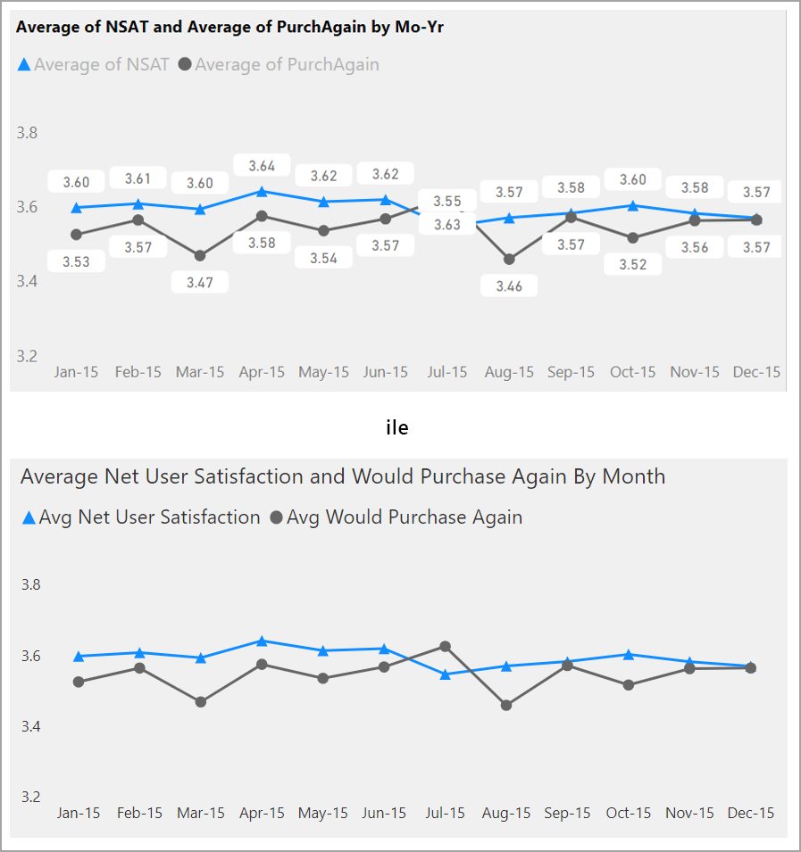

Görselinizin veya raporunuzun çok meşgul olup olmadığından emin değilseniz [gözlerinizi kısarak](https://chrome.google.com/webstore/detail/the-squint-test/gppnipfbappicilfniaimcnagbpfflpg) test edin.  Gözleriniz veri noktalarından daha çok veri etiketlerine kayıyorsa veri etiketlerini kapatın.

### Temalar, karşıtlık ve renk körlerine uygun renkler

Raporlarınızdaki metinler ile arka plan renkleri arasında yeterli düzeyde karşıtlık bulunduğundan emin olmanız gerekir. WCAG 2.1 başarı ölçütü 1.4.3, metin ve arka plan renginin en az 4.5:1 karşıtlık oranına sahip olması gerektiğini belirtir. Raporunuzun renklerini denetlemek için kullanabileceğiniz [Color Contrast Analyzer](https://developer.paciellogroup.com/resources/contrastanalyser/), [WebAIM](https://webaim.org/resources/contrastchecker/) ve [Accessible Colors](https://accessible-colors.com/) gibi birkaç araç vardır.

Ayrıca, bazı rapor görüntüleyicilerinin renkli görme bozukluklarının olabileceğini de göz önünde bulundurmanız gerekir. [Coblis](https://www.color-blindness.com/coblis-color-blindness-simulator/) ve [Vischeck](https://www.vischeck.com/vischeck/vischeckImage.php) gibi araçlar, farklı renk görme bozuklukları olan rapor görüntüleyicilerin ne göreceğinin benzetimini yapar.  Raporunuzda daha az renk veya tek renkli bir palet kullanmak, erişilemeyen raporlar oluşturma sorunu azaltmaya yardımcı olabilir.

Renk görme bozuklukları olan kullanıcıların belirli renk birleşimlerini ayırt edilebilmesi özellikle zordur. Buna aşağıdaki birleşimler dahildir: 

* yeşil ve kırmızı
* yeşil ve kahverengi
* mavi ve mor
* yeşil ve mavi
* açık yeşil ve sarı
* mavi ve gri
* yeşil ve gri
* yeşil ve siyah

Bu renkleri bir grafikte veya aynı rapor sayfasında bir arada kullanmaktan kaçının. Power BI, raporunuzu daha erişilebilir hale getirmenize yardımcı olacak bazı yerleşik temalara sahiptir, ancak bu makalede önerilen ek araçlardan bazılarıyla raporunuzu denetlemek en iyi uygulamadır.

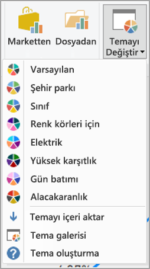

## İpuçları ve önemli noktalar
Bu bölümde erişilebilirliği göz önünde bulundurarak raporlar oluştururken aklınızda bulundurmanız gereken bazı yönergeler, ipuçları ve önemli noktalar sunulmaktadır.

### Hedef kitlenizin ne istediğini anlayın

Rapor oluşturmak yinelemeli bir işlemdir. Sayfaya görsel yerleştirme başlamadan önce, raporunuzdan hangi bilgileri almak istediklerini ve bu bilgileri nasıl görmek istediklerini daha iyi anlamak için rapor tüketicilerinizden bazılarıyla konuşun.  

Erişilebilirliği dahil etmek, bu işlemin bir parçası olmalıdır. Vizyonunuzun, rapor tüketicilerinizin aklındaki şeye uymadığını öğrenebilirsiniz. Raporunuzun ilk taslağını hazırladıktan sonra, raporu bir rapor tüketicisine gösterin ve daha fazla geri bildirim alın. Rapor yazarı olarak, geri bildirim almak gelecekte memnuniyetsiz rapor tüketicilerinden talep yağmuruna tutulma olasılığını azaltmaya yardımcı olabilir.

### Raporunuzu basit ve tutarlı tutun

Raporunuzu mümkün olduğunca basit tutun. İnsanlar genellikle tek bir görsele çok fazla yük bindirmeye çalışır. Genellikle raporu birden çok görsele bölmek, raporu daha basit ve kolay anlaşılır hale getirir. Verilerin farklı modellerini gösterip zengin bir deneyim oluşturmak için filtreleri veya görsel etkileşimleri kullanıyorsa birden çok görsel kullanmayı düşünün. Aynı zamanda, bir sayfadaki görsellerin sayısını minimum düzeyde tutun. Gereksiz artıklık ve sayfa dağınıklığını önlemeye çalışın. Aynı şeyi gösteren iki görsel gerekli değildir. Rapor tüketicileri bütün bilgilerin çok sayıda görselden verilmesinden bunalabilir veya dikkat süreleri sınırlı olup dikkatleri dağılabilir. Bunun yapılması raporunuzun tüketilmesini daha kolay hale getirmekle kalmaz, aynı zamanda bir sayfada çok fazla görselin olması raporunuzun performansını yavaşlatabilir.

Rapor genelindeki görsel öğeler için aynı yazı tipi rengini ve stilini kullanarak raporunuzun tutarlılığını koruyun. Veri etiketleri ve eksen başlıkları için yaptığınız gibi tüm görsel başlıkları için aynı yazı tipi boyutunu kullanın. Birden fazla rapor sayfasında dilimleyiciler kullanıyorsanız raporunuzun her sayfasında aynı konumda tutun.

### Görme bozukluğu testi

Bir raporun görme zorluğu olan tüketiciler için ne şekilde göründüğünü test etmenin hızlı bir yolu, ekranınızın veya mobil cihazınızın parlaklığını kapatmaktır.  Görme testi gerçekleştirmenize yardımcı olmak üzere kullanabileceğiniz tarayıcı eklentileri vardır.

## Rapor erişilebilirliği denetim listesi

Power BI, erişilebilirlik araçları ve işlevselliği sağlamaya ek olarak, raporlar oluştururken kullanabileceğiniz aşağıdaki denetim listesini sağlar. Bu denetim listesi, raporlarınızın yayımlanmadan önce erişilebilir olmasına ve en geniş kitlenin kullanımına sunulmasına yardımcı olur. 

### Tüm görseller

* Başlık, eksen etiketi ve veri etiketi ile arka plan arasındaki renk karşılığının en az 4.5:1 olduğundan emin olun.
* Bilgi iletmenin tek yolu olarak renk kullanmaktan kaçının. Rengi tamamlaması veya yerine geçmesi için metin ya da simgeler kullanın.
* Gereksiz jargonları veya kısaltmaları değiştirin.
* Sayfadaki dekoratif olmayan tüm görsellere **alternatif metin** eklendiğinden emin olun.
* Rapor sayfanızın, renk görme bozukluğu olan kullanıcılar için çalışıp çalışmadığını denetleyin.

### Dilimleyiciler
* Rapor sayfalarınızda birkaç dilimleyiciden oluşan bir koleksiyon kullanıyorsanız tasarımınızın sayfalar arasında tutarlı olduğundan emin olun. Mümkün olduğunca aynı yazı tipini, renkleri ve uzamsal konumu kullanın.

### Metin Kutusu
* Yazı tipi ile arka plan arasındaki renk karşıtlığının en az 4.5:1 olduğundan emin olun.
* Ekran okuyucularının okuyabilmesi için **alternatif metin** kutusuna metin içeriğini yerleştirdiğinizden emin olun.

### Görsel etkileşimler
* Önemli bilgilere yalnızca bir etkileşim ile mi erişilebiliyor? Yanıt evetse, önemli sonucu daha belirgin hale getirmek için görsellerinizi önceden filtreleyerek yeniden düzenleyin.
* Gezinti için yer işaretlerini kullanıyor musunuz? Deneyimin yalnızca klavye kullanan kullanıcılar için kabul edilebilir olduğundan emin olmak için raporunuzda bir klavye ile gezinmeyi deneyin.

### Sıralama düzeni
* Sayfadaki her görselin sıralama düzenini bilerek mi ayarladınız? Erişilebilir **Verileri Göster** tablosu, görselde ayarladığınız sıralama düzeninde verileri gösterir.

### Araç İpuçları
* Önemli bilgileri iletmek için araç ipuçlarını kullanmayın. Motor sorunları olan kullanıcılar ve fare kullanmayan kullanıcılar bunlara erişmekte sorun yaşayacaktır.
* Araç ipuçlarını grafiklere yardımcı bilgi olarak ekleyin. Her görsel için erişilebilir **Verileri Göster** tablosuna dahil edilir.

### Video
* Sayfa işlendiğinde videonun otomatik olarak başlatılmasını engelleyin.
* Videolarınızın açıklamalı alt yazı içerdiğinden veya bir konuşma metni sağladığınızdan emin olun.

### Ses
* Sayfa işlendiğinde sesin otomatik olarak başlatılmasını engelleyin.
* Her ses için bir konuşma metni sağlayın.

### Şekiller
* Tüm dekoratif şekillerin sekme sırasında gizli olarak işaretlendiğinden, böylece ekran okuyucu tarafından duyurulmayacağından emin olun.
* Dikkati dağıtacak kadar fazla sayıda dekoratif şekil kullanmaktan kaçının.
* Veri noktalarını çağırmak için şekiller kullanırken, neyin çağrıldığını açıklamak için **alternatif metin** kullanın.

### Görüntüler
* Veri noktalarını çağırmak için görüntüleri kullanırken, neyin çağrılacağını açıklamak için **alternatif metin** kullanın.
* Tüm dekoratif görüntülerin sekme sırasında gizli olarak işaretlendiğinden, böylece ekran okuyucu tarafından duyurulmayacağından emin olun.
* Dikkati dağıtacak kadar fazla sayıda dekoratif görüntü kullanmaktan kaçının.

### Özel görseller
* Özel görseller için **Verileri Göster** tablosunun erişilebilir olup olmadığını denetleyin. Gösterilen bilgiler yeterli değilse başka bir görsel arayın.
* *Yürütme Ekseni* özel görselini kullanıyorsanız otomatik olarak yürütülmediğinden emin olun. Kullanıcının değişen değerleri başlatması/durdurması için oynat/duraklat düğmesine basması gerektiğini açıkça belirtin.

### Sayfadaki görsellerin tamamında
* Sekme sırasını ayarlayın ve herhangi bir dekoratif öğe üzerinde sekme sırasını kapatın (öğeyi gizli olarak işaretleyin).

## Önemli noktalar ve sınırlamalar
Erişilebilirlik özelliklerine ilişkin sınırlamalar ve bilinen birkaç sorun vardır. Aşağıdaki listede bu sorunların ve sınırlamaların açıklamaları verilmiştir:

* **Power BI Desktop** ile ekran okuyucuları kullanırken en iyi deneyimi elde etmek için, **Power BI Desktop**'ta dosya açmadan önce ekran okuyucuyu başlatın.

## Sonraki adımlar

Power BI erişilebilirliği ile ilgili makale koleksiyonu aşağıda verilmiştir:

* [Power BI’da erişilebilirliğe genel bakış](desktop-accessibility-overview.md) 
* [Erişilebilirlik araçlarıyla Power BI raporlarını tüketme](desktop-accessibility-consuming-tools.md)
* [Erişilebilirlik araçlarıyla Power BI raporları oluşturma](desktop-accessibility-creating-tools.md)
* [Power BI raporlarına yönelik erişilebilirlik klavye kısayolları](desktop-accessibility-keyboard-shortcuts.md)
* [Rapor erişilebilirliği denetim listesi](#report-accessibility-checklist)
