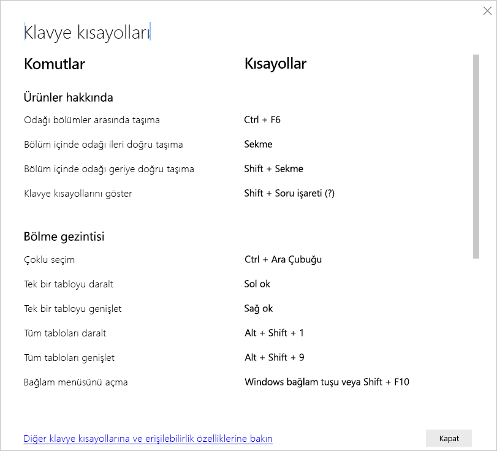
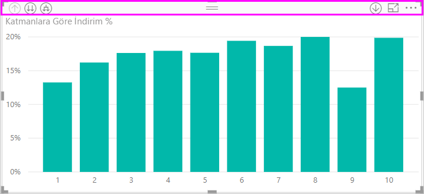
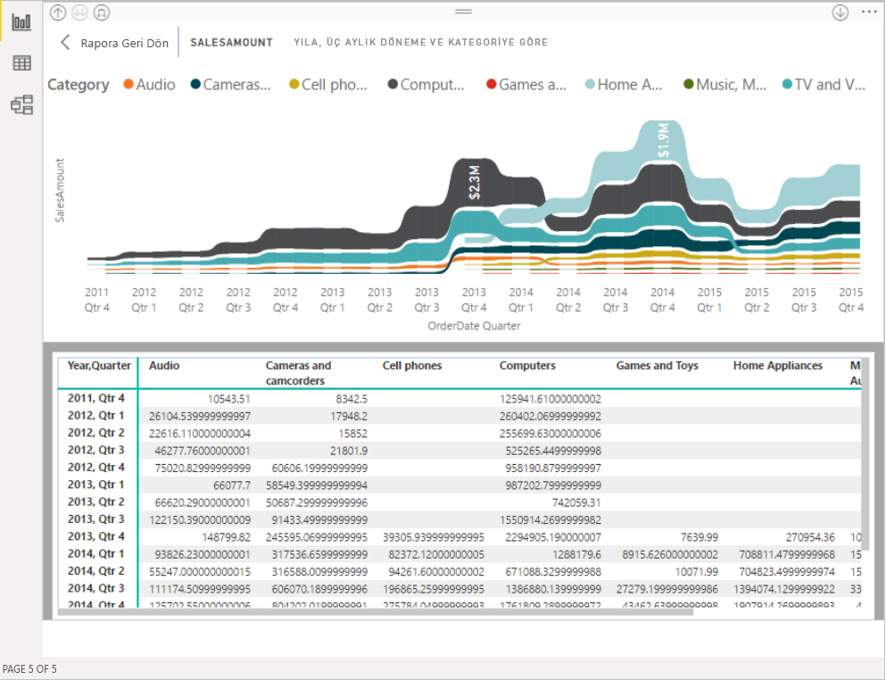
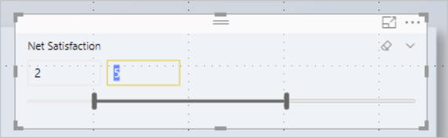
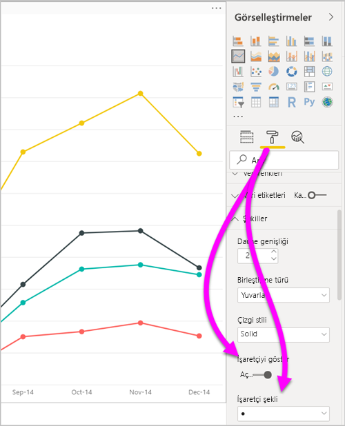
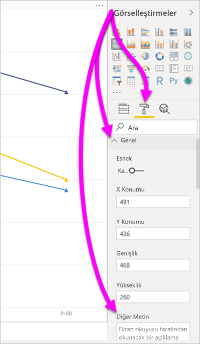
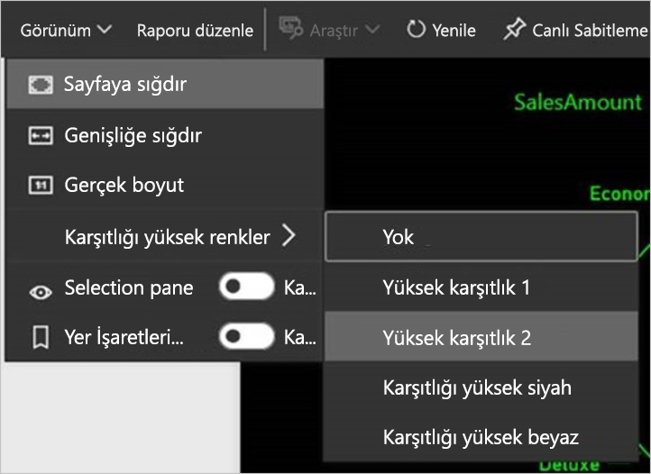

# Power BI Desktop raporlarında erişilebilirlik
Power BI'da, engelli kullanıcıların Power BI raporlarını daha kolay bir şekilde kullanmasına ve bunlarla etkileşime geçmesine olanak sağlayan özellikler bulunur. Bu özellikler, klavye veya ekran okuyucu aracılığıyla raporları kullanabilme ve sayfalardaki çeşitli nesnelere odaklanmak için sekmeyle gezinebilme özelliklerinin yanı sıra görselleştirmelerde işaretçilerin verimli bir şekilde kullanılabilmesini içerir.

## Klavye veya ekran okuyucu ile Power BI Desktop raporlarını kullanma
**Power BI Desktop**'ın Eylül 2017 sürümünden itibaren, **Shift + ?** tuşlarına basarak **Power BI Desktop**'ta kullanılabilen, erişilebilirliğe yönelik klavye kısayollarının açıklandığı bir pencerenin gösterilmesini sağlayabilirsiniz.

Erişilebilirlik iyileştirmeleri sayesinde, aşağıdaki teknikleri uygulayarak bir klavye veya ekran okuyucu ile Power BI raporlarını kullanabilirsiniz:

> [!NOTE]
> Rapor görüntülerken genellikle tarama modunu kapatmış olmanız gerekir.

**Ctrl + F6** tuşlarını kullanarak bir rapordaki rapor sayfası sekmeleri veya nesneler arasında odağı değiştirebilirsiniz.

* Odak rapor sayfası sekmeleri üzerindeyken, odağı bir rapor sayfasından sonraki rapor sayfasına geçirmek için **Sekme** veya **Ok** tuşlarını kullanın. Ekran okuyucu rapor sayfasının başlığını okur ve sayfanın seçili olup olmadığı söyler. Şu anda odakta olan rapor sayfasını yüklemek için **Enter** tuşunu ve ara çubuğunu kullanın.
* Odak yüklenmiş rapor sayfası üzerindeyken odağı sayfadaki nesnelerin (tüm metin kutuları, resimler, şekiller ve grafikler dahil) her birine kaydırmak için **Sekme** tuşunu kullanın. Ekran okuyucu nesnenin türünü ve nesnenin başlığını (varsa) okur. Rapor yazarı tarafından sağlanmışsa, ekran okuyucu söz konusu nesnenin açıklamasını da okur. 

Görseller arasında ilerlerken **Alt + Shift + F10** tuşlarına basarak odağı görsel üst bilgisine taşıyabilirsiniz. Gösrsel üst bilgisi sıralama, grafiğin arkasındaki verileri dışarı aktarma ve Odak modu gibi çeşitli seçenekler içerir. 

**Verileri göster** penceresinin erişilebilir bir sürümünün gösterilmesi için **Alt + Shift + F11** tuşlarına basabilirsiniz. Bu pencere, görselde kullanılan verileri ekran okuyucunuzda her zaman kullandığınız klavye kısayollarını kullanarak bir HTML tablosunda incelemenizi sağlar. 

> [!NOTE]
> Ekran okuyucu **Verileri göster** özelliğine yalnızca bu klavye kısayolu aracılığıyla erişebilir. **Verileri göster** sayfasını görsel üst bilgisindeki seçenekten açarsanız ekran okuyucu buna erişemez. **Verileri göster** özelliğini kullanırken, ekran okuyucunuzun sağladığı tüm kısayol tuşlarından yararlanmak için tarama modunu açın.

Temmuz 2018'de **Power BI Desktop**'ın kullanıma sunulmasından başlayarak, dilimleyicilere de yerleşik erişilebilirlik işlevselliği eklendi. Dilimleyici seçtiğinizde, dilimleyicinin değerini ayarlamak için **Ctrl + Sağ ok** tuşlarını (Control tuşu artı Sağ ok tuşu) kullanarak dilimleyici içindeki çeşitli denetimler arasında ilerleyin. Örneğin başlangıçta **Ctrl + Sağ ok** tuşlarına bastığınızda odak silginin üzerindedir. Ardından ara çubuğuna basmak, dilimleyicideki tüm değerleri silen silgi düğmesine tıklamakla eşdeğerdir. 

**Sekme** tuşuna basarak dilimleyicideki denetimler arasında ilerleyebilirsiniz. Silgideyken **Sekme** tuşuna basıldığında, aşağı açılan liste düğmesine geçilir. Bir kez daha **Sekme** tuşuna basıldığında ilk dilimleyici değerine gidilir (dilimleyicide birden çok değer, örneğin bir aralık varsa). 

Bu erişilebilirlik eklemeleri, kullanıcıların ekran okuyucu ve klavye gezintisi aracılığıyla Power BI raporlarını tam olarak kullanabilmesine olanak sağlar.

## Erişilebilir raporlar oluşturmaya yönelik ipuçları
Aşağıdaki ipuçları, daha erişilebilir **Power BI Desktop** raporları oluşturmanıza yardımcı olabilir.

### Erişilebilir raporlar için genel ipuçları

* **Çizgi**, **Alan** ve **Birleşik** görselleri ile **Dağılım** ve **Kabarcık** görselleri için, **İşaretçileri göster** iki durumlu düğmesini açık konuma getirin ve her çizgi için farklı **İşaretçi şekli** kullanın.
  
  * **İşaretleyicileri göster** iki durumlu düğmesini açmak için **Görselleştirmeler** bölmesinin **Biçim** bölümünü seçin ve **Şekiller** bölümünü genişletin. **İşaretçileri göster** düğmesini bulmak için ekranı aşağı kaydırın ve düğmeyi **Açık** konuma getirin.
  * Tek tek çizgileri özelleştirmek için **Seriyi özelleştir** düğmesini bulun ve **Açık** konuma getirin. Ardından, bu **Şekiller** bölümündeki açılan kutudan her bir çizginin (veya bir **Alan** grafiği kullanıyorsanız her bir alanın) adını seçin. Açılan kutunun altında, seçili çizgi için kullanılan işaretçinin birçok özelliğini (şekli, rengi ve boyutu dahil) ayarlayabilirsiniz.
  
    
  
  * Her bir çizgi için farklı bir **İşaretçi şekli** kullanılması, rapor kullanıcılarının çizgileri (veya alanları) daha kolay bir şekilde ayırt edebilmesini sağlar.
* Önceki maddeye ek olarak, bilgileri ifade etmek için renkleri kullanmamanızı öneririz. Çizgi ve dağılım grafiklerinde şekilleri kullanırken, tablolarda ve matrislerde içgörü sağlamak için koşullu biçimlendirmeye güvenmeyin. 
* Raporunuzdaki her görsel için bir sıralama düzeni seçin. Ekran okuyucu kullanıcıları grafiğin temel aldığı verilerde gezindiğinde görselle aynı sıralama düzeniyle karşılaşır.
* Tema galerisinden yüksek karşıtlığı sahip ve renk körlüğü olan kişiler için uygun bir tema seçin. [**Tema Oluşturma** önizleme özelliğini](desktop-report-themes.md) kullanarak bu temayı içeri aktarın.
* Rapordaki her nesne için alternatif metin sağlayın. Bunu yaparak rapor tüketicilerinizin görselle neyi iletmek istediğinizi anladığından emin olabilirsiniz. Görseli, resmi, şekli veya metin kutusunu göremediğiniz durumlarda bile yararlı olur. Görsel ve şekil gibi bir nesneyi ve ardından **Görselleştirmeler** bölmesinin **Biçim** bölümünü seçerek **Power BI Desktop** raporundaki herhangi bir nesneye alternatif metin sağlayabilirsiniz. Sonra **Genel** alanını genişletin, en alta kaydırın ve **Alternatif Metin** metin kutusunu doldurun.
  
  
  
  Alternatif metin bir ifade ile de dinamik olarak değiştirilebilir (örneğin, bir görsele uygulanan filtreleri yansıtma). İfadeyi, bir görselin başlığını ayarlar gibi ayarlarsınız. [Görsel başlıkları için koşullu biçimlendirme](desktop-conditional-format-visual-titles.md)
  
* Raporlarınızdaki metinler ve arka plan renkleri arasında yeterli düzeyde karşıtlık bulunduğundan emin olun. Raporunuzdaki renkleri denetlemek için [Renk Karşıtlığı Analizi](https://developer.paciellogroup.com/resources/contrastanalyser/) gibi birçok araçtan faydalanabilirsiniz. 
* Kolay okunabilir metin boyutları ve yazı tipleri kullanın. Okunması zor olabilecek kadar küçük boyutlu metinler ve yazı tipleri erişilebilirlik açısından kullanışsızdır.
* Tüm görsellere başlık, eksen etiketleri ve veri etiketleri ekleyin.
* Tüm rapor sayfaları için anlamlı başlıklar kullanın.
* Raporunuzdaki dekoratif şekiller ve görüntüler raporun sekme sıralamasına dahil edildiğinden, bunları kullanmaktan mümkün olduğunca kaçının. Raporunuzda dekoratif nesneler kullanmanız gerekiyorsa nesnenin alternatif metnini güncelleştirerek ekran okuyucu kullanıcılarının dekoratif amaçlı olduğunu anlamalarını sağlayın.

### Alan demetlerindeki öğeleri düzenleme
**Power BI Desktop**'ın Ekim 2018 sürümünden itibaren kullanıcılar **Alanlar** kutusunda klavyeyle gezinebilirsiniz ve bu bölüm ekran okuyucularıyla etkileşim kurabilir. 

Ekran okuyucularla rapor oluşturma işlemini geliştirmek için bir bağlam menüsü sağlanmıştır. Bu menü **Alanlar** listesindeki alanları kutuda yukarı veya aşağı taşımanızı sağlar. Ayrıca menü alanı **Gösterge** veya **Değer** gibi diğer kutulara taşımaya da olanak tanır.

## Raporlar için yüksek karşıtlık desteği

Windows’ta yüksek karşıtlık modlarını kullandığınızda, seçtiğini ayarlar ve palet aynı zamanda **Power BI Desktop**’taki raporlara uygulanır. 

**Power BI Desktop**, Windows’un hangi yüksek karşıtlık temasını kullandığını otomatik olarak algılar ve bu ayarları raporlarınıza uygular. Bu yüksek karşıtlık renkleri, Power BI hizmetinde veya başka bir yerde yayımlandığında raporu izler.

Power BI hizmeti Windows tarafından seçilen yüksek karşıtlık ayarlarını algılamayı da dener. Bu algılama denemesinin etkili ve doğru olması, Power BI hizmetinin gösterildiği tarayıcıya bağlıdır. Power BI hizmetinde temayı el ile ayarlamak isterseniz, **Görünüm** > **Yüksek karşıtlık renkleri**’ni ve sonra rapora uygulamak istediğiniz temayı seçebilirsiniz.

## Önemli noktalar ve sınırlamalar
Erişilebilirlik özelliklerine ilişkin sınırlamalar ve bilinen birkaç sorun vardır. Aşağıdaki listede bu sorunların ve sınırlamaların açıklamaları verilmiştir:

* **Power BI Desktop** ile ekran okuyucuları kullanırken en iyi deneyimi elde etmek için, **Power BI Desktop**'ta dosya açmadan önce ekran okuyucuyu başlatın.
* Ekran Okuyucusu uygulamasını kullanıyorsanız, **Verileri göster** seçeneğiyle ulaştığınız HTML tablosunda gezinme konusunda belirli sınırlamalarla karşılaşabilirsiniz.

## Klavye kısayolları
Power BI raporları arasında klavyeyle dolaşırken klavye kısayolları yararlı olur. Aşağıdaki tablolarda, Power BI raporunda kullanılabilen kısayollar açıklanır. Bu klavye kısayollarını, **Power BI Desktop**’ın yanı sıra şu deneyimlerde de kullanabilirsiniz:

* **Soru-Cevap Gezgini** iletişim kutusu
* **Başlarken** iletişim kutusu
* **Dosya** menüsü ve **Hakkında** iletişim kutusu
* **Uyarı** çubuğu
* **Dosya Geri Yükleme** iletişim kutusu
* **Kaş Çatmalar** iletişim kutusu

Erişilebilirliği geliştirmek için devam eden çalışmalarımız kapsamında, listelenen önceki deneyimler ekran okuyucu ve yüksek karşıtlık ayarlarını da destekler.

### Sık kullanılan kısayollar
| Bu eylemi gerçekleştirmek için           | Buna basın                |
| :------------------- | :------------------- |
| Odağı bölümler arasında taşıma  | **Ctrl + F6** |
| Bölüm içinde odağı ileri doğru taşıma | **Sekme**         |
| Bölüm içinde odağı geriye doğru taşıma | **Shift + Sekme** |
| Nesneyi seçme veya seçimi temizleme | **Enter** veya **ara çubuğu** |
| Nesneleri çoklu seçme | **Ctrl + ara çubuğu** |

### Görselde
| Bu eylemi gerçekleştirmek için           | Buna basın                |
| :------------------- | :------------------- |
| Odağı görsel menüye taşıma | **Alt + Shift + F10** |
| Verileri göster | **Alt + Shift + F11**  |
| Görsel girin | **Ctrl + Sağ ok** |
| Katman girin | **Enter** |
| Katman veya görselden çıkın | **Esc** |
| Veri noktasını seçme veya seçimi temizleme | **Enter** veya **ara çubuğu** |
| Çoklu seçim | **Ctrl + Enter** veya **Ctrl + ara çubuğu** |
| Sağ tıklama | <ul><li>Windows klavyesi: **Windows bağlam tuşu + F10**. Windows bağlam tuşu, Sol Alt tuşuyla Sol Ok tuşunun arasındadır</li><li>Başka klavye: **Shift + F10**</li></ul> |
| Seçimi temizle | **Ctrl + Shift + C** |

### Tablo ve matris gezintisi
| Bu eylemi gerçekleştirmek için          | Buna basın                |
| :------------------- | :------------------- |
| Odağı bir hücre yukarı / aşağı taşıma (tüm alanlardaki tüm hücreler arasında)  | **Yukarı ok tuşu** / **Aşağı ok tuşu** |
| Odağı bir hücre sola / sağa taşıma (tüm alanlardaki tüm hücreler arasında)  | **Sol ok tuşu** / **Sağ ok tuşu** |

### Bölme gezintisi
| Bu eylemi gerçekleştirmek için           | Buna basın                |
| :------------------- | :------------------- |
| Çoklu seçim | **Ctrl + ara çubuğu** |
| Tek bir tabloyu daralt | **Sol ok tuşu** |
| Tek bir tabloyu genişlet | **Sağ ok tuşu** |
| Tüm tabloları daralt | **Alt + Shift + 1** |
| Tüm tabloları genişlet | **Alt + Shift + 9** |
| Bağlam menüsünü açma | <ul><li>Windows klavyesi: **Windows bağlam tuşu + F10**.  Windows bağlam tuşu, Sol Alt tuşuyla Sol Ok tuşunun arasındadır</li><li>Başka klavye: **Shift + F10**</li></ul> |

### Dilimleyici
| Bu eylemi gerçekleştirmek için         | Buna basın                |
| :------------------- | :------------------- |
| Dilimleyiciyle etkileşim kurma | **Ctrl + Sağ ok tuşu** |

### Seçim bölmesi
| Bu eylemi gerçekleştirmek için           | Buna basın                |
| :------------------- | :------------------- |
| Seçim bölmesini etkinleştirme | **F6** |
| Nesneyi katman içinde yukarı taşıma | **Ctrl + Shift + F** |
| Nesneyi katman içinde aşağı taşıma | **Ctrl + Shift + B** |
| Nesneyi gizleme / gösterme (iki durumlu) | **Ctrl + Shift + S** |

### DAX Editor
| Bu eylemi gerçekleştirmek için          | Buna basın                |
| :------------------- | :------------------- |
| Satırı yukarı / aşağı taşıma | **Alt + Yukarı ok tuşu** / **Aşağı ok tuşu** |
| Üstteki /alttaki satırı kopyalama | **Shift + Alt + Yukarı ok tuşu** / **Aşağı ok tuşu** |
| Altına satır ekle | **Ctrl + Enter** |
| Üstüne satır ekle | **Ctrl + Shift + Enter** |
| Eşleşen köşeli ayraca atla | **Ctrl + Shift +**  \ |
| Satırı girintileme / Satırı kenar boşluğuna genişletme | **Ctrl + ]**  /  **[** |
| İmleç ekle | **Alt + Tıklama** |
| Geçerli satırı seç | **Ctrl + I** |
| Geçerli seçimin tüm oluşumlarını seç | **Ctrl + Shift + L** |
| Kelimenin tüm oluşumlarını seç | **Ctrl + F2** |

### Veri girme
| Bu eylemi gerçekleştirmek için           | Buna basın                |
| :------------------- | :------------------- |
| Düzenlenebilir kılavuzdan çıkış | **Ctrl + Sekme** |

## Sonraki adımlar
* [Power BI Desktop'ta Rapor Temalarını Kullanma (Önizleme)](desktop-report-themes.md)

