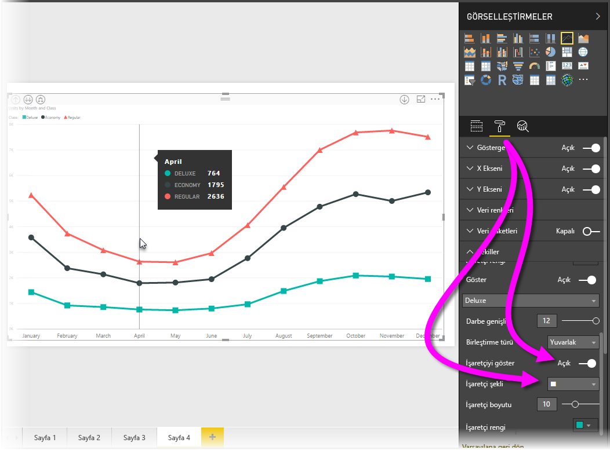
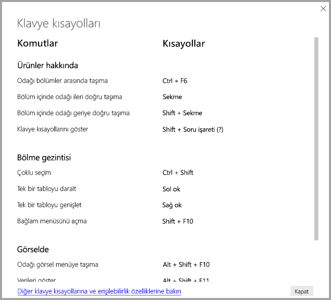
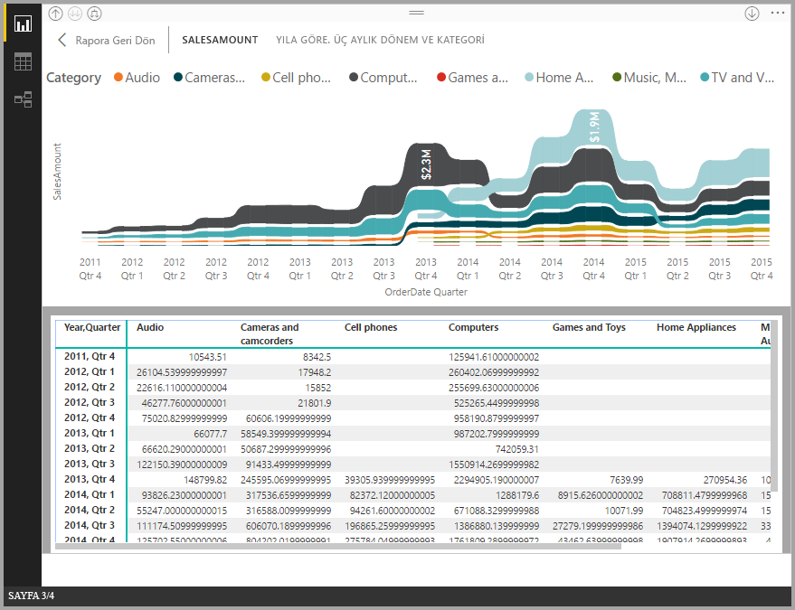
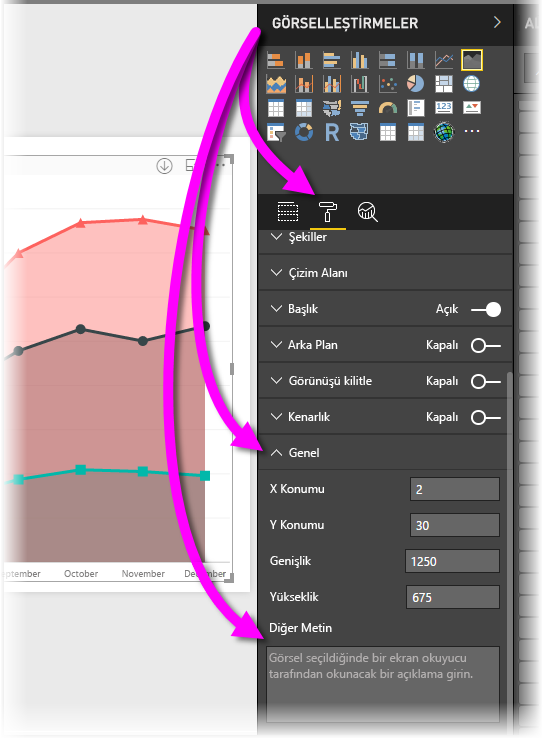

# Power BI Desktop raporlarında erişilebilirlik
**Power BI Desktop**'ta, engelli kullanıcıların **Power BI Desktop** raporlarını daha kolay bir şekilde kullanmasına ve bunlarla etkileşime geçmesine olanak sağlayan özellikler bulunur. Bu özellikler, klavye veya ekran okuyucu aracılığıyla raporları kullanabilme ve sayfalardaki çeşitli nesnelere odaklanmak için sekmeyle gezinebilme özelliklerinin yanı sıra görselleştirmelerde işaretçilerin verimli bir şekilde kullanılabilmesini içerir.

> [!NOTE]
> Bu erişilebilirlik özellikleri Haziran 2017'de kullanıma sunulan **Power BI Desktop** sürümüyle ve sonraki sürümlerle kullanılabilir. Gelecek sürümlerle birlikte daha fazla erişilebilirlik özelliğini kullanıma sunmayı planlıyoruz.
> 
> 

## Klavye veya ekran okuyucu ile Power BI Desktop raporlarını kullanma
**Power BI Desktop**'ın Eylül 2017 sürümünden itibaren, **?** tuşuna basarak, **Power BI Desktop**'ta kullanılabilen, erişilebilirliğe yönelik klavye kısayollarının açıklandığı bir pencerenin gösterilmesini sağlayabilirsiniz.

Erişilebilirlik iyileştirmeleri sayesinde, aşağıdaki teknikleri uygulayarak bir klavye veya ekran okuyucu ile **Power BI Desktop** raporlarını kullanabilirsiniz:

**Ctrl+F6** tuş birleşimini kullanarak bir rapordaki rapor sayfası sekmeleri veya nesneler arasında odağı çevirebilirsiniz.

* Odak *rapor sayfası sekmeleri* üzerindeyken, odağı bir rapor sayfasından sıradaki rapor sayfasına çevirmek için *Sekme* veya *Ok* tuşlarını kullanın. Rapor sayfasının başlığı ve sayfanın seçili olup olmadığı ekran okuyucusu tarafından sesli bir şekilde okunur. Odaklanılmış olan rapor sayfasını yüklemek için *Enter* veya *Boşluk* tuşunu kullanın.
* Odak bir *rapor sayfası* üzerinde olduğunda, odağı sayfadaki her bir nesneye (tüm metin kutuları, resimler, şekiller ve grafikler dahil) yöneltmek için *Sekme* tuşunu kullanın. Ekran okuyucu nesnenin türünün yanı sıra yazarı tarafından sağlanan açıklamasını okur. 

Odağı bir görsel menüsüne çevirmek için **Alt+Shift+F10** tuşlarına basabilirsiniz.

*Verileri gör* penceresinin erişilebilir bir sürümünün sunulması için **Alt+Shift+F11** tuşlarına basabilirsiniz.

Bu erişilebilirlik eklemeleri, kullanıcıların ekran okuyucu ve klavye gezintisi aracılığıyla **Power BI Desktop** raporlarını tam olarak kullanabilmesine olanak sağlamak için oluşturulmuştur.

## Erişilebilir raporlar oluşturmaya yönelik ipuçları
Aşağıdaki ipuçları, daha erişilebilir **Power BI Desktop** raporları oluşturmanıza yardımcı olabilir.

* **Çizgi**, **Alan** ve **Birleşik** görsellerin yanı sıra **Dağılım** ve **Kabarcık** görselleri için işaretçileri açın ve her bir çizgi için farklı *İşaretçi şekilleri* kullanın.
  
  * *İşaretçileri* etkinleştirmek için, **Görsel Öğeler** bölmesindeki **Biçim** bölümünü açın, **Şekiller** bölümünü genişletin ve ardından **İşaretçiler**'e ilişkin geçiş tuşuna gidip *Açık* seçeneğini belirleyin.
  * Ardından, bu **Şekiller** bölümündeki açılan kutudan her bir çizginin (veya bir **Alan** grafiği kullanıyorsanız her bir alanın) adını seçin. Açılan kutunun altında, seçili çizgi için kullanılan işaretçinin birçok özelliğini (şekli, rengi ve boyutu dahil) ayarlayabilirsiniz.
  
  
  
  * Her bir çizgi için farklı bir *İşaretçi şekli* kullanılması, rapor kullanıcılarının çizgileri (veya alanları) daha kolay bir şekilde ayırt edebilmesini sağlar.
* Önceki maddeye ek olarak, bilgileri ifade etmek için renkleri kullanmamanızı öneririz. Çizgilerde şekilleri (önceki maddede açıklandığı gibi, işaretçiler) kullanmakta yarar vardır.
* Tema galerisinden yüksek karşıtlığı bulunan ve renkleri ayırt etmekte zorlanan kişiler için uygun bir *tema* seçin ve temayı [**Tema Oluşturma** önizleme özelliğini](desktop-report-themes.md) kullanarak içeri aktarın.
* Rapordaki her bir nesne için *Diğer Metin* sağlayın. Böylece, raporunuzu kullanan kişiler; ilgili görseli, resmi, şekli veya metin kutusunu görmese bile bu görselle ne amaçladığınızı anlayabilir. Nesneyi (görsel, şekil vb.) seçip **Görsel Öğeler** bölmesindeki **Biçim** bölümünde bulunan **Genel**'i genişleterek ve ardından en alt kısma gidip **Diğer Metin** metin kutusunu doldurarak bir **Power BI Desktop** raporundaki herhangi bir nesne için *Diğer Metin* sağlayabilirsiniz.
  
  
* Raporlarınızdaki metinler ve arka plan renkleri arasında yeterli düzeyde karşıtlık bulunduğundan emin olun.
* Kolay okunabilir metin boyutları ve yazı tipleri kullanın. Okunması zor olabilecek kadar küçük boyutlu metinler ve yazı tipleri erişilebilirlik açısından kullanışsızdır.
* Tüm görsellere başlık, eksen etiketleri ve veri etiketleri ekleyin.

## Önemli noktalar ve sınırlamalar
Erişilebilirlik özelliklerine ilişkin sınırlamalar ve bilinen birkaç sorun aşağıdaki listede açıklanmıştır:

* JAWS, tüm eklenen raporlar da dahil olmak üzere **Power BI hizmetinde** görüntülenen raporlarda desteklenir. JAWS **Power BI Desktop**'ta da desteklenir ancak ekran okuyucunun düzgün bir şekilde çalışması için, okuyucuyu, herhangi bir **Power BI Desktop** dosyasını açmadan önce açmanız gerekir.

## Sonraki adımlar
* [Power BI Desktop'ta Rapor Temalarını Kullanma (Önizleme)](desktop-report-themes.md)

