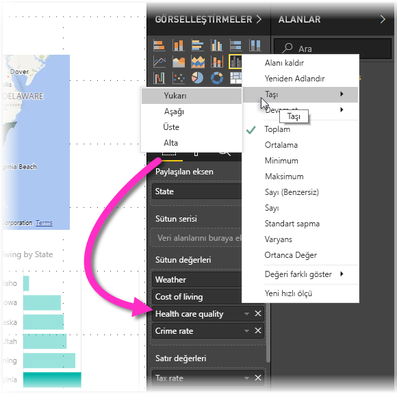

# Power BI Desktop raporlarında erişilebilirlik
Power BI'da, engelli kullanıcıların Power BI raporlarını daha kolay bir şekilde kullanmasına ve bunlarla etkileşime geçmesine olanak sağlayan özellikler bulunur. Bu özellikler, klavye veya ekran okuyucu aracılığıyla raporları kullanabilme ve sayfalardaki çeşitli nesnelere odaklanmak için sekmeyle gezinebilme özelliklerinin yanı sıra görselleştirmelerde işaretçilerin verimli bir şekilde kullanılabilmesini içerir.

> [!NOTE]
> Bu erişilebilirlik özellikleri Haziran 2017'de kullanıma sunulan **Power BI Desktop** sürümüyle ve sonraki sürümlerle kullanılabilir. Gelecek sürümlerle birlikte daha fazla erişilebilirlik özelliğini kullanıma sunmayı planlıyoruz.
> 
> 

## Klavye veya ekran okuyucu ile Power BI Desktop raporlarını kullanma
**Power BI Desktop**'ın Eylül 2017 sürümünden itibaren, **?** tuşuna basarak, **Power BI Desktop**'ta kullanılabilen, erişilebilirliğe yönelik klavye kısayollarının açıklandığı bir pencerenin gösterilmesini sağlayabilirsiniz.

Erişilebilirlik iyileştirmeleri sayesinde, aşağıdaki teknikleri uygulayarak bir klavye veya ekran okuyucu ile Power BI raporlarını kullanabilirsiniz:

Rapor görüntülerken genellikle tarama modunu kapatmış olmanız gerekir.

**Ctrl+F6** tuş birleşimini kullanarak bir rapordaki rapor sayfası sekmeleri veya nesneler arasında odağı çevirebilirsiniz.

* Odak *rapor sayfası sekmeleri* üzerindeyken, odağı bir rapor sayfasından sıradaki rapor sayfasına çevirmek için *Sekme* veya *Ok* tuşlarını kullanın. Rapor sayfasının başlığı ve sayfanın seçili olup olmadığı ekran okuyucusu tarafından sesli bir şekilde okunur. Odaklanılmış olan rapor sayfasını yüklemek için *Enter* veya *Boşluk* tuşunu kullanın.
* Odak bir *rapor sayfası* üzerinde olduğunda, odağı sayfadaki her bir nesneye (tüm metin kutuları, resimler, şekiller ve grafikler dahil) yöneltmek için *Sekme* tuşunu kullanın. Ekran okuyucu nesnenin türünü, varsa nesnenin başlığını ve rapor yazarı tarafından sağlanmışsa nesnenin açıklamasını okur. 

Görseller arasında gezinirken daha fazla etkileşim kurmak isterseniz **Alt+Shift+F10** tuşlarına basarak odağı sıralama, grafiğin temel aldığı verileri dışarı aktarma ve Odak modu gibi seçeneklerin yer aldığı görsel üst bilgisine geçirebilirsiniz. 

*Verileri göster* penceresinin erişilebilir bir sürümünün sunulması için **Alt+Shift+F11** tuşlarına basabilirsiniz. Bu sayede ekran okuyucunuzda her zaman kullandığınız klavye kısayollarını kullanarak görselde kullanılan verileri bir HTML tablosunda inceleyebilirsiniz. 

> [!NOTE]
> Veri göster özelliğine yalnızca bu klavye kısayolu aracılığıyla ekran okuyucu tarafından erişim sağlanabilir. Verileri göster sayfasını görsel üst bilgisindeki seçenekten açarsanız ekran okuyucu buna erişemez. Verileri göster özelliğini kullanırken, ekran okuyucunuzun sağladığı tüm kısayol tuşlarından yararlanmak için tarama modunu açın.

Temmuz 2018'de **Power BI Desktop**'ın kullanıma sunulmasından başlayarak, dilimleyicilere de yerleşik erişilebilirlik işlevselliği eklendi. Dilimleyici seçtiğinizde, dilimleyicinin değerini ayarlamak için CTRL+sağ ok tuşlarını (Control tuşu artı sağ ok tuşu) kullanarak dilimleyici içindeki çeşitli denetimler arasında ilerleyin. Örneğin, başlangıçta CTRL+sağ ok tuşlarına bastığınızda odak silgidedir ve ARA ÇUBUĞU'na basmak silgi düğmesine tıklamayla eşdeğerdir ve dilimleyicideki tüm değerleri siler. 

SEKME tuşuna basarak dilimleyicideki denetimler arasında ilerleyebilirsiniz. Silginin üzerindeyken SEKME tuşuna basıldığında aşağı açılan düğmeye gidilir; bir kez daha SEKME tuşuna basıldığında ilk dilimleyici değerine gidilir (dilimleyicide bir aralık gibi birden çok değer varsa). 

Bu erişilebilirlik eklemeleri, kullanıcıların ekran okuyucu ve klavye gezintisi aracılığıyla Power BI raporlarını tam olarak kullanabilmesine olanak sağlamak için oluşturulmuştur.

## Erişilebilir raporlar oluşturmaya yönelik ipuçları
Aşağıdaki ipuçları, daha erişilebilir **Power BI Desktop** raporları oluşturmanıza yardımcı olabilir.

### Erişilebilir raporlar için genel ipuçları

* **Çizgi**, **Alan** ve **Birleşik** görsellerin yanı sıra **Dağılım** ve **Kabarcık** görselleri için işaretçileri açın ve her bir çizgi için farklı *İşaretçi şekilleri* kullanın.
  
  * *İşaretçileri* etkinleştirmek için, **Görsel Öğeler** bölmesindeki **Biçim** bölümünü açın, **Şekiller** bölümünü genişletin ve ardından **İşaretçiler**'e ilişkin geçiş tuşuna gidip *Açık* seçeneğini belirleyin.
  * Ardından, bu **Şekiller** bölümündeki açılan kutudan her bir çizginin (veya bir **Alan** grafiği kullanıyorsanız her bir alanın) adını seçin. Açılan kutunun altında, seçili çizgi için kullanılan işaretçinin birçok özelliğini (şekli, rengi ve boyutu dahil) ayarlayabilirsiniz.
  
  
  
  * Her bir çizgi için farklı bir *İşaretçi şekli* kullanılması, rapor kullanıcılarının çizgileri (veya alanları) daha kolay bir şekilde ayırt edebilmesini sağlar.
* Önceki maddeye ek olarak, bilgileri ifade etmek için renkleri kullanmamanızı öneririz. Çizgi ve dağılım grafiklerinde şekil kullanmaya ek olarak tablolarda ve matrislerde içgörü sağlamak için koşullu biçimlendirmeye güvenmeyin. 
* Raporunuzdaki her görsel için bir sıralama düzeni seçin. Ekran okuyucusu kullanıcıları grafiğin temel aldığı verilerde gezindiğinde görselle aynı sıralama düzeniyle karşılaşır.
* Tema galerisinden yüksek karşıtlığı bulunan ve renkleri ayırt etmekte zorlanan kişiler için uygun bir *tema* seçin ve temayı [**Tema Oluşturma** önizleme özelliğini](desktop-report-themes.md) kullanarak içeri aktarın.
* Rapordaki her bir nesne için *Diğer Metin* sağlayın. Böylece, raporunuzu kullanan kişiler; ilgili görseli, resmi, şekli veya metin kutusunu görmese bile bu görselle ne amaçladığınızı anlayabilir. Nesneyi (görsel, şekil vb.) seçip **Görsel Öğeler** bölmesindeki **Biçim** bölümünde bulunan **Genel**'i genişleterek ve ardından en alt kısma gidip **Diğer Metin** metin kutusunu doldurarak bir **Power BI Desktop** raporundaki herhangi bir nesne için *Diğer Metin* sağlayabilirsiniz.
  
  
* Raporlarınızdaki metinler ve arka plan renkleri arasında yeterli düzeyde karşıtlık bulunduğundan emin olun. Raporunuzdaki renkleri kontrol etmek için [Renk Karşıtlığı Analizi](https://developer.paciellogroup.com/resources/contrastanalyser/) gibi birçok araçtan faydalanabilirsiniz. 
* Kolay okunabilir metin boyutları ve yazı tipleri kullanın. Okunması zor olabilecek kadar küçük boyutlu metinler ve yazı tipleri erişilebilirlik açısından kullanışsızdır.
* Tüm görsellere başlık, eksen etiketleri ve veri etiketleri ekleyin.
* Tüm rapor sayfaları için anlamlı başlıklar kullanın.
* Raporunuzdaki dekoratif şekiller ve görüntüler raporun sekme sıralamasına dahil edildiğinden, bunları kullanmaktan mümkün olduğunca kaçının. Raporunuzda dekoratif nesneler kullanmanız gerekiyorsa nesnenin alternatif metnini güncelleştirerek ekran okuyucu kullanıcılarının dekoratif amaçlı olduğunu anlamalarını sağlayın.

### Alan demetlerindeki öğeleri düzenleme
**Power BI Desktop**'ın Ekim 2018 sürümünden itibaren kullanıcılar **Alanlar** içinde klavyeyle ile gezinebilir ve bu bölümde ekran okuyucuları ile etkileşim kurabilir. 

Ekran okuyucularla rapor oluşturma sürecini geliştirmek için **Alanlar** listesindeki alanları kutu içinde yukarı veya aşağı hareket ettirmeyi sağlamak veya **Açıklama** ya da **Değer** gibi diğer kutulara taşımak için bir bağlam menüsü sunulmuştur.

## Raporlar için yüksek karşıtlık desteği

Windows’ta yüksek karşıtlık modlarını kullandığınızda, seçtiğini ayarlar ve palet aynı zamanda **Power BI Desktop**’taki raporlara uygulanır. 

**Power BI Desktop**, Windows’ta hangi yüksek karşıtlık temasının kullanıldığını otomatik olarak algılar ve bu ayarları raporlarınıza uygular. Bu yüksek karşıtlık renkleri, Power BI hizmetinde veya başka bir yerde yayımlandığında raporu izler.

Power BI hizmeti ayrıca Windows için seçilen yüksek karşıtlık ayarlarını algılamaya çalışır, ancak bu algılamanın ne kadar etkili ve doğru olduğu Power BI hizmeti için kullanılan tarayıcıya bağlıdır. Power BI hizmetinde temayı el ile ayarlamak isterseniz, **Görünüm > Yüksek karşıtlık renkleri**’ni ve sonra rapora uygulamak istediğiniz temayı seçebilirsiniz.

**Power BI Desktop**’ta **Görselleştirmeler** ve **Alanlar** gibi bazı alanların yüksek karşıtlıklı Windows renk düzenlerini yansıtmadığına dikkat edin.

## Önemli noktalar ve sınırlamalar
Erişilebilirlik özelliklerine ilişkin sınırlamalar ve bilinen birkaç sorun aşağıdaki listede açıklanmıştır:

* **Power BI Desktop** ile ekran okuyucu kullanırken en iyi deneyimi elde etmek için, Power BI Desktop'ta dosya açmadan önce tercih ettiğiniz ekran okuyucuyu başlatmanız önerilir.
* Ekran okuyucusu uygulamasını kullanıyorsanız, Verileri göster seçeneğiyle ulaştığınız HTML tablosunda gezinme konusunda belirli sınırlamalarla karşılaşabilirsiniz.

## Klavye Kısayolları
### Sık kullanılan kısayollar
| Bunu yapmak için           | Buna basın                |
| :------------------- | :------------------- |
| Odağı bölümler arasında taşıma  | Ctrl + F6 |
| Bölüm içinde odağı ileri doğru taşıma | Sekme         |
| Bölüm içinde odağı geriye doğru taşıma | Shift + Sekme |

### Görselde
| Bunu yapmak için           | Buna basın                |
| :------------------- | :------------------- |
| Odağı görsel menüye taşıma | Alt + Shift + F10 |
| Verileri göster | Alt + Shift +F11  |

### Bölme Gezintisi
| Bunu yapmak için           | Buna basın                |
| :------------------- | :------------------- |
| Bağlam menüsünü açma | <ul><li>Windows klavyesi: Windows bağlam tuşu + F10.  Windows bağlam tuşu, Sol Alt tuşuyla Sol Ok tuşunun arasındadır</li><li>Başka klavye: Shift + F10</li></ul> |

### Dilimleyici
| Bunu yapmak için           | Buna basın                |
| :------------------- | :------------------- |
| Dilimleyiciyle etkileşim kurma | Ctrl + Sağ ok tuşu |

### Seçim Bölmesi
| Bunu yapmak için           | Buna basın                |
| :------------------- | :------------------- |
| Seçim bölmesini etkinleştirme | F6 |
| Nesneyi katman içinde yukarı taşıma | Ctrl + Shift + F |
| Nesneyi katman içinde aşağı taşıma | Ctrl + Shift + B |
| Nesneyi gizleme / gösterme (iki durumlu) | Ctrl + Shift + S |

### DAX Editor
| Bunu yapmak için           | Buna basın                |
| :------------------- | :------------------- |
| Satırı yukarı / aşağı taşıma | Alt + Yukarı ok tuşu / Aşağı ok tuşu |
| Üstteki /alttaki satırı kopyalama | Shift + Alt + Yukarı ok tuşu / Aşağı ok tuşu |
| Altına satır ekleme | Ctrl + Enter |
| Üstüne satır ekleme | Ctrl + Shift + Enter |
| Eşleşen köşeli ayraca atlama | Ctrl + Shift + \ |
| Satır girintisini artırma / azaltma | Ctrl + ] / [ |
| İmleç ekleme | Alt + Tıklama |
| Geçerli satırı seçme | Ctrl + I |
| Geçerli seçimin tüm oluşumlarını seçme | Ctrl + Shift + L |
| Kelimenin tüm oluşumlarını seçme | Ctrl + F2 |

## Sonraki adımlar
* [Power BI Desktop'ta Rapor Temalarını Kullanma (Önizleme)](desktop-report-themes.md)

