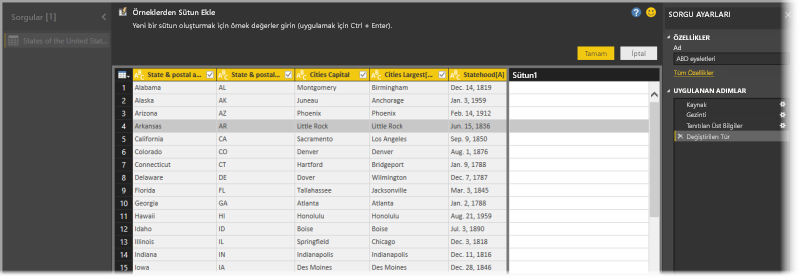
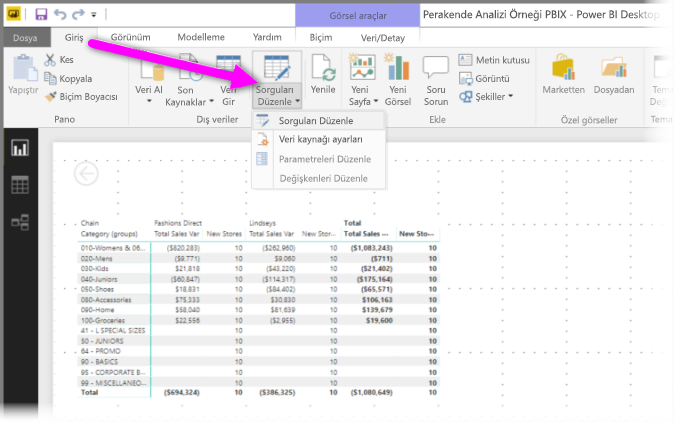
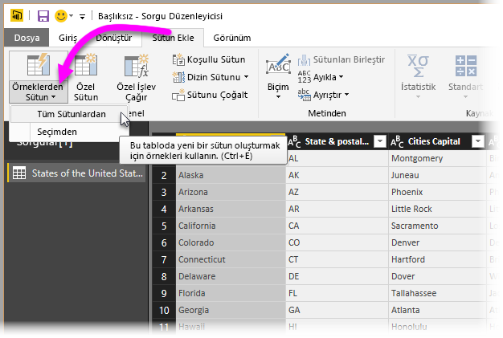
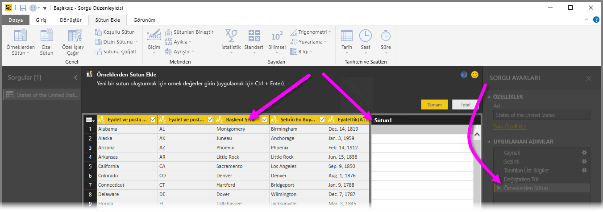
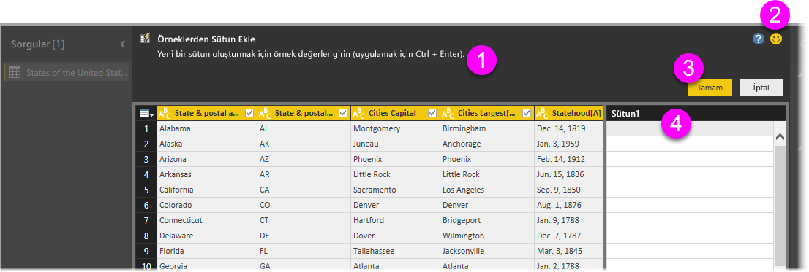
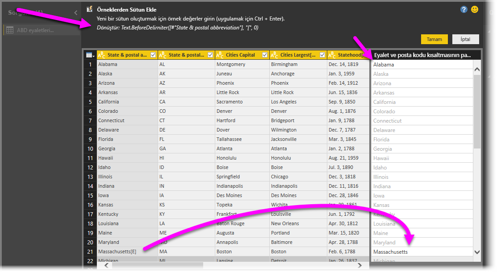

# Power BI Desktop'ta örnekten sütun ekleme
**Power BI Desktop**'ın Nisan 2017 sürümünden itibaren, **Sorgu Düzenleyicisi**'ni kullanarak modelinize yeni veri sütunları ekleyebilirsiniz. Bunun için yeni sütununuzda bir veya daha fazla örnek değer sağlamanız yeterlidir. Geçerli seçimi kullanarak veya bir tablodaki tüm (veya seçili) sütunları temel alan bir giriş sağlayarak yeni bir sütun örneği oluşturabilirsiniz.

Bu yaklaşım hızlı ve kolay bir şekilde yeni sütunlar oluşturmanıza yardımcı olur, ayrıca aşağıdaki durumlar için harikadır:

* Yeni sütununuzda hangi veri sonucunu elde etmek istediğinizi biliyorsunuz ancak hangi dönüştürme işleminin (veya dönüştürme işlemi koleksiyonunun) sizi bu sonuca götüreceğinden emin değilsiniz.
* İhtiyacınız olan dönüştürme işlemlerini zaten biliyorsunuz ama bunları gerçekleştirmek için kullanıcı arabiriminde nereye tıklayacağınızdan veya neyi seçeceğinizden emin değilsiniz.
* **M** dilinde *Özel Sütun* ifadesi kullanarak yapabileceğiniz dönüştürme işlemlerine hakimsiniz ancak söz konusu ifadelerden biri (veya daha fazlası) kullanıcı arabiriminde tıklanabilir veya eklenebilir değil.

**Örneklerden sütun ekleme** özelliğini kullanmak kolay ve basittir. Sonraki birkaç bölümde, ne kadar kolay olduğunu göreceğiz.

## Örneklerden yeni sütun eklemek için Sorgu Düzenleyicisi'ni kullanma
Bir örnekten yeni sütun oluşturmak için **Sorgu Düzenleyicisi**'ni başlatın. Bunu, **Power BI Desktop**'taki **Giriş** şeridinde bulunan **Sorguları Düzenle** seçeneğini belirleyerek yapabilirsiniz.

Bu makalede, aşağıdaki Wikipedia makalesindeki verileri kullanacağız (bu bir bağlantı olduğundan, tıklayarak verileri kendiniz alabilir ve birlikte ilerleyebilirsiniz):

* [**List of states and territories of the United States**](https://wikipedia.org/wiki/List_of_states_and_territories_of_the_United_States) (Amerika Birleşik Devletleri'nin eyaletleri ve bölgeleri listesi)

**Sorgu Düzenleyicisi**'ni başlatıp verileri yüklediğinizde, örneklerden sütün eklemeye başlayabilirsiniz. Yeni bir sütun eklemek için, **Sorgu Düzenleyicisi**'nde şeritteki **Sütun Ekle** sekmesini ve **Örneklerden Sütun**'u seçin. Açılan menüyü seçerseniz **Tüm Sütunlardan** (açılan menü yerine düğmeyi seçerseniz varsayılan seçenek budur) veya **Seçimden** seçeneğini belirleyebilirsiniz. Bu makalede, **Tüm Sütunlardan** seçeneğini belirleyerek ilerleyeceğiz.

## Örneklerden Sütun Ekle bölmesi
Örneklerden yeni bir sütun eklemek üzere seçim yaptığınızda, yeni bir bölme görünür ve geçerli tablodaki sütunları gösterir. (Hepsini görmek için kaydırma yapmanız gerekebilir.) Ayrıca sağ tarafta da **Column1** gösterilir. Bu, **Power BI Desktop**'un örneklerinizden yola çıkarak oluşturduğu sütundur. Yeni **Column1** başlığının altında, Power BI'ın örneğinizle eşleşecek kurallar ve dönüştürmeler oluşturmak için kullandığı örnekleri girebileceğiniz boş hücreler bulunur.

Bunun **Sorgu Ayarları** bölmesindeki bir **Uygulanan Adım** olduğuna da dikkat edin. **Sorgu Düzenleyicisi** her zamanki gibi dönüştürme adımlarınızı kaydeder ve sırasıyla bunları sorguya uygular.

**Örneklerden Sütun Ekle** adı verilen bu bölme dört birincil alandan oluşur:

1. Özelliğin veya dönüştürmenin kısa bir açıklamasını içeren **Komut çubuğu**.
2. Power BI'ın söz konusu özelliği geliştirmesine yardımcı olan **Geri Bildirim Gönder** seçeneği.
3. Dönüştürmelerinizi işleyip sütunu eklemenizi veya iptal etmenizi sağlayan **Tamam** ve **İptal** düğmeleri.
4. Satırlardan herhangi birine, söz konusu satırdaki diğer sütunlarla ilişkili olarak örnek değerlerinizi girebileceğiniz (Power BI'a örneklerinizi sağlamak için) yeni sütun alanı.

Örneğinizi yeni sütuna yazdığınız sırada Power BI, algıladığı dönüştürmeleri temel alarak, oluşturacağı sütunun nasıl görüneceğine ilişkin bir önizleme sunar. Örneğin, tablonun ilk sütunundaki *Alabama* değerine karşılık olarak ilk satıra *Alabama* yazdık. Biz *Enter* tuşuna basar basmaz Power BI bu değeri temel alarak sütunu doldurur.

Ama sonra *Masssachusetts[E]* yazan satıra gittik ve sonundaki *[E]*yi (istemediğimiz için sildik. Power BI değişimi algıladı ve örneği kullanarak bir dönüştürme oluşturdu. Orta bölmenin üst kısmındaki dönüşüm açıklamasına dikkat edin.

Siz örnek sağlamaya devam ettiğiniz sırada, **Sorgu Düzenleyicisi** dönüştürmelere ekleme yapar. Memnun kaldığınızda, **Tamam**'ı seçip değişikliklerinizi işleyebilirsiniz.

## Örneklerden Sütun Ekle'nin nasıl çalıştığını görün
Nasıl çalıştığını görmek ister misiniz? Aşağıdaki videoda, bu örneğin önceki bölümlerinde sunulan veri kaynağından yararlanılarak, bu özelliğin nasıl kullanıldığı uygulamalı olarak gösterilmektedir. Bir göz atın ve birlikte ilerleyin!

<iframe width="560" height="315" src="https://www.youtube.com/embed/-ykbVW9wQfw" frameborder="0" allowfullscreen></iframe>

## Önemli noktalar ve sınırlamalar
**Örneklerden Sütun Ekle**'yle kullanılabilen birçok dönüştürme vardır, ancak tüm dönüştürmeler bu özelliğin kapsamında değildir. Aşağıdaki listede, *desteklenen* tüm dönüştürmeler sunulmuştur.

* **Başvuru**
  
  * Belirli bir sütuna yönelik başvuru (kırpma, temizleme ve büyük/küçük harf dönüştürmeleri dahil)

* **Metin dönüştürmeleri**
  
  * Birleştir (hazır dize ve tam sütun değerlerinin birleştirilmesini destekler)
  * Değiştir
  * Uzunluk
  * Ayıkla   
    * İlk Karakterler
    * Son Karakterler
    * Aralık
    * Sınırlandırıcıdan Önce Gelen Metin
    * Sınırlandırıcıdan Sonra Gelen Metin
    * Sınırlandırıcılar Arasındaki Metin
    * Uzunluk

* Aşağıdaki desteklenen **metin dönüştürmeleri**, **Power BI Desktop**'ın Kasım 2017 sürümü itibarıyla kullanılabilir:
    
  * Karakterleri Kaldır
  * Karakterleri Tut

> [!NOTE]
> Tüm *Metin* dönüştürmeleri, sütun değerinin kırpılması, temizlenmesi veya sütun değerine büyük/küçük harf dönüştürmesi uygulanması gerekebileceğini hesaba katar.
> 
> 

* **Tarih dönüştürmeleri**
  
  * Gün
  * Haftanın Günü
  * Haftanın Günü Adı
  * Yılın Günü
  * Ay
  * Ayın Adı
  * Yılın Çeyreği
  * Ayın Haftası
  * Yılın Haftası
  * Yıl
  * Yaş
  * Yıl Başı
  * Yıl Sonu
  * Ay Başı
  * Ay Sonu
  * Çeyrek Başı
  * Ayın Günleri
  * Çeyrek Sonu
  * Hafta Başı
  * Hafta Sonu
  * Ayın Günü
  * Günün Başlangıcı
  * Gün Sonu

* **Saat dönüştürmeleri**
  
  * Saat
  * Dakika
  * Saniye  
  * Yerel Saat Olarak

> [!NOTE]
> Tüm *Tarih* ve *Saat* dönüştürmeleri, sütun değerinin *Tarih*, *Saat* veya *Tarih/Saat* olarak dönüştürülmesi gerekebileceğini hesaba katar.
> 
> 

* **Sayı dönüştürmeleri** 

  * Mutlak Değer
  * Arkkosinüs
  * Arksinüs
  * Arktanjant
  * Sayıya Dönüştür
  * Kosinüs
  * Küp
  * Böl
  * Üs
  * Faktöriyel
  * Tam Sayı-Böl
  * Çifttir
  * Tektir
  * Ln
  * 10 Tabanında Logaritma
  * Mod
  * Çarp
  * Aşağı Yuvarla
  * Yukarı Yuvarla
  * İşaret
  * Sinüs
  * Karekök
  * Kare
  * Çıkar
  * Toplam
  * Tanjant

* Aşağıdaki desteklenen **sayı dönüştürmeleri**, **Power BI Desktop**'ın Kasım 2017 sürümü itibarıyla kullanılabilir:

  * Gruplandırma/Aralıklar

* **Genel**
  
  * Koşullu Sütun