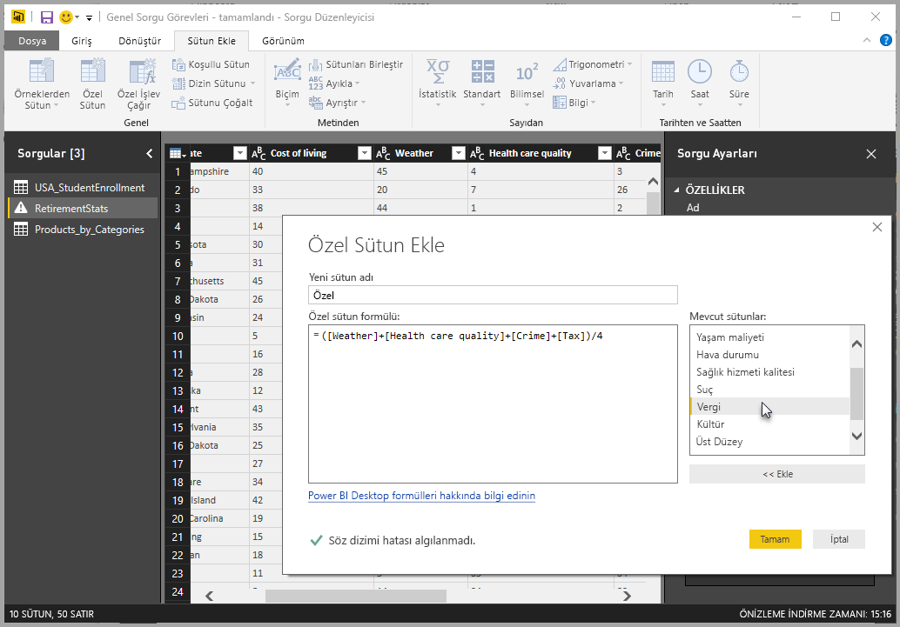
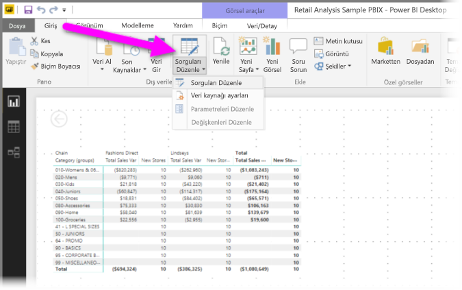
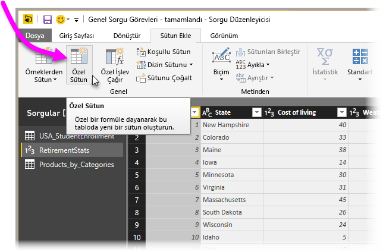
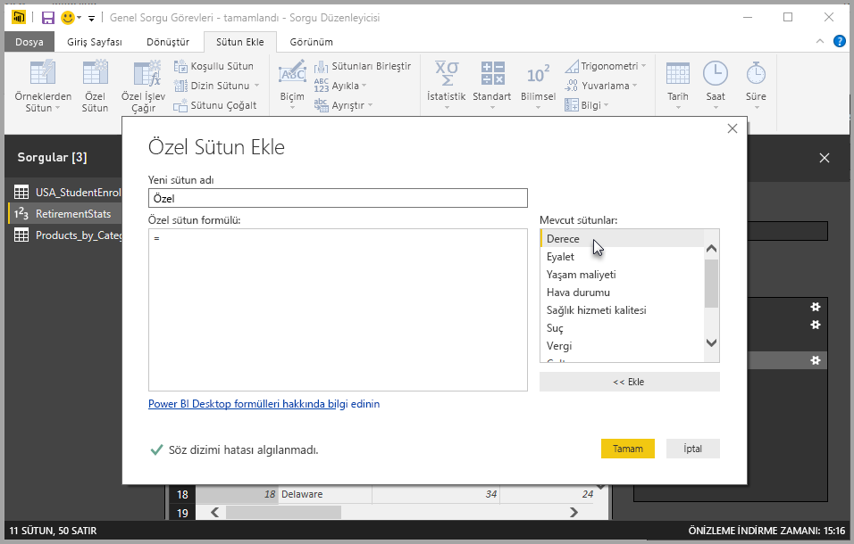
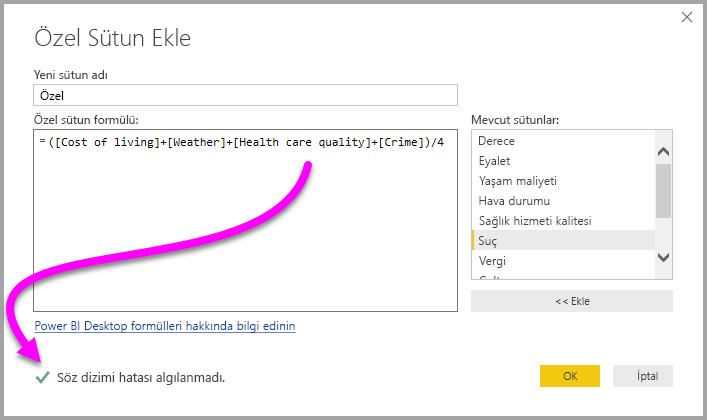
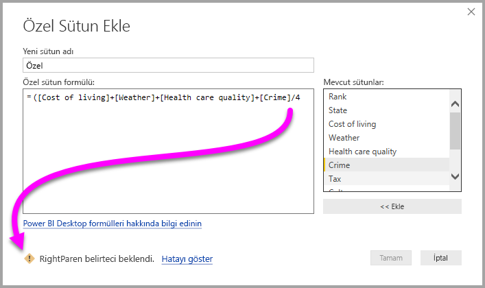
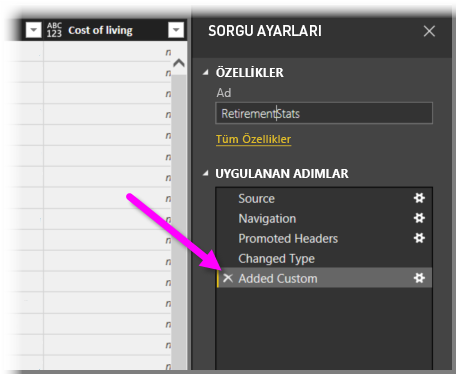
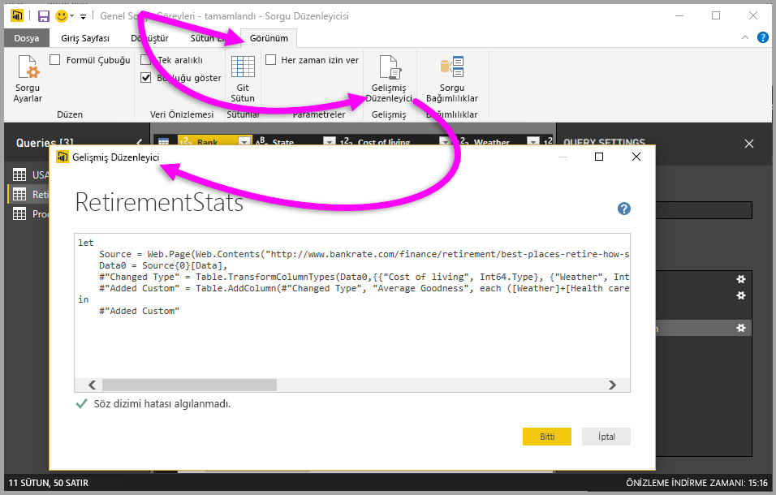

# Power BI Desktop'ta özel sütun ekleme
**Power BI Desktop**'taki **Sorgu Düzenleyicisi**'ni kullanarak modelinize veri içeren yeni bir özel sütunu kolayca ekleyebilirsiniz. Özel sütununuzu tanımlayan [M formüllerini](https://msdn.microsoft.com/library/mt270235.aspx) oluşturmaya yönelik kullanışlı tuşlar yardımıyla özel sütununuzu oluşturabilir ve yeniden adlandırabilirsiniz. M formülü, [kapsamlı bir işlev başvurusu içerik kümesine](https://msdn.microsoft.com/library/mt779182.aspx) sahiptir. 

Özel sütun oluşturma, **Sorgu Düzenleyicisi**'nde oluşturduğunuz sorgu için **Uygulanan Adımlar**'dan biridir. Bu da değiştirilebileceği, öne veya arkaya taşınabileceği ya da istendiğinde düzenlenebileceği anlamına gelir.

## Yeni özel sütun eklemek için Sorgu Düzenleyicisi'ni kullanma
Yeni özel sütun oluşturmak için **Sorgu Düzenleyicisi**'ni başlatın. Bunu, **Power BI Desktop**'taki **Giriş** şeridinden **Sorguları Düzenle** seçeneğini belirleyerek yapabilirsiniz.

**Sorgu Düzenleyicisi**'ni başlattıktan ve veri yükledikten sonra, şeritteki **Sütun Ekle** sekmesini seçip **Özel Sütun** seçeneğini belirleyerek özel sütun ekleyebilirsiniz.

Bir sonraki bölümde ele alacağımız **Özel Sütun Ekle** penceresi görüntülenir.

## Özel Sütun Ekle penceresi
**Özel Sütun Ekle** penceresindeyken, kullanılabilir alanların listesini sağ bölmede, özel sütununuzun adını ise üstte (yeniden adlandırmak için bu metin kutusuna yeni bir ad girmeniz yeterlidir) görürsünüz. Ayrıca bu pencerede, sağ bölmeden alan ekleyerek, işleçler yerleştirerek ve başka işlemlerle oluşturduğunuz (veya yazdığınız), yeni özel sütununuzun tanımlanacağı [**M** formülünü](https://msdn.microsoft.com/library/mt779182.aspx) de görüntülersiniz. 

## Özel sütununuz için formül oluşturma
Sağ taraftaki **Mevcut sütunlar:** listesinden bir alan seçebilir ve alanı özel sütun formülüne eklemek için **<< Ekle** seçeneğini belirleyebilirsiniz. Ayrıca, listedeki bir sütuna çift tıklayarak da söz konusu sütunu ekleyebilirsiniz.

Siz formülü yazarken ve sütununuzu oluştururken, pencerenin alt kısmında, herhangi bir söz dizimi hatasının algılanıp algılanmadığını gerçek zamanlı olarak (yazdığınız sırada) belirten bir göstergeyle karşılaşırsınız. Herhangi bir sorun yoksa yeşil bir onay işareti görürsünüz.

Ancak söz diziminizde hata varsa algılanan hatanın yanı sıra imleci (formülünüzde) hatanın algılandığı yere yerleştiren bir bağlantıyla birlikte sarı bir uyarı simgesiyle karşılaşırsınız.

**Tamam**'ı seçtiğinizde, özel sütununuz modele eklenir ve sorgunuzun **Uygulanan Adımlar**'ında **Özel Eklendi** yer alır.

**Uygulanan Adımlar** bölmesindeki **Özel Eklendi** seçeneğine çift tıklamanız halinde, oluşturduğunuz özel sütun formülünün, gerekli değişiklikleri yapabilmeniz için hazır olarak yüklendiği **Özel Sütun Ekle** penceresi tekrar görünür.

## Özel Sütunlar için Gelişmiş Düzenleyici'yi kullanma
**Gelişmiş Düzenleyici**'yi kullanarak da özel bir sütun oluşturabilirsiniz. (Ayrıca sorgunuzun herhangi bir adımını değiştirebilirsiniz.) **Sorgu Düzenleyicisi**'ndeki **Görünüm** sekmesini seçip **Gelişmiş Düzenleyici** seçeneğini belirleyerek **Gelişmiş Düzenleyici**'yi görüntüleyebilirsiniz.

**Gelişmiş Düzenleyici**, sorgunuz üzerinde tam denetime sahip olmanızı sağlar.

## Sonraki adımlar
**Sorgu Düzenleyicisi**'ne sunduğunuz örnekleri temel alan bir sütun oluşturma gibi, özel sütun oluşturmak için uygulanabilecek başka yöntemler de vardır. Örneklerden özel sütunlar oluşturma ile ilgili daha fazla bilgi için şu makaleye bakın:

* [Add a column from an example in Power BI Desktop (Power BI Desktop'ta örnekten sütun ekleme)](desktop-add-column-from-example.md)
* [M formül diline giriş](https://msdn.microsoft.com/library/mt270235.aspx)
* [M işlevi başvurusu](https://msdn.microsoft.com/library/mt779182.aspx)  

