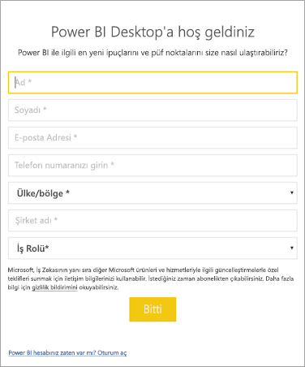

# <a name="how-administrators-can-manage-the-power-bi-desktop-sign-in-form"></a>Yöneticiler için Power BI Desktop oturum açma formunu yönetme seçenekleri
Power BI Desktop uygulaması ilk kez açıldığında bir oturum açma formu görüntülenir. Devam etmek için, istenen bilgiler girilebilir veya Power BI'da oturum açılabilir. Yöneticiler bu formu kayıt defteri anahtarı kullanarak yönetebilir. 



Yöneticiler aşağıdaki kayıt defteri anahtarını kullanarak oturum açma formunu devre dışı bırakabilir. Bu, genel ilkeler kullanılarak kuruluşun tamamına da uygulanabilir.

```
Key: HKEY_LOCAL_MACHINE\SOFTWARE\Policies\Microsoft\Power BI Desktop
valueName: ShowLeadGenDialog
```

0 değeri girildiğinde iletişim kutusu devre dışı bırakılır.

Başka bir sorunuz mu var? [Power BI Topluluğu'na sorun](http://community.powerbi.com/)

