# Power BI Desktop'ta Toplamalar (Önizleme)

Power BI'da **toplamaları** kullanarak büyük verilerde önceden mümkün olmayan etkileşimli analizler gerçekleştirebilirsiniz. **Toplamalar**, karar almak için büyük veri kümelerinden faydalanma maliyetlerini önemli ölçüde düşürebilir.

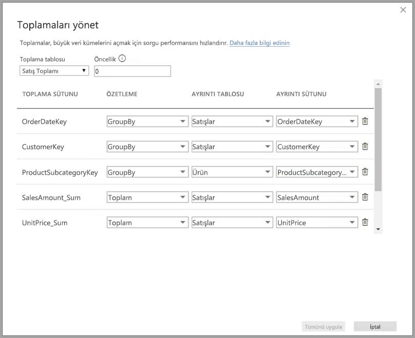

**Toplamaları** kullanmanın avantajları aşağıda listelenmiştir:

* **Büyük veri kümelerinde sorgu performansı**: Kullanıcılar Power BI raporlarındaki görsellerle etkileşimli çalışırken, veri kümesine DAX sorguları gönderilir. Toplama düzeyinde verileri önbelleğe alarak ayrıntı düzeyinde gereken kaynakların küçük bir bölümünü kullanıp sorgu düzeylerini artırın. Büyük verilerden eskiden mümkün olmayan bir şekilde faydalanın.
* **Veri yenileme iyileştirmesi**: Verileri toplama düzeyinde önbelleğe alarak önbellek boyutlarını ve yenileme sürelerini azaltın. Verilerin kullanıcılara sunulması sürecini hızlandırın.
* **Dengeli mimariler elde edin**: Toplu sorguların etkili bir şekilde işlenmesi için işi Power BI'ın bellek içi önbelleğine bırakın. Veri kaynağına gönderilen sorguları DirectQuery moduyla sınırlayın ve eşzamanlılık sınırlarında kalın. Geçen sorgular genellikle veri ambarı ve büyük veri sistemlerinin iyi bir şekilde işlediği filtrelenmiş ve işlem düzeyindeki sorgular olur.

### Tablo düzeyi depolama
Toplamalar özelliği ile normalde tablo düzeyi depolama kullanılır. Daha fazla bilgi için bkz. [Power BI Desktop’ta depolama modu (Önizleme)](desktop-storage-mode.md).

### Veri kaynağı türleri
Toplamalar veri ambarları ve veri reyonları gibi boyutlu modelleri temsil eden veri kaynaklarının yanı sıra Hadoop tabanlı büyük veri kaynakları için kullanılır. Bu makalede her veri kaynağı türü için Power BI'daki tipik modelleme farkları açıklanmaktadır.

Tüm Power BI İçeri Aktarma ve (çok boyutlu olmayan) DirectQuery kaynakları toplamalarla çalışır.

## Toplamalar önizleme özelliğini etkinleştirme

**Toplamalar** özelliği Önizleme aşamasındadır ve **Power BI Desktop**'ta etkinleştirilmesi gerekir. **Toplamalar** özelliğini etkinleştirmek için, **Dosya > Seçenekler ve Ayarlar > Seçenekler > Önizleme Özellikleri**’ni seçin ve ardından **bileşik modeller** ve **Toplamaları yönet** onay kutusunu işaretleyin. 

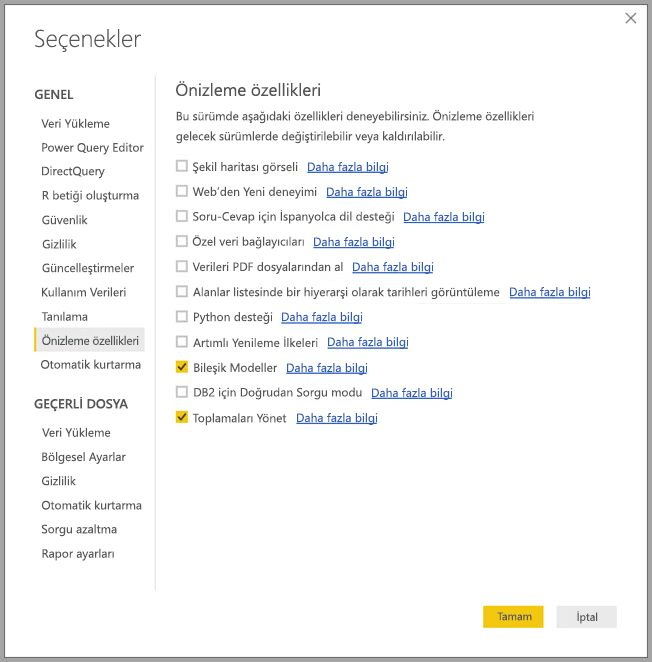

Özelliğin etkinleştirilmesi için **Power BI Desktop**'ı yeniden başlatmanız gerekir.

## İlişkilere dayanan toplamalar

İlişkilere dayanan **toplamalar** genellikle boyutlu modellerle birlikte kullanılır. Kaynak olarak veri ambarlarını ve veri reyonlarını kullanan Power BI veri kümeleri, aralarında ilişki bulunan boyut tabloları ve olgu tablolarından oluşan yıldız/kar tanesi şemalarına benzer.

Aşağıdaki tek bir veri kaynağından oluşan modeli inceleyin. Başlangıç için tüm tabloların DirectQuery kullandığını kabul edelim. **Sales** olgu tablosunda milyarlarca satır bulunur. Önbellek için **Sales** tablosunun depolama modunu **İçeri Aktarma** olarak belirlemek yüksek bellek ve yönetim yüküne neden olacaktır.

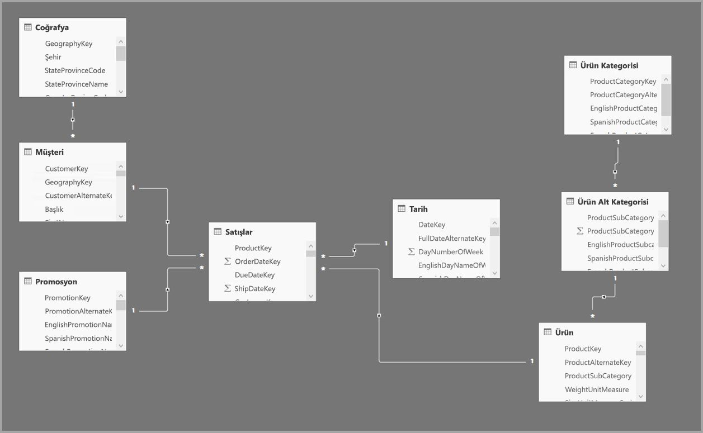

Bunun yerine bir toplama tablosu olan **Sales Agg** tablosunu oluşturuyoruz. Ayrıntı düzeyi **Sales** tablosundan daha yüksek olduğundan satır sayıcı çok daha az olacaktır. Satır sayısı **CustomerKey**, **DateKey** ve **ProductSubcategoryKey** ölçütlerine göre gruplandırılmış **SalesAmount** toplamıyla eşit olmalıdır. Satır sayısı milyar yerine milyon seviyesine inerek yönetilmesi daha kolay bir tablo sunabilir.

Şimdi aşağıdaki boyut tablolarının sorgular için en çok kullanılan ve en yüksek iş değerine sahip tablolar olduğunu düşünelim. Bunlar **Sales Agg** tablosunu *bir-çok* (veya *çok-bir*) ilişkilerini kullanarak filtreleyecek tablolardır. *Çok-çok* veya *çok kaynaklı* gibi diğer ilişki türleri toplamalarda kullanılmaz.

* Coğrafya
* Customer
* Tarih
* Ürün Alt Kategorisi
* Ürün Kategorisi

Aşağıdaki görüntüde bu model gösterilmektedir.

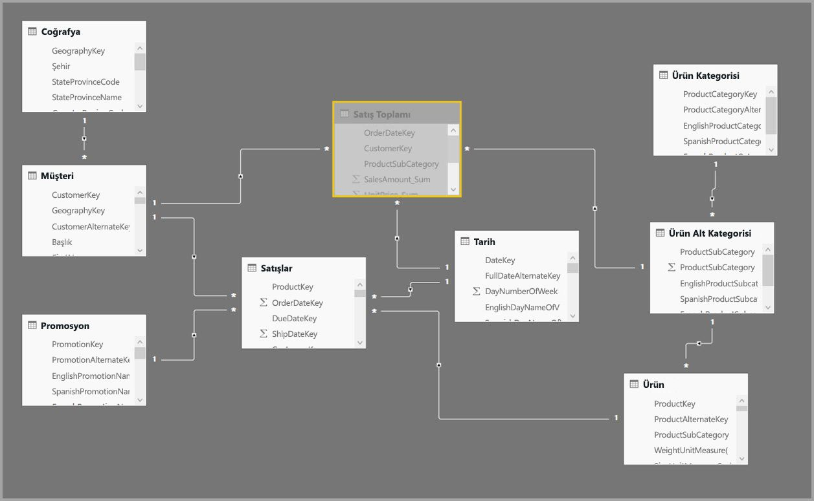

> [!NOTE]
> **Sales Agg** tablosu da bir tablo olduğundan farklı şekillerde yüklenme esnekliğine sahiptir. Örneğin ETL/ELT işlemleri veya tablo için [M ifadesi](https://msdn.microsoft.com/query-bi/m/power-query-m-reference) kullanılarak kaynak veritabanında toplama işlemleri gerçekleştirilebilir. [Power BI Premium'da artımlı yenilemeyi](service-premium-incremental-refresh.md) kullanarak veya kullanmadan İçeri aktarma depolama modunu kullanabilir veya DirectQuery olabilir ve [columnstore dizinleri](https://docs.microsoft.com/sql/relational-databases/indexes/columnstore-indexes-overview) kullanılarak hızlı sorgular için iyileştirilebilir. Bu esneklik performans sorunlarından kaçınmak için sorgu yükünü yayan dengeli mimarileri mümkün kılar.

### Depolama modu 
Kullandığımız örnek üzerinden devam edelim. Sorguları hızlandırmak için **Sales Agg** tablosunun depolama modunu **İçeri Aktarma** olarak ayarlamıştık.

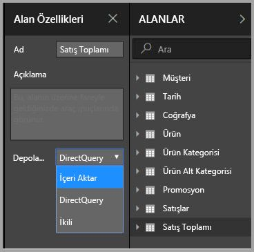

Bunu yaptığımızda aşağıdaki iletişim kutusu açılır ve ilgili boyut tablolarının **İkili** depolama moduna ayarlanacağını bildirir. 

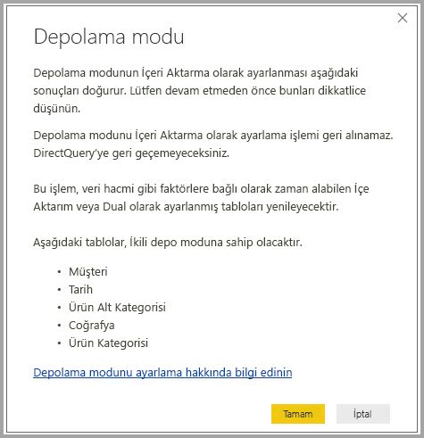

Boyut tablolarının **İkili** olarak ayarlanması alt sorguya bağlı olarak İçeri Aktarma veya DirectQuery olarak davranmalarını sağlar.

* İçeri Aktarma türündeki **Sales Agg** tablosunda bulunan ölçümleri toplayan sorgular ve ilgili İkili tablolardan alınan gruplandırma ölçütü öznitelikleri bellek içi önbellekten döndürülebilir.
* DirectQuery türündeki **Sales** tablosunda bulunan ölçümleri toplayan sorgular ve ilgili İkili tablolardan alınan gruplandırma ölçütü öznitelikleri DirectQuery modunda döndürülebilir. Gruplandırma ölçütü işlemini içeren sorgu mantığı kaynak veritabanına gönderilir.

**İkili** depolama modu hakkında daha fazla bilgi için [depolama modu](desktop-storage-mode.md) makalesini inceleyin.

> Not: **Sales Agg** tablosu gizlidir. Toplama tablolarının veri kümesi kullanıcılarından gizlenmesi gerekir. Kullanıcılar ve sorgular toplama tablosuna değil ayrıntı tablosuna başvurur. Toplama tablosunun var olduğundan dahi haberleri olmasına gerek yoktur.

### Toplamaları yönetme iletişim kutusu
Şimdi toplamaları tanımlayacağız. **Sales Agg** tablosuna sağ tıklayın ve açılan bağlam menüsünden **Toplamaları yönet**'i seçin.

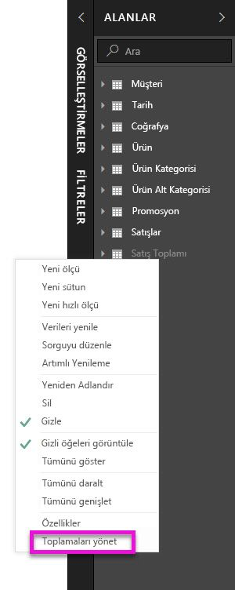

**Toplamaları yönet** iletişim kutusu görüntülenir. **Sales Agg** tablosundaki her sütun için bir satır bulunur ve buradan toplama davranışını belirleyebilirsiniz. **Sales** tablosuna başvuran Power BI veri kümesi sorguları **Sales Agg** tablosuna yönlendirilir. Veri kümesi kullanıcılarının **Sales Agg** tablosunun varlığından haberdar olmasına gerek yoktur.

Aşağıdaki tabloda **Sales Agg** tablosunun toplamaları gösterilmiştir.

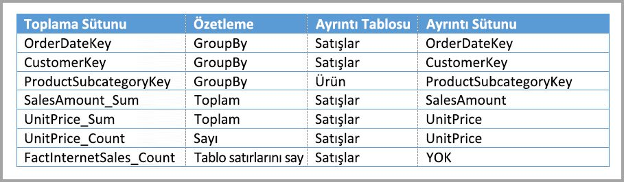

#### Özetleme işlevi

Özetleme açılan menüsünden aşağıdaki seçimleri yapabilirsiniz.
* Sayı
* GroupBy
* Maks
* Min
* Toplam
* Tablo satırlarını say

#### Doğrulamalar

İletişim kutusu aşağıdaki doğrulamaları gerçekleştirir:

* Seçilen ayrıntı sütununun veri türü Sayı ve Tablo satırlarını say özetleme işlevlerinin dışında toplama sütunuyla aynı veri türüne sahip olmalıdır. Sayı ve Tablo satırlarını say işlevleri yalnızca tamsayı toplama sütunları için sunulur ve veri türünün eşleşmesi gerekmez.
* Üç veya daha fazla tabloyu kapsayan zincirleme toplamalara izin verilmez. Örneğin **A Tablosunda** **C Tablosuna** başvuran toplamalara sahip olan **B Tablosuna** başvuran toplamalar ayarlanamaz.
* İki girişin aynı özetleme işlevini kullandığı ve aynı ayrıntı tablosuna/sütununa başvurduğu yinelenen toplamalara izin verilmez.

**Toplamaların** genel önizleme sürümünde aşağıdaki doğrulamalar da zorlanır. Genel kullanıma sunma öncesinde bu doğrulamaları kaldırmayı planlıyoruz.

* Toplamalarda satır düzeyi güvenlik (RLS) kullanılamaz. *Genel önizleme sınırlaması.*
* Ayrıntı tablosunun DirectQuery olması gerekir, İçeri Aktarma olamaz. *Genel önizleme sınırlaması.*

Buna benzer doğrulamaların çoğu aşağıdaki görüntüde olduğu gibi açılan menü değerlerini devre dışı bırakarak ve araç ipucunda açıklama metni görüntülenerek zorlanır.

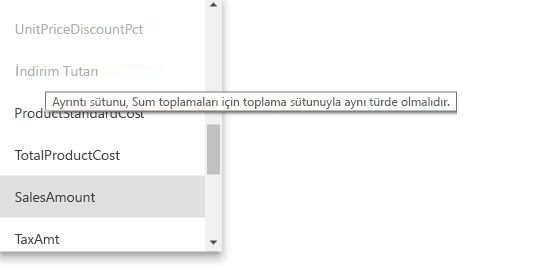

### Gruplandırma ölçütü sütunları

Bu örnekteki üç GroupBy girişi isteğe bağlıdır ve toplama davranışını etkilemez (bir sonraki görüntüde gösterilen DISTINCTCOUNT örnek sorgusu hariç). Bu girişler verilerin daha kolay okunabilmesi için dahil edilmiştir. Bu GroupBy girişleri olmadan da toplamalar ilişkilere göre sonuç verecektir. Bu durum toplamaları ilişki olmadan kullanma davranışından farklıdır ve makalenin ilerleyen bölümlerindeki büyük veri örneğinde daha ayrıntılı bir şekilde ele alınacaktır.

### Sorguların toplamalara isabet edip etmeyeceğini tespit etme

Sorguların bellek içi önbellekten mi (depolama motoru) yoksa SQL Profiler kullanarak DirectQuery kaynağından (veri kaynağına gönderilen) mı döndürüldüğünü belirleme hakkında daha fazla bilgi için [depolama modu](desktop-storage-mode.md) makalesini inceleyin. Bu işlem toplamaların isabet alıp almadığını belirlemek için de kullanılabilir.

Buna ek olarak SQL Profiler'da aşağıdaki genişletilmiş olay da sağlanmıştır.

    Query Processing\Aggregate Table Rewrite Query

Aşağıdaki JSON kod parçacığında, toplama kullanıldığında elde edilen olay çıktısı örneği gösterilmektedir.

* **matchingResult**, alt sorgu için bir toplama kullanıldığını gösterir.
* **dataRequest**, alt sorgu tarafından kullanılan gruplandırma ölçütü sütunlarını ve toplu sütunları gösterir.
* **mapping**, toplama tablosundaki sütunların eşlenmiş olduğu sütunları gösterir.

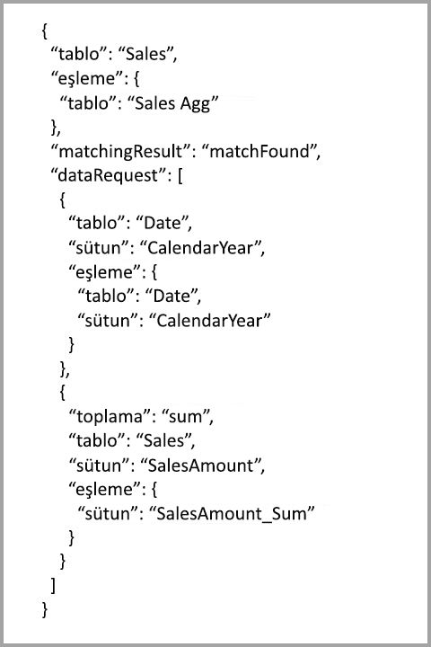

### Sorgu örnekleri
*Date* tablosundaki sütunlar toplamaya isabet edebilecek ayrıntı düzeyinde olduğundan aşağıdaki sorgu toplamaya isabet eder. **SalesAmount** için **Sum** toplaması kullanılır.

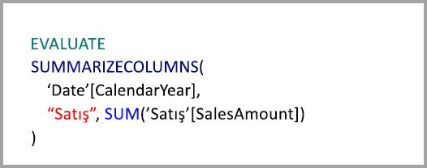

Aşağıdaki sorgu toplamaya isabet etmeyecektir. **SalesAmount** tablosunun toplamını istemesine rağmen toplamaya isabet edebilecek ayrıntı düzeyinde olmayan **Product** tablosundaki bir sütunla gruplandırma işlemi gerçekleştirmektedir. Modeldeki ilişkileri incelerseniz bir ürün alt kategorisinde birden fazla **Product** satırı olabileceğini görürsünüz. Sorgu, toplama yapılacak ürünü belirleyemeyecektir. Sorgu bu durumda DirectQuery modeline döner ve veri kaynağına bir SQL sorgusu gönderir.

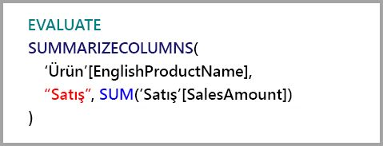

Toplamalar, yalnızca bir toplama işlemi gerçekleştiren basit hesaplama adımları değildir. Karmaşık hesaplamalar da toplamalardan faydalanabilir. Kavramsal açıdan karmaşık bir hesaplama işlemi SUM, MIN, MAX ve COUNT alt sorgularına ayrılır ve her alt sorgu toplama isabeti açısından değerlendirilir. Bu mantık sorgu planı uygulaması nedeniyle her durumda geçerli olmayabilir ancak genellikle uygulanır. Aşağıdaki örnek toplamaya isabet edecektir:

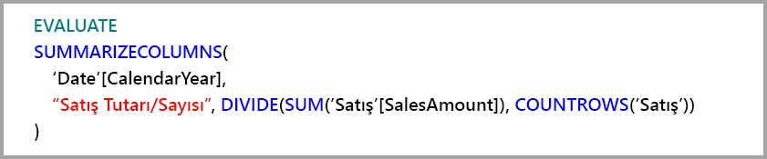

COUNTROWS işlevi toplamalardan yararlanabilir. **Sales** tablosu için tanımlanmış bir **Count** tablo satırı toplaması bulunduğundan aşağıdaki sorgu toplamaya isabet edecektir.

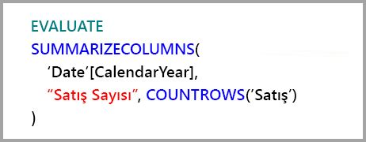

AVERAGE işlevi toplamalardan yararlanabilir. AVERAGE, COUNT ile bölünen bir SUM sorgusuna dönüştürüldüğünden aşağıdaki sorgu toplamaya isabet edecektir. **UnitPrice** sütununda hem SUM hem de COUNT için tanımlanmış toplamalar bulunduğundan toplamaya isabet eder.

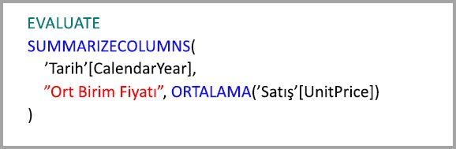

Bazı durumlarda DISTINCTCOUNT işlevi de toplamaları kullanabilir. Toplama tablosundaki **CustomerKey** sütununun benzersizliğini koruyan **CustomerKey** GroupBy girişi olduğundan aşağıdaki sorgu toplamaya isabet edecektir. İki ile beş milyon arasındaki benzersiz değerlerin aşılması sorgu performansını etkileyebileceğinden bu teknik de performans eşiğine tabi olacaktır. Ancak ayrıntı tablosunda milyarlarca satır ve sütunda iki ile beş milyon arasında benzersiz değer bulunan senaryolarda faydalı olabilir. Bu durumda benzersiz sayı, önbelleğe alınmış olsa dahi milyarlarca satıra sahip bir tabloyu taramaktan daha hızlı bir performans sergileyebilir.

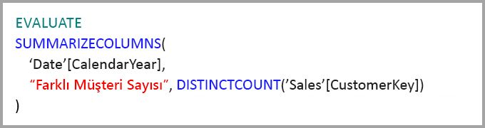

## Gruplandırma ölçütü sütunlarını temel alan toplamalar 

Hadoop tabanlı büyük veri modellerinin özellikleri boyutlu modellerden farklıdır. Büyük tablolardaki birleşimlerden kaçınmak için genellikle ilişkileri kullanmazlar. Bunun yerine boyut öznitelikleri genellikle olgu tabloları olacak şekilde normalleştirilmişlikten çıkarılır. Bu büyük veri modellerinde gruplandırma ölçütü sütunlarını temel alan **toplamalar** kullanılarak etkileşimli analiz gerçekleştirilebilir.

Aşağıdaki tabloda toplanacak **Movement** sayısal sütunu bulunmaktadır. Diğer tüm sütunlar gruplandırma ölçütü öznitelikleridir. Tabloda IoT verileri ve çok sayıda satır vardır. Depolama modu DirectQuery olarak belirlenmiştir. Veri hacminin çok büyük olması nedeniyle veri kümesinin tamamında toplanan veri kaynağıyla ilgili sorgular yavaş gerçekleşmektedir.

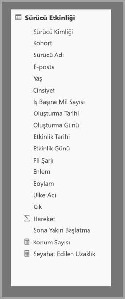

Bu veri kümesinde etkileşimli analizi etkinleştirmek için özniteliklerin çoğuna göre gruplandırma yapan ancak boylam ve enlem gibi kardinalite özniteliklerini dışlayan bir toplama tablosu ekleyebiliriz. Bu işlem satır sayısını önemli ölçüde azaltır ve bellek içi önbelleğe rahatça sığacak kadar küçük hale getirir. **Driver Activity Agg** için İçeri Aktarma depolama modu kullanılmıştır.

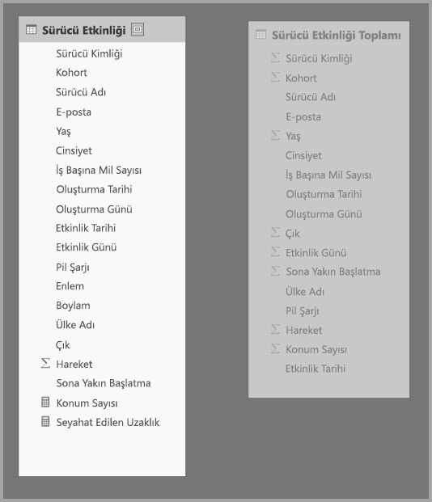

Ardından **Toplamaları yönet** iletişim kutusunda toplama eşlemelerini tanımlamamız gerekir. **Driver Activity Agg** tablosundaki her sütun için bir satır görüntülenir ve buradan toplama davranışını belirleyebiliriz.

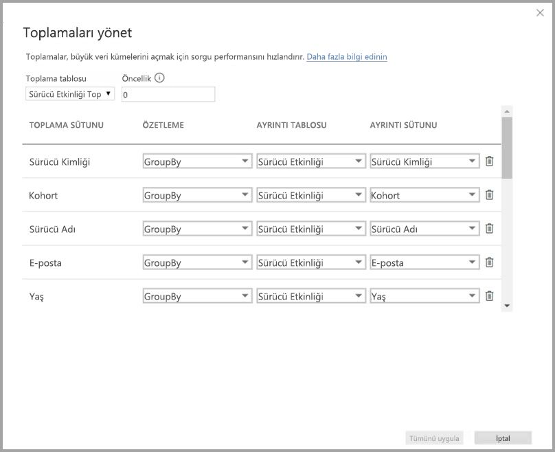

Aşağıdaki tabloda **Sales Agg** tablosunun toplamaları gösterilmiştir.

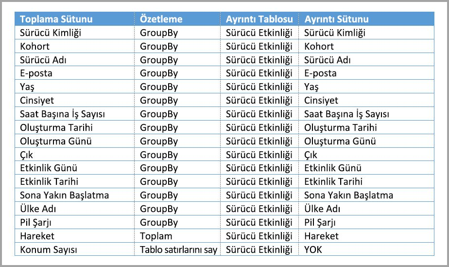

### Gruplandırma ölçütü sütunları

Bu örnekte **GroupBy** girişleri **isteğe bağlı değildir**. Onlar olmadan toplamalar isabet almayacaktır. Bu işlem, ilişkilere dayalı toplamalar kullanmaya kıyasla farklı bir davranış sergiler ve bu durum, bu makalenin önceki bölümlerinde sunulan boyutlu model örneğinde ele alınmıştır.

### Sorgu örnekleri

**Activity Date** sütunu toplama tablosunun kapsamında olduğundan aşağıdaki sorgu toplamaya isabet edecektir. Tablo satırlarını say toplaması COUNTROWS işlevi tarafından kullanılmıştır.

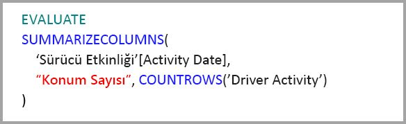

Tablo satırlarını say toplamalarını kullanmak özellikle olgu tablolarında filtre özniteliklerini içeren modeller için iyi bir fikirdir. Power BI, kullanıcı tarafından açıkça istenmediği durumlarda sorguları veritabanına COUNTROWS kullanarak gönderebilir. Örneğin filtre iletişim kutusunda her değer için satır sayısı gösterilmektedir.

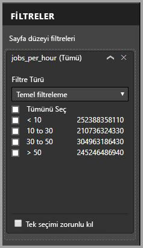

## Toplama önceliği

Toplama önceliği, tek bir alt sorgunun birden fazla toplama tablosu tarafından değerlendirilmesini sağlar.

Aşağıdaki örneği inceleyin. Birden fazla DirectQuery kaynağı içeren bir [bileşik modeldir](desktop-composite-models.md).

* **Driver Activity Agg2** İçeri Aktarma tablosu, gruplandırma ölçütü öznitelikleri az ve düşük kardinaliteye sahip olduğundan yüksek ayrıntı düzeyindedir. Satır sayısı binlere indiğinden bellek içi önbelleğe kolayca sığabilir. Bu öznitelikler yüksek profilli bir yönetici panosunda kullanılacağından ilgili sorguların mümkün olduğunca hızlı olması gerekir.
* **Driver Activity Agg** tablosu DirectQuery modundaki bir ara toplama tablosudur. Bir milyardan fazla satır içermektedir ve columnstore dizinleri kullanılarak iyileştirilmiştir.
* **Driver Activity** tablosu DirectQuery türündedir ve bir büyük veri sisteminden alınan trilyonlarca IoT verisi satırına sahiptir. Bağımsız IoT değerlerinin denetlenen filtre bağlamlarında görüntülenmesi için ayrıntılandırma sorgularını destekler.

Bu modelin bellek ayak izi oldukça küçüktür ancak çok büyük bir veri kümesine erişim sağlamaktadır. Sorgu yükünü mimarinin bileşenlerine dağıttığından ve her bileşenin güçlü olduğu yönleri kullandığından dengeli bir mimariyi temsil etmektedir.

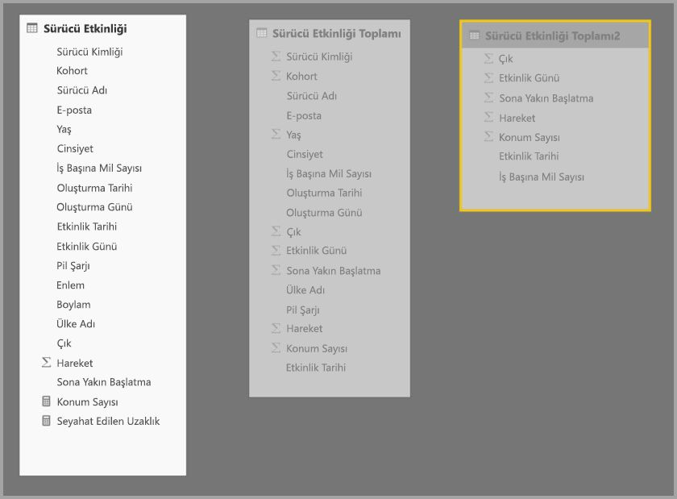

**Driver Activity Agg2** tablosunun **Toplamaları yönet** iletişim kutusundaki *Öncelik* değeri 10 olarak belirlenmiştir. Bu değer **Driver Activity Agg** tablosundan yüksektir ve bu nedenle toplamaları kullanan sorgular tarafından ilk olarak kullanılacaktır. **Driver Activity Agg2** tarafından yanıtlanabilecek ayrıntı düzeyinde olmayan alt sorgular **Driver Activity Agg** tablosunu kullanacaktır. İki toplama tablosu tarafından da yanıtlanamayacak ayrıntılı sorgular **Driver Activity** tablosuna yönlendirilecektir.

Zincirleme toplamalara izin verilmediğinden **Ayrıntı Tablosu** sütununda **Driver Activity Agg** değil **Driver Activity** tablosu belirtilmiştir (bu makalenin önceki bölümlerinde bulunan [doğrulamalar](#validations) bölümünü inceleyin).

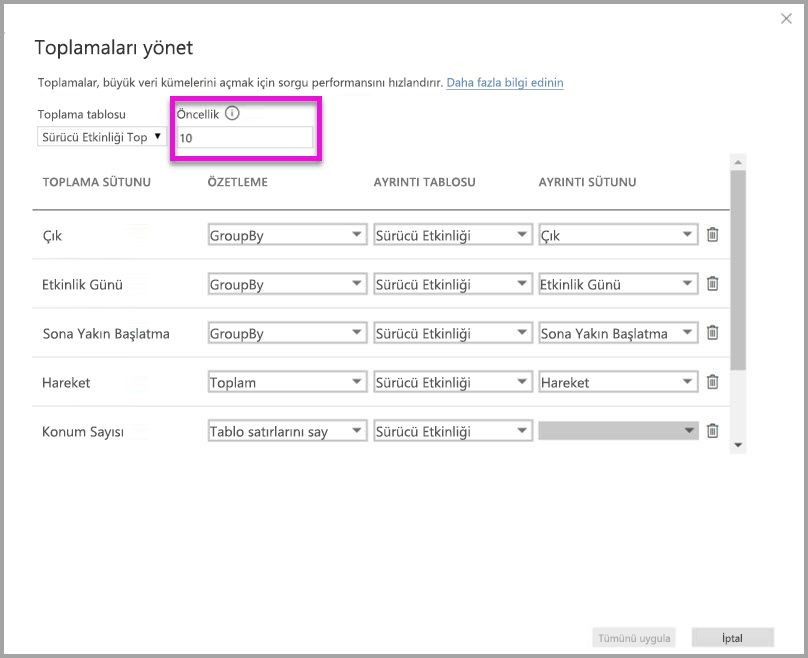

Aşağıdaki tabloda **Sales Agg** tablosunun toplamaları gösterilmiştir.

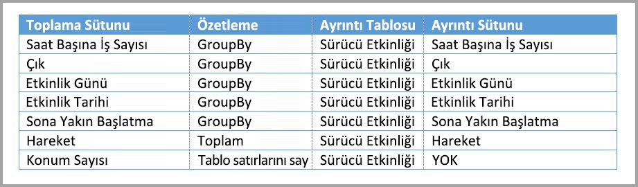

## İlişkilerle bağlanmış gruplandırma ölçütü sütunlarını temel alan toplamalar

İsterseniz bu makalenin önceki bölümlerinde anlatılan iki toplama tekniğini bir arada kullanabilirsiniz. İlişkileri temel alan **toplamaların** birden fazla tabloya ayrılabilmesi için normalleştirilmişlikten çıkarılmış boyut tablolarına ihtiyaç duyulabilir. Bu işlemin belirli boyut tabloları için yüksek maliyetli veya zahmetli olacağı durumlarda belirli boyutlar için toplama tablosunda gerekli öznitelikler çoğaltılabilir ve diğerleri için ilişkiler kullanılabilir.

Aşağıdaki model **Sales Agg** tablosundaki *Month*, *Quarter*, *Semester* ve *Year* bölümlerini çoğaltır. **Sales Agg** ile **Date** tablosu arasında ilişki yoktur. **Customer** ve **Product Subcategory** ile ilişki vardır. **Sales Agg** depolama modu İçeri Aktar olarak belirlenmiştir.

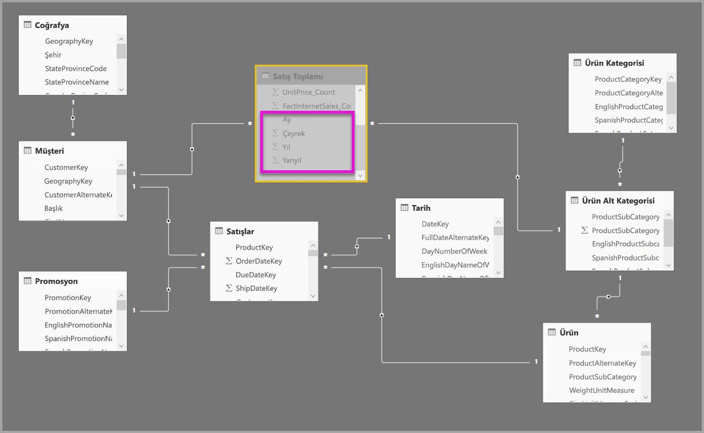

Aşağıdaki tabloda **Sales Agg** tablosunun **Toplamaları yönet** iletişim kutusundaki girişler gösterilmiştir. Ayrıntı tablosunun **Date** olduğu GroupBy girişleri, Date özniteliklerine göre gruplandırma yapan sorguların toplamalara isabet etmesi için zorunludur. Önceki örnekte olduğu gibi ilişkilerin mevcut olması nedeniyle CustomerKey ve ProductSubcategoryKey için GroupBy girişleri toplama isabetlerini etkilemez (yine DISTINCTCOUNT hariç olmak üzere).

> Not: Bu modelde **Date** tablosu bir ayrıntı tablosu olduğundan Toplamaları yönet iletişim kutusunun doldurulabilmesi için DirectQuery modunda olması gerekir. Bu bir Önizleme sürümü sınırlamasıdır ve Genel Kullanım sürümünde kaldırılması planlanmaktadır.

### Sorgu örnekleri

Aşağıdaki sorguda CalendarMonth toplama tablosunun kapsamında olduğundan ve CategoryName için bir-çok ilişkileri aracılığıyla erişim sağlanabildiğinden sorgu toplamaya isabet edecektir. **SalesAmount** için Sum toplaması kullanılmıştır.

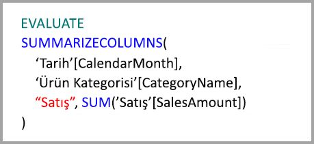

CalendarDay toplama tablosunun kapsamında olmadığından aşağıdaki sorgu toplamaya isabet etmeyecektir.

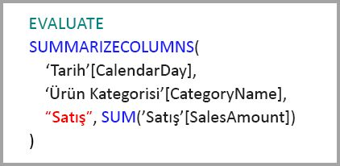

DATESYTD işlevi toplama tablosunun kapsamında olmayan CalendarDay değeri tablosu oluşturduğundan aşağıdaki akıllı zaman sorgusu toplamaya isabet etmeyecektir.

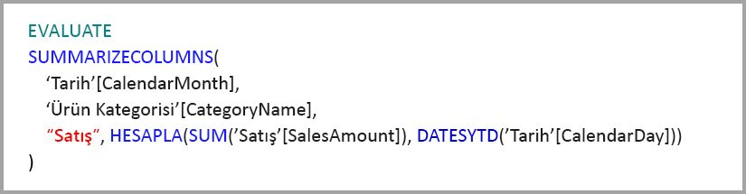

## Önbellekler eşitlenmiş durumda tutulmalıdır

Bellek içi önbelleğin kaynak verilerle eşitlenmemesi durumunda DirectQuery ve İçeri Aktarma ve/veya İkili depolama modunu birlikte kullanan **toplamalar** farklı veri döndürebilir. Sorgu yürütme, örneğin DirectQuery sonuçlarını önbelleğe alınmış değerlerle eşleşecek şekilde filtreleyerek veri sorunlarını maskeleme girişiminde bulunmaz. Bu özellikler performansı geliştirmeleridir ve yalnızca iş gereksinimlerinizi karşılama imkanını tehlikeye atmayacak şekillerde kullanılmalıdır. Veri akışlarınızı bilmek sizin sorumluluğunuzdadır. Bu nedenle lütfen tasarımlarınızı buna uygun şekilde yapın. Gerekirse, kaynakta bu tür sorunlarla başa çıkmak için yerleşik teknikler vardır.

## Sonraki adımlar

Aşağıdaki makalelerde bileşik modellerle ilgili daha fazla açıklama ve DirectQuery'nin ayrıntılı açıklaması bulunabilir.

* [Power BI Desktop’ta bileşik modeller (Önizleme)](desktop-composite-models.md)
* [Power BI Desktop’ta çoka çok ilişkiler (Önizleme)](desktop-many-to-many-relationships.md)
* [Power BI Desktop’ta depolama Modu (Önizleme)](desktop-storage-mode.md)

DirectQuery makaleleri:

* [Power BI'da DirectQuery kullanma](desktop-directquery-about.md)
* [Power BI'da DirectQuery tarafından desteklenen veri kaynakları](desktop-directquery-data-sources.md)

