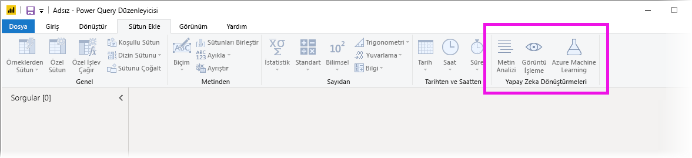
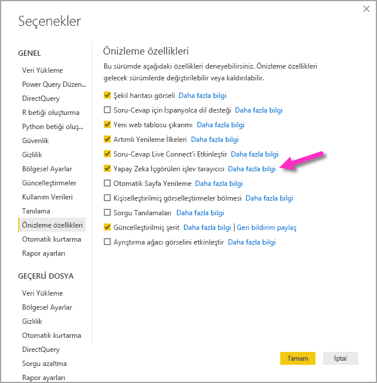
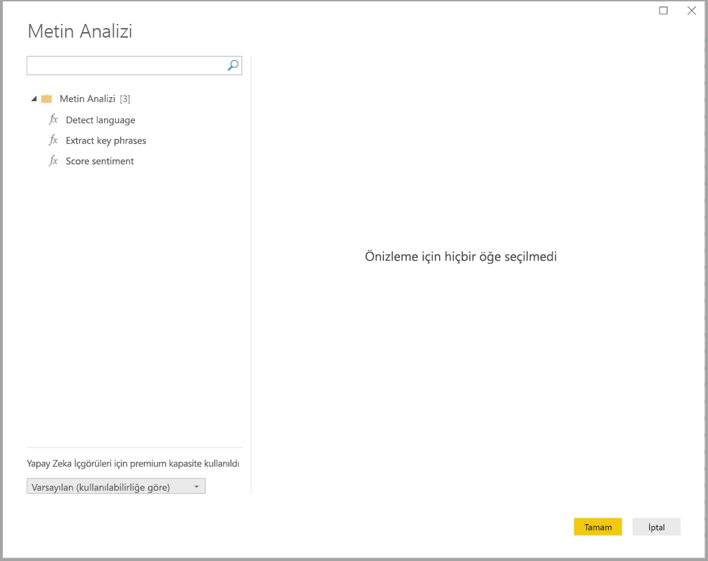
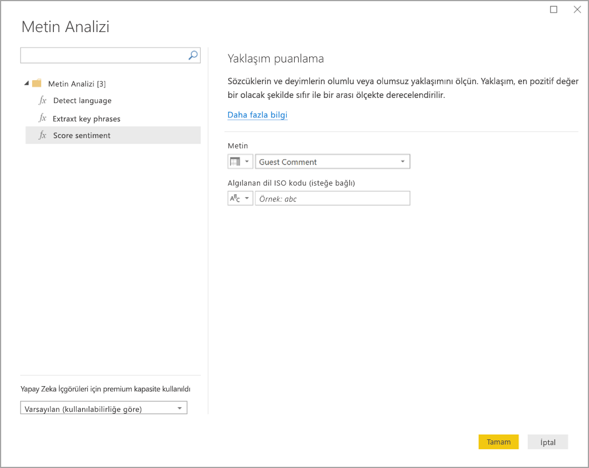
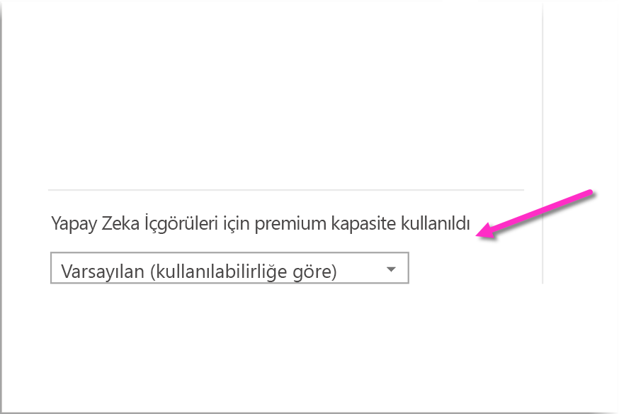
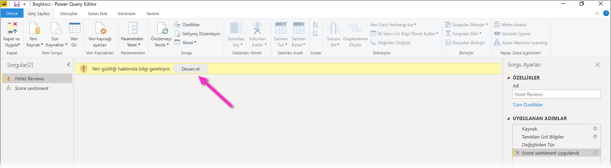
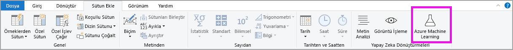
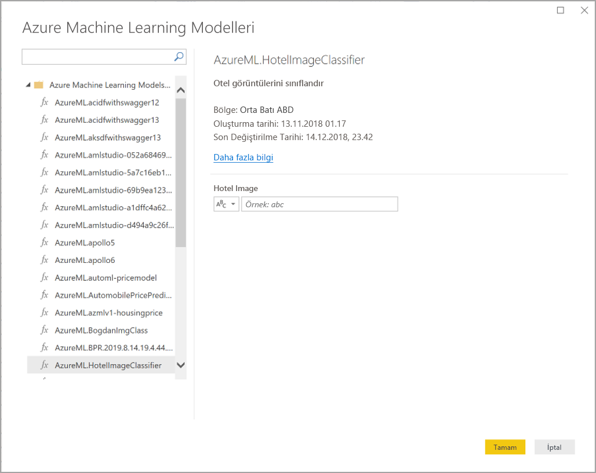

# Power BI Desktop’taki Yapay Zeka İçgörüleri’ni kullanma (önizleme)

Power BI'da Yapay Zeka İçgörüleri'ni kullanarak, veri hazırlama çalışmalarınızı geliştiren önceden eğitilmiş makine öğrenmesi modelleri koleksiyon erişim elde edebilirsiniz. Yapay Zeka İçgörüleri'ne **Power Query düzenleyicisinde** erişilir ve ilişkili özellikleriyle işlevlerine **Power Query düzenleyicisinin** **Giriş** ve **Sütun Ekle** sekmeleri aracılığıyla erişilir. 

Bu makalede her ikisi de Azure Bilişsel Hizmetler'den olan Metin Analizi ve Görüntü İşleme işlevleri açıklanır. Ayrıca bu makalede Power BI'da Azure Machine Learning'den kullanılabilen özel işlevler açıklanır.

## Yapay Zeka İçgörüleri'ni etkinleştirme

Power BI'da yapay zeka içgörüleri bir önizleme özelliğidir ve etkinleştirilmesi gerekir. Etkinleştirmek için **Dosya > Seçenekler ve ayarlar > Seçenekler**'i ve ardından sol sütundan **Önizleme özellikleri**'ni seçin. Sağ bölmede bir **Yapay Zeka İçgörüleri işlev tarayıcısı** seçimi vardır. Önizleme özelliğini etkinleştirmek için **Yapay Zeka İçgörüleri işlev tarayıcısı**'nın yanındaki kutuyu işaretleyin. Önizleme özelliğinin geçerlilik kazanması için Power BI Desktop'ı yeniden başlatmanız gerekir.

## Metin Analizi ve Görüntü İşleme'yi kullanma

Power BI'da Metin Analizi ve Görüntü İşleme'yle, Power Query'de verileri zenginleştirmek için [Azure Bilişsel Hizmetler](https://azure.microsoft.com/services/cognitive-services/)'den farklı algoritmalar uygulayabilirsiniz.

Bugün desteklenen hizmetler şunlardır:

* [Yaklaşım Analizi](https://docs.microsoft.com/azure/cognitive-services/text-analytics/how-tos/text-analytics-how-to-sentiment-analysis)
* [Anahtar İfade Ayıklama](https://docs.microsoft.com/azure/cognitive-services/text-analytics/how-tos/text-analytics-how-to-keyword-extraction)
* [Dil Algılama](https://docs.microsoft.com/azure/cognitive-services/text-analytics/how-tos/text-analytics-how-to-language-detection)
* [Resim Etiketleme](https://docs.microsoft.com/azure/cognitive-services/computer-vision/concept-tagging-images). 

Dönüştürmeler Power BI hizmetinde yürütülür ve Azure Bilişsel Hizmetler aboneliği gerekmez. 

> [!IMPORTANT]
> 
> Metin Analizi veya Görüntü İşleme özelliklerini kullanmak için Power BI Premium gerekir.

### Premium kapasitelerde Metin Analizi ve Görüntü İşleme'yi etkinleştirme

Bilişsel Hizmetler EM2, A2 veya P1 ve üstü Premium kapasite düğümleri için desteklenir. Bilişsel Hizmetler'i çalıştırmak için kapasitede ayrı bir AI iş yükü kullanılır. Bu özelliklerin genel önizlemesi (Haziran 2019 öncesi) sırasında bu iş yükü varsayılan olarak devre dışı bırakılmıştı. Power BI'da Bilişsel Hizmetleri kullanmadan önce yönetim portalının **kapasite ayarlarında** AI iş yükünün etkinleştirilmesi gerekir. **İş yükleri** bölümünde **AI iş yükü**'nü açmalı ve bu iş yükünün kullanmasını istediğiniz en büyük bellek miktarını tanımlamalısınız. Önerilen bellek sınırı %20'dir. Bu sınırın aşılması sorgunun yavaşlamasına neden olur.

### Kullanılabilir işlevler

Bu bölümde Power BI'da Bilişsel Hizmetler'le kullanılabilen işlevler açıklanır.

#### Dil algılama

Dil algılama işlevi metin girişini değerlendirir ve her alan için dil adını ve ISO tanımlayıcısını döndürür. Bu işlev dilin bilinmediği rastgele metinleri toplayan veri sütunlarında kullanışlıdır. İşlev, giriş olarak metin biçiminde veriler bekler.

Metin Analizi 120 dile kadar tanır. Daha fazla bilgi için [desteklenen dillere](https://docs.microsoft.com/azure/cognitive-services/text-analytics/text-analytics-supported-languages) bakın.

#### Anahtar ifadeleri ayıklama

**Anahtar İfade Ayıklama** işlevi yapılandırılmamış metinleri değerlendirir ve her metin alanı için bir anahtar ifade listesi döndürür. İşlev, giriş olarak bir metin alanı gerektirir ve **Kültür bilgisi** için isteğe bağlı girişi kabul eder.

Anahtar ifade ayıklama, üzerinde çalışması için işleve daha büyük metin öbekleri verdiğinizde daha iyi sonuç verir. Bu, küçük metin bloklarında daha iyi çalışan yaklaşım analizinin tam tersidir. Her iki işlemden de en iyi sonuçları almak için, girişleri buna göre yeniden yapılandırmayı göz önünde bulundurun.

#### Yaklaşım puanlama

**Yaklaşım Puanlama** işlevi metin girişini değerlendirir ve her belge için 0 (olumsuz) ile 1 (olumlu) arasında bir yaklaşım puanı döndürür. Bu işlev sosyal medyada, müşteri incelemelerinde ve tartışma forumlarında olumlu ve olumsuz yaklaşımı algılamak için yararlıdır.

Metin Analizi'nde 0 ile 1 arasında bir yaklaşım puanı oluşturmak için makine öğrenmesi sınıflandırma algoritması kullanılır. 1'e yaklaşan puanlar olumlu yaklaşımı ve 0'a yaklaşan puanlar olumsuz yaklaşımı gösterir. Model, yaklaşım ilişkilendirmeleri için çok büyük bir metinle önceden eğitilir. Şu anda kendi eğitim verilerinizi sağlamanız mümkün değildir. Model, metin analizi sırasında metin işleme, kısmi konuşma analizi, sözcük değiştirme ve sözcük ilişkilendirmeleri gibi tekniklerin bir bileşimini kullanır. Algoritma hakkında daha fazla bilgi için bkz. [Metin Analizine Giriş](https://blogs.technet.microsoft.com/machinelearning/2015/04/08/introducing-text-analytics-in-the-azure-ml-marketplace/).

Yaklaşım analizi, metindeki belirli bir varlığın yaklaşımını ayıklamak yerine giriş alanının tamamında gerçekleştirilir. Uygulamada, büyük metin blokları yerine bir veya iki tümce içeren belgelerde puanlama doğruluğu gelişme eğilimi gösterir. Nesnellik değerlendirmesi aşamasında, model bir bütün olarak giriş alanının nesnel olduğunu veya yaklaşım içerdiğini saptar. Büyük ölçüde nesnel olan bir giriş alanı yaklaşım algılama aşamasına ilerletilmez; sonuçta 0,50 puan alır ve başka işlem yapılmaz. İşlem hattında ilerleyen giriş alanları için, sonraki aşamada giriş alanında algılanan yaklaşımın derecesine bağlı olarak 0,50'nin üstünde veya altında bir puan oluşturulur.

Şu anda Yaklaşım Analizi İngilizce, Almanca, İspanyolca ve Fransızcayı desteklemektedir. Diğer diller önizleme aşamasındadır. Daha fazla bilgi için [desteklenen dillere](https://docs.microsoft.com/azure/cognitive-services/text-analytics/text-analytics-supported-languages) bakın.

#### Resimleri etiketleme

**Resimleri etiketleme** işlevi iki binden fazla nesneye, canlıya, manzaraya ve eyleme dayanarak etiketler döndürür. Etiketler belirsizse veya bilinen gerçeklere uymuyorsa, etiketin anlamını bilinen ayar bağlamında netleştirmek için çıkışta *ipuçları* sağlanır. Etiketler taksonomi olarak düzenlenmez ve devralınan hiyerarşiler yoktur. İçerik etiketleri koleksiyonu, tam tümceler halinde biçimlendirilmiş insan tarafından okunabilir dilde görüntülenen bir resim *açıklaması* için temel oluşturur.

Resmi karşıya yükledikten veya resim URL'sini belirttikten sonra, Görüntü İşleme algoritmaları resimde tanımlanan nesnelere, canlılara ve eylemlere dayanarak etiketlerin çıkışını yapar. Etiketleme ön plandaki kişi gibi ana konuyla sınırlı değildir; ortamı (iç mekan veya dış mekan), mobilyaları, araçları, bitkileri, hayvanları, aksesuarları ve gereçleri de içerir.

Bu işleve giriş olarak bir resim URL'si ve base-64 alanı gerekir. Şu anda resim etiketleme İngilizce, İspanyolca, Japonca, Portekizce ve Basitleştirilmiş Çinceyi desteklemektedir. Daha fazla bilgi için [desteklenen dillere](https://docs.microsoft.com/rest/api/cognitiveservices/computervision/tagimage/tagimage#uri-parameters) bakın.

### Power Query'de Metin Analizi veya Görüntü İşleme işlevleri

Verilerinizi Metin Analizi veya Görüntü İşleme işlevleriyle zenginleştirmek için **Power Query düzenleyicisini** açın. Bu örnek metnin yaklaşımını puanlama işleminde size yol gösterir. Anahtar ifadeleri ayıklamak, dili algılamak ve resimleri etiketlemek için de aynı adımlar kullanılabilir.

**Giriş** veya **Sütun ekle** şeridinde **Metin analizi** düğmesini seçin. Oturum açmanız istenir.

Oturum açtıktan sonra açılan pencerede kullanmak istediğiniz işlevi ve dönüştürmek istediğiniz veri sütununu seçin.

Power BI işlevi çalıştırmak üzere bir Premium kapasite seçer ve sonuçları Power BI Desktop'a geri gönderir. Seçilen kapasite uygulama sırasında yalnızca Metin Analizi ve Görüntü İşleme işlevi için kullanılır ve Power BI Desktop'ta yenilenir. Rapor yayımlandıktan sonra, yenilemeler raporun yayımlandığı çalışma alanının Premium kapasitesinde çalıştırılır. Açılan pencerenin sol alt bölümündeki açılan listede tüm Bilişsel Hizmetler tarafından kullanılan kapasiteyi değiştirebilirsiniz.

**Cultureinfo**, metnin dilini belirtmeye yönelik isteğe bağlı bir giriştir. Bu alan bir ISO kodudur. Cultureinfo için giriş olarak bir sütunu veya statik bir alanı kullanabilirsiniz. Bu örnekte tüm sütun için dil olarak İngilizce (en) belirtilmiştir. Bu alanı boş bırakırsanız, Power BI işlevi uygulamadan önce dili otomatik olarak algılar. Sonra **Uygula**'yı seçin.

Yeni veri kaynağında Yapay Zeka İçgörüleri'ni ilk kez kullandığınızda, verilerinizin gizlilik düzeyini ayarlamanız istenir.

> [!NOTE]
> Power BI'da veri kümesi yenilemeleri, yalnızca gizlilik düzeyi genel veya kurumsal olarak ayarlanan veri kaynaklarında çalışır.

İşlevi çağırdıktan sonra, sonuç tabloya yeni bir sütun olarak eklenir. Dönüştürme de sorguya uygulanmış bir adım olarak eklenir.

Resim etiketleme ve anahtar ifade ayıklama işlemlerinde sonuçlarda birden çok değer döndürebilir. Tek tek her sonuç, özgün satırın yinelemesinde döndürülür.

### Metin Analizi ve Görüntü İşleme işlevleri içeren raporu yayımlama

Power Query'de düzenlenirken ve Power BI Desktop'ta yenilemeler yapılırken, Metin Analizi ve Görüntü İşleme işlevleri Power Query düzenleyicisinde seçilmiş olan Premium kapasiteyi kullanır. Rapor Power BI'da yayımlandıktan sonra artık içinde yayımlandığı çalışma alanının Premium kapasitesini kullanır.

Metin Analizi ve Görüntü İşleme işlevlerinin uygulandığı raporlar Premium kapasitede yer almayan bir çalışma alanına yayımlanmalıdır; aksi takdirde veri kümesinin yenilenmesi başarısız olur.

### Premium kapasite üzerindeki etkiyi yönetme

Aşağıdaki bölümlerde Metin Analizi ve Görüntü İşleme işlevlerinin kapasite üzerindeki etkilerini nasıl yönetebileceğiniz açıklanır.

#### Kapasite seçme

Rapor yazarları Yapay Zeka İçgörüleri'ni hangi Premium kapasitede çalıştıracaklarını seçebilir. Varsayılan olarak Power BI kullanıcının erişimi olan, ilk oluşturulmuş kapasiteyi seçer.

#### Kapasite Ölçümleri uygulamasıyla izleme

Premium kapasite sahipleri, Metin Analizi ve Görüntü İşleme işlevlerinin kapasite üzerindeki etkisini [Power BI Premium Kapasite Ölçümleri uygulamasıyla](service-admin-premium-monitor-capacity.md) izleyebilir. Uygulama kapasitenizdeki yapay zeka iş yüklerinin durumu hakkında ayrıntılı ölçümler sağlar. Üstteki grafikte yapay zeka iş yüklerinin bellek tüketimi gösterilir. Premium kapasite yöneticileri kapasite başına yapay zeka iş yükünün bellek sınırını ayarlayabilir. Bellek kullanımı bellek sınırına ulaştığında, bellek sınırını artırmayı veya bazı çalışma alanlarını farklı bir kapasiteye taşımayı düşünebilirsiniz.

### Power Query ile Power Query Online'ı karşılaştırma

Power Query ve Power Query Online'da kullanılan Metin Analizi ve Görüntü İşleme işlevleri aynıdır. Deneyimler arasındaki farklar şunlardır:

* Power Query'de Metin Analizi, Görüntü İşleme ve Azure Machine Learning için ayrı düğmeler vardır. Power Query Online'da bunlar tek menüde toplanmıştır.
* Power Query'de rapor yazarı işlevleri çalıştırmak için kullanılan Premium kapasiteyi seçebilir. Power Query Online'da bu gerekli değildir çünkü veri akışı zaten belirli bir kapasite üzerindedir.

### Metin Analizi'nin önemli noktaları ve sınırlamaları

Metin Analizi kullanılırken dikkat edilmesi gereken bazı önemli noktalar ve sınırlamalar vardır.

* Artımlı yenileme desteklenir ama yapay zeka içgörüleriyle sorgularda kullanıldığında performans sorunlarına yol açabilir.
* Direct Query desteklenmez.

## Azure ML'yi kullanma

Pek çok kuruluş işleriyle ilgili daha iyi öngörüler ve tahminler elde etmek için **Machine Learning** modellerini kullanıyor. Raporlarınızda, panolarınızda ve diğer analizlerinizde bu modelleri görselleştirme ve içgörüleri çağırma olanağı, bu içgörüleri en çok ihtiyaç duyan işletme kullanıcılarına yaymanıza yardımcı olabilir. Power BI sorunsuz işaretleyip tıklama hareketlerini kullanarak Azure Machine Learning'de barındırılan modellerden gelen içgörüleri birleştirmenizi basitleştirir.

Bu özelliği kullanmak için bir veri bilimcisi Azure portalını kullanarak BI analistine Azure ML modeli üzerinde erişim verebilir. Ardından, her oturumun başlangıcında Power Query kullanıcının erişimi olan tüm Azure ML modellerini keşfeder ve bunları dinamik Power Query işlevleri olarak kullanıma sunar. Kullanıcı Power Query düzenleyicisinin şeridinden bu işlevlere erişerek bunları çağırabileceği gibi M işlevini doğrudan da çağırabilir. Ayrıca Power BI bir satır kümesi için Azure ML modelini çağırırken erişim isteklerini otomatik toplu iş olarak işleyerek daha iyi bir performans elde edebilir.

Bu işlevsellik Power BI Desktop’da, Power BI veri akışlarında ve Power BI hizmetindeki Power Query Online'da desteklenir.

Veri akışları hakkında daha fazla bilgi edinmek için bkz. [Power BI'da self servis veri hazırlığı](service-dataflows-overview.md).

Azure Machine Learning hakkında daha fazla bilgi edinmek için aşağıdaki makalelere bakın:

- Genel Bakış: [Azure Machine Learning nedir?](https://docs.microsoft.com/azure/machine-learning/service/overview-what-is-azure-ml)
- Azure Machine Learning için Hızlı Başlangıçlar ve Öğreticiler: [Azure Machine Learning Belgeleri](https://docs.microsoft.com/azure/machine-learning/)

### Azure ML modeline erişim verme

Power BI'dan Azure ML modeline erişmek için, kullanıcının Azure aboneliğine **Okuma** erişimi olmalıdır. Ayrıca kullanıcının şu erişimleri de olmalıdır:

- Machine Learning Studio (klasik) modelleri için, Machine Learning Studio (klasik) web hizmetine **Okuma** erişiminiz olmalıdır
- Machine Learning modelleri için, Machine Learning çalışma alanına **Okuma** erişiminiz olmalıdır

Bu bölümdeki adımlarda Power BI kullanıcısına Azure ML hizmetinde barındırılan model üzerinde erişim verme işlemi açıklanır. Bu sayede bu modele bir Power Query işlevi olarak erişebilirler. Diğer ayrıntılar için bkz. [RBAC'yi ve Azure portalını kullanarak erişimi yönetme](https://docs.microsoft.com/azure/role-based-access-control/role-assignments-portal).

1. [Azure portalında](https://portal.azure.com/) oturum açın.
2. **Abonelikler** sayfasına gidin. **Abonelikler** sayfasını, Azure portalının sol gezinti menüsündeki **Tüm Hizmetler** listesi aracılığıyla bulabilirsiniz.
3. Aboneliğinizi seçme
4. **Erişim denetimi (IAM)** öğesini ve sonra da **Ekle** düğmesini seçin.
5. Rol olarak **Okuyucu**'yu seçin. Azure ML modeline erişim vermek istediğiniz Power BI kullanıcısını seçin.
6. **Kaydet**'i seçin
7. Kullanıcıya belirli bir Machine Learning Studio (klasik) web hizmeti *veya* modeli barındıran Machine Learning çalışma alanı üzerinde **Okuma** erişimi vermek için üç ile altı arasındaki adımları yineleyin.

### Machine Learning modelleri için şema bulma

Veri bilimcileri Machine Learning için makine öğrenmesi modellerini geliştirir hatta dağıtırken öncelikli olarak Python kullanır. Model için şema dosyası oluşturma görevini otomatikleştirmenize yardımcı olan Machine Learning Studio'dan (klasik) farklı olarak, Machine Learning'de veri bilimcisinin Python kullanarak şema dosyasını açıkça oluşturması gerekir.

Bu şema dosyası, Machine Learning modelleri için dağıtılan web hizmetine dahil edilmelidir. Şemayı web hizmeti için otomatik olarak oluşturmak isterseniz, dağıtılan modelin giriş betiğinde bir giriş/çıkış örneği sağlamalısınız. Lütfen [Azure Machine Learning hizmeti belgelerine sahip Dağıtım modellerindeki Otomatik Swagger şema oluşturma alt bölümüne (İsteğe bağlı)](https://docs.microsoft.com/azure/machine-learning/how-to-deploy-and-where#optional-define-model-web-service-schema) bakın. Bu bağlantı, şema oluşturma deyimlerine sahip örnek giriş betiğini içerir.

Özellikle, giriş betiğindeki _@input\_schema_ ve _@output\_schema_ işlevleri, _input\_sample_ ve _output\_sample_ değişkenlerindeki giriş ve çıkış örneği biçimlerine başvurur ve dağıtım sırasında web hizmeti için bir OpenAPI (Swagger) belirtimi oluşturmak üzere bu örnekleri kullanır.

Bu şema oluşturma yönergeleri, giriş betiği güncelleştirilerek, Azure Machine Learning SDK kullanan otomatik makine öğrenimi denemeleri kullanılarak oluşturulan modellere de uygulanmalıdır.

> [!NOTE]
> Azure Machine Learning görsel arabirimi kullanılarak oluşturulan modeller şu anda şema oluşturmayı desteklemiyor ancak daha sonraki sürümlerde destekleyecek.
> 
### Power Query'de Azure ML modelini çağırma

Size erişim verilmiş olan herhangi bir Azure ML modelini doğrudan Power Query Düzenleyicisi'nden çağırabilirsiniz. Azure ML modellerine erişmek için Power Query düzenleyicisinin **Giriş** veya **Sütun Ekle** şeridinde **Azure Machine Learning** düğmesini seçin.

Erişiminiz olan tüm Azure ML modelleri burada Power Query işlevleri olarak listelenir. Ayrıca, Azure ML modeli için giriş parametreleri de otomatik olarak ilgili Power Query işlevinin parametreleri olarak eşlenir.

Azure ML modelini çağırmak için, açılan listeden seçilen tüm varlık sütunlarını giriş olarak belirtebilirsiniz. Sütun simgesini giriş iletişim kutusunun sol tarafına doğru döndürerek giriş olarak bir sabitin kullanılmasını da belirtebilirsiniz.

Azure ML modeli çıkışının önizlemesini varlık tablosunda yeni bir sütun olarak görüntülemek için **Tamam**'ı seçin. Ayrıca model çağrısını da sorgu için uygulanmış bir adım olarak görürsünüz.

Model birden çok çıkış parametresi döndürürse, bunlar çıkış sütununda bir kayıt olarak gruplandırılır. Sütunu genişletip ayrı sütunlarda tek tek çıkış parametreleri oluşturabilirsiniz.

### Azure ML'nin önemli noktaları ve sınırlamaları

Aşağıdaki önemli noktalar ve sınırlamalar Power BI Desktop'ta Azure ML için geçerlidir.

* Azure Machine Learning görsel arabirimi kullanılarak oluşturulan modeller şu anda şema oluşturmayı desteklemez. Önümüzdeki sürümlerde desteklenmesi beklenmektedir.
* Artımlı yenileme desteklenir ama yapay zeka içgörüleriyle sorgularda kullanıldığında performans sorunlarına yol açabilir.
* Direct Query desteklenmez.

## Sonraki adımlar

Bu makalede Machine Learning'i Power BI Desktop'a tümleştirme işlemine genel bakış sağlanır. Aşağıdaki makaleleri de ilginç ve yararlı bulabilirsiniz.

- [Öğretici: Power BI'da Machine Learning Studio (klasik) modelini çağırma](service-tutorial-invoke-machine-learning-model.md)
- [Öğretici: Power BI’da Bilişsel Hizmetler’i kullanma](service-tutorial-use-cognitive-services.md)
- [Power BI'da Bilişsel Hizmetler](service-cognitive-services.md)
- [Power BI'da Azure Machine Learning tümleştirmesi](service-machine-learning-integration.md)
- [Uygulama ile Premium kapasiteleri izleme](service-admin-premium-monitor-capacity.md)
- [Premium kapasite ölçümler uygulamasında yapay zeka ölçümleri](https://powerbi.microsoft.com/blog/ai-metrics-now-available-in-power-bi-premium-capacity-metrics-app/) mevcut olan yapay zeka ölçümleri
