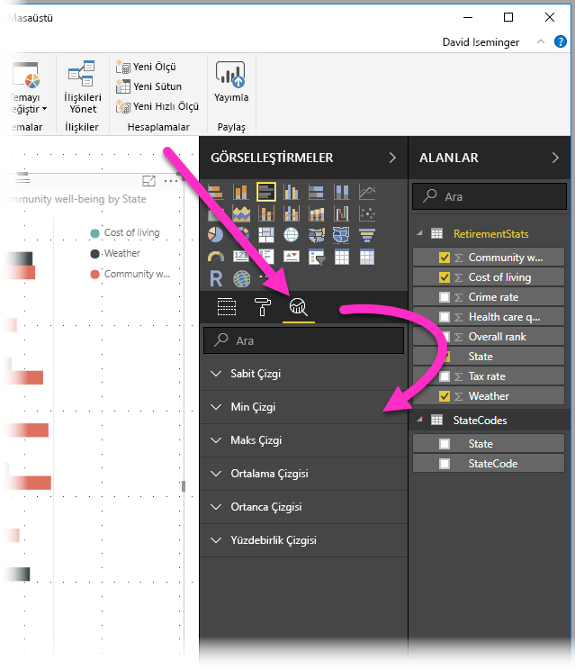
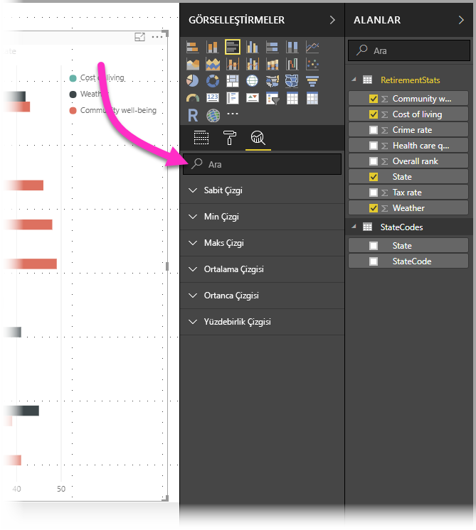
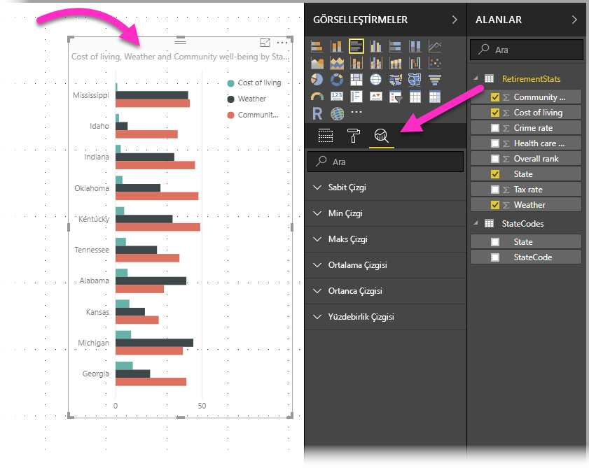
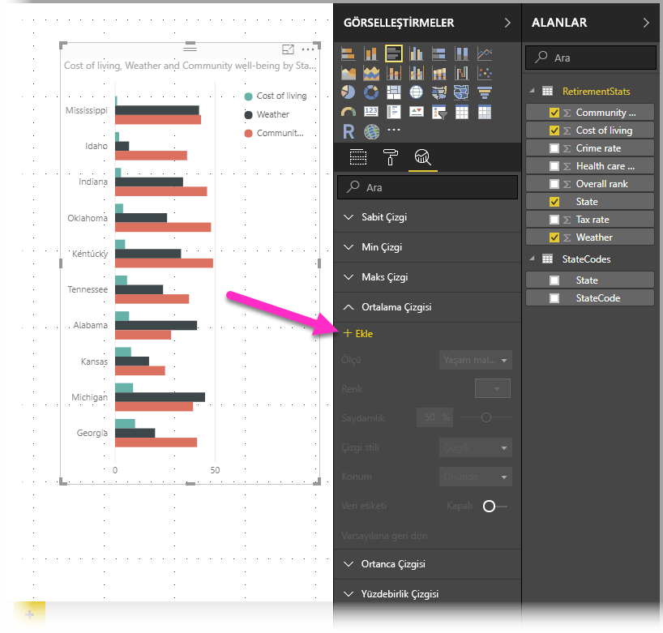
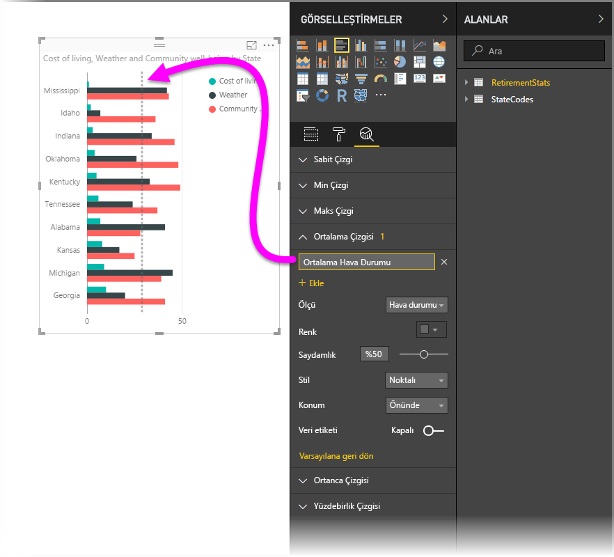
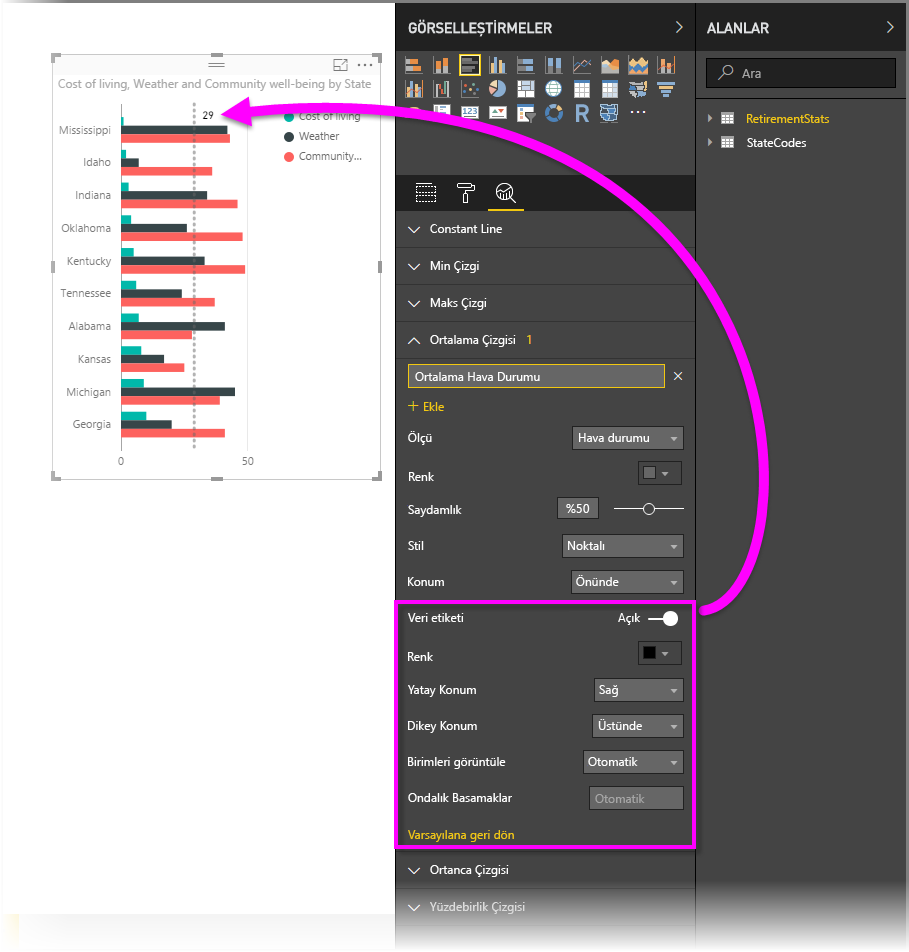
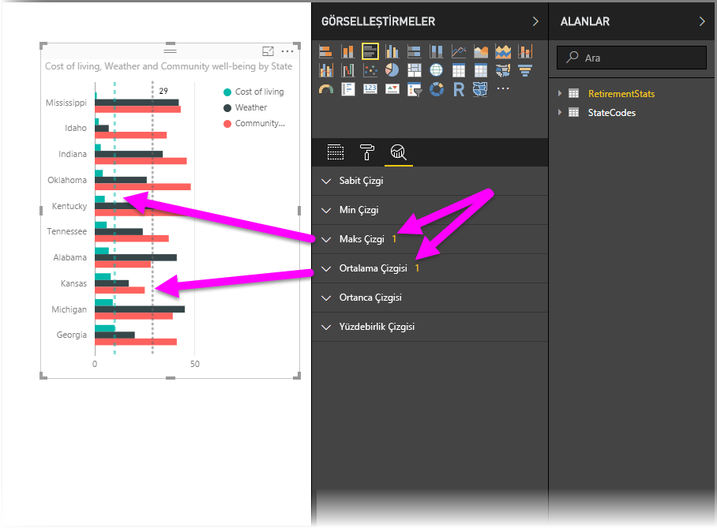
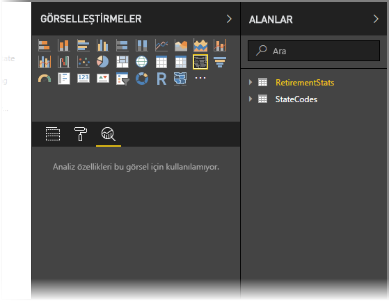
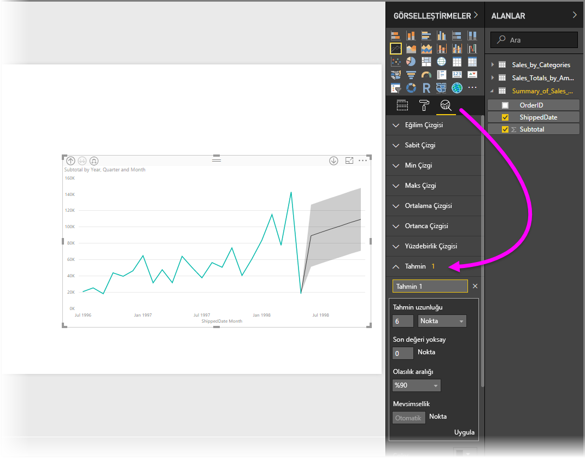

# Power BI Desktop'taki Analiz bölmesini kullanma
**Power BI Desktop**'taki **Analiz** bölmesini kullanarak görsellere *dinamik başvuru çizgileri* ekleyebilir ve önemli eğilimlere veya öngörülere odaklanılmasını sağlayabilirsiniz. **Analiz** bölmesi, Power BI Desktop’ın **Görselleştirmeler** alanında bulunur.

> [!NOTE]
> **Analiz** bölmesi yalnızca Power BI Desktop tuvalinde bir görsel seçmeniz halinde görünür.

## Analiz bölmesinde arama
**Power BI Desktop**’ın Şubat 2018 sürümünden (sürüm 2.55.5010.201 veya üzeri) itibaren, **Görselleştirmeler** bölmesinin alt bölümü olan **Analiz** bölmesi içinde arama yapabilirsiniz. Aşağıdaki resimde gösterildiği gibi, **Analiz** bölmesi seçildiğinde arama kutusu görünür.

## Analiz bölmesini kullanma
**Analiz** bölmesi ile aşağıdaki türlerde dinamik başvuru çizgileri (kullanılabilen çizgiler görsel türüne göre değişiklik gösterir) oluşturabilirsiniz:

* X Ekseni sabit çizgisi
* Y Ekseni sabit çizgisi
* Min. çizgi
* Maks. çizgi
* Ortalama çizgisi
* Ortanca çizgisi
* Yüzdebirlik çizgisi

Aşağıdaki bölümlerde, **Analiz** bölmesini ve dinamik başvuru çizgilerini görselleştirmelerinizde nasıl kullanabileceğiniz gösterilmiştir.

Bir görsel için kullanılabilen dinamik başvuru çizgilerini görüntülemek için şu adımları uygulayın:

1. Bir görsel oluşturun veya seçin, ardından **Görsel Öğeler** bölmesindeki **Analiz** simgesini seçin.
   
   
2. Oluşturmak istediğiniz çizgi türüne ilişkin aşağı oku belirleyerek söz konusu çizgi türünün seçeneklerini genişletin. Bu örnekte, **Ortalama Çizgisi** seçeneğini belirleyeceğiz.
   
   
3. Yeni bir çizgi oluşturmak için **+ Ekle**'yi seçin. Ardından, metin kutusuna çift tıklayıp istediğiniz adı yazarak çizgiye bir ad verebilirsiniz.
   
   Çizginiz için *renk*, *saydamlık*, *stil* ve *konum* (görselin veri öğelerine göre) gibi çok çeşitli seçenekler belirleyebilir ve etiketin dahil edilip edilmemesini tercih edebilirsiniz. Daha da önemlisi, görseldeki veri öğeleriyle otomatik olarak doldurulan **Ölçü** açılan menüsünü seçerek çizginizin görseldeki hangi **Ölçüye** dayanacağını belirleyebilirsiniz. Bu örnekte, *Weather*'ı ölçü olarak belirleyecek, *Average Weather* olarak etiketleyecek ve aşağıda gösterildiği gibi birkaç seçeneği daha özelleştireceğiz.
   
   
4. Bir veri etiketi görüntülemek istiyorsanız **Veri etiketi** kaydırıcısını açık durumuna getirin. Bu işlemi gerçekleştirdiğinizde aşağıdaki görüntüde gösterildiği gibi veri etiketiniz için ek seçenekler barındıran yeni bir bölüme sahip olursunuz.
   
   
5. **Analiz** bölmesindeki **Ortalama çizgisi**'nin yanında görünen sayıya dikkat edin. Bu, o anda görselinizde hangi türden kaç dinamik çizgi bulunduğunu gösterir. *Cost of Living* için **Maks. çizgi** eklersek **Analiz** bölmesinde bu görsele uygulanmış bir **Maks. Çizgi** dinamik başvuru çizgisine sahip olduğumuz gösterilir.
   
   

Seçtiğiniz görselde (bu örnekte, bir **Harita** görseli) dinamik başvuru çizgileri kullanılamıyorsa **Analiz** bölmesini seçtiğinizde aşağıdaki görüntüyle karşılaşırsınız.

**Analiz** bölmesiyle dinamik başvuru çizgileri oluşturarak çok çeşitli öngörülere dikkat çekebilirsiniz.

Dinamik başvuru çizgilerinin kullanılabildiği görsel türlerini genişletmek de dahil daha fazla özellik ve işlev sunmayı planlıyoruz; bu nedenle yenilikleri sık sık kontrol etmenizde fayda var.

## Tahmin Uygulama
**Tahmin** özelliğini, bir görseli seçip **Analiz** bölmesindeki **Tahmin** bölümünü genişleterek kullanabilirsiniz. Tahmini değiştirmek için, *Tahmin uzunluğu* ve *Olasılık aralığı* gibi birçok giriş sağlayabilirsiniz. Aşağıdaki görüntüde tahmin uygulanmış basit bir çizgi görseli gösterilmektedir ancak hayal gücünüzden yararlanarak (ve *tahmin etme* özelliğiyle deneme yaparak) bu özelliğin modellerinize nasıl uygulanabileceğini anlayabilirsiniz.

## Sınırlamalar
Dinamik başvuru çizgilerinin kullanılabilirliği, birlikte çalışılan görsele göre değişiklik gösterir. Aşağıdaki liste, şu anda hangi görseller için hangi dinamik çizgilerin kullanılabildiğini göstermektedir:

Aşağıdaki görsellerle dinamik çizgiler tüm özellikleriyle birlikte kullanılabilir:

* Alan grafiği
* Çizgi grafik
* Dağılım grafiği
* Kümelenmiş Çubuk grafik

Şu görsellerle **Analiz** bölmesinde yalnızca *sabit çizgi* kullanılabilir:

* Yığılmış Alan
* Yığılmış Çubuk
* Yığılmış Sütun
* %100 Yığılmış Çubuk
* %100 Yığılmış Sütun

Aşağıdaki görseller için *eğilim çizgisi* şu anda kullanılabilecek tek seçenektir:

* Yığılmamış Çizgi
* Kümelenmiş Sütun grafik

Son olarak, aşağıdakiler gibi Kartezyen olmayan görsellerle şu anda **Analiz** bölmesinde başvuru çizgileri kullanılamaz:

* Matris
* Pasta grafiği
* Halka
* Tablo

Yüzdelik satır yalnızca **Power BI Desktop**’ta içeri aktarılan veriler kullanılırken veya **Analysis Service 2016** veya sonraki sürümünü, **Azure Analysis Services**’ı ya da Power BI hizmetindeki bir veri kümesini çalıştıran bir sunucudaki modele canlı olarak bağlanıldığında kullanılır. 

## Sonraki adımlar
Power BI Desktop ile yapabileceğiniz çok şey var. Sunulan özellikler hakkında daha fazla bilgi için aşağıdaki kaynaklara bakın:

* [Power BI Desktop'taki Yenilikler](desktop-latest-update.md)
* [Power BI Desktop'ı İndirme](desktop-get-the-desktop.md)
* [Power BI Desktop nedir?](desktop-what-is-desktop.md)
* [Power BI Desktop ile Sorgulara Genel Bakış](desktop-query-overview.md)
* [Power BI Desktop'taki Veri Türleri](desktop-data-types.md)
* [Power BI Desktop'ta Verileri Şekillendirme ve Birleştirme](desktop-shape-and-combine-data.md)
* [Power BI Desktop'taki Genel Sorgu Görevleri](desktop-common-query-tasks.md)    

