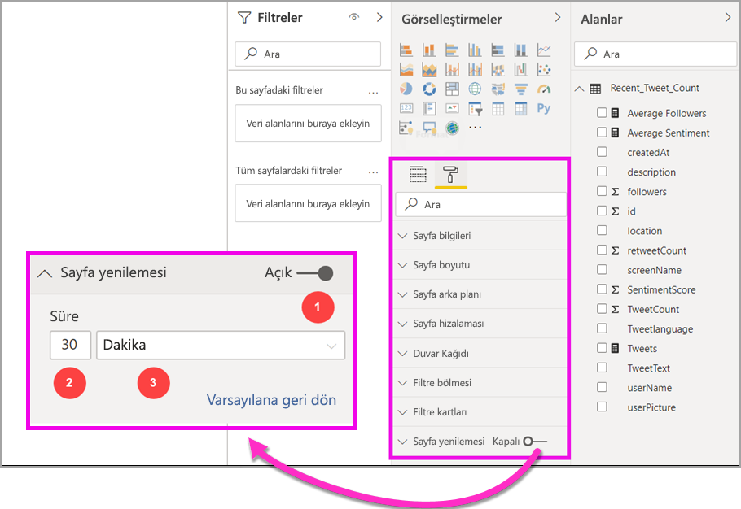
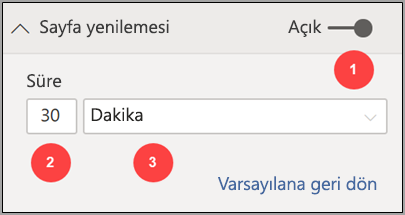
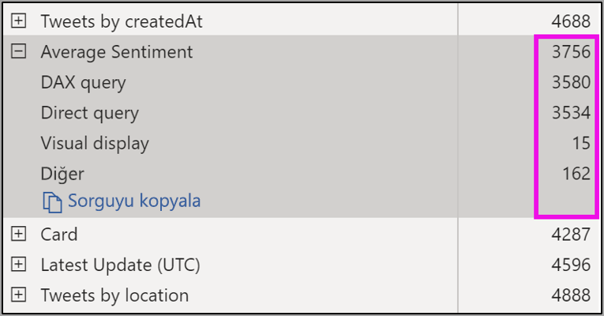
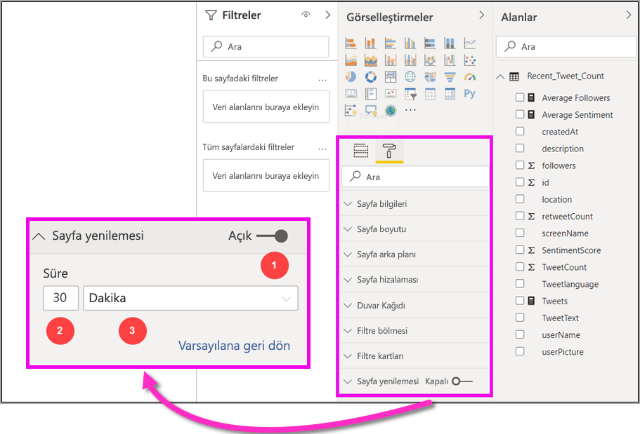

# Power BI Desktop’ta otomatik sayfa yenileme (önizleme)

Kritik olayları izlerken, kaynak veriler güncelleştirildiği anda verilerin yenilenmesi önemlidir. Örneğin, üretim sektöründe bir makinenin hatalı çalıştığını veya hatalı çalışmak üzere olduğunu bilmeniz kritik önem taşır.

Power BI’daki otomatik sayfa yenileme (APR) özelliği, etkin rapor sayfanızın [DirectQuery kaynakları](https://docs.microsoft.com/power-bi/desktop-directquery-about) için önceden tanımlanmış bir tempoda yeni verileri sorgulamasını sağlar.

## Otomatik sayfa yenilemeyi kullanma

Bu önizleme sürümü için Power BI Desktop’ta otomatik sayfa yenileme özelliğini etkinleştirmeniz gerekir. **Dosya > Seçenekler ve ayarlar**’a gidin, ardından **Seçenekler**’i seçin ve sol bölmeden **Önizleme özellikleri**’ni seçin. *Otomatik sayfa yenileme*’nin yanındaki onay kutusunu seçerek özelliği etkinleştirin. Otomatik sayfa yenileme yalnızca DirectQuery veri kaynakları için kullanılabilir.

Otomatik sayfa yenilemeyi kullanmak için, yenilemeyi etkinleştirmek istediğiniz rapor sayfasını seçin. **Görsel Öğeler** bölmesinde **Biçimlendirme** simgesini (boya rulosu) seçin ve bölmenin alt kısmından **Sayfa yenileme**’yi bulun. 

Aşağıdaki görüntüde **Sayfa yenileme** kartı gösterilmektedir. Numaralandırılmış öğelerin açıklamaları, sonraki birkaç paragrafta verilmiştir:

1.  Otomatik Sayfa Yenileme kaydırıcısı - sayfa yenilemeyi açar veya kapatır
2.  Sayfa yenileme aralığı değeri - yenileme aralığı için sayı değeri
3.  Sayfa yenileme aralığı birimi - sayfa yenileme için aralık birimi

Burada sayfa yenilemeyi açabilir ve yenileme süresini seçebilirsiniz. Varsayılan değer 30 dakikadır (minimum yenileme aralığı bir saniyedir). Raporunuz, belirlediğiniz aralıkta yenilemeye başlar. 

## Sayfa yenileme aralığını belirleme

Otomatik sayfa yenileme etkinleştirildiğinde Power BI Desktop, DirectQuery kaynağınıza sürekli olarak sorgu gönderir. Sorgunun gönderilmesi ile verilerin döndürülmesi arasında bir gecikme olur; bu nedenle kısa yenileme aralıkları için sorguların sorgulanan verileri yapılandırılan aralık içinde başarıyla döndürdüğünü onaylamanız gerekir. Veriler aralık içinde döndürülmezse, görsellerin yapılandırılandan daha az sıklıkla güncelleştirildiği durumlar oluşturursunuz.

En iyi uygulama olarak yenileme aralığı en azından beklenen yeni veri alım hızıyla eşleşmelidir:

* Yeni veriler her 20 dakikada bir kaynağa ulaşırsa yenileme aralığınız 20 dakikadan kısa olamaz. 

* Her saniye yeni veriler alınırsa, aralık bir saniye olarak ayarlanmalıdır. 

Bir saniye gibi düşük yenileme aralıkları için, doğrudan sorgu veri kaynağının türünü, sorgularınızın bunun üzerinde oluşturduğu yükü, rapor görüntüleyicilerinizin kapasitenin veri merkezine olan mesafesini vb.’yi de dikkate almanız gerekir. 

Power BI Desktop’ta, her bir görsel sorgusunun kaynaktan sonuç almak için yeterli zamanı olduğunu ve harcanan süreyi onaylamanıza olanak sağlayan Performans Analizi’ni kullanarak bunu tahmin edebilirsiniz. Performans Analizi’nin sonuçlarına göre, veri kaynağını ayarlayabilir ve veri kaynağı üzerinde değişiklikler yapabilir veya raporunuzdaki diğer görseller ve ölçülerle deneme yapabilirsiniz.

Aşağıdaki görüntüde, Performans Analizi’ndeki DirectQuery sonuçları gösterilmektedir:

Bu veri kaynağıyla ilgili bazı diğer özellikleri ele alalım. 

1.  Veriler iki saniyelik hızla ulaşır. 
2.  Performans analizi, yaklaşık 4,9 saniyelik (4688 milisaniyelik) maksimum sorgu + görüntüleme süresini gösterir. 
3.  Veri kaynağı, saniyede yaklaşık 1000 eşzamanlı sorguyu işleyecek şekilde yapılandırılmıştır. 
4.  Yaklaşık 10 kullanıcının raporu eşzamanlı olarak görüntülemesini beklersiniz.

Böylece aşağıdakiler oluşur:

* **5 görsel x 10 kullanıcı = yaklaşık 50 sorgu**

Bu hesaplama, veri kaynağının destekleyebileceğinden çok daha fazla yüke neden olur. Veriler iki saniyelik hızla ulaşır ve bu da sizin yenileme hızınız olmalıdır. Ancak sorgunun tamamlanması yaklaşık beş saniye sürdüğünden bunu beş saniyeden uzun bir süreye ayarlamamız gerekir. 

Ayrıca, rapor bulutta barındırılan Analysis Services örneğini kullanacağından, raporunuzu hizmette yayımlarken bu sonucun farklı olabileceğini unutmayın. Yenileme hızınızı uygun şekilde ayarlamak isteyebilirsiniz. 

Sorguları ve yenileme zamanlamasını hesaba katmak için Power BI yalnızca kalan tüm yenileme sorguları tamamlandığında bir sonraki yenileme sorgusunu çalıştırır. Bu nedenle, yenileme aralığınız, sorgularınızın işlenme süresinden kısa olursa Power BI yalnızca kalan sorgular tamamlandıktan sonra tekrar yenileme yapar. 

Daha sonra, kapasite yöneticisi olarak performans sorunlarını nasıl algılayıp tanılayabileceğinize bakalım. Daha sonra bu makalenin ilerleyen bölümünde, performans ve sorun giderme ile ilgili diğer sorular ve yanıtlar için **otomatik sayfa yenileme ile ilgili SSS** bölümüne de göz atabilirsiniz.

## Power BI hizmetinde otomatik sayfa yenileme

Ayrıca, Power BI Desktop’ta yazılmış ve Power BI hizmetinde yayımlanmış olan raporlar için de otomatik sayfa yenilemeyi ayarlayabilirsiniz. 

Power BI hizmetindeki raporlar için otomatik sayfa yenileme, Power BI Desktop’taki yapılandırmaya benzer adımlarla yapılandırılır. Aşağıdaki görüntüde, Power BI hizmeti için **Page yenileme**  yapılandırması gösterilmektedir:

1.  Otomatik Sayfa Yenileme kaydırıcısı - sayfa yenilemeyi açar veya kapatır
2.  Sayfa yenileme aralığı değeri - yenileme aralığı için sayı değeri bir tamsayı olmalıdır
3.  Sayfa yenileme aralığı birimi - sayfa yenileme için aralık birimi

### Sayfa yenileme aralıkları

Power BI hizmetinde izin verilen sayfa yenileme aralıkları, raporun çalışma alanı türünden etkilenir. Bu, aşağıdaki raporların tümü için geçerlidir:

* Otomatik sayfa yenileme özelliği etkin olan bir çalışma alanında rapor yayımlama
* Bir çalışma alanında önceden bulunan bir sayfa yenileme aralığını düzenleme
* Doğrudan hizmette rapor oluşturma

Power BI Desktop’ın yenileme aralığı için bir kısıtlaması yoktur; yenileme aralığı, bir saniye sıklığında bile olabilir. Ancak raporlar Power BI hizmetinde yayımlandığında belirli kısıtlamalar uygulanır ve bunlar aşağıdaki bölümlerde açıklanmıştır.

### Yenileme aralıklarındaki kısıtlamalar

Power BI hizmetinde, Premium hizmetlerinin kullanılıp kullanılmadığına bakılmaksızın, çalışma alanı gibi faktörlere göre otomatik sayfa yenileme kısıtlamaları uygulanır.

Bunun nasıl çalıştığını netleştirmek için, kapasiteler ve çalışma alanları ile ilgili arka plan bilgileriyle başlayalım:

**Kapasiteler**, Power BI içeriğini barındırmak ve sunmak için kullanılan bir dizi kaynağı (depolama, işlemci ve bellek) temsil eden temel bir Power BI kavramıdır. Kapasiteler paylaşımlı veya ayrılmıştır. **Paylaşılan Kapasite** diğer Microsoft müşterileriyle paylaşılırken, **Ayrılmış Kapasite** ise tamamen tek bir müşteriye ayrılmıştır. Ayrılmış kapasiteler, [Yönetilen Premium kapasiteler](service-premium-capacity-manage.md) makalesinde sunulmaktadır.

Paylaşılan kapasitede iş yükleri, diğer müşterilerle paylaşılan hesaplama kaynaklarında çalışır. Kapasitenin kaynakları paylaşması gerektiğinden, *tarafsızlığı* sağlamak için maksimum model boyutu (1 GB) ve maksimum günlük yenileme sıklığı (günde sekiz defa) ayarlama gibi sınırlamalar uygulanır.

Power BI **çalışma alanları**, kapasitelerin içinde bulunur ve güvenlik, işbirliği ve dağıtım kapsayıcılarını temsil eder. Her Power BI kullanıcısının **Çalışma Alanım** olarak bilinen kendi kişisel çalışma alanı vardır. İşbirliğine ve dağıtıma olanak tanımak için ek çalışma alanları oluşturulabilir ve bunlar **çalışma alanları** olarak bilinir. Kişisel çalışma alanları da dahil olmak üzere çalışma alanları varsayılan olarak **paylaşılan kapasitede** oluşturulur.

Burada, iki çalışma alanı senaryosu için bazı ayrıntılara yer verilmiştir:

**Paylaşılan çalışma alanları**: Düzenli çalışma alanları (Premium kapasitenin parçası olmayan çalışma alanları) için otomatik sayfa yenileme minimum 30 dakikalık aralığa (izin verilen en düşük aralık) sahip olur.

**Premium çalışma alanları**: Premium çalışma alanlarındaki otomatik sayfa yenileme kullanılabilirliği, premium yöneticinizin Power BI Premium kapasitesi için ayarladığı iş yükü ayarlarına bağlı olur. Otomatik sayfa yenilemeyi ayarlama yeteneğinizi etkileyebilecek iki değişken vardır:

 1. *Özellik açık/kapalı*: Kapasite yöneticiniz özelliği devre dışı bırakmaya karar verdiyse, yayımlanmış raporunuzda herhangi bir sayfa yenileme türü ayarlayamazsınız.

 2. *Minimum yenileme aralığı*: Özellik etkinleştirilirken, kapasite yöneticinizin bir minimum yenileme aralığı ayarlaması gerekir. Zaman aralığınız minimumdan düşükse Power BI hizmeti, kapasite yöneticiniz tarafından ayarlanan minimum aralığa göre aralığınızı geçersiz kılar.

Aşağıdaki tabloda, bu özelliğin nerede kullanılabildiğine dair daha fazla ayrıntı ve her bir kapasite türü ve [depolama moduna](service-dataset-modes-understand.md) ilişkin sınırlar açıklanmaktadır

| Depolama Modu | Ayrılmış Kapasite | Paylaşılan Kapasite |
| --- | --- | --- |
| Doğrudan Sorgu | **Destekleniyor** – Evet.  **Minimum yenileme aralığı** – 1 saniye  **Kapasite yönetimini geçersiz kılma** – Evet. | **Destekleniyor** – Evet.  **Minimum yenileme aralığı** – 30 dakika  **Kapasite yönetimini geçersiz kılma** – Hayır. |
| İçeri Aktar | **Destekleniyor** – Hayır.  **Minimum yenileme aralığı** – Yok.  **Kapasite yönetimini geçersiz kılma** – Yok. | **Destekleniyor** – Hayır.  **Minimum yenileme aralığı** – Yok.  **Kapasite yönetimini geçersiz kılma** – Yok. |
| Karma Mod (DQ + diğerleri) | **Destekleniyor** – Evet.  **Minimum yenileme aralığı** – 1 saniye  **Kapasite yönetimini geçersiz kılma** – Evet. | **Destekleniyor** – Evet.  **Minimum yenileme aralığı** – 30 dakika  **Kapasite yönetimini geçersiz kılma** – Hayır. |
| Live connect AS | **Destekleniyor** – Hayır.  **Minimum yenileme aralığı** – Yok.  **Kapasite yönetimini geçersiz kılma** – Yok. | **Destekleniyor** – Hayır.  **Minimum yenileme aralığı** – Yok.  **Kapasite yönetimini geçersiz kılma** – Yok. |
| Live connect PBI | **Destekleniyor** – Hayır.  **Minimum yenileme aralığı** – Yok.  **Kapasite yönetimini geçersiz kılma** – Yok. | **Destekleniyor** – Hayır.  **Minimum yenileme aralığı** – Yok.  **Kapasite yönetimini geçersiz kılma** – Yok. |

> [!NOTE]
> Power BI Desktop’tan otomatik sayfa yenileme özelliği etkin raporunuzu hizmette yayımlarken, veri kümesi ayarları menüsünde DirectQuery veri kaynağı için kimlik bilgilerini sağlamanız gerekir.

## Önemli noktalar ve sınırlamalar

Power BI Desktop veya Power BI hizmetinde otomatik sayfa yenilemeyi kullanırken göz önünde bulundurulması gereken birkaç nokta vardır.

* İçeri Aktarma, LiveConnect ve Push depolama modları, otomatik sayfa yenileme için desteklenmez.  
* En az bir DirectQuery veri kaynağı olan bileşik modeller desteklenir.
* Power BI Desktop’ın yenileme aralığı için bir kısıtlaması yoktur; yenileme aralığı, bir saniye sıklığında bile olabilir. Raporlar Power BI hizmetinde yayımlandığında, bu belgenin önceki kısmında açıklandığı gibi belirli kısıtlamalar uygulanır.

### Performans tanılamaları

Otomatik sayfa yenileme, senaryoları izlemek ve hızla değişen verileri keşfetmek için kullanışlıdır. Ancak bazen bu, kapasite veya veri kaynağı üzerinde gereksiz yük oluşturabilir.

Veri kaynaklarında gereksiz yük oluşmasını engellemek için Power BI aşağıdaki korumaları içerir:

1. Tüm otomatik sayfa yenileme sorguları, etkileşimli sorguların (örn. sayfa yükleme ve görselleri çapraz filtreleme) öncelikli olmasını sağlamak için **daha düşük** öncelikle çalıştırılır.
2. Bir sonraki yenileme döngüsü geldiğinde sorgunuz tamamlanmadıysa Power BI, önceki sorgu tamamlanıncaya kadar yeni yenileme sorguları düzenlemez. Örneğin, bir saniyelik yenileme aralığınız varsa ve sorgularınız ortalama dört saniye sürüyorsa Power BI yalnızca dört saniyede bir etkili şekilde bir sorgu düzenler.

Performans sorunları yaşamaya devam edebileceğiniz iki yer vardır:

1. **Kapasite:** Sorgu ilk olarak premium kapasiteye gelir; burada, rapor görselleştirmelerinden oluşturulan DAX sorgusu katlanır ve kaynak sorgulara değerlendirilir.
2. **Doğrudan Sorgu veri kaynağı:** Önceki adımda yer alan çevrilmiş sorgular, kaynağa karşı çalıştırılır. Bu, SQL Server’larınız, SAP Hana kaynaklarınız vb. olabilir.

Yöneticilerin kullanımına sunulan [Premium ölçümler uygulamasını](service-admin-premium-monitor-capacity.md) kullanarak, düşük öncelikli sorgular tarafından kapasitenin ne kadarının kullanılmakta olduğunu görselleştirebilirsiniz.

Düşük öncelikli sorgular, otomatik sayfa yenileme sorgularından ve model yenileme sorgularından oluşur. Şu anda, otomatik sayfa yenileme ve Model Yenileme sorgularından gelen yükü ayırt etmenin bir yolu yoktur.

Kapasitenizin düşük öncelikli sorgularla aşırı yüklendiğini fark ederseniz, uygulayabileceğiniz birkaç eylem vardır:

1. Daha büyük bir premium SKU isteyin.
2. Rapor sahibine başvurun ve yenileme aralığını azaltmasını isteyin.
3. Kapasite yönetici portalında şunları yapabilirsiniz:
  1. Bu kapasite için otomatik sayfa yenilemeyi kapatabilirsiniz
  2. Minimum yenileme aralığını yükseltebilirsiniz; bu, söz konusu kapasitedeki tüm raporları etkiler.

### Sık sorulan sorular

Bu bölümde, şunlara yönelik yaygın sorular ve yanıtları sağlanmaktadır 

1. Ben bir rapor yazarıyım. Rapor yenileme aralığını Masaüstünde 1 sn olacak şekilde tanımladım, ancak raporum yayımlandıktan sonra hizmet yenilenmiyor.

    * Sayfa için otomatik sayfa yenilemenin açık olup olmadığını kontrol edin. Bu ayar sayfa başına olduğundan, raporda yenilemek istediğiniz her bir sayfa için bunun açık olduğundan emin olmanız gerekir.
    * Premium kapasite ekli bir çalışma alanına yüklediğinizden emin olun; aksi takdirde yenileme aralığınız 30. dakikada kilitlenir.
    * Raporunuz bir premium çalışma alanında yer alıyorsa, yöneticinize başvurun ve ekli kapasite için bu özelliği etkinleştirdiğinden emin olun. Ayrıca, kapasite için minimum yenileme aralığının raporunuzla aynı veya daha düşük olduğundan da emin olun.

2. Ben bir kapasite yöneticisiyim. Otomatik sayfa yenileme aralığı ayarlarımı değiştirdim, ancak bu ayarlar yansıtılmıyor. Başka bir deyişle, raporlar halen olmaması gereken bir hızda yenileniyor veya ayarı açtığım halde yenilenmiyor.

    * Kapasite yöneticisi kullanıcı arabiriminde yapılan otomatik sayfa yenileme ayarı değişikliklerinin raporlara yayılması 5 dakika sürer.
    * Otomatik sayfa yenileme özelliğini hem kapasite için açmanız, hem de bir raporun bunu görmek istediğiniz sayfaları için açmanız gerekir.

3. Raporum karma modda çalışıyor (DQ + İçeri Aktarma). Tüm görseller yenilenmiyor.

    * Görselleriniz İçeri Aktarma tablolarına başvuruyorsa bu beklenen bir durumdur. İçeri Aktarma için otomatik sayfa yenileme desteklenmez.
    * Bu bölümdeki 1. soruya bakın.

4. Raporum hizmette düzgün şekilde yenileniyordu, ancak aniden durdu.

    * Sorunun kendi kendine çözülüp çözülmediğini görmek için sayfayı yenilemeyi deneyin.
    * Kapasite yöneticinize danışın, özelliği kapatmış veya minimum yenileme aralığını yükseltmiş olabilir (2. Soruya bakın)

5. Ben bir rapor yazarıyım. Görsellerim, belirttiğim tempoda yenilenmiyor. Daha yavaş hızda yenileniyor.

    * Sorgularınızın yürütülmesi daha uzun sürüyorsa, yenileme aralığı gecikir. otomatik sayfa yenileme, yeni sorgular çalıştırmadan önce tüm sorguların çalışmasının sona ermesini bekler.
    * Kapasite yöneticiniz, raporunuzda ayarlamış olduğunuzdan daha yüksek bir minimum yenileme aralığı ayarlamış olabilir. Kapasite yöneticinizle görüşüp bunun azaltılmasını isteyin.

6. Otomatik sayfa yenileme sorguları, önbellekten sunulur mu?

    * Hayır, tüm otomatik sayfa yenileme sorguları, önbelleğe alınmış verileri atlar.

## Sonraki adımlar

Daha fazla bilgi için aşağıdaki makaleleri inceleyin:

* [Power BI'da DirectQuery kullanma](desktop-directquery-about.md)
* [Rapor öğesi performansını incelemek için Performans Analizi’ni kullanma](desktop-performance-analyzer.md)
* [Power BI Premium Kapasitelerini Dağıtma ve Yönetme](whitepaper-powerbi-premium-deployment.md)
* [Power BI Desktop'ta Veri Kaynakları](desktop-data-sources.md)
* [Power BI Desktop'ta Verileri Şekillendirme ve Birleştirme](desktop-shape-and-combine-data.md)
* [Power BI Desktop'ta Excel çalışma kitaplarına bağlanma](desktop-connect-excel.md)   
* [Verileri doğrudan Power BI Desktop'a girme](desktop-enter-data-directly-into-desktop.md)   
