# Power BI'da öngörü paylaşmak ve hikayeler oluşturmak için yer işaretlerini kullanma (Önizleme)
Power BI'da **yer işaretlerini** kullanarak, filtreleme ve görsellerin durumu dahil olmak üzere bir rapor sayfasının geçerli olarak yapılandırılmış görünümünü yakalayabilir ve ardından, kaydedilmiş bu yer işaretini seçerek söz konusu duruma kolayca geri dönebilirsiniz. 

Ayrıca, bir yer işareti koleksiyonu oluşturabilir, bu yer işaretlerinin sırasını istediğiniz gibi düzenleyebilir ve daha sonra bir öngörü dizisini veya görselleriniz ve raporlarınız ile anlatmak istediğiniz hikayeyi vurgulamak için her bir yer işareti üzerinden ilerleyebilirsiniz. 

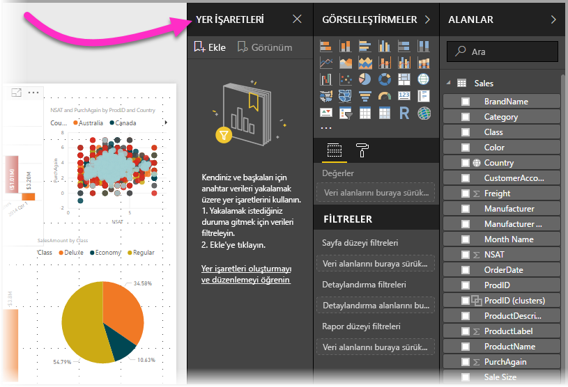

Yer işaretlemesine yönelik birçok kullanım vardır. Yer işaretlerini, rapor oluşturma konusundaki ilerleyişinizi izlemek için kullanabilirsiniz (yer işaretleri kolayca eklenebilir, silinebilir ve yeniden adlandırılabilir) ve yer işaretleri üzerinden sırayla ilerleyen PowerPoint benzeri bir sunum oluşturarak raporunuzla bir hikaye anlatmak için yer işaretlerinden yararlanabilirsiniz. Yer işaretleri, en iyi şekilde nasıl yararlanabileceğinize yönelik tercihlerinize bağlı olarak başka amaçlarla da kullanılabilir.

### Yer işaretleri önizlemesini etkinleştirme
**Power BI Desktop**'ın **Ekim 2017** sürümü itibarıyla, yeni **yer işaretleri** özelliğini deneyebilirsiniz. Bu özellik, **Power BI hizmetindeki** yer işareti özellikli raporlar için de kullanılabilir. Bu önizleme özelliğini etkinleştirmek için **Dosya > Seçenekler ve Ayarlar > Seçenekler > Önizleme Özellikleri** seçeneğini belirleyin ve ardından **Yer imleri**'nin yanındaki onay kutusunu işaretleyin. Seçiminizi yaptıktan sonra Power BI Desktop'ı yeniden başlatmanız gerekir.

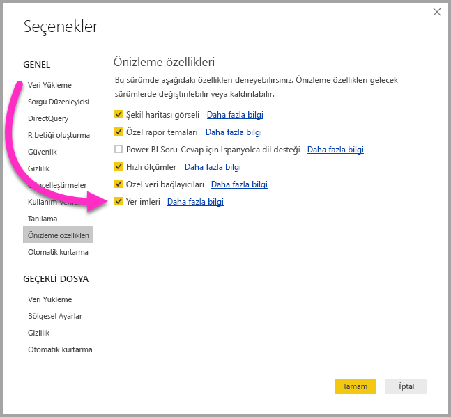

Seçiminizi yaptıktan sonra **Power BI Desktop**'ı yeniden başlatmanız gerekir.

## Yer işaretlerini kullanma
Yer işaretlerini kullanmak için **Görünüm** şeridini ve ardından **Yer İşaretleri Bölmesi** kutusunu seçin. 

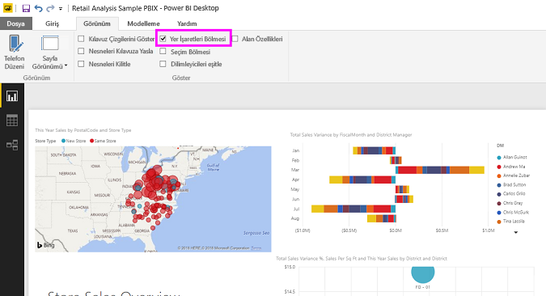

Bir yer işareti oluşturduğunuzda aşağıdaki öğeler, bu yer işareti ile birlikte kaydedilir:

* Geçerli sayfa
* Filtreler
* Dilimleyiciler
* Sıralama düzeni
* Detay konumu
* Görünürlük (**Seçim** bölmesi kullanıldığında, bir nesnenin görünürlüğü)
* Herhangi bir görünür nesnenin odak veya **Spotlight** modları

Yer işaretleri şu anda çapraz vurgulama durumunu kaydetmemektedir. 

Bir rapor sayfasını yer işaretinde görünmesini istediğiniz şekilde yapılandırın. Rapor sayfanızı ve görsellerinizi istediğiniz şekilde düzenledikten sonra yer işareti eklemek için **Yer İşaretleri** bölmesinden **Ekle**'yi seçin. 

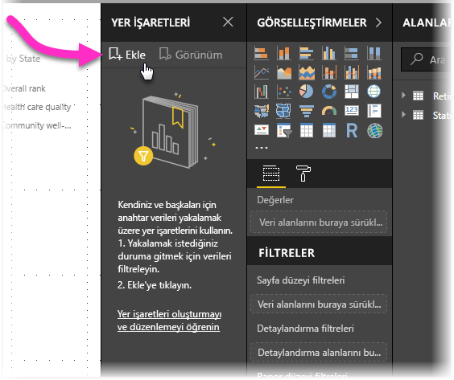

**Power BI Desktop**, bir yer işareti oluşturur ve yer işaretine genel bir ad verir. Bir yer işaretini, yer işareti adının yanındaki üç nokta simgesini seçip görüntülenen menüden bir eylem belirleyerek kolayca *yeniden adlandırabilir*, *silebilir* veya *güncelleştirebilirsiniz*.

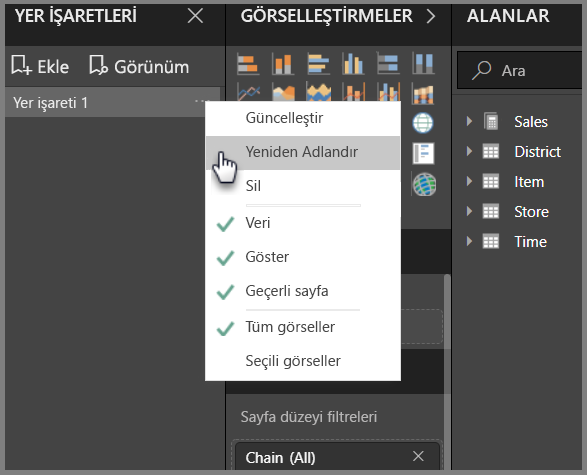

**Yer İşaretleri** bölmesindeki yer işaretine tıklayarak yer işaretinizi görüntüleyebilirsiniz. 

## Yer işaretlerini düzenleme
Yer işaretleri oluşturdukça bunları oluşturduğunuz sıranın hedef kitlenize sunmak istediğiniz sırayla aynı olmadığını düşünebilirsiniz. Sorun değil, yer işaretlerinin sırasını kolayca yeniden düzenleyebilirsiniz.

Geçerli sırayı değiştirmek için, aşağıdaki görüntüde gösterildiği gibi, **Yer İşaretleri** bölmesinde basit sürükleme ve bırakma işlemleri gerçekleştirin. Yer işaretleri arasındaki sarı çubuk, sürüklenen yer işaretinin nereye yerleştirileceğini belirtir.

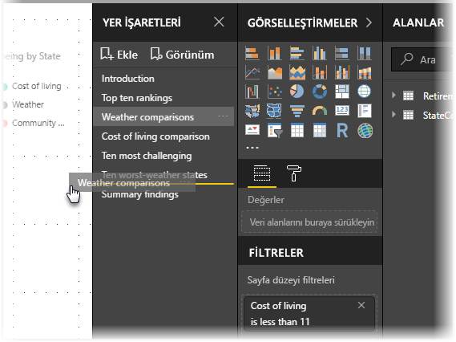

Yer işaretlerinizin sırası, sonraki bölümde açıklandığı gibi yer işaretlerinin **Görünüm** özelliği kullanılırken önemli hale gelebilir.

## Slayt gösterisi olarak yer işaretleri
Sırasıyla sunmak istediğiniz bir yer işareti koleksiyonunuz olduğunda, bir slayt gösterisi başlatmak için **Yer İşaretleri** bölmesindeki **Görünüm** seçeneğini belirleyebilirsiniz.

**Görünüm** modunda dikkat edilmesi gereken birkaç özellik vardır:

1. Yer işaretinin adı, tuvalin alt tarafında görüntülenen yer işareti başlık çubuğunda görünür.
2. Yer işareti başlık çubuğu, önceki ve sonraki yer işaretine gitmenize olanak sağlayan oklar içerir
3. **Görünüm** modundan çıkmak için **Yer İşaretleri** bölmesindeki **Çıkış**'ı veya yer işareti başlık çubuğundaki **X** işaretini seçebilirsiniz. 

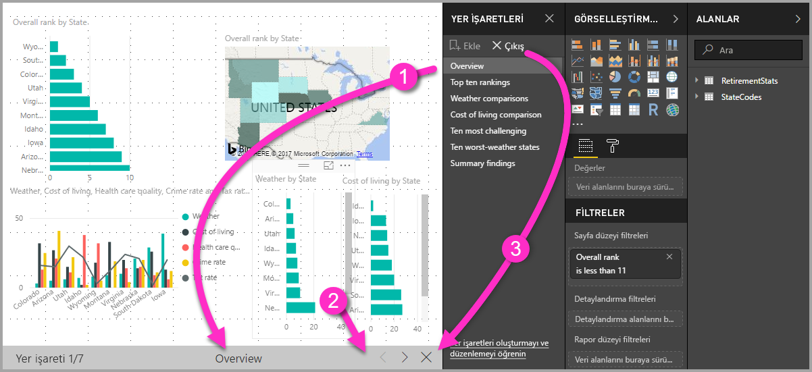

**Görünüm** modundayken sunumunuz için daha fazla alan sağlamak üzere **Yer İşaretleri** bölmesini kapatabilirsiniz (bölmedeki X işaretine tıklayarak). **Görünüm** modundayken tüm görseller etkileşimlidir ve normalde olduğu gibi çapraz vurgulama için kullanılabilir. 

## Görünürlük - Seçim bölmesini kullanma
Yer işaretlerinin dahil edildiği sürümle birlikte yeni **Seçim** bölmesi de kullanıma sunulmuştur. **Seçim** bölmesi, geçerli sayfadaki tüm nesnelerin bir listesini sunar ve nesneyi seçip görünür olup olmayacağını belirtmenize olanak sağlar. 

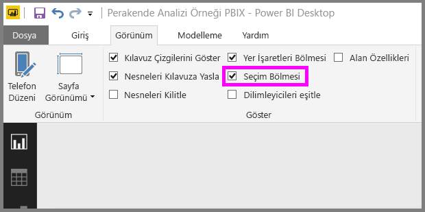

**Seçim** bölmesini kullanarak bir nesneyi seçebilirsiniz. Ayrıca, görselin sağındaki göz simgesine tıklayarak nesnenin geçerli durumda görünür olup olmayacağına ilişkin seçiminizi belirleyebilirsiniz. 

Bir yer işareti eklendiğinde her bir nesnenin görünürlük durumu da **Seçim** bölmesindeki ayarına göre kaydedilir. 

**Dilimleyicilerin**, görünür olup olmadıklarından bağımsız olarak rapor sayfalarını filtrelemeye devam ettiğini unutmayın. Bu nedenle, farklı dilimleyici ayarlarına sahip birçok farklı yer işareti oluşturabilir ve tek bir rapor sayfasının çeşitli yer işaretlerinde oldukça farklı görünmesini (ve farklı öngörüleri vurgulamasını) sağlayabilirsiniz.

## Şekiller ve resimler için yer işaretleri
Yer işaretlerine şekil ve resim de bağlayabilirsiniz. Bu özellik kullanıldığında, bir nesneye tıkladığınızda o nesne ile ilişkili yer işareti gösterilir. 

Bir nesneye yer işareti atamak için nesneyi seçin, ardından aşağıdaki görüntüde gösterildiği gibi **Şekil Biçimlendir** bölmesinden **Bağlantı** seçeneğini belirleyin.

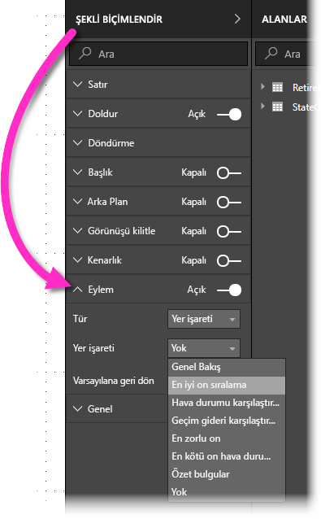

**Bağlantı** kaydırıcısını **Açık** olarak ayarladığınızda nesnenin bir bağlantı mı yoksa bir yer işareti mi olacağını belirleyebilirsiniz. Yer işaretini seçerseniz ardından nesnenin hangi yer işaretlerine bağlanacağını seçebilirsiniz.

Nesne bağlantılı yer işaretlemesi ile pek çok ilgi çekici işlem yapabilirsiniz. Sadece bir nesneye tıklayarak rapor sayfanızdaki görsellere ilişkin bir içindekiler tablosu oluşturabilir veya aynı bilgilerle farklı görünümler (görsel türleri gibi) sağlayabilirsiniz.

Bağlantıyı açmak için, düzenleme modundayken CTRL tuşuna basıp bağlantıya tıklayabilirsiniz; düzenleme modunda değilseniz açmak için bağlantıya tıklamanız yeterlidir. 

## Spotlight'ı kullanma
Yer işaretleri ile gelen bir diğer özellik de **Spotlight**'tır. Örneğin, **Görünüm** modunda yer işaretlerinizin sunumunu yaparken **Spotlight** ile ilgiyi belirli bir grafiğe çekebilirsiniz.

Şimdi aralarındaki farkları görmek için **Spotlight** ile **odak** modunu karşılaştıralım.

1. **Odak** modunda, **odak** modu simgesini seçerek bir görselin tuvalin tamamını doldurmasını sağlayabilirsiniz.
2. **Spotlight**'ı kullanarak ise sayfadaki tüm diğer görsellerin rengini neredeyse saydam olacak şekilde soldurarak bir görseli özgün boyutunda vurgulayabilirsiniz. 

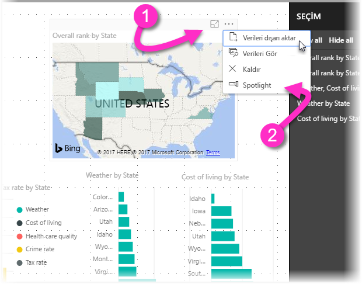

Önceki görüntüdeki görsel için **odak** simgesi seçili olduğu için sayfa aşağıdaki gibi görünür:

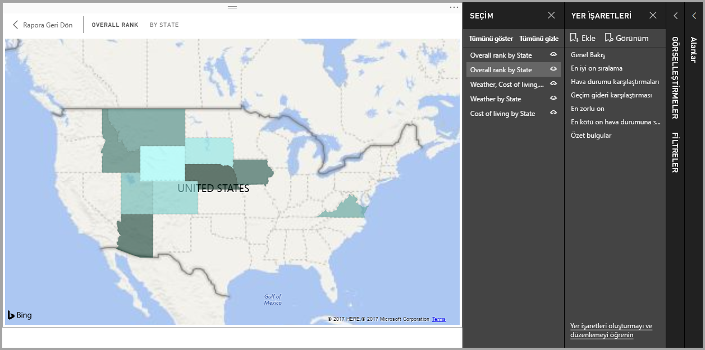

Görselin üç nokta menüsünden **Spotlight** seçildiğindeyse sayfa aşağıdaki gibi görünür:

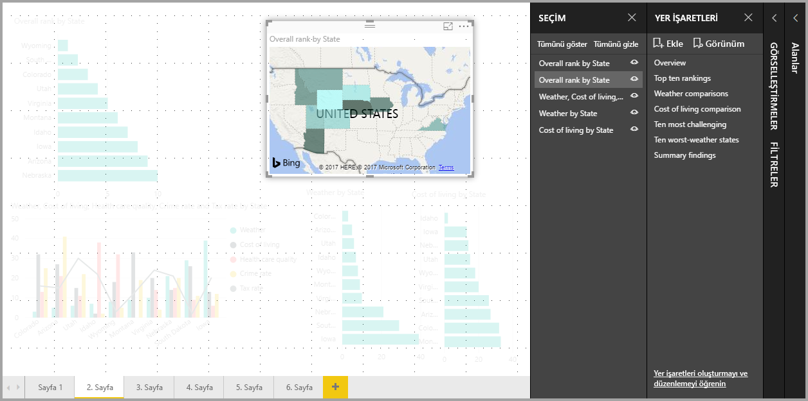

Bir yer işareti eklendiğinde bu modlardan biri seçiliyse seçili olan mod (odak veya Spotlight) yer işaretinde de korunur.

## Power BI hizmetinde yer işaretleri
**Power BI hizmetinde** en az bir yer işareti bulunan bir rapor yayımladığınızda, bu yer işaretlerini **Power BI hizmetinde** görüntüleyebilir ve yer işaretleriyle etkileşim kurabilirsiniz. Yayımladığınız her rapor içink, yer işaretleri özelliğinin **Power BI hizmetinde** kullanılabilir olmasını sağlamak üzere, raporu yayımlamadan önce raporda oluşturulmuş en az bir yer işaretiniz olmalıdır.

Bir raporda yer işaretleri mevcut olduğunda söz konusu bölmelerden her birimi göstermek için **Görünüm > Seçim bölmesi** veya **Görünüm > Yer İşaretleri bölmesi**'ni seçebilirsiniz.

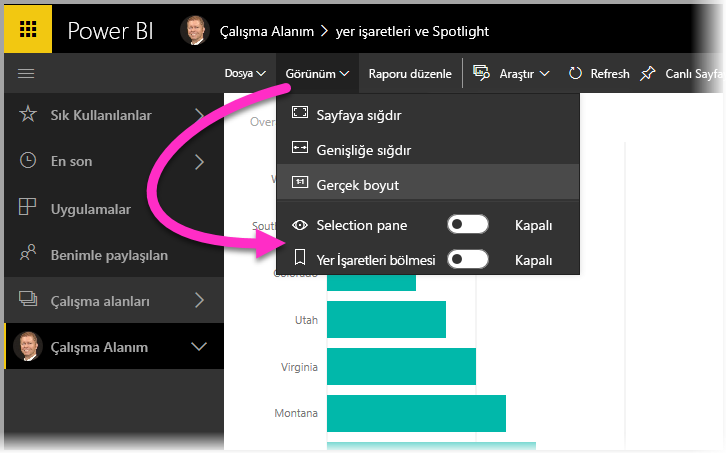

**Power BI hizmetinde** **Yer İşaretleri bölmesi**, tıpkı **Power BI Desktop**'taki gibi çalışır. Yer işaretlerinizi bir slayt gösterisi gibi sırayla göstermek için **Görünüm** seçeneğini belirlemek de buna dahildir.

Yer işaretleri arasında gezinmek için gri renkli yer işareti başlık çubuğunu kullanmayı unutmayın. Siyah okları kullanırsanız yer işaretleri arasında değil, raporlar arasında gezinirsiniz.

## Sınırlamalar ve önemli noktalar
**Yer işaretleri**'nin bu önizleme sürümünde dikkat etmeniz gereken bazı sınırlamalar ve önemli noktalar bulunmaktadır.

* Filtrenin *kaynağı* olmaları durumunda özel görseller, yer işaretleri ile birlikte çalışmaz. Bir sayfadaki öğeleri filtrelemek için özel görseller kullanıyorsanız (örneğin, ciklet dilimleyici) ve ilgili sayfaya bir yer işareti ile dönerseniz sayfa filtrelenebilir ancak özel görsel sayfanın nasıl filtrelendiğini gösterecek şekilde güncelleştirilmez. 
* Bir rapor bölmesinin çapraz vurgulanma durumu, yer işareti oluşturduğunuzda *kaydedilmez*. 
* Yer işareti oluşturduktan sonra rapor sayfasına bir görsel eklerseniz bu görsel, varsayılan durumunda görüntülenir. Bu, önceden yer işaretleri oluşturduğunuz bir sayfaya dilimleyici eklediğinizde dilimleyicinin varsayılan durumunda davranış göstereceği anlamına da gelir.
* Bir yer işareti oluşturulduktan sonra gerçekleştirdiğiniz görsel taşıma işlemleri, yer işaretinde gösterilir. 
* Raporunuzu **Power BI hizmetinde** yayımladığınızda hizmette yer işaretlerinin kullanılabilmesi için raporunuzda en az bir yer işareti *olması gerekir*. Bu, yayımladığınız her rapor için gereklidir.
* Yer işaretleri bir Önizleme özelliği olduğundan henüz [**Rapor Sunucusu için Power BI Desktop**](report-server/quickstart-create-powerbi-report.md)'ta kullanılmamaktadır.

## Sonraki adımlar
Yer işaretlerine benzeyen veya yer işaretleriyle etkileşim kuran özellikler hakkında daha fazla bilgi için aşağıdaki makalelere göz atın:

* [Power BI Desktop'ta detaylandırma özelliğini kullanma](desktop-drillthrough.md)
* [Bir pano kutucuğunu veya rapor görselini Odak modunda görüntüleme](service-focus-mode.md)

