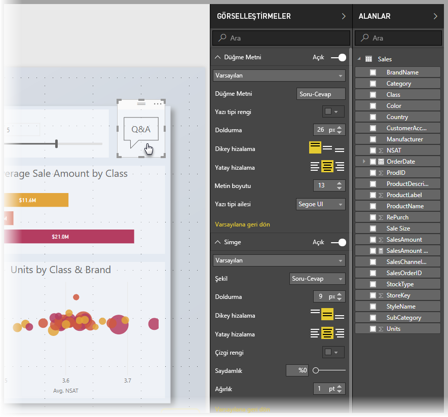
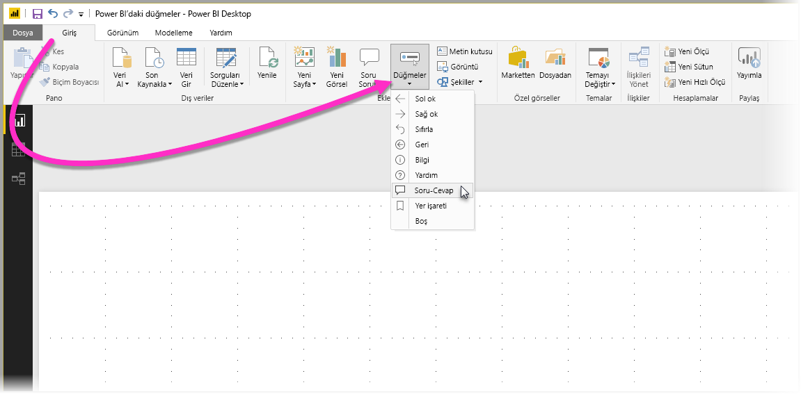
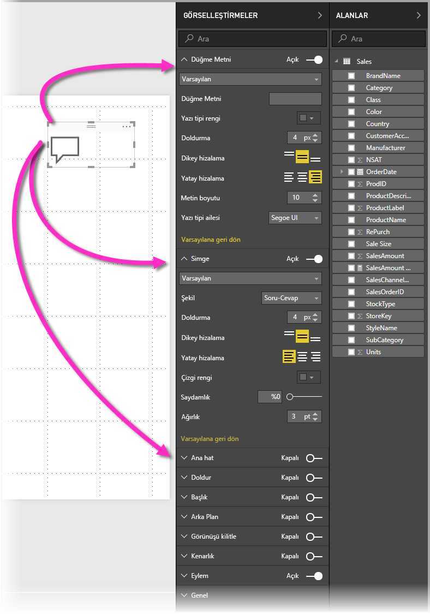
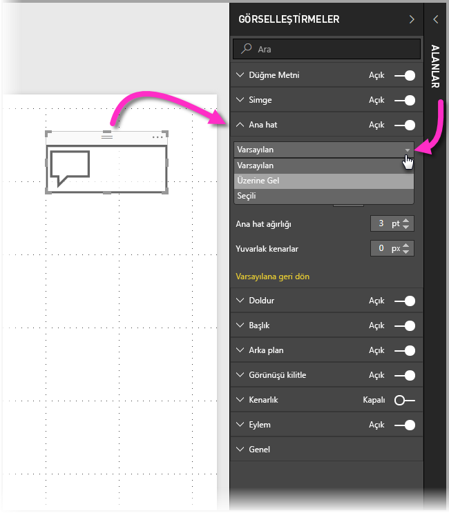
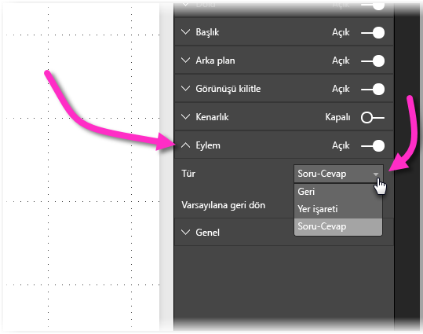

# Power BI’da düğmeleri kullanma
Power BI **düğmeleri**, uygulamalar gibi davranan raporlar ve panolar oluşturmanızı, böylece kullanıcıların Power BI içeriklerinin üzerine gelip tıklayıp etkileşime gireceği ilgi çekici bir ortam elde etmenizi sağlar. **Power BI Desktop**’ta rapor düğmeleri ekleyebilir ve kullanıcılar için uygulama gibi davranan panolar oluşturmak amacıyla bu raporları Power BI hizmetinde paylaşabilir veya yayımlayabilirsiniz.

**Power BI Desktop**’ta oluşturduğunuz düğmeler, **Power BI hizmetinde** yayımlanan raporlar ve panolarda kullanıma açıktır.

## Raporlarda düğme oluşturma
Bir **Power BI Desktop** raporunda düğme oluşturmak için, **Giriş** şeridinde bulunan **Düğmeler** seçeneğini belirlediğinizde görünen açılan menüde, aşağıdaki görüntüde gösterildiği gibi seçeneklerden oluşan bir koleksiyondan istediğiniz düğmeyi seçebilirsiniz. 

Bir düğme oluşturup rapor tuvalinde seçtiğinizde **Görselleştirmeler** bölmesi, düğmeyi gereksinimlerinizi karşılayacak şekilde özelleştirmek için birçok yol gösterir. Örneğin, **Görselleştirmeler** bölmesinin o kartında bulunan kaydırıcıyı oynatarak **Düğme Metni**’ni açıp kapatabilirsiniz. Ayrıca diğer özelliklerin yanı sıra düğmenin simgesini, düğme dolgusunu, başlığı ve bir raporda veya panoda kullanıcıların düğmeye tıkladığında gerçekleşen eylemi değiştirebilirsiniz.

## Boşta olduğunda, üzerine gelindiğinde veya seçildiğinde gerçekleşen düğme özelliklerini ayarlama

Power BI düğmelerinin üç durumu vardır: varsayılan (üzerine gelinmediğinde veya seçilmediğinde görünen şekli), üzerine gelindiğinde veya seçildiğinde (genelde *tıklanma* olarak geçer). **Görselleştirmeler** bölmesindeki kartların birçoğu, bu üç duruma göre teker teker değiştirilebilir, bu da size düğmelerinizi özelleştirmek için bolca esneklik sağlar.

**Görselleştirmeler** bölmesinde bulunan aşağıdaki kartlar, düğmenin biçimlendirmesini veya davranışını, üç durumuna göre ayarlamanızı sağlar:

* Düğme Metni
* Simge
* Ana hat
* Doldur

Düğmenin her durumda nasıl göründüğünü belirlemek için, bu kartlardan birini genişletin ve kartın üstünde görünen açılan listeyi seçin. Aşağıdaki resimde, üç durumu gösteren seçili açılan listeyle birlikte **Ana hat** kartının genişletildiğini görürsünüz:

## Düğme için eylem belirleyin

Bir kullanıcı Power BI’da bir düğmeyi seçtiğinde gerçekleşecek olan eylemi belirleyebilirsiniz. Düğme eylemleri seçeneklerine, **Görselleştirmeler** bölmesindeki **Eylem** kartından erişebilirsiniz.

Düğme eylemleri seçenekleri şunlardır:

* Geri
* Yer işareti
* Soru-Cevap

**Geri** seçeneğini belirlemek, kullanıcıyı raporun önceki sayfasına döndürür. Bu, özellikle ayrıntılı sayfalar için kullanışlıdır.

**Yer işareti** seçeneğini belirlemek, geçerli rapor için tanımlı bir yer işaretiyle ilişkili rapor sayfasını sunar. [Power BI’da yer işaretleri hakkında daha fazla bilgi edinebilirsiniz](desktop-bookmarks.md). 

Açılan listeden **Soru-Cevap** seçeneğini belirlemek, bir **Soru-Cevap Gezgini** penceresi sunar. 

Belirli düğmelerin, otomatik olarak seçili varsayılan bir eylemi olur. Örneğin, **Soru- Cevap** düğmesi türü, otomatik olarak varsayılan eylem olacak şekilde **Soru- Cevap**’ı seçer. [Bu blog gönderisine](https://powerbi.microsoft.com/blog/power-bi-desktop-april-2018-feature-summary/#Q&AExplorer) göz atarak **Soru-Cevap Gezgini** hakkında daha fazla bilgi edinebilirsiniz.

Kullanmak istediğiniz düğme üzerinde *CTRL+CLICK* tuşlarını kullanarak raporunuz için oluşturduğunuz düğmeleri deneyebilir veya test edebilirsiniz. 

## Sonraki adımlar
Düğmelere benzeyen veya düğmelerle etkileşim kuran özellikler hakkında daha fazla bilgi için aşağıdaki makalelere göz atın:

* [Power BI Desktop'ta detaylandırma özelliğini kullanma](desktop-drillthrough.md)
* [Bir pano kutucuğunu veya rapor görselini Odak modunda görüntüleme](service-focus-mode.md)
* [Power BI’da içgörü paylaşmak ve hikayeler oluşturmak için yer işaretlerini kullanma](desktop-bookmarks.md)

