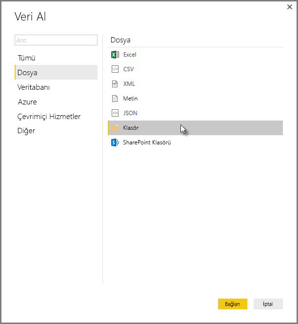
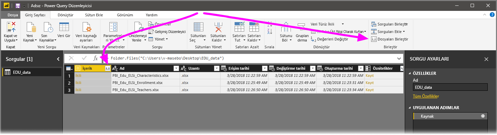
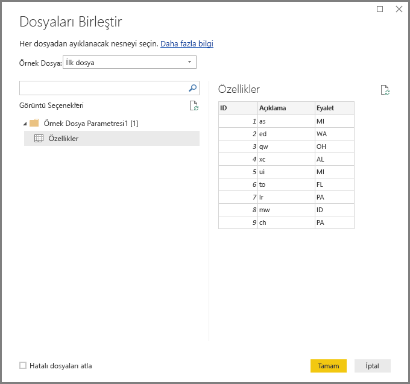
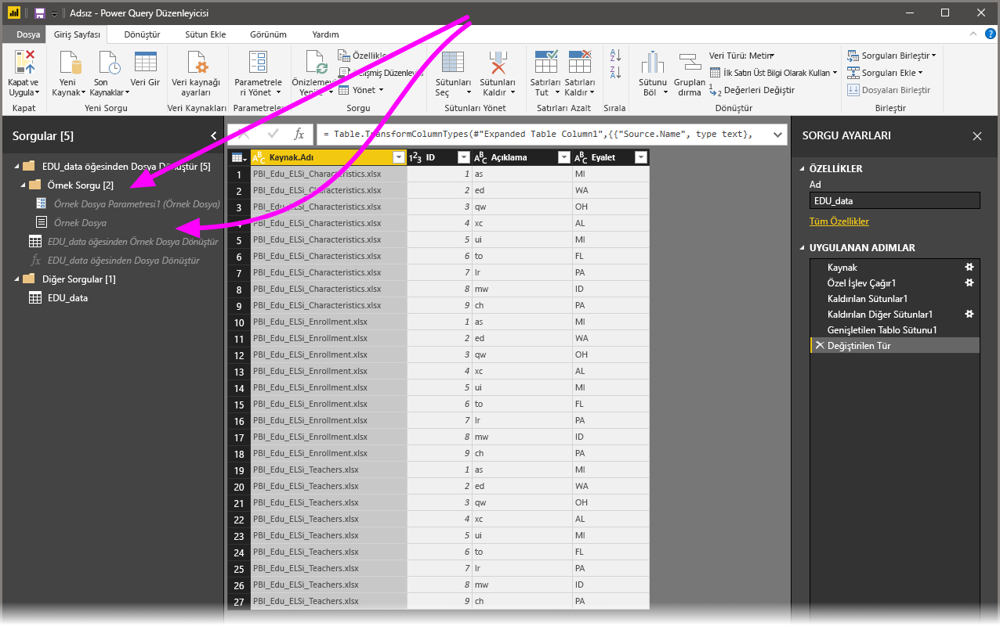

# Power BI Desktop’ta dosyaları (ikili değerleri) birleştirme
Aynı şemaya sahip birden fazla dosyayı tek bir mantıksal tablo olarak birleştirmek, **Power BI Desktop**'a veri aktarmaya yönelik güçlü bir yaklaşımdır. Bu kullanışlı ve popüler yaklaşım, **Power BI Desktop**'ın Kasım 2016 sürümü (ve sonraki sürümler) ile birlikte çok daha kullanışlı ve kapsamlı hale geldi. Ayrıntıları bu makalede bulabilirsiniz.

Aynı klasörde bulunan dosyaları birleştirme işlemine başlamak için **Veri Al > Dosya > Klasör**’ü seçin.

## Önceki dosyaları (ikili değerleri) birleştirme davranışı
**Power BI Desktop**’ın Kasım 2016 sürümünden önce bu işlev, **İkili Değerleri Birleştir** olarak adlandırılıyordu ve **ikili değerleri birleştir** dönüştürme işlemiyle belirli dosya türlerini birleştirebiliyordunuz ancak bazı sınırlamalar söz konusuydu:

* Tek dosyalarda dönüştürme işleminin gerçekleştirilebilmesi için dosyaların tek bir tabloda birleştirilmesi gerekiyordu. Benzer şekilde, genellikle dosyaları birleştirmeniz ve düzenleme işleminin bir parçası olarak satırları filtreleyip *başlık değerlerini* dışarıda bırakmanız gerekiyordu.
* **İkili değerleri birleştir** dönüştürme işlemi yalnızca *metin* veya *CSV* dosyalarında kullanılabiliyor; Excel çalışma kitapları ve JSON dosyaları gibi şu anda desteklenen diğer dosya biçimlerinde kullanılamıyordu.

Müşteriler **ikili değerleri birleştir** işleminin daha kullanışlı hale getirilmesini istediğinden bu dönüştürme deneyimi iyileştirildi ve **dosyaları birleştir** olarak yeniden adlandırıldı.

## Geçerli dosyaları birleştirme davranışı
**Power BI Desktop** artık **dosyaları (ikili değerleri) birleştir** işlemini çok daha etkin bir şekilde gerçekleştiriyor. Bu işleme, **Sorgu Düzenleyicisi**’nin **Giriş** şeridi sekmesinde veya ilgili sütunda **dosyaları birleştir** seçeneğini belirleyerek başlarsınız.

**Dosyaları birleştir** dönüştürme işleminin geçerli davranışı:

* **Dosyaları birleştir** dönüştürme işlemi, her bir giriş dosyasını çözümler ve kullanılacak doğru dosya biçimini (*metin* veya *Excel çalışma kitabı* ya da *JSON* dosyası gibi) belirler.
* Dönüştürme işlemi, ilk dosyadan belirli bir nesneyi (örneğin, ayıklanacak bir *Excel çalışma kitabı*) seçmenize olanak sağlar.
  
  
* **Dosyaları birleştir** işlemi daha sonra otomatik olarak aşağıdaki sorguları gerçekleştirir:
  
  * Tek bir dosyada gerekli tüm ayıklama adımlarını gerçekleştirecek örnek bir sorgu oluşturulur.
  * Dosya/ikili değer girişini *örnek sorgu* olarak parametreleştiren bir *işlev sorgusu* oluşturulur. Örnek sorgu ve işlev sorgusu bağlantılı hale getirilir. Böylece, örnek sorguda yapılan değişiklikler işlev sorgusunda da geçerli olur.
  * *İşlev sorgusu*, giriş ikili değerlerinin bulunduğu özgün sorguya (örneğin, *Klasör* sorgusu) uygulanır. Böylece, her bir satırdaki ikili değer girişleri için işlev sorgusu uygulanır ve ayıklanan veriler, üst düzey sütunlar olarak genişletilir.
    
    

**Dosyaları birleştir** seçeneğinin yeni davranış biçimiyle, aynı dosya türüne ve yapısına (örneğin, aynı sütunlarda bulunmaları) sahip oldukları sürece belirli bir klasördeki tüm dosyaları kolayca birleştirebilirsiniz.

Ayrıca, otomatik olarak oluşturulan *örnek sorguyu* değiştirerek başka dönüştürme ve ayıklama adımlarını da kolayca uygulayabilirsiniz. Bunun için ek *işlev sorgusu* adımlarını değiştirmeniz veya yeni adımlar oluşturmanız gerekmez. *Örnek sorgu* üzerindeki tüm değişiklikler, bağlantılı *işlev sorgusunda* otomatik olarak oluşturulur.

## Sonraki adımlar
Power BI Desktop'ı kullanarak çok çeşitli türlerdeki verilere bağlanabilirsiniz. Veri kaynakları hakkında daha fazla bilgi için aşağıdaki kaynaklara bakın:

* [Power BI Desktop nedir?](desktop-what-is-desktop.md)
* [Power BI Desktop'ta Veri Kaynakları](desktop-data-sources.md)
* [Power BI Desktop'ta Verileri Şekillendirme ve Birleştirme](desktop-shape-and-combine-data.md)
* [Power BI Desktop'ta CSV dosyalarına bağlanma](desktop-connect-csv.md)   
* [Verileri doğrudan Power BI Desktop'a girme](desktop-enter-data-directly-into-desktop.md)   

