# Power BI Desktop'taki genel sorgu görevleri
Power BI Desktop'ın **Sorgu Düzenleyicisi** penceresinde çalışırken yararlanabileceğiniz, yaygın olarak kullanılan birkaç görev vardır. Bu belgede, söz konusu görevler gösterilmiş ve ek bilgilere yönelik bağlantılar sağlanmıştır. 

Burada gösterilen, sık kullanılan sorgu görevleri aşağıda verilmiştir:

* Verilere bağlanma
* Verileri şekillendirme ve birleştirme
* Satırları gruplandırma
* Sütunları özetleme
* Özel sütun oluşturma
* Formülleri sorgulama

Bu görevleri tamamlamak için birkaç veri bağlantısından yararlanacağız. Bu görevlere ilişkin adımları kendi başınıza uygulamak isterseniz ilgili verileri indirebilir veya verilere bağlanabilirsiniz.

İlk veri bağlantısı bir Excel çalışma kitabıdır. Diğeri ise (başka bir Power BI Desktop yardım içeriğinde de kullanılmıştır) şu sayfadan erişilebilen bir Web kaynağıdır:

[*http://www.bankrate.com/finance/retirement/best-places-retire-how-state-ranks.aspx*](http://www.bankrate.com/finance/retirement/best-places-retire-how-state-ranks.aspx)

Bu veri kaynaklarından her ikisine de bağlanmak için gerekli adımlar, sık kullanılan Sorgu görevlerinin başlangıcı niteliğindedir.

## Verilere bağlanma
Power BI Desktop'ta verilere bağlanmak için, şeritteki **Giriş** sekmesinde bulunan **Veri Al** seçeneğini belirleyin. Power BI Desktop, en sık kullanılan veri kaynaklarını içeren bir menü görüntüler. Power BI Desktop'ta bağlanılabilen veri kaynaklarının tam listesi için, menünün alt kısmında bulunan **Diğer...** düğmesini seçin. Daha fazla bilgi için bkz. [Power BI Desktop'taki Veri Kaynakları](https://docs.microsoft.com/en-us/power-bi/desktop-data-sources).

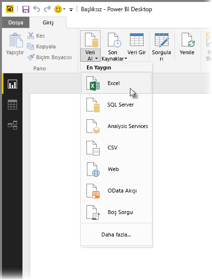

Başlamak için **Excel** seçeneğini belirleyin, çalışma kitabına gidin ve ardından bu dosyayı seçin. Sorgu Düzenleyicisi çalışma kitabını inceler ve ardından, bulduğu verileri **Gezgin** penceresinde gösterir.

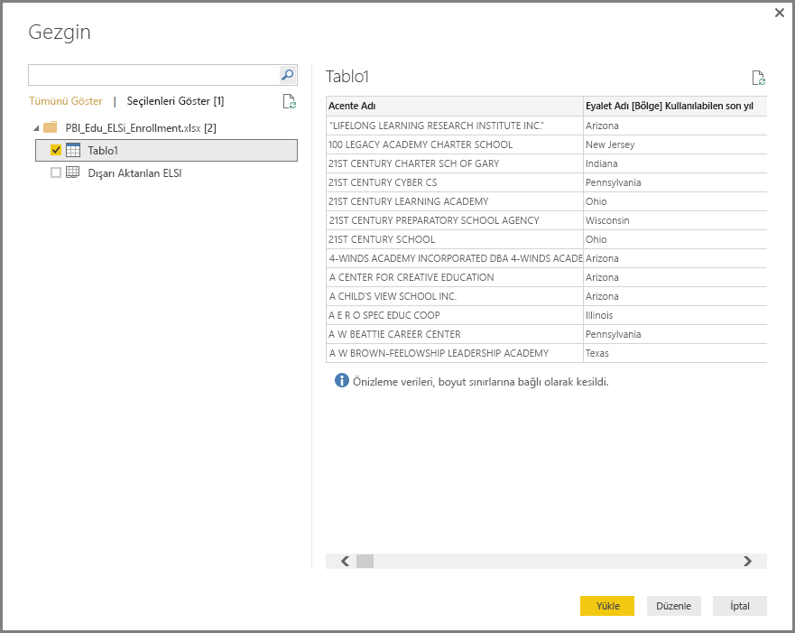

Verileri Power BI Desktop'a yüklemeden önce, **Düzenle** seçeneğini belirleyerek ayarlayabilir veya *şekillendirebilirsiniz*. Yükleme yapmadan önce bir sorguyu düzenlemek, özellikle de bu işlemden önce küçültmek istediğiniz büyük veri kümeleriyle çalışıyorsanız kullanışlıdır. Bizim için de bu durum söz konusu olduğundan **Düzenle** seçeneğini belirliyoruz.

Farklı türdeki verilere bağlanmak oldukça kolaydır. Ayrıca bir Web kaynağına da bağlanmak istiyoruz. **Veri Al \> Diğer...** seçeneğini ve ardından **Diğer \> Web** seçeneğini belirleyin.

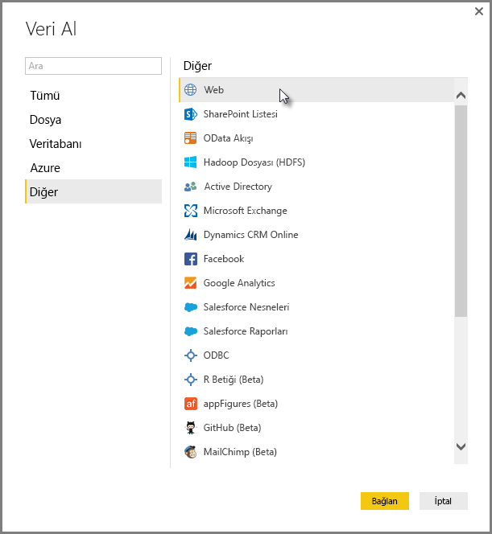

Web sayfasının URL'sini girebileceğiniz **Web'den** penceresi görüntülenir.

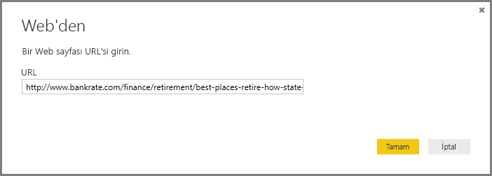

**Tamam** seçeneğini belirlediğinizde Power BI Desktop, daha önce de olduğu gibi çalışma kitabını inceler ve bulduğu verileri **Gezgin** penceresinde gösterir.

Diğer veri bağlantıları da benzer şekilde kurulur. Bir veri bağlantısını gerçekleştirmek için kimlik doğrulaması gerekiyorsa Power BI Desktop, geçerli kimlik bilgilerini girmenizi ister.

Power BI Desktop'ta verilere bağlanma işleminin adım adım gösterimi için bkz. [Power BI Desktop'ta verilere bağlanma](https://docs.microsoft.com/en-us/power-bi/desktop-connect-to-data).

## Verileri şekillendirme ve birleştirme
Verileri Sorgu Düzenleyicisi ile kolayca şekillendirebilir ve birleştirebilirsiniz. Bu bölümde, verileri nasıl şekillendirebileceğinize ilişkin birkaç örnek bulunur. Verileri şekillendirme ve birleştirme işlemlerinin eksiksiz bir gösterimi için bkz. **[Power BI Desktop'ta verileri şekillendirme ve birleştirme](https://docs.microsoft.com/en-us/power-bi/desktop-shape-and-combine-data)**.

Önceki bölümde, bir Excel çalışma kitabı ve bir Web kaynağı olmak üzere iki veri kümesini bağladık. Seçilen Web sayfasındaki sorgu (Sorgu Düzenleyicisi penceresinin sol tarafındaki **Sorgular** bölmesinde listelenen mevcut sorgular bölümünden alınan) Sorgu Düzenleyicisi’ne yüklendikten sonra aşağıdaki görüntüyle karşılaşırız.

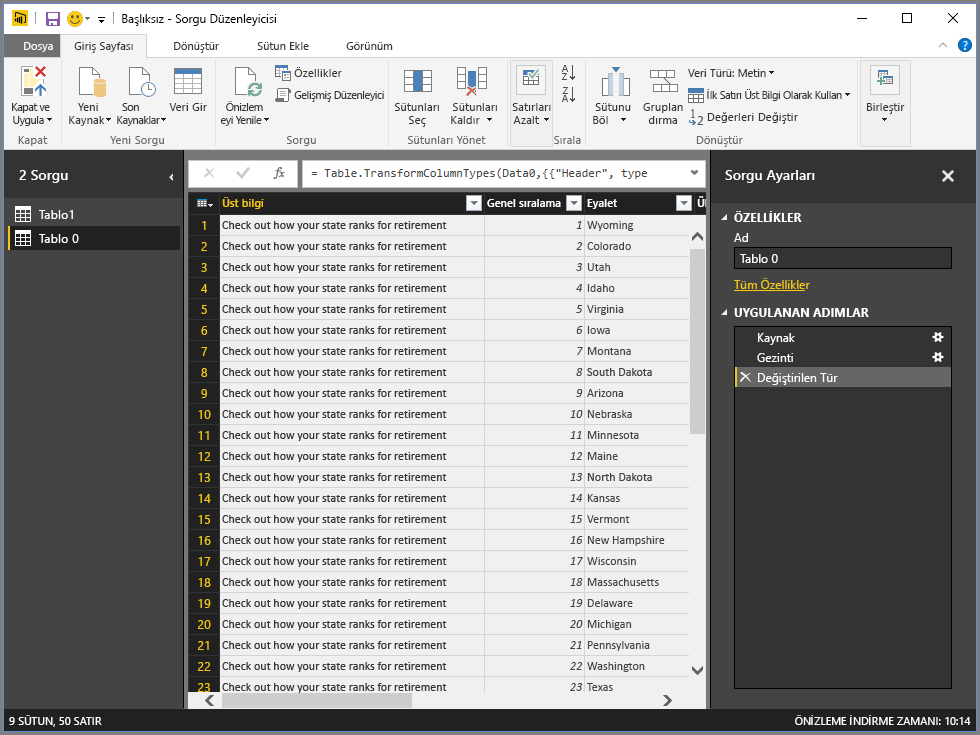

Verileri şekillendirdiğinizde, bir veri kaynağını ihtiyaçlarınızı karşılayan bir düzene ve biçime dönüştürmüş olursunuz. Bu örnekte ihtiyaç duymadığımızdan, *Header* başlıklı ilk sütunu kaldırabiliriz.

**Sorgu Düzenleyicisi**'ndeki şeritte ve bağlama duyarlı sağ tıklama menülerinde birçok komuta ulaşabilirsiniz. Örneğin, *Üst bilgi* sütununa sağ tıkladığınızda görüntülenen menüyü kullanarak sütunu kaldırabilirsiniz. Ayrıca sütunu seçip şeritteki **Sütunları Kaldır** düğmesini de belirleyebilirsiniz.

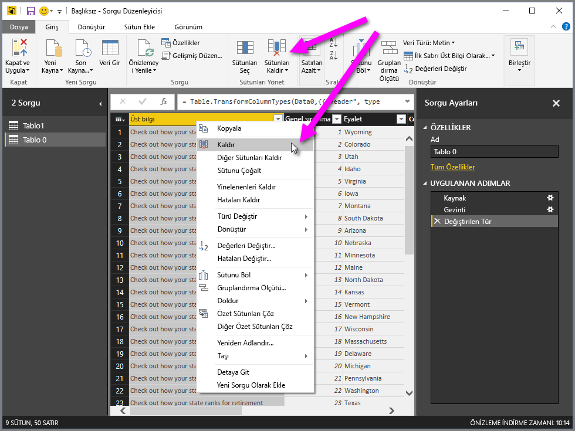

Bu sorgudaki verileri başka birçok yöntemle de şekillendirebilirsiniz; üstten veya alttan başlayarak dilediğiniz sayıda satırı kaldırabilir, sütun ekleyebilir, sütunları bölebilir, değerleri değiştirebilir ve Sorgu Düzenleyicisi’ni, verileri istediğiniz gibi alacak şekilde yönlendirmek için başka şekillendirme görevleri gerçekleştirebilirsiniz.

## Satırları gruplandırma
Sorgu Düzenleyicisi'nde, birden çok satırda bulunan değerleri tek bir değer olacak şekilde gruplandırabilirsiniz. Bu, sunulan ürün sayısı, toplam satışlar veya öğrenci sayısı özetlenirken kullanışlı olabilir.

Bu örnekte, bir eğitim kaydı veri kümesindeki satırları gruplandıracağız. Veriler bir Excel çalışma kitabından alınmış ve tam da istediğimiz sütunları elde etmek üzere Sorgu Düzenleyicisi’nde şekillendirilmiştir. Ayrıca tablo yeniden adlandırılmış ve birkaç dönüştürme işlemi daha gerçekleştirilmiştir.

Şimdi her bir eyaletin sahip olduğu Kuruluş (okul bölgelerinin yanı sıra hizmet bölgeleri gibi diğer eğitim kuruluşları dahil) miktarını bulalım. *State Abbr* sütununu seçip şeritteki **Dönüştür** veya **Giriş** sekmesinde bulunan **Gruplandır** düğmesini seçeriz. (**Gruplandır** düğmesi her iki sekmede de yer alır.)

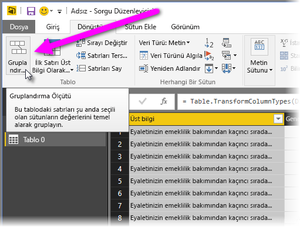

**Gruplandır** penceresi görüntülenir. Sorgu Düzenleyicisi satırları gruplandırdığında, **Gruplandır** işleminden elde edilen sonuçları yerleştirdiği yeni bir sütun oluşturur. **Gruplandır** işlemini aşağıda belirtilen yollarla ayarlayabilirsiniz:

1. *Gruplandır*: Bu, gruplandırılacak sütundur. Sorgu Düzenleyicisi, seçilmiş sütunu belirler ancak bu pencerede, söz konusu sütunu tablodaki herhangi bir sütunla değiştirebilirsiniz.
2. *Yeni sütun adı*: Sorgu Düzenleyicisi, gruplandırılmakta olan sütuna uyguladığı işlemi temel alarak yeni sütun için bir ad önerse de yeni sütunu dilediğiniz gibi adlandırabilirsiniz.
3. *İşlem*: Burada, Sorgu Düzenleyicisi'nin uygulayacağı işlemi belirtirsiniz.
4. *Gruplama ekleme* ve *Toplama ekleme*: Bu seçenekler, **Gelişmiş** seçeneği belirlendikten sonra görüntülenir. Birden çok sütunda gruplandırma işlemlerinin (**Gruplandır** eylemleri) yanı sıra birden çok toplama işlemi de yapabilirsiniz. Üstelik bunların tümünü **Gruplandır** penceresinde, tek bir işlem altında gerçekleştirebilirsiniz. Sorgu Düzenleyicisi, birden çok sütun üzerinde çalışan yeni bir sütun (bu penceredeki seçimlerinize göre) oluşturur. 

Bir **Gruplandır** işlemine daha fazla gruplanma veya toplama eklemek için **Gruplama ekleme** veya **Toplama ekleme** düğmesini seçin. **...** simgesini seçip **Sil** seçeneğini belirleyerek bir gruplamayı veya toplamayı kaldırabilirsiniz. İsterseniz nasıl bir işlem olduğunu görmek için düğmeyi deneyebilirsiniz.
   
   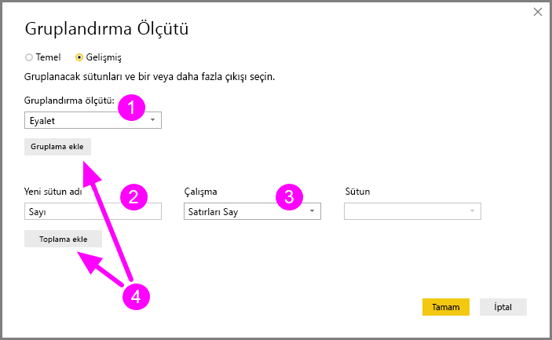

**Tamam** seçeneğini belirlediğimizde, Sorgu Düzenleyicisi **Gruplandır** işlemini gerçekleştirir ve sonuçları döndürür. Şuna bir bakın: Bugün Ohio, Texas, Illinois ve California eyaletlerinden her birinde binin üzerinde kuruluş var!

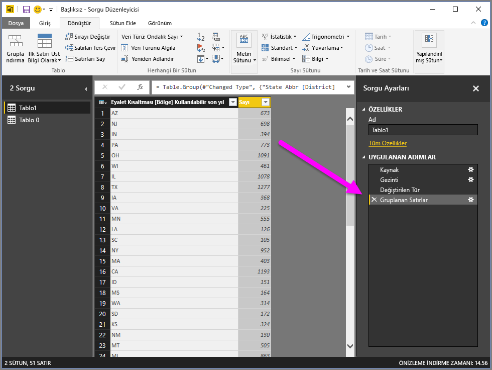

Üstelik Sorgu Düzenleyicisi'ni kullanırken, kısa bir süre önce tamamlanmış adımın yanında bulunan **X** simgesini seçerek, son şekillendirme işlemini her zaman silebilirsiniz. Deneme amaçlı işlemler gerçekleştirin ve sonuçlardan memnun kalmazsanız verileriniz Sorgu Düzenleyicisi tarafından tam da istediğiniz gibi şekillendirilene kadar adımı tekrarlayın.

## Sütunları özetleme
Power BI Desktop ile sütunları özetleyebilir ve sütundaki her bir benzersiz değer için toplanan değerler içeren bir tablo oluşturabilirsiniz. Örneğin, her bir ürün kategorisinde kaç adet farklı ürününüz bulunduğunu bilmeniz gerekiyorsa tam da bu işinize yaracak bir tabloyu hızlıca oluşturabilirsiniz.

Bir örneğe göz atalım. Aşağıdaki **Products** tablosu, yalnızca her bir benzersiz ürünü (adına göre) ve ait oldukları kategoriyi gösterecek biçimde şekillendirilmiştir. Her bir kategorideki ürün sayısını gösteren yeni bir tablo (*CategoryName* sütununu temel alan) oluşturmak için, sütunu seçin ve ardından şeritteki **Dönüştür** sekmesinde bulunan **Özet Sütun** seçeneğini belirleyin.

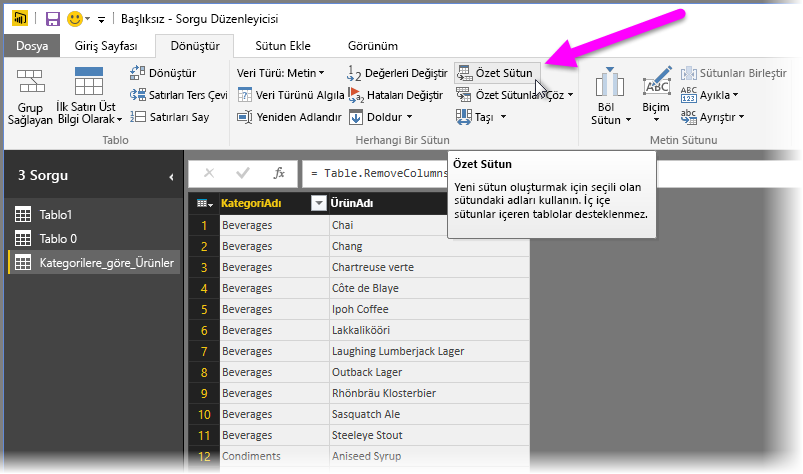

Yeni sütun oluşturmak için hangi sütun değerlerinin kullanılacağını belirten (1) **Özet Sütun** penceresi görüntülenir ve **Gelişmiş seçenekler** (2) menüsünü genişletmeniz halinde, toplanan değerlere uygulanacak işlevi görebilirsiniz (3).

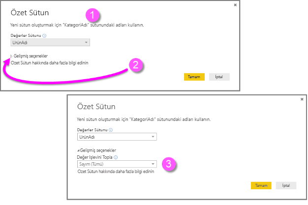

**Tamam**'ı seçtiğinizde Sorgu Düzenleyicisi, **Özet Sütun** penceresinde sağlanan dönüştürme yönergeleri doğrultusunda tabloyu görüntüler.

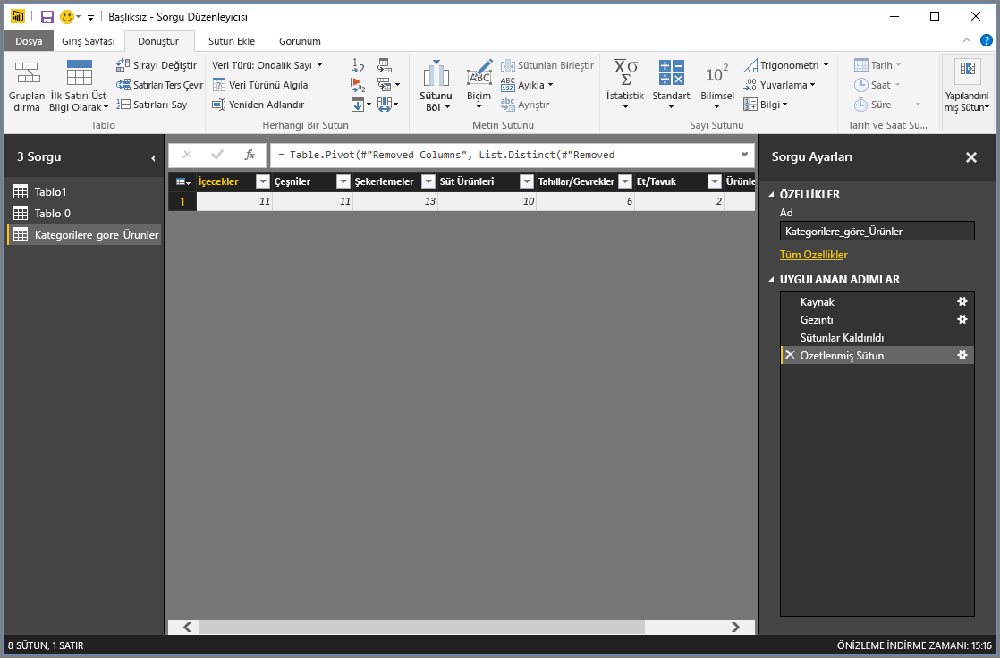

## Özel sütun oluşturma
Sorgu Düzenleyicisi'nde, tablonuzdaki birden çok sütunda çalışan özel formüller oluşturabilir ve ardından söz konusu formüllerin sonuçlarını yeni (özel) bir sütuna yerleştirebilirsiniz. Sorgu Düzenleyicisi sayesinde özel sütunları kolayca oluşturabilirsiniz.

Sorgu Düzenleyicisi’nde, şeritteki **Sütun Ekle** sekmesinden **Özel Sütun**’u seçin.

Aşağıdaki pencere görünür. Aşağıdaki örnekte, English Language Learners (ELL) kategorisindeki toplam öğrenci yüzdesini hesaplayan, *Percent Ell* adında özel bir sütun oluşturdu.

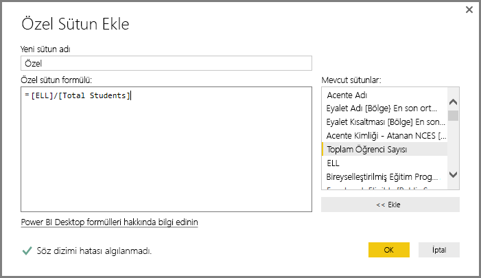

Sorgu Düzenleyicisi'nde uygulanan diğer adımlar gibi, ihtiyacınız olan veriler yeni özel sütunda sağlanmıyorsa **Özel Eklendi** adımının yanındaki **X** işaretini seçerek, adımı **Sorgu Ayarları** bölmesinde bulunan **Uygulanan Adımlar** bölümünden silebilirsiniz.

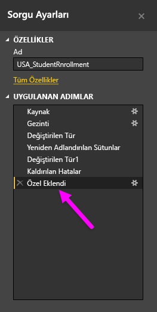

## Formülleri sorgulama
Sorgu Düzenleyicisi'nin oluşturduğu adımları düzenleyebilmenin yanı sıra verilerinize bağlanma ve verilerinizi şekillendirme ile ilgili tam denetime sahip olmak için özel formüller oluşturabilirsiniz. Sorgu Düzenleyicisi söz konusu veriler üzerinde her işlem gerçekleştirdiğinde, eylemle ilişkilendirilen formül **Formül Çubuğu**'nda görüntülenir. **Formül Çubuğu**'nu görüntülemek için, şeridin **Görünüm** sekmesinde bulunan **Formül Çubuğu**'nun yanındaki onay kutusunu seçin.

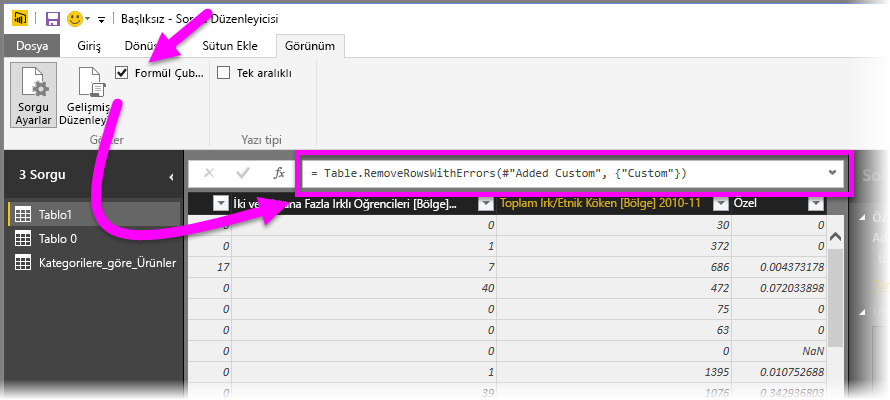

Sorgu Düzenleyicisi, her bir sorgu için uygulanan tüm adımları, görüntüleyebileceğiniz veya değiştirebileceğiniz bir metin olarak saklar. Şeridin **Görünüm** sekmesindeki **Gelişmiş Düzenleyici** seçeneğini belirlediğinizde görüntülenen **Gelişmiş Düzenleyici**'yi kullanarak herhangi bir sorgu metnini görüntüleyebilir ve değiştirebilirsiniz.

Görüntülenen **USA\_StudentEnrollment** sorgusuyla ilişkili sorgu adımlarını içeren **Gelişmiş Düzenleyici**'nin görünümü aşağıda verilmiştir. Bu adımlar, sıklıkla **M** olarak da adlandırılan Power Query Formül Dili ile oluşturulmuştur. Bilgi için bkz. [Learn about Power Query formulas (Power Query formülleri hakkında bilgi edinin)](https://support.office.com/article/Learn-about-Power-Query-formulas-6bc50988-022b-4799-a709-f8aafdee2b2f?ui=en-US&rs=en-US&ad=US). Yalnızca dil belirtimini görüntülemek için bkz. [Excel için Microsoft Power Query Formül Dili Belirtimi](http://go.microsoft.com/fwlink/?linkid=320633).

Power BI Desktop, kapsamlı bir formül kategorisi kümesi sunar. Daha fazla bilgi ve tüm Sorgu Düzenleyicisi formüllerine ilişkin eksiksiz bir başvuru için [Power Query Formül Kategorileri](https://support.office.com/en-in/article/Power-Query-formula-categories-125024ec-873c-47b9-bdfd-b437f8716819) sayfasını ziyaret edin.

Sorgu Düzenleyicisi'ne ilişkin formül kategorileri aşağıda verilmiştir:

* Sayı
  * Sabitler
  * Bilgi
  * Dönüştürme ve biçimlendirme
  * Biçim
  * Yuvarlama
  * İşlemler
  * Rastgele
  * Trigonometri
  * Bayt
* Metin
  * Bilgi
  * Metin karşılaştırmaları
  * Ayıklama
  * Değiştirme
  * Üyelik
  * Dönüşümler
* Mantıksal
* Tarih
* Saat
* DateTime
* DateTimeZone
* Süre
* Kayıt
  * Bilgi
  * Dönüşümler
  * Seçim
  * Serileştirme
* Liste
  * Bilgi
  * Seçim
  * Dönüşüm
  * Üyelik
  * Küme işlemleri
  * Sıralama
  * Ortalamalar
  * Ekleme
  * Sayısal
  * Oluşturucular
* Tablo
  * Tablo oluşturma
  * Dönüştürmeler
  * Bilgi
  * Satır işlemleri
  * Sütun işlemleri
  * Üyelik
* Değerler
* Aritmetik işlemler
* Parametre Türleri
* Meta Veriler
* Veri erişimi
* URI
* İkili biçimler
  * Sayı okuma
* İkili
* Satırlar
* İfade
* İşlev
* Hata
* Karşılaştırıcı
* Bölücü
* Birleştirici
* Değiştirici
* Tür

## Sonraki adımlar
Power BI Desktop ile yapabileceğiniz çok şey var. Özellikler hakkında daha fazla bilgi edinmek için aşağıdaki kaynaklara bakın:

* [Power BI Desktop ile Çalışmaya Başlama](desktop-getting-started.md)
* [Power BI Desktop ile Sorgulara Genel Bakış](desktop-query-overview.md)
* [Power BI Desktop'ta Veri Kaynakları](desktop-data-sources.md)
* [Power BI Desktop'taki Verilere Bağlanma](desktop-connect-to-data.md)
* [Power BI Desktop'ta Verileri Şekillendirme ve Birleştirme](desktop-shape-and-combine-data.md)

