# Tablolarda koşullu biçimlendirme 
Tablolar için koşullu biçimlendirme sayesinde hücre değerlerine göre (veya başka değerlere ya da alanlara göre) özel hücre renkleri belirtebilir ve gradyan renklerini kullanabilirsiniz. Ayrıca, veri çubukları ile hücre değerlerini gösterebilirsiniz. 

Koşullu biçimlendirme seçeneklerine erişmek için Power BI Desktop'ın **Görsel Öğeler** bölmesinin **Alanlar** kutusundaki **Değerler** kutusunda yer alan değerlerden biçimlendirmek istediğinizin yanındaki aşağı oku seçin (veya alana sağ tıklayın). Koşullu biçimlendirmeyi yalnızca **Alanlar** kutusunun **Değerler** alanındaki alanlar için yönetebilirsiniz.

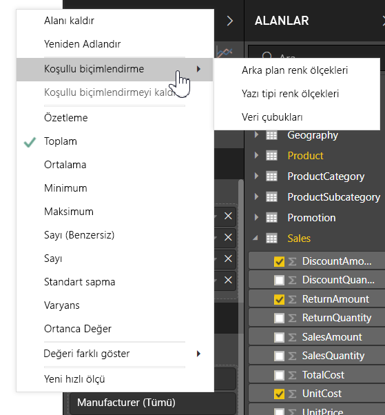

Aşağıdaki bölümlerde bu koşullu biçimlendirme seçeneklerinin her biri açıklanmaktadır. Tek bir tablo sütununda bir veya daha fazla seçenek birleştirilebilir.

> [!NOTE]
> Koşullu biçimlendirme bir tabloya uygulandığında, koşullu biçimlendirilmiş hücrelere uygulanmış olan özel tablo stillerini geçersiz kılar.

Bir görselleştirmedeki koşullu biçimlendirmeyi kaldırmak için alana tekrar sağ tıklayın, **Koşullu biçimlendirmeyi kaldır**'ı ve sonra kaldırılacak biçimlendirme türünü seçin.

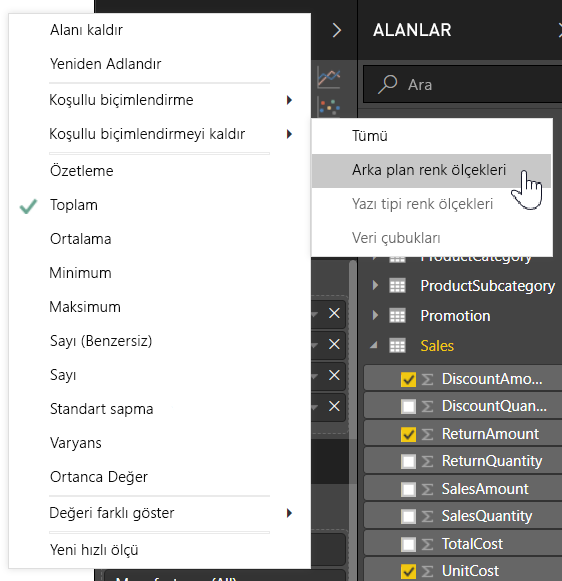

## Arka plan renk ölçekleri

**Koşullu biçimlendirme** ve sonra **Arka plan renk ölçekleri** seçildiğinde aşağıdaki iletişim kutusu açılır.

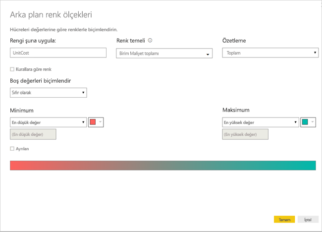

Bir alanda **Renk temeli** ayarını yaparak veri modelinizden renklerin temel alacağı alanı seçebilirsiniz. Ayrıca, **Özetleme** değerleri ile birlikte seçili alan için toplama türünü belirtebilirsiniz. Renklendirilecek alan **Rengi şuraya uygula:** alanında belirtilir, böylece takip edebilirsiniz. Biçimlendirme temeli olarak sayısal bir değer seçtiğiniz sürece, metin ve tarih alanlarına koşullu biçimlendirme uygulayabilirsiniz.

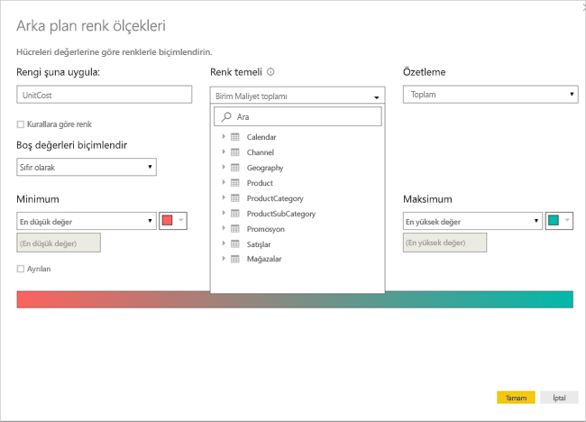

Belirtilen değer aralıkları için ayrı renk değerleri kullanmak istiyorsanız **Kurallara göre renk** öğesini seçin. Bir renk spektrumu kullanmak için **Kurallara göre renk** kutusunu işaretlenmemiş olarak bırakın. 

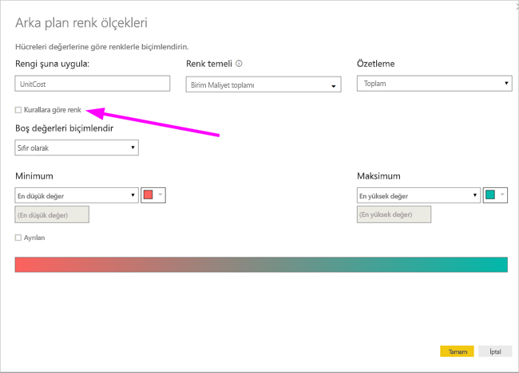

### Kurallara göre renk

**Kurallara göre renk** öğesini seçtiğinizde her biri ayarlanmış bir renge sahip bir veya daha fazla değer aralığı girebilirsiniz.  Her değer aralığı bir *If* değer koşulu, bir *and* değer koşulu ve bir renk ile başlar.

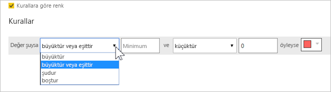

Her bir aralıkta değerleri olan tablo hücreleri, belirtilen renkle doldurulur. Aşağıdaki şekilde üç kural vardır.

Örnek tablo şimdi şu şekilde görünür:

### En düşükten en yükseğe renk

*En Düşük* ve *En Yüksek* değerler ile renklerini yapılandırabilirsiniz. **Ayrılan** kutusunu seçerseniz isteğe bağlı bir *Orta* değeri de yapılandırabilirsiniz.

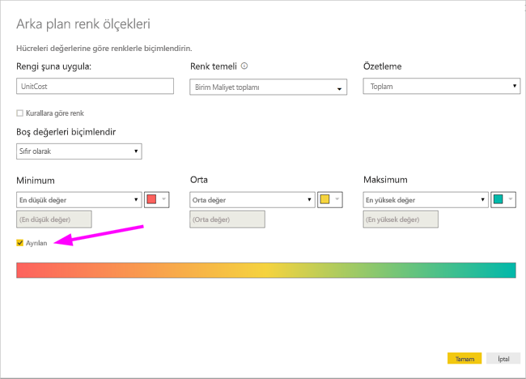

Örnek tablo şimdi şu şekilde görünür:

## Yazı tipi renk ölçekleri

**Koşullu biçimlendirme** ve sonra **Yazı tipi renk ölçekleri** seçildiğinde aşağıdaki iletişim kutusu açılır. Bu iletişim kutusu **Arka plan renk ölçekleri** iletişim kutusuna benzer ancak hücre arka plan rengi yerine yazı tipi rengini değiştirir.

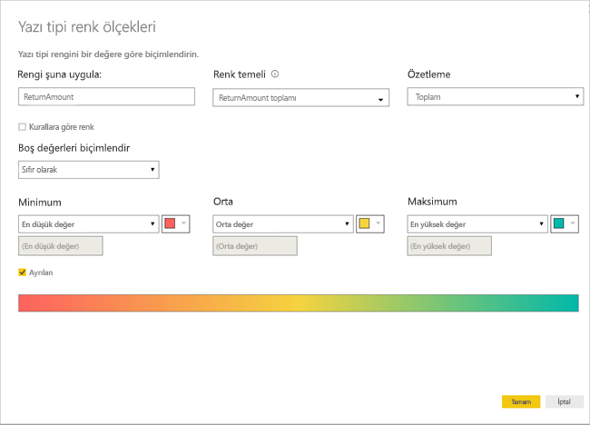

Örnek tablo şimdi şu şekilde görünür:

## Veri çubukları

**Koşullu biçimlendirme** ve sonra **Veri çubukları** seçildiğinde aşağıdaki iletişim kutusu açılır. 

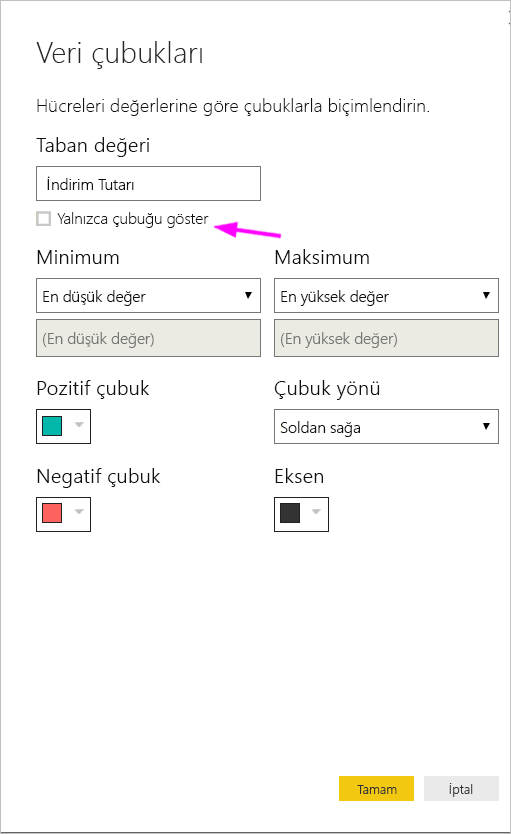

Varsayılan olarak, **Yalnızca çubuğu göster** seçeneği işaretli değildir ve bu nedenle tablo hücresi hem çubuğu hem de gerçek değeri gösterir.

**Yalnızca çubuğu göster** seçeneği işaretliyse tablo hücresi yalnızca çubuğu gösterir.

## Alan değerine göre renk biçimlendirme

Metin değeri veya onaltılık kod kullanarak bir renk belirten bir ölçü veya sütun kullanabilir, bu rengi bir tablo veya matris görselinin arka planına veya yazı tipi rengine uygulayabilirsiniz. Ayrıca belirli bir alan için özel mantık oluşturabilir, bu mantığın yazı tipine veya arka plana istenen rengi uygulamasını sağlayabilirsiniz.

Örneğin aşağıdaki tabloda her ürün modeliyle ilişkilendirilmiş bir renk vardır. 

Hücreyi alan değerine göre biçimlendirmek için görselin *Color* sütununa sağ tıklayıp **Koşullu biçimlendirme** iletişim kutusunu seçin ve bu örnek için menüden **Arka plan rengi**'ni seçin. 

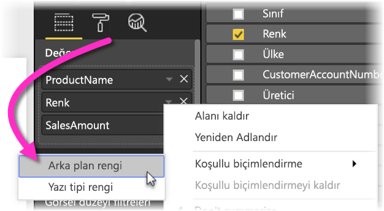

Aşağıdaki görüntüde gösterilen şekilde açılan iletişim kutusunun **Şuna göre biçimlendir** açılan menüsünden **Alan değeri**'ni seçin.

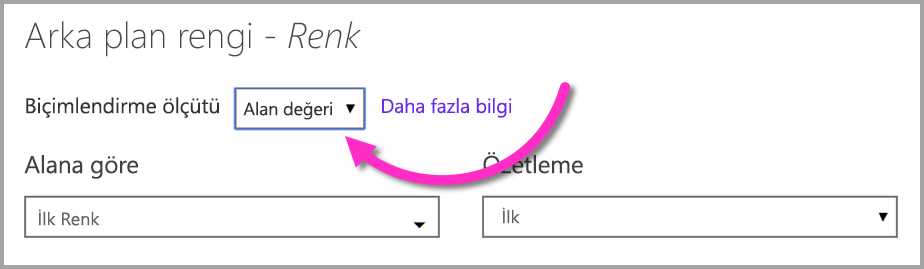

Bu işlemi yazı tipi rengi için tekrarlayabilirsiniz. Tamamladığınızda görselin **color** sütunu aşağıdaki ekran görüntüsünde gösterilen şekilde düz renk olur.

Tercih ettiğiniz koşullara göre farklı onaltılık kodlar oluşturan bir iş mantığını kullanan bir DAX hesaplaması da oluşturabilirsiniz. Bu durum genellikle koşullu biçimlendirme iletişim kutusundan birden fazla kural oluşturmaktan daha kolaydır. Aşağıdaki örnek görüntüde *ColorKPI* alanını inceleyin.

Ardından **Arka plan rengi** değerini aşağıda gösterilen şekilde ayarlayabilirsiniz.

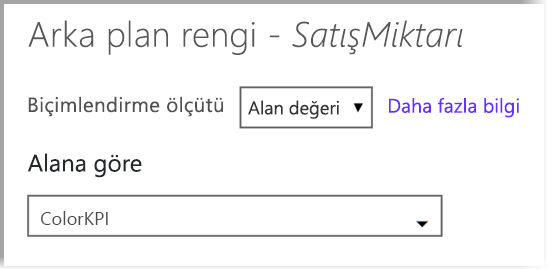

Bunu yaptığınızda aşağıdaki matrise benzer sonuçlar elde edebilirsiniz.

Yalnızca hayal gücünüzü ve DAX bilginizi kullanarak birçok farklı kullanım oluşturabilirsiniz.

CSS renk belirtimi listelenen değerlerden herhangi birini kullanabilirsiniz [ https://www.w3.org/TR/css-color-3/ ](https://www.w3.org/TR/css-color-3/) görsellerinizi renk:
* 3, 6 veya 8 basamaklı onaltılık örneğin #3E4AFF kodlar. Kod başlangıcında # sembolünü eklediğinizden emin olun. "3E4AFF" kabul edilmiyor. 
* RGB veya RGBA örn RGBA (234, 234, 234, 0,5) değerleri
* HSL HSLA değerleri veya örneğin HSLA (123, %75, % 75'i, 0,5)
* Örneğin Uçuk Gökyüzü Mavisi, yeşil sarı renk adları 

## Sonraki adımlar
Daha fazla bilgi için aşağıdaki makaleyi inceleyin:  

* [Power BI'da renk biçimlendirmeye ilişkin ipuçları ve püf noktaları](visuals/service-tips-and-tricks-for-color-formatting.md)  

