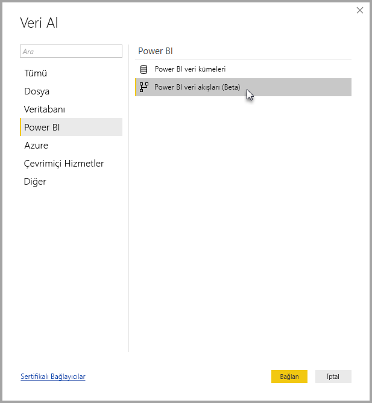
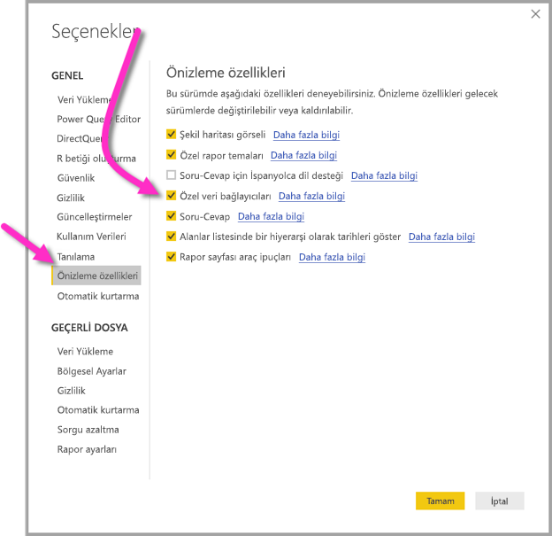

# Power BI Desktop'ta Power BI veri akışlarıyla oluşturulan verilere bağlanma (Önizleme)
Tıpkı Power BI Desktop'taki diğer veri kaynaklarında olduğu gibi **Power BI Desktop**'ta **Power BI veri akışları** tarafından oluşturulan verilere bağlanabilirsiniz.

**Power BI veri akışları (önizleme)** bağlayıcısı, Power BI hizmetinde veri akışları tarafından oluşturulan varlıklara bağlanmanızı sağlar. Veri akışları önizleme sürümünde olduğundan veri akışları bağlayıcısını sisteminizde kullanabilmeniz için yapmanız gereken işlemler vardır. 

## Power BI veri akışları bağlayıcısını (önizleme) indirme ve etkinleştirme

**Power BI veri akışları** bağlayıcısının bir kopyasını indirmeniz ve bilgisayarınızdaki belirli bir konuma kopyalamanız gerekir. Power BI Desktop için yapılacak aylık güncelleştirmelerin birinde bağlayıcı, veri bağlayıcısı listesine otomatik olarak eklenecek ve bu adımları gerçekleştirme gereksinimi ortadan kaldırılacaktır.

**Power BI veri akışları bağlayıcısını** şu konumdan indirebilirsiniz: [Power BI veri akışları bağlayıcısı](https://visuals.azureedge.net/cds-analytics/PublicPreview/CDSA.mez)

**Power BI veri akışları** bağlayıcısını (önizleme) bilgisayarınızda kullanılabilir duruma getirmek için aşağıdaki adımları izleyin:

1. .MEZ dosyasının (veri bağlayıcı dosyası) bir kopyasını indirin. Özel önizleme müşterilerine .MEZ dosyalarını indirme bilgileri doğrudan Microsoft tarafından gönderilecektir.

2. İndirilen veri bağlayıcısı dosyasını bilgisayarınızdaki şu klasöre yerleştirin: **Belgeler > Power BI Desktop > Özel bağlayıcılar klasörü**

3. Power BI Desktop'ta **Dosya > Seçenekler ve ayarlar > Seçenekler**'i ve ardından soldaki bölmeden **Önizleme özellikleri**'ni seçin.

    

4. Seçili değilse **Özel veri bağlayıcıları** kutusunu seçin. 

5. Bağlayıcının görünmesi için **Power BI Desktop** uygulamasını yeniden başlatın.

## Power BI veri akışları bağlayıcısını (önizleme) kullanma
**Power BI Desktop** yeniden başlatıldıktan sonra bağlayıcı kullanılabilir veri kaynakları arasında gösterilir. Bir veri havuzuna bağlanmak için aşağıdaki görüntüde gösterilen şekilde **Veri Al > Çevrimiçi Hizmetler > Power BI veri akışları (beta)** yolunu izleyin:

## Önemli noktalar ve sınırlamalar

**Power BI veri akışları bağlayıcısının** bu önizleme sürümünü kullanmak için **Power BI Desktop** uygulamasının son sürümünü çalıştırıyor olmanız gerekir. En son sürüme sahip olduğunuzdan emin olmak için [Power BI Desktop](desktop-get-the-desktop.md) uygulamasını yeniden indirip bilgisayarınıza yükleyebilirsiniz.  

Not: Power BI veri akışları bağlayıcısı yapılacak aylık **Power BI Desktop** güncelleştirmesiyle eklendiğinde çakışma yaşamamak için indirdiğiniz .MEZ dosyasını **Belgeler > Power BI Desktop > Özel bağlayıcılar** klasöründen silmeniz *gerekir*. 

## Sonraki adımlar
Power BI veri bağlantılarıyla gerçekleştirebileceğiniz farklı işlemler ve **Power BI Desktop** hakkındaki diğer yararlı makaleler için:

* [Power BI Desktop'ta Veri Kaynakları](desktop-data-sources.md)
* [Power BI Desktop'ta Verileri Şekillendirme ve Birleştirme](desktop-shape-and-combine-data.md)
* [Verileri doğrudan Power BI Desktop'a girme](desktop-enter-data-directly-into-desktop.md)   

