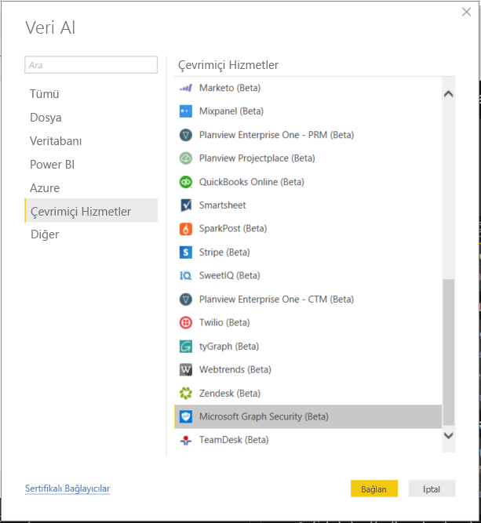
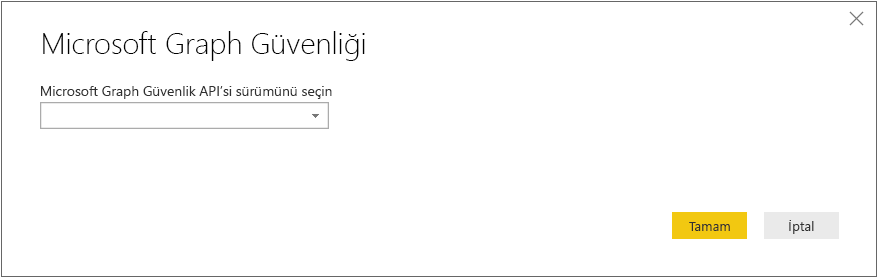
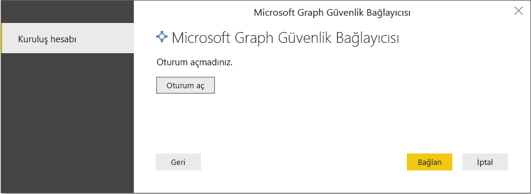
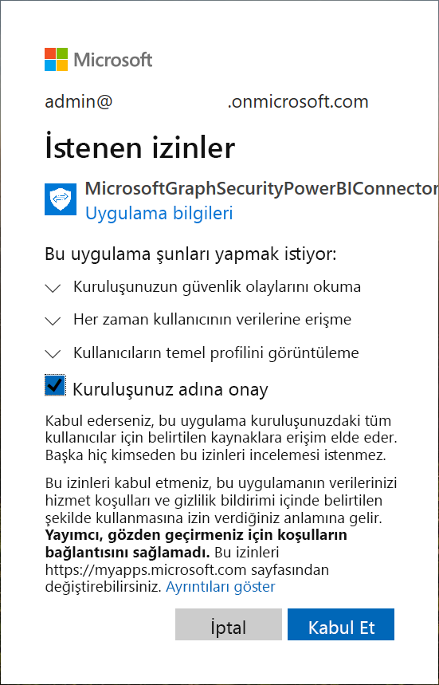
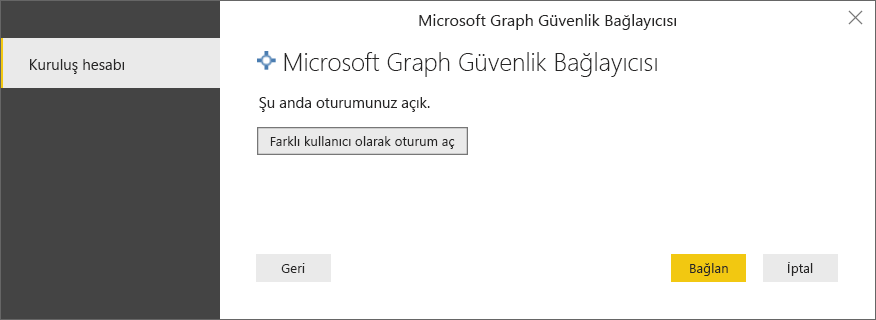
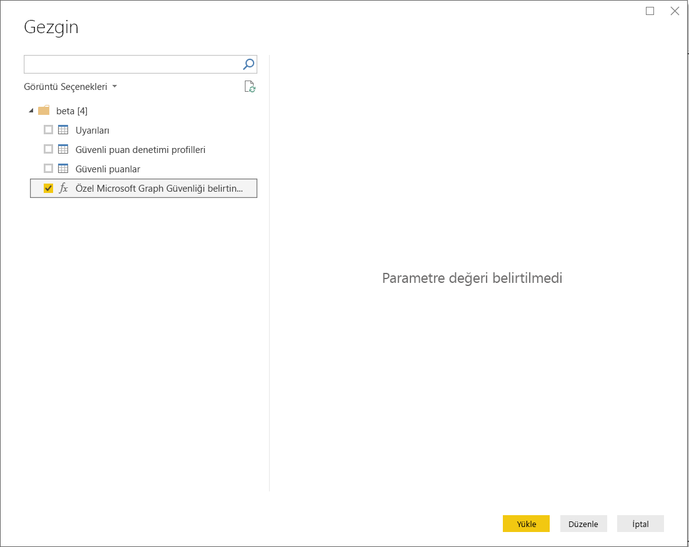
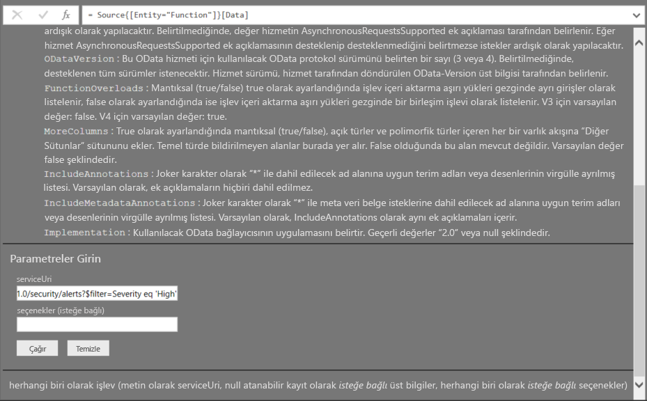
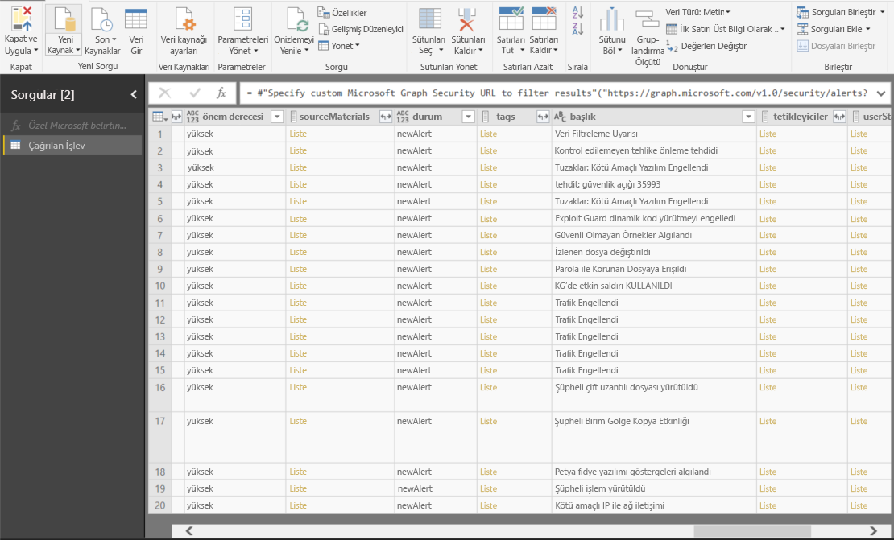

# Power BI Desktop’ta Microsoft Graph Güvenliği’ne bağlanma

Microsoft Graph Güvenliği Power BI bağlayıcısı üzerinden Microsoft Graph Güvenlik API’sine bağlanmak için Power BI Desktop’u kullanabilirsiniz. Bu sayede panolar ve raporlar oluşturabilir, güvenlikle ilgili [uyarılar](https://docs.microsoft.com/graph/api/resources/alert?view=graph-rest-1.0) ve [Güvenlik Puanı](https://docs.microsoft.com/graph/api/resources/securescores?view=graph-rest-beta) içgörüleri kazanabilirsiniz. [Microsoft Graph Güvenlik API’si](https://aka.ms/graphsecuritydocs) Microsoft'tan ve ekosistem iş ortaklarından gelen [birden çok güvenlik çözümünü](https://aka.ms/graphsecurityalerts) bağlayarak uyarıların daha kolay ilişkilendirilmesini sağlar, zengin bağlamsal bilgilere erişim sunar ve otomasyonu basitleştirir. Kuruluşları güvenlik ürünlerinde hızla içgörüler kazanma ve önlemler alma yönünde güçlendirirken, birden çok tümleştirmeyi oluşturup korumanın maliyetini ve karmaşıklığını da azaltır.

## Microsoft Graph Güvenlik bağlayıcısıyla bağlanmanın önkoşulları

* Microsoft Graph Güvenlik bağlayıcısını kullanmak için Azure Active Directory (AD) kiracısının yöneticisinin *açıkça verilmiş* onayı olması gerekir. Bu, [Microsoft Graph Güvenlik Kimlik Doğrulaması gereksinimlerinin](https://aka.ms/graphsecurityauth) bir parçasıdır. Bu onay Microsoft Graph Güvenliği Power BI bağlayıcısının uygulama kimliği ve adını gerektirir. Bu bilgileri [Azure portalında](https://portal.azure.com) da bulabilirsiniz:

   | Özellik | Değer |
   |----------|-------|
   | **Uygulama Adı** | `MicrosoftGraphSecurityPowerBIConnector` |
   | **Uygulama Kimliği** | `cab163b7-247d-4cb9-be32-39b6056d4189` |
   |||

   Bağlayıcıya onay vermek için Azure AD kiracısı yöneticiniz aşağıdaki adımlardan birini izleyebilir:

   * [Azure AD uygulamalarına kiracı yöneticisi onayı verme](https://docs.microsoft.com/azure/active-directory/develop/v2-permissions-and-consent).

   * Mantıksal uygulamanız ilk kez çalıştırıldığında [uygulama onayı deneyimi](https://docs.microsoft.com/azure/active-directory/develop/application-consent-experience) aracılığıyla uygulamanız Azure AD kiracınızın yöneticisinden onay isteyebilir.
   
* Microsoft Graph Güvenliği Power BI bağlayıcısıyla bağlanmak üzere oturum açarken kullanılan kullanıcı hesabı Azure AD’de Güvenlik Okuyucusu Sınırlı Yönetim rolünün üyesi olmalıdır (Güvenlik Okuyucusu ya da Güvenlik Yöneticisi). [Kullanıcılara Azure AD rolleri atama](https://docs.microsoft.com/graph/security-authorization#assign-azure-ad-roles-to-users) bölümündeki adımları izleyin. 

## Microsoft Graph Güvenlik bağlayıcısını kullanma

**Microsoft Graph Güvenlik** bağlayıcısını kullanmak için bu adımları izleyin:

1. Power BI Desktop’taki **Giriş** şeridinden **Veri Al -> Diğer...** öğesini seçin.
2. Soldaki kategorilerden **Çevrimiçi Hizmetler**’i seçin.
3. **Microsoft Graph Güvenliği (Beta)** seçeneğine tıklayın.

    
    
4. Açılan **Microsoft Graph Güvenliği** penceresinde sorgulanacak Microsoft Graph API’si sürümünü seçin. Seçenekler v1.0 ve betadır.

    
    
5. İstendiğinde Azure Active Directory hesabınızda oturum açın. Bu hesabın yukarıdaki önkoşullar bölümünde belirtildiği gibi **Güvenlik Okuyucusu** rolüne sahip olması gerekir.

    
    
6. Kiracı yönetici sizseniz **ve** size henüz önkoşullara uygun olarak Microsoft Graph Güvenliği Power BI bağlayıcısı (uygulaması) onayı verilmediyse aşağıdaki iletişim kutusuyla karşılaşırsınız. “**Kuruluşunuz adına onay**” öğesini seçtiğinizden emin olun.

    
    
7. Oturum açtığınızda aşağıdaki pencereyi görürsünüz ve bu kimliğinizin doğrulandığını gösterir. **Bağlan**'ı seçin.

    
    
8. Başarıyla bağlandıktan sonra, önceki adımda seçtiğiniz sürüm için [Microsoft Graph Güvenlik API’sinde](https://aka.ms/graphsecuritydocs) sağlanan varlıkların (örneğin, uyarılar) gösterildiği bir **Gezgin** penceresi açılır. İçeri aktarıp **Power BI Desktop**’ta kullanmak üzere bir veya daha fazla varlık seçin. 10. adımda belirtilen sonuç görünümünü almak için **Yükle**’ye tıklayın.

   
    
9. Microsoft Graph Güvenlik API'sinde gelişmiş bir sorgu yapmak isterseniz **Sonuçları filtrelemek için özel Microsoft Graph Güvenlik URL'si belirtin** işlevini seçin. Bu işlev, Microsoft Graph Güvenlik API'sine erişmek için gerekli izinlerle bu API'de bir [OData.Feed](https://docs.microsoft.com/power-bi/desktop-connect-odata) sorgusu yapmanızı sağlar.

   > [!NOTE]
   > Aşağıda, örnek serviceUri olarak `https://graph.microsoft.com/v1.0/security/alerts?$filter=Severity eq 'High'` kullanılmıştır. En son sonuçları filtrelemek, sıralamak veya almak üzere sorgular oluşturmak için [Graph'in desteklediği ODATA sorgu parametreleri](https://docs.microsoft.com/graph/query-parameters) konusuna bakın.

   
    
   **Çağır**'ı seçtiğinizde OData.Feed işlevi Sorgu Düzenleyicisi'ni açan API'ye bir çağrı yapar, siz de kullanmak istediğiniz veri kümesini filtreleyebilir ve daraltabilirsiniz. Sonra da bu daraltılmış veri kümesini Power BI Desktop'a yüklersiniz.

10. Aşağıdaki resimde sorguladığınız bir veya birden çok Microsoft Graph Güvenlik varlığının sonuç penceresi gösterilir.

   
    

Artık görsel ve rapor oluşturmak veya diğer Excel çalışma kitapları, veritabanları ya da başka bir veri kaynağı gibi bağlanmak veya içeri aktarmak isteyebileceğiniz verilerle etkileşime geçmek için Power BI Desktop'a Microsoft Graph Güvenlik bağlayıcısından aktardığınız verileri kullanmaya hazırsınız.

## Sonraki Adımlar
* [Microsoft Graph Güvenliği GitHub Power BI örnek deposunda](https://aka.ms/graphsecuritypowerbiconnectorsamples) bu bağlayıcıyı kullanan Power BI örneklerini ve şablonlarını gözden geçirin.

* [Microsoft Graph Güvenliği Power BI Bağlayıcısı blog gönderisinde](https://aka.ms/graphsecuritypowerbiconnectorblogpost) bazı kullanıcı senaryolarını ve ek bilgileri gözden geçirin.

* Power BI Desktop'ı kullanarak çok çeşitli türlerdeki verilere bağlanabilirsiniz. Veri kaynakları hakkında daha fazla bilgi için aşağıdaki kaynaklara bakın:

    * [Power BI Desktop nedir?](desktop-what-is-desktop.md)
    * [Power BI Desktop'ta Veri Kaynakları](desktop-data-sources.md)
    * [Power BI Desktop'ta Verileri Şekillendirme ve Birleştirme](desktop-shape-and-combine-data.md)
    * [Power BI Desktop'ta Excel çalışma kitaplarına bağlanma](desktop-connect-excel.md)
    * [Verileri doğrudan Power BI Desktop'a girme](desktop-enter-data-directly-into-desktop.md)
