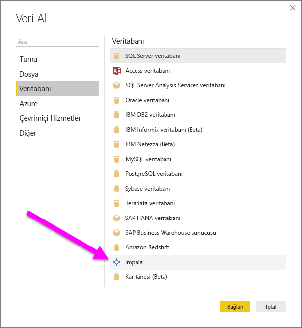
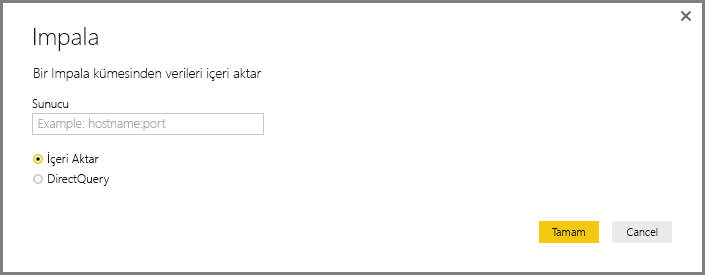
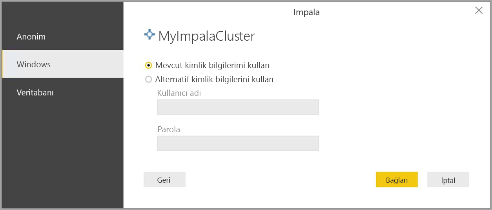
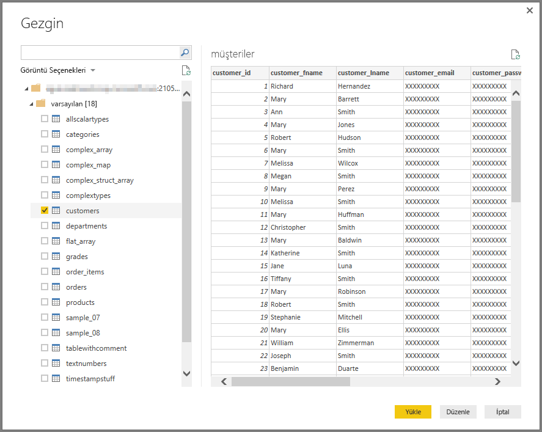

# Power BI Desktop'ta bir Impala veritabanına bağlanma
Tıpkı Power BI Desktop'taki diğer veri kaynaklarında olduğu gibi Power BI Desktop'ta bir **Impala** veritabanına bağlanabilir ve temel alınan verileri kullanabilirsiniz.

## Impala veritabanlarına bağlanma
Bir **Impala** veritabanına bağlanmak için Power BI Desktop'ın **Giriş** şeridindeki **Veri Al**'ı seçin. Soldaki kategorilerden **Veritabanı**'nı seçtiğinizde **Impala**'yı görebilirsiniz.

Açılan **Impala** penceresindeki kutuya Impala sunucunuzun adını yazın veya yapıştırın ve **Tamam**'ı seçin. Ayrıca, **İçeri aktar** seçeneğini belirleyerek verileri doğrudan Power BI'a aktarmayı tercih edebilir veya **DirectQuery**'yi kullanabilirsiniz. [DirectQuery'yi kullanma](desktop-use-directquery.md) hakkında daha fazla bilgi edinebilirsiniz.

İstendiğinde kullanıcı adı ve parolanızı girin veya anonim olarak bağlanın (hangisi destekleniyorsa).

> [!NOTE]
> Belirli bir **Impala** sunucusu için kullanıcı adı ve parolanızı girdiğinizde Power BI Desktop, sonraki bağlantı denemelerinde de aynı kimlik bilgilerini kullanır. **Dosya > Seçenekler ve ayarlar > Veri kaynağı ayarları**'na giderek bu kimlik bilgilerini değiştirebilirsiniz.
> 
> 

Bağlantı başarıyla kurulduktan sonra bir **Gezgin** penceresi açılır ve sunucudaki kullanılabilir verileri görüntüler. Bu veriler arasından **Power BI Desktop**'a aktarılıp kullanılacak bir veya daha fazla öğe seçebilirsiniz.

## Önemli Noktalar ve Sınırlamalar
**Impala** bağlayıcısı ile ilgili olarak göz önünde bulundurmanız gereken bazı sınırlar ve önemli noktalar vardır:

* Gelecekte **Power BI Gateway** ile yenileme desteği sunulması planlanmaktadır.

## Sonraki adımlar
Power BI Desktop'ı kullanarak çok çeşitli türlerdeki verilere bağlanabilirsiniz. Veri kaynakları hakkında daha fazla bilgi için aşağıdaki kaynaklara bakın:

* [Power BI Desktop ile çalışmaya başlama](desktop-getting-started.md)
* [Power BI Desktop'taki veri kaynakları](desktop-data-sources.md)
* [Power BI Desktop'ta Verileri Şekillendirme ve Birleştirme](desktop-shape-and-combine-data.md)
* [Power BI Desktop'ta Excel çalışma kitaplarına bağlanma](desktop-connect-excel.md)   
* [Verileri doğrudan Power BI Desktop'a girme](desktop-enter-data-directly-into-desktop.md)   

