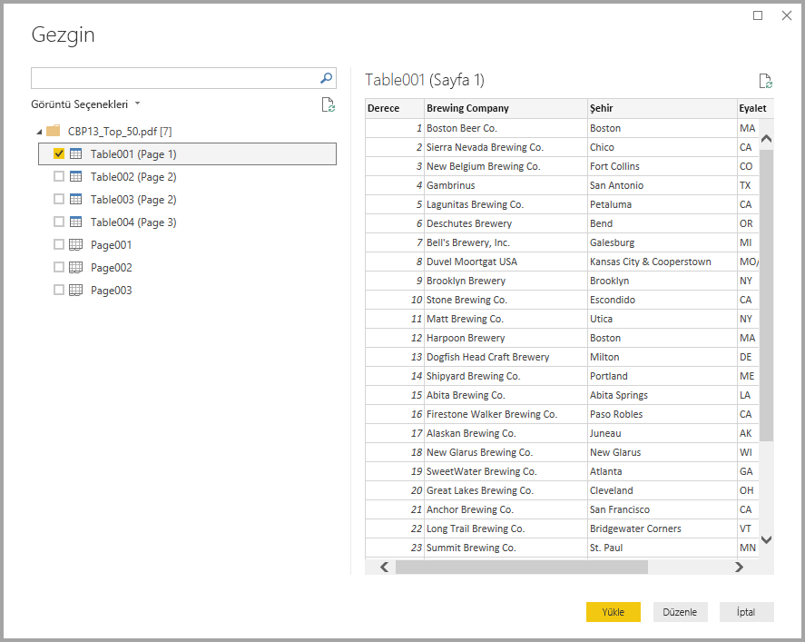

# Power BI Desktop’ta PDF dosyalarına bağlanma (Önizleme)
Tıpkı Power BI Desktop'taki diğer veri kaynaklarında olduğu gibi Power BI Desktop'ta bir **PDF dosyasına** bağlanabilir ve dosyadaki verileri kullanabilirsiniz.

Aşağıdaki bölümlerde **PDF dosyasına** bağlanma, veri seçme ve bu verileri **Power BI Desktop**'a alma adımları anlatılmaktadır.

## PDF bağlayıcısını etkinleştirme
**Power BI Desktop** PDF bağlayıcısı önizleme sürümündedir ve etkinleştirilmesi gerekir. PDF bağlayıcısını etkinleştirmek için **Dosya > Seçenekler ve Ayarlar > Seçenekler > Önizleme özellikleri** seçeneğini belirleyin ve ardından **Verileri PDF dosyalarından al**’ın yanındaki onay kutusunu işaretleyin. 

Seçiminizi yaptıktan sonra **Power BI Desktop**'ı yeniden başlatmanız gerekir.

**PDF (beta)** bağlayıcısını ilk kez kullandığınızda PDF bağlayıcısının geliştirme aşamasında olduğunu ve özelliklerinin ileride değişebileceğini belirten bir uyarı gösterilir. Bağlayıcıyı kullanmak için **Devam**'ı seçin.

Her zaman **Power BI Desktop** uygulamasının en son sürümünü kullanmanızı öneririz. Son sürüme [Power BI Desktop'ı edinin](desktop-get-the-desktop.md) bağlantısından ulaşabilirsiniz. 

## PDF dosyasına bağlanma
Bir **PDF** dosyasına bağlanmak için Power BI Desktop'ın **Giriş** şeridindeki **Veri Al**'ı seçin. Soldaki kategorilerden **Dosya**'yı seçtiğinizde **PDF (beta)** seçeneğini görebilirsiniz.

Kullanmak istediğiniz PDF dosyasının konumunu belirtmeniz istenir. Dosya konumu belirtildikten ve PDF dosyası yüklendikten sonra bir **Gezgin** penceresi açılır ve dosyadaki kullanılabilir verileri görüntüler. Bu veriler arasından **Power BI Desktop**'a aktarılıp kullanılacak bir veya daha fazla öğe seçebilirsiniz.

PDF dosyasında bulunan öğelerin yanındaki onay kutusunu işaretlediğinizde ilgili öğe sağdaki bölmede görüntülenir. İçeri aktarmaya hazır olduğunuzda **Yükle** düğmesini seçerek verileri **Power BI Desktop**'a alabilirsiniz.

**Power BI Desktop**’un Kasım 2018 sürümünden başlayarak, PDF bağlantınız için isteğe bağlı parametreler olarak **Başlangıç Sayfası** ve **Son Sayfa**'yı belirtebilirsiniz. Ayrıca aşağıdaki biçimi kullanarak bu parametreleri M formül diliyle de belirtebilirsiniz:

`Pdf.Tables(File.Contents("c:\sample.pdf"), [StartPage=10, EndPage=11])`

## Sonraki adımlar
Power BI Desktop'ı kullanarak çok çeşitli türlerdeki verilere bağlanabilirsiniz. Veri kaynakları hakkında daha fazla bilgi için aşağıdaki kaynaklara bakın:

* [Power BI Desktop nedir?](desktop-what-is-desktop.md)
* [Power BI Desktop'ta Veri Kaynakları](desktop-data-sources.md)
* [Power BI Desktop'ta Verileri Şekillendirme ve Birleştirme](desktop-shape-and-combine-data.md)
* [Power BI Desktop'ta Excel çalışma kitaplarına bağlanma](desktop-connect-excel.md)   
* [Verileri doğrudan Power BI Desktop'a girme](desktop-enter-data-directly-into-desktop.md)   

