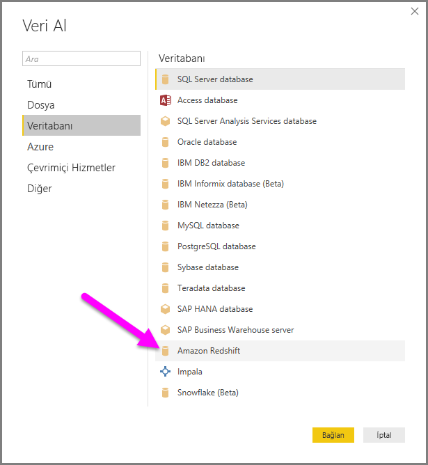
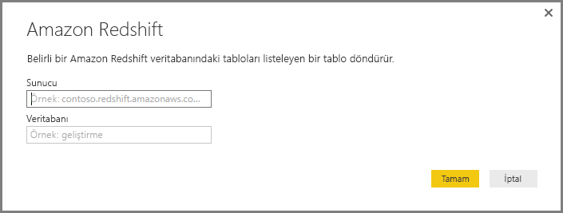
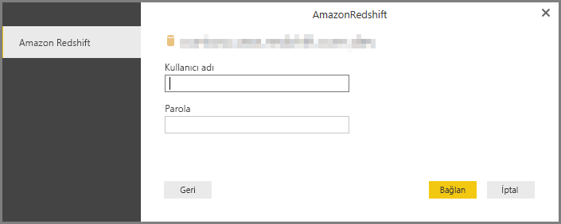
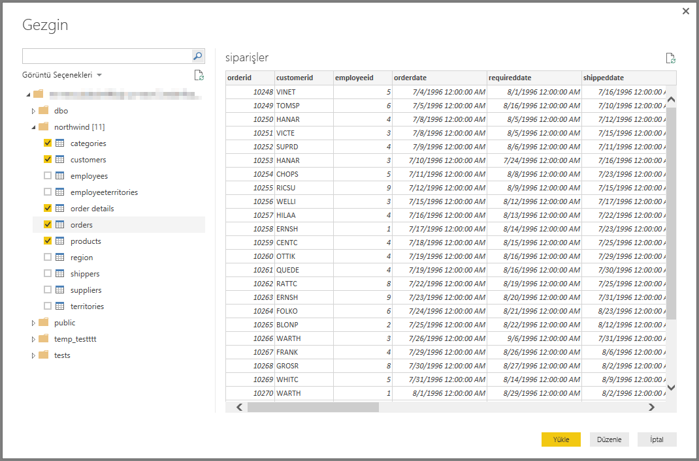

# Power BI Desktop'ta bir Amazon Redshift veritabanına bağlanma
Tıpkı Power BI Desktop'taki diğer veri kaynaklarında olduğu gibi **Power BI Desktop'ta** **Amazon Redshift** veritabanına bağlanabilir ve temel alınan verileri kullanabilirsiniz.

## Bir Amazon Redshift veritabanına bağlanma
Bir **Amazon Redshift** veritabanına bağlanmak için Power BI Desktop'taki **Giriş** şeridinden **Veri Al** seçeneğini belirleyin. Soldaki kategorilerden **Veritabanı**'nı seçtiğinizde **Amazon Redshift**'i görebilirsiniz.

Görüntülenen **Amazon Redshift** penceresindeki kutuya, **Amazon Redshift** sunucunuzun ve veritabanınızın adını yazın veya yapıştırın. Kullanıcılar, *Sunucu* alanına şu biçimde bir bağlantı noktası girebilir: *SunucuURL:BağlantıNoktası*

İstendiğinde kullanıcı adınızı ve parolanızı girin. Hataları önlemek için SSL sertifikası ile tam olarak eşleşen sunucu adını kullanmanız gerekir. 

Bağlantı başarıyla kurulduktan sonra bir **Gezgin** penceresi açılır ve sunucudaki kullanılabilir verileri görüntüler. Bu veriler arasından **Power BI Desktop**'a aktarılıp kullanılacak bir veya birden çok öğe seçebilirsiniz.

**Gezgin** penceresinden seçiminizi yaptıktan sonra veriler için **Yükle** veya **Düzenle** seçeneğini belirleyebilirsiniz.

* Veriler için **Yükle** seçeneğini belirlerseniz verileri yüklemek için *İçeri Aktar* veya *DirectQuery* modlarından birini kullanmanız istenir. Daha fazla bilgi için [DirectQuery'nin açıklandığı makaleye](desktop-use-directquery.md) göz atın.
* Veriler için **Düzenle** seçeneğini belirlerseniz verilere her türden dönüştürme ve filtre uygulayabileceğiniz **Sorgu Düzenleyicisi** açılır. Söz konusu dönüştürmelerin ve filtrelerin çoğu, temel alınan **Amazon Redshift** veritabanına da uygulanmıştır (destekleniyorsa).

## Sonraki adımlar
Power BI Desktop'ı kullanarak çok çeşitli türlerdeki verilere bağlanabilirsiniz. Veri kaynakları hakkında daha fazla bilgi için aşağıdaki kaynaklara bakın:

* [Power BI Desktop nedir?](desktop-what-is-desktop.md)
* [Power BI Desktop'taki veri kaynakları](desktop-data-sources.md)
* [Power BI Desktop'ta Verileri Şekillendirme ve Birleştirme](desktop-shape-and-combine-data.md)
* [Power BI Desktop'ta Excel çalışma kitaplarına bağlanma](desktop-connect-excel.md)   
* [Verileri doğrudan Power BI Desktop'a girme](desktop-enter-data-directly-into-desktop.md)   

