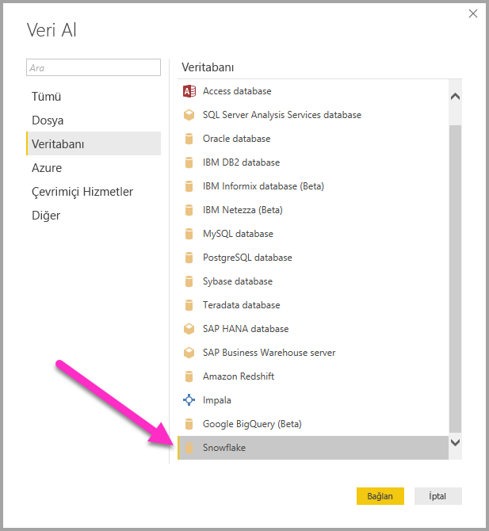
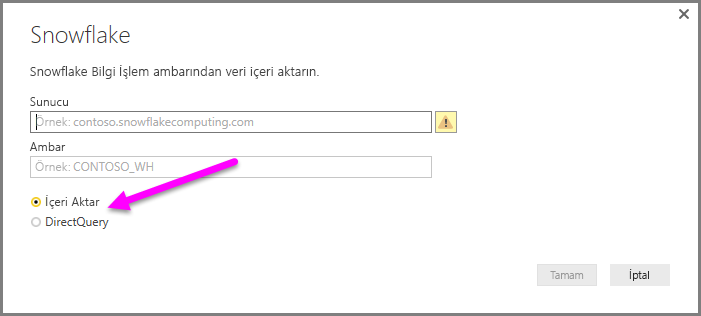
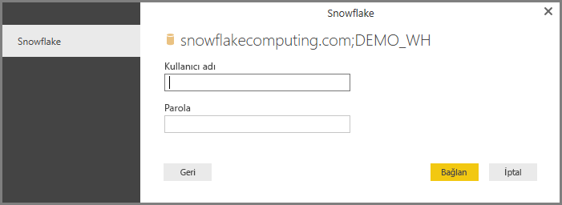
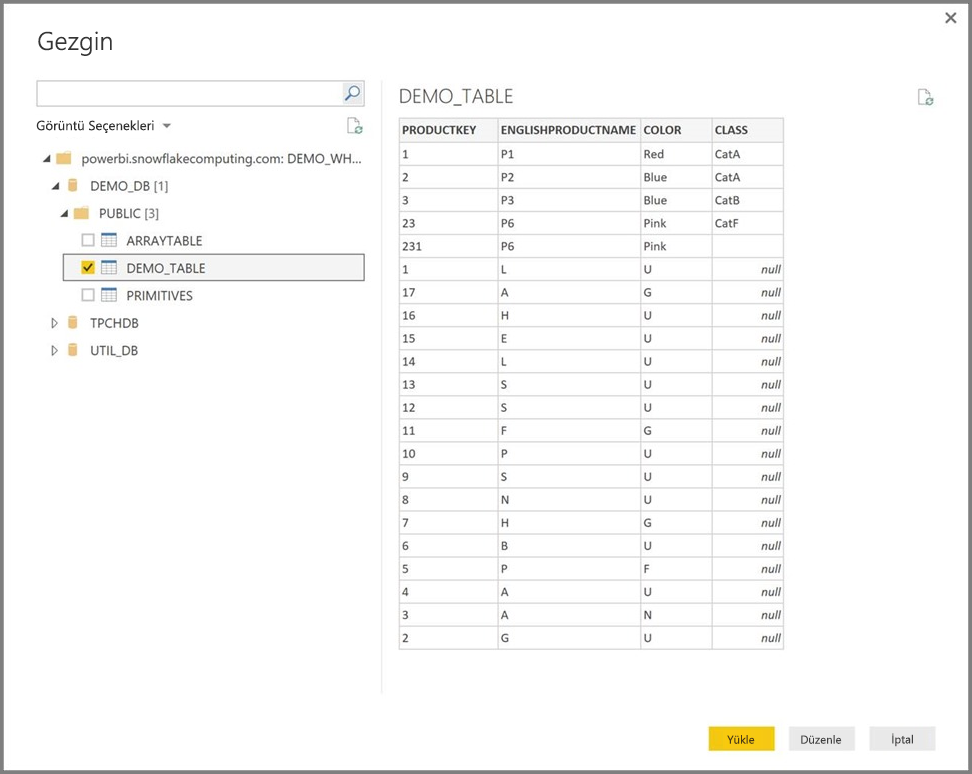

# Power BI Desktop'ta Snowflake'e bağlanma
Tıpkı Power BI Desktop'taki diğer veri kaynaklarında olduğu gibi Power BI Desktop'ta bir **Snowflake** bilgi işlem ambarına bağlanabilir ve temel alınan verileri kullanabilirsiniz. 

> [!NOTE]
> 32 bit veya 64 bit olan **Power BI Desktop** yüklemesiyle eşleşen mimariyi kullanarak, **Snowflake** bağlayıcısını kullanan bilgisayarlara **Snowflake ODBC sürücüsünü** de yüklemeniz *gerekir*. Aşağıdaki bağlantıyı kullanmanız ve [uygun Snowflake ODBC sürücüsünü indirmeniz](https://go.microsoft.com/fwlink/?LinkID=823762) yeterlidir.
> 
> 

## Bir Snowflake bilgi işlem ambarına bağlanma
Bir **Snowflake** bilgi işlem ambarına bağlanmak için Power BI Desktop'ın **Giriş** şeridindeki **Veri Al**'ı seçin. Soldaki kategorilerden **Veritabanı**'nı seçtiğinizde **Snowflake**'i görebilirsiniz.

Açılan **Snowflake** penceresindeki kutuya Snowflake bilgi işlem ambarınızın adını girin veya yapıştırın ve **Tamam**'ı seçin. Ayrıca, **İçeri aktar** seçeneğini belirleyerek verileri doğrudan Power BI'a aktarmayı tercih edebilir veya **DirectQuery**'yi kullanabilirsiniz. [DirectQuery'yi kullanma](desktop-use-directquery.md) hakkında daha fazla bilgi edinebilirsiniz.

İstendiğinde kullanıcı adınızı ve parolanızı girin.

> [!NOTE]
> Belirli bir **Snowflake** sunucusu için kullanıcı adı ve parolanızı girdiğinizde Power BI Desktop, sonraki bağlantı denemelerinde de aynı kimlik bilgilerini kullanır. **Dosya > Seçenekler ve ayarlar > Veri kaynağı ayarları**'na giderek bu kimlik bilgilerini değiştirebilirsiniz.
> 
> 

Bağlantı başarıyla kurulduktan sonra bir **Gezgin** penceresi açılır ve sunucudaki kullanılabilir verileri görüntüler. Bu veriler arasından **Power BI Desktop**'a aktarılıp kullanılacak bir veya daha fazla öğe seçebilirsiniz.

Seçili tabloyu **Yüklemeyi** seçtiğinizde tablonun tamamı **Power BI Desktop**'a getirilir. Sorguyu **Düzenlemeyi** seçtiğinizde ise kullanmak istediğiniz veri kümesini filtreleyebileceğiniz ve iyileştirebileceğiniz, ardından, iyileştirilen bu veri kümesini **Power BI Desktop**'a yükleyebileceğiniz **Sorgu Düzenleyicisi** açılır.

## Sonraki adımlar
Power BI Desktop'ı kullanarak çok çeşitli türlerdeki verilere bağlanabilirsiniz. Veri kaynakları hakkında daha fazla bilgi için aşağıdaki kaynaklara bakın:

* [Power BI Desktop nedir?](desktop-what-is-desktop.md)
* [Power BI Desktop'ta Veri Kaynakları](desktop-data-sources.md)
* [Power BI Desktop'ta Verileri Şekillendirme ve Birleştirme](desktop-shape-and-combine-data.md)
* [Power BI Desktop'ta Excel çalışma kitaplarına bağlanma](desktop-connect-excel.md)   
* [Verileri doğrudan Power BI Desktop'a girme](desktop-enter-data-directly-into-desktop.md)   

