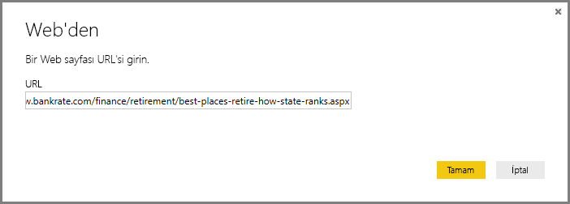
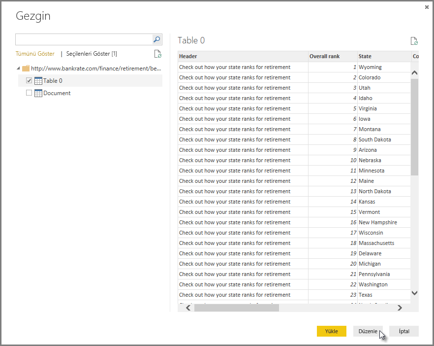
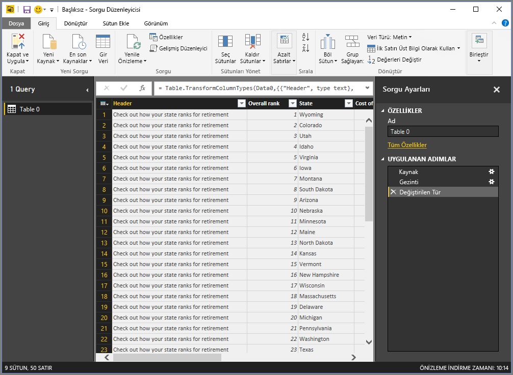
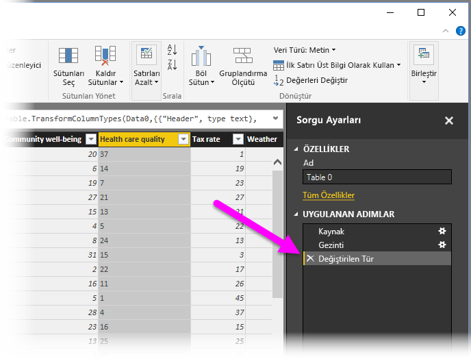
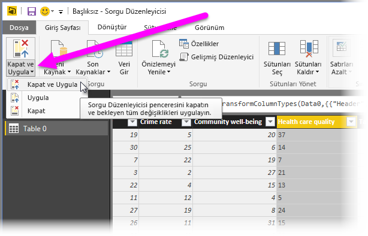
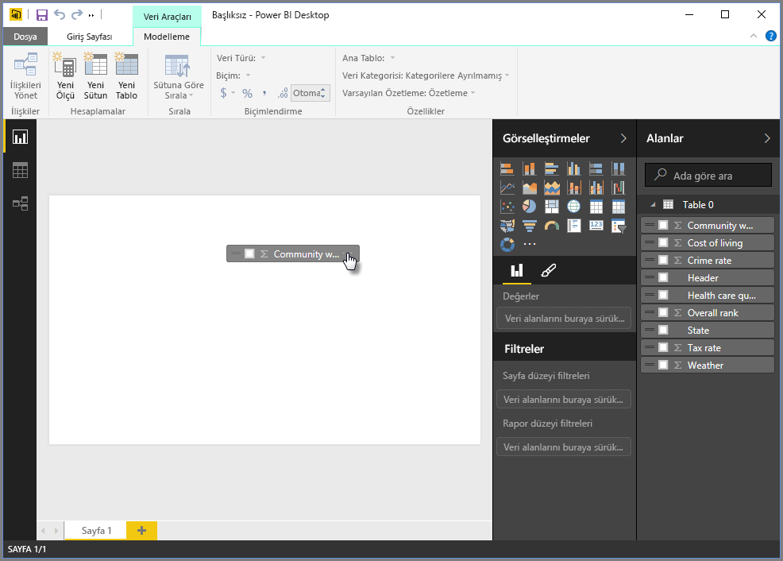
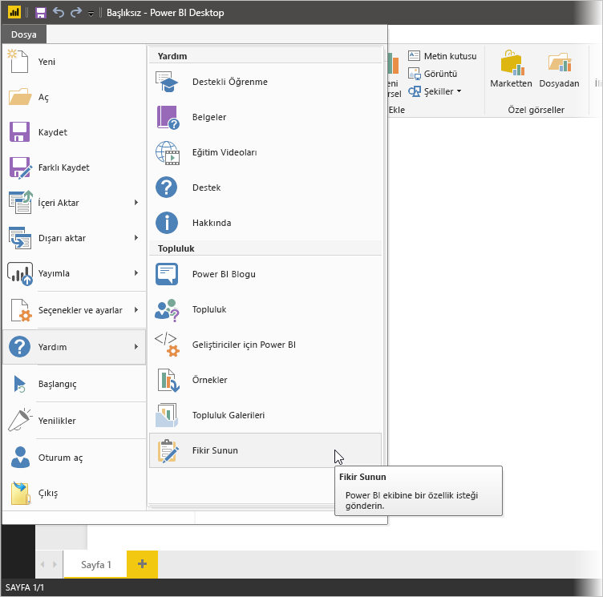

# Power BI Desktop'taki verilere bağlanma
Power BI Desktop ile durmadan büyüyen veri dünyasına kolayca bağlanabilirsiniz. Power BI Desktop'ı [indirebilir](http://go.microsoft.com/fwlink/?LinkID=521662) ve yükleyebilirsiniz (henüz yapmadıysanız).

Power BI Desktop'ta kullanılabilecek *çok çeşitli* veri kaynakları bulunur. Aşağıdaki görüntüde, **Dosya** şeridini seçip **Veri Al \> Diğer** seçeneğini belirleyerek verilere nasıl bağlanabileceğiniz gösterilmektedir.

Bu örnekte, bir **Web** veri kaynağına bağlanacağız.

Emekli olduğunuzu hayal edin: Bol bol güneş ışığının, düşük vergilerin ve yeterli sağlık hizmetlerinin bulunduğu bir yerde yaşamak istiyorsunuz. Belki de... bir veri analistisiniz ve müşterilerinize yardımcı olmak istiyorsunuz. Bu örnekte ise bir yağmurluk üreticisi olan müşterinizin satış için *çok* yağmur alan yerlere odaklanmasına yardımcı olmayı hedeflediğinizi varsayalım.

İşte size her iki senaryo için de bu konulara yönelik olarak işinize yarayacak veriler içeren bir web kaynağı:

[*http://www.bankrate.com/finance/retirement/best-places-retire-how-state-ranks.aspx*](http://www.bankrate.com/finance/retirement/best-places-retire-how-state-ranks.aspx)

**Veri Al \> Web** seçeneğini belirleyin ve adresi yazın.

**Tamam**'ı seçtiğinizde Power BI Desktop'ın **Sorgu** işlevi çalışmaya başlar. Power BI Desktop, web kaynağı ile bağlantı kurar ve **Gezgin** penceresi söz konusu web sayfasında bulduğu sonuçları görüntüler. Bu örnekte, bir tablonun (Tablo 0) yanı sıra genel Belge bulunur. Beklentilerimizi karşılayan tabloyu listeden seçiyoruz. **Gezgin** penceresi, bir önizleme görüntüler.

Bu noktada, tabloyu yükleyebilir veya pencerenin alt kısmından **Düzenle**'yi seçerek tabloyu yüklemeden önce sorguyu düzenleyebiliriz.

**Düzenle**'yi seçersek tablo yüklenir ve Sorgu Düzenleyicisi başlatılır. **Sorgu Ayarları** bölmesi görüntülenir. (Aksi halde, şeritten **Görünüm**'ü seçip **Göster \> Sorgu Ayarları** seçeneğini belirleyerek **Sorgu Ayarları** bölmesini görüntüleyebilirsiniz.) Aşağıdaki gibi bir ekranla karşılaşırsınız.

Metin türünde olan tüm bu puanların sayı olmasına ihtiyacımız var. Sorun değil. Bunları değiştirmek için sütun başlığına sağ tıklayıp **Türü Değiştir \> Tam Sayı** seçeneğini belirlemeniz yeterlidir. Birden fazla sütun seçmek için öncelikle bir sütun seçip **SHIFT** tuşunu basılı tutarak bitişik daha fazla sütun seçin ve ardından bir sütun başlığına sağ tıklayarak seçili tüm sütunları değiştirin. Bitişik olmayan sütunları seçmek için **CTRL** tuşunu kullanın.

**Sorgu Ayarları**'nda bulunan **Uygulanan Adımlar**, yapılan değişiklikleri gösterir. Siz verilerde değişiklik yaptıkça Sorgu Düzenleyicisi, bu değişiklikleri **Uygulanan Adımlar** bölümünde kaydeder. Adımları gerektiği şekilde ayarlayabilir, yeniden ziyaret edebilir, yeniden düzenleyebilir veya silebilirsiniz.

Tabloda yapılan ek değişiklikler tablo yüklendikten sonra da gerçekleştirilebilir ancak şimdilik bunu yapmayacağız. İşlem tamamlandığında **Giriş** şeridinden **Kapat ve Uygula**'yı seçeriz ve Power BI Desktop, yaptığımız değişiklikleri uygulayıp Sorgu Düzenleyicisi'ni kapatır.

Veri modeli yüklüyken, Power BI Desktop'taki **Rapor** görünümünde alanları tuvale sürükleyerek görselleştirmeler oluşturmaya başlayabiliriz.

Bunun tek veri bağlantısı bulunan basit bir model olduğunun farkındayız. Çoğu Power BI Desktop raporunda ise zengin bir veri modeli oluşturan ilişkiler ile ihtiyaçlarınızı karşılamak üzere şekillendirilmiş farklı veri kaynaklarına yönelik bağlantılar bulunur. 

### Sonraki adımlar
Power BI Desktop ile yapabileceğiniz çok şey var. Özellikler hakkında daha fazla bilgi edinmek için aşağıdaki kaynaklara bakın:

* [Power BI Desktop ile Çalışmaya Başlama](desktop-getting-started.md)
* [Power BI Desktop ile Sorgulara Genel Bakış](desktop-query-overview.md)
* [Power BI Desktop'taki Veri Kaynakları](desktop-data-sources.md)
* [Power BI Desktop'ta Verileri Şekillendirme ve Birleştirme](desktop-shape-and-combine-data.md)
* [Power BI Desktop'taki Genel Sorgu Görevleri](desktop-common-query-tasks.md)   

Bize geri bildirim sağlamak ister misiniz? Harika! Power BI Desktop’taki **Fikir Sunun** menü öğesini kullanın veya [Topluluk Geri Bildirimi](http://community.powerbi.com/t5/Community-Feedback/bd-p/community-feedback)’ni ziyaret edin. Geri bildirimlerinizi sabırsızlıkla bekliyoruz!

